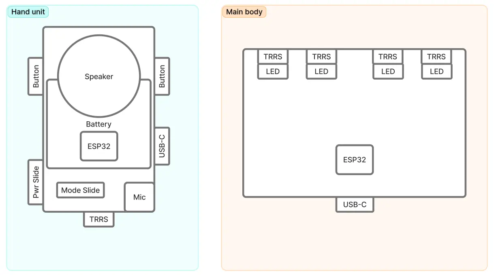
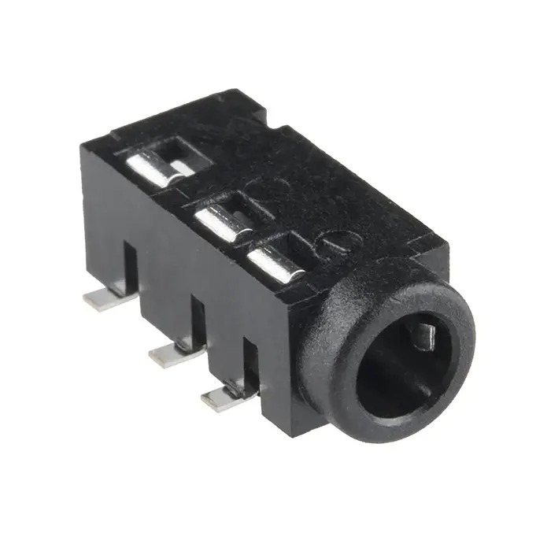

## Intro

Hey, it's Sun. Welcome to my course blog for [How To Make (Almost) Anything](https://fab.cba.mit.edu/classes/MAS.863/) (HTMAA), fall 2025.

I'll publish weekly articles on the things I've learned and report progress towards the final project.

I joined the [Tangible Media Group](https://tangible.media.mit.edu/) at the [MIT Media Lab](https://www.media.mit.edu/) in 2025. My [research interest](https://medialab.chuanqisun.com/?secret=empathy) is in the social, cultural, and philosophical aspects of generative AI. I've previously worked as a software engineer at Microsoft and enjoy [building tools](https://chuanqisun.com/) for the open source community.

## Weekly updates



<!-- hide the "post" tag because it is self-evidence -->

- [{{ post.data.title }}]({{ post.url }}) {{ post.data.date | humanDate }}  #{{ tag }}



## Final project

I want to combine my background in AI application development with TMG's focus in Tangible Interface to build a voice-driven AI programming system inspired by telephone switchboard operators.

### The inspiration

I’m motivated by how AI-routed phone systems have eroded the empathy and connection once provided by human operators. I want to revive that craft by building a switchboard that puts a person back in the loop as a thoughtful listener and connector.


**Jersey Telecom Switchboard and Operator ([source](https://commons.wikimedia.org/wiki/File:Jersey_Telecom_switchboard_and_operator.jpg))**

### The idea

A physical AI agent network implemented as a hardware grid with voice-based interaction and programming capabilities. The system combines push-to-talk interfaces with node-based generative AI computation, allowing users to dynamically program and interact with AI agents through voice commands. I want to call this system **Field Programmable Generative AI (FPGAI)**


**My initial sketch**

Next, I want to visualize the idea with gen AI. I'm entirely new to 3D modeling and rendering, so the fastest route to gain intuition on the form of the design is naturally using AI.

I crafted the prompt based on what I was imagining. The latest gemini model got this for me in one shot.


**Device base ([prompt](./posts/week-01/media/ai-rendered-base.txt))**

Next, let's visualize the hand-held device. I want to model it after a CB radio speaker mic. Inspired by [this project](https://x.com/gvy_dvpont/status/1866217836537848144)


**Hand unit ([prompt](./posts/week-01/media/ai-rendered-hand-unit.txt))**

Finally, let's put them together and add some context. I haven't decided the exact size for each component yet. I think that will have to wait until I figured out the electronics first.


**In use ([prompt](./posts/week-01/media/ai-rendered-in-use.txt))**

### The implementation

While it's still too early to fully specify the project, I have the following high level design.

**Main Board**

- Grid of 3.5mm audio jacks serving as physical computation nodes
- Analog-to-Digital conversion
- LED indicators for node states and network connections
- Network interface to host computer for AI workloads

**Speaker-Microphone Units**

- Handheld devices with audio connectors
- Push-to-talk button for voice input
- Mode switch (interaction/programming)
- Built-in speaker for AI audio output

### Operating Modes

**Interaction Mode**

- Push-to-talk activates voice input to connected node
- AI processes input and returns audio response through speaker
- Real-time computation with visual feedback via LEDs

**Programming Mode**

- Voice commands modify network topology
- Reprogram individual node computation logic
- Create autonomous nodes that operate without physical connection
- Define inter-node communication patterns

After the conceptual exploration from week 1, I switched focus to the electronics. I hope the electronics design can help inform the exterior of the system.

I started off with off-the-shelf components and iterated the idea to build more from sractch.

### Proof of concept with off-the-shelf components

I can prototype almost the entire experience with cheap off-the-shelf products:

1. Push-to-talk with a secondhand CB radio hand unit
2. Audio cable adapters to 3.5mm TRRS
3. USB hub for multiple inputs


**Prototype using consumer electronics**

What's missing:

1. No effort involved. This will result in a failing grade. It's only good for prototyping
2. Can't guarantee the compatibility of the hand unit with the 3.5mm TRRS jack
3. Can't prototype the visual feedback feature, where the 3.5mm jack shows "ready" state to the user via an LED

### Bring intelligence to the main body

Iterating on the idea, I could use a Raspberry Pi with a primitive USB hub as the main processor. The Pi may still use a nearby laptop for LLM and speech-to-text, text-to-speech, but it's also possible to bring the entire AI/ML stack onto the device, reducing the need for networking.


**Moving compute to Raspberry Pi**

I still need to figure out how the Pi can use the LEDs to display system state. Besides, I need to program some microcontroller to meet the requirements of this class. Can we go one level deeper?

### Move audio processing to hand unit

To make the project more challenging, I can use an ESP32-based audio system to pick up speech and play back AI voice. We can wirelessly connect the ESP32 with a nearby laptop, where the voice-driven AI interactions will take place.

The main body still needs a controller to send the following information to the nearby laptop:

1. Detect which socket is plugged in
2. Control the LED status lights


**Audio processing in hand unit**

The audio cable in this design does not really pass audio. It is solely used for detecting the state of plugged/unplugged. I need to figure out how to rig the 3.5mm jack to achieve this.

### Build my own speaker/microphone

The next level is replacing the ESP32-based audio kit with a custom PCB, with speaker and microphone manually soldered. This will probably be the upper bound of the level of complexity I can handle.


**Build microphone and speaker on custom PCB**

My next step is taking the idea to a TA for advice. This is my first time designing with electronics, so I do anticipate big revisions. Stay tuned.

### Networking

Learning about embedded programming validated the design above. After getting hands-on experience building an [echo server with ESP32](./posts/week-03/index.md#networking), I now feel confident that I can relay data between the ESP32 hand unit and a nearby laptop using either a Wi-Fi or a serial connection. Next, I can explore several things in parallel:

- Improve the 3D modeling using the electronics component as reference
- Learn 3D printing (next week) and prototype the hand unit and the main body
- Program the microphone and speaker with the ESP32 to inform the circuit design for the custom PCB
- Explore low-latency, two-way audio streaming between the laptop and the ESP32

### Electronics design update

I consulted with our TA [Quentin Bolsee](https://fabacademy.org/2020/labs/ulb/students/quentin-bolsee/about/) regarding electronics design and received valuable help on input/output devices. I also conducted additional research using YouTube tutorials from [atomic14](https://www.youtube.com/@atomic14), which enabled me to fully spec out the electronics for both components.

<iframe src="https://www.youtube.com/embed/d_h38X4_eQQ?si=qrE0fMYY1X2jP3Q9" title="YouTube video player" frameborder="0" allow="accelerometer; autoplay; clipboard-write; encrypted-media; gyroscope; picture-in-picture; web-share" referrerpolicy="strict-origin-when-cross-origin" allowfullscreen></iframe>

The hand unit will be built around a Xiao ESP32-C3 microcontroller, with upgrade options to ESP32-C6 if WiFi performance becomes a bottleneck, or to WROOM-32E if more GPIO pins are needed. For audio processing, I've selected the ICS-43434 I2S MEMS Microphone for input and the MAX98357A I2S Class D Amplifier paired with an 8-ohm speaker for output. However, the amplifier's specified response frequency of 600hz - 4000hz may not be ideal for voice applications, so I might need to find an alternative. The physical interface will include two buttons (single button for push-to-talk, both buttons for broadcast) and two switches (Power On/Off and Mode switch for interaction/programming). Power will come from a 3.7V LiPo battery, with a potential upgrade to a 3AA battery pack plus voltage regulator for easier replacement and a more vintage feel, though I need to consult with an electronics expert about the implementation details. Connectivity will be handled through a 3.5mm TRRS jack.

The main unit uses a simpler design with a Xiao ESP32-C3 microcontroller controlling 4 LEDs and 4 3.5mm TRRS jacks for the 2x2 grid configuration.


**High-level design for the electronic components**

For connection detection, I want to eventually support multiple hand units speaking simultaneously, which requires tracking which hand unit is plugged into which jack. Traditional physical TRS plug detection doesn't differentiate between different plugs, so I propose using TRRS jacks as a clever hack. By treating high/low voltage as 1/0 bits and using the sleeve as ground while the other 3 connections serve as signal lines, I can create 2^3 = 8 unique values. This allows each jack in the 2x2 grid to be uniquely identified by a 3-bit code. The main unit will be responsible for pulling up/down the 3 signal lines on the jacks, while the hand unit decodes the 3-bit code and sends it to the laptop along with its own unique ID.


**TRRS socket has 4 pins**

This design enables all necessary communication between the PC, hand unit, and main unit: hand unit plug-in messages with 3-bit codes and wireless IDs, audio streaming from hand units to PC using wireless IDs, audio streaming from PC to hand units using wireless IDs, and LED state updates from PC to main unit using 3-bit codes to identify specific jacks.

### Parts list

| Component                                                                                                                                | Quantity | Availability  | Notes                               |
| ---------------------------------------------------------------------------------------------------------------------------------------- | -------- | ------------- | ----------------------------------- |
| [Xiao ESP32-C3](https://www.digikey.com/en/products/detail/seeed-technology-co-ltd/113991054/16652880)                                   | 2        | Out of stock  | 1\* for hand units, 1 for main unit |
| [ICS-43434 I2S MEMS Microphone](https://www.digikey.com/en/products/detail/tdk-invensense/ICS-43434/6140298)                             | 1\*      | Stocked       |                                     |
| [MAX98357A I2S Class D Amplifier](https://www.digikey.com/en/products/detail/analog-devices-inc-maxim-integrated/MAX98357AETE-T/4936122) | 1\*      | Stocked       |                                     |
| [PSR-57N08A01-AQ 8-ohm speaker](https://www.digikey.com/en/products/detail/mallory-sonalert-products-inc/PSR-57N08A01-AQ/2071452)        | 1\*      | Stocked       |                                     |
| [3.5mm TRRS jack](https://www.sparkfun.com/audio-jack-3-5mm-trrs-smd.html)                                                               | 5        | Need to order | 1\* hand unit + 4 main              |
| [TRRS audio cable](https://www.monoprice.com/product?p_id=24437&srsltid=AfmBOorjZ4_M3Uo6oXfcsZa9juhuYBGbdvfnJ7mGzuYrVbLg65MT6nCNH84)     | 1\*      | Need to order |                                     |
| [3.7V LiPo battery](https://www.digikey.com/en/products/detail/mikroelektronika/MIKROE-698/13679450)                                     | 1\*      | Need to order |                                     |
| [Button](https://www.digikey.com/en/products/detail/omron-electronics-inc-emc-div/B3SN-3112P/27856)                                      | 2\*      | Stocked       |                                     |
| [Slide switch](https://www.digikey.com/en/products/detail/c-k/AYZ0102AGRLC/1640108)                                                      | 2\*      | Stocked       |                                     |
| [LED](https://www.digikey.com/en/products/detail/lumex-opto-components-inc/SML-LX1206IC-TR/229140)                                       | 4        | Stocked       |                                     |
| 3AA battery pack + voltage regulator                                                                                                     | 1        | Optional      | Alternative power solution          |

\*For a single hand unit. Need more for additional units

With this design update, it became clear that the main unit is essentially a "dumb" device that encodes the TRRS socket and displays which AI agent is speaker and doesn't care about audio processing at all.

I have also gained insights how the physical contraints for the housing. The hand unit needs to mainly account for battery and speaker size. The PCB size and shape can be more flexible. The main unit needs to account for the 4 TRRS jacks.

Here are new and remaining questions which I plan to resolve by going to TAs as well as attending future lectures.

1. PCB design. [atomic14's design](https://www.youtube.com/watch?v=d_h38X4_eQQ) is a good reference but I don't know how I can design my own.
2. Packaging design. How do I hold the components in place? especially the 3.5mm TRRS jacks which will receive physical stress.
3. Physical interaction. How do I put buttons and sliding switch on the hand unit? I want a good tactile feel.
4. LED lighting. How do make a ring that lights up around the TRRS socket?
5. The CBA electronics shop inventory doesn't match what the website says. For example, the ESP32s are out of stock but the website didn't reflect that.

And here are the things I can prototype now:

1. Play voice from ESP32 over WiFi
2. Capture sound from ESP32 over WiFi
3. Address and light-up 4 LEDs with ESP32
4. Encode and decode TRRS identities between two ESP32 boards
5. Design a case roughly based on atomic14's PCB foot-print.

### Sound output

With the help from our TA [Quentin Bolsee](https://fabacademy.org/2020/labs/ulb/students/quentin-bolsee/about/), I installed the official ESP32 board manager following its [documentation](https://docs.espressif.com/projects/arduino-esp32/en/latest/installing.html). Then I installed the specific library for Arduino ESP32 Nano from the board manager.

I used the official example code to play a square wave tone, with a few lines of modification to set the right output pin. Here is the full [source](./code/sound-test.ino).

```cpp
#define I2S_BCLK D7
#define I2S_LRC  D8
#define I2S_DIN  D9
```

<video controls src="./media/sound-out.mp4"></video>
**Sound output from ESP32 using MAX98357A amplifier**

I found a powerful library for audio processing by Phil Schatzmann, called [Arduino Audio Toolkit](https://github.com/pschatzmann/arduino-audio-tools). After studying his examples, I was able to get my computer to send live microphone audio to the ESP32 over WiFi, and play it back immediately. The latency is about 1 second, which concerns me but isn't a deal breaker.

This POC validated the idea that we can shift all the computation to a PC nearby and let ESP32 handle audio input/output.

- [Server code (PC)](./code/streaming-test-server.js)
- [Client code (ESP32)](./code/streaming-test-client.ino)

<video controls src="./media/latency-test.mp4"></video>
**Latency test result: 1 second delay**
