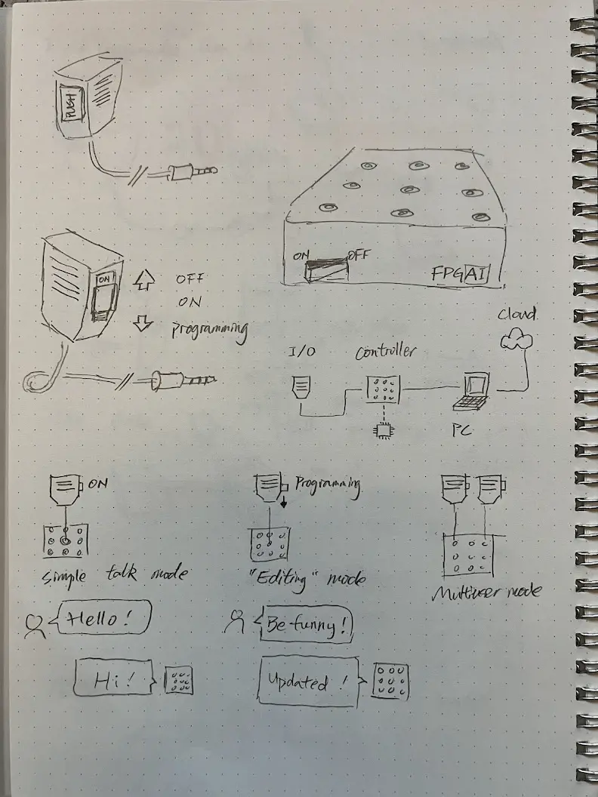
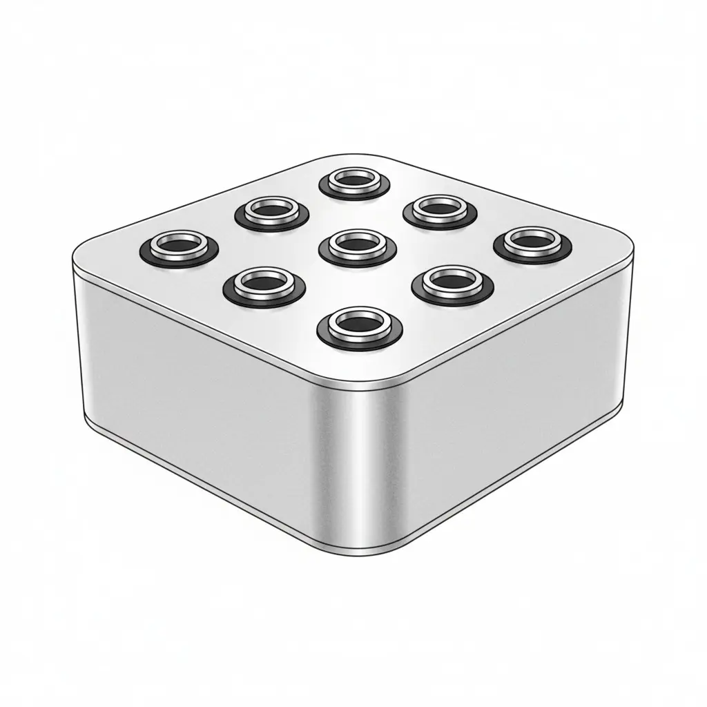
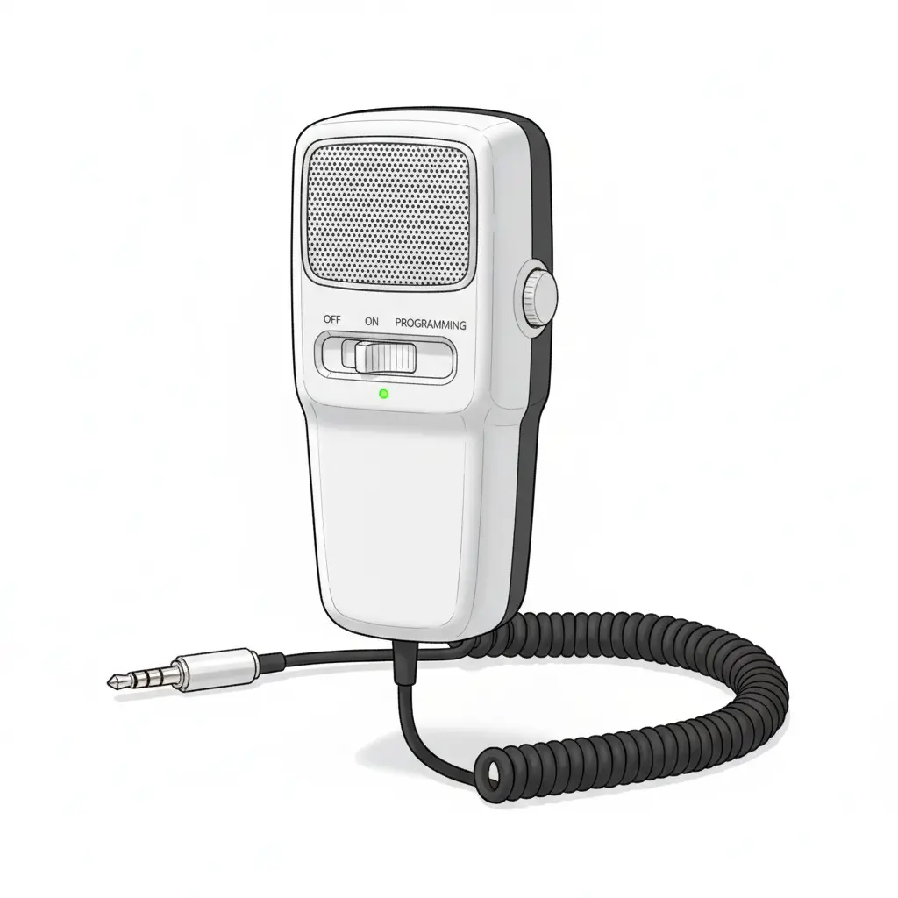
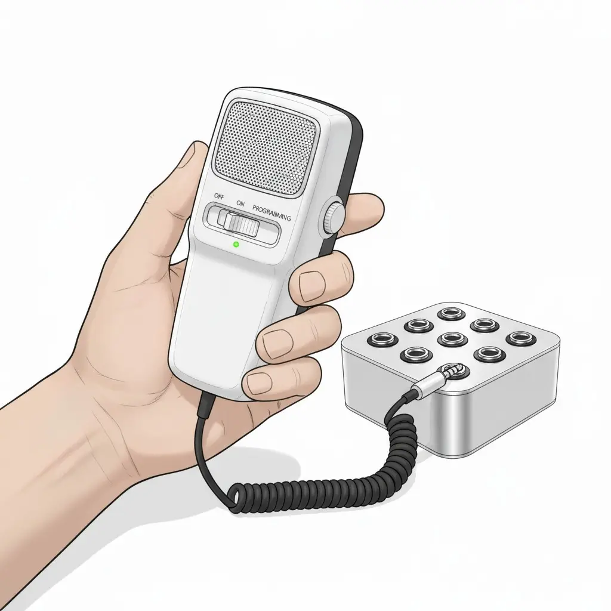

## Intro

Hey, it's Sun. Welcome to my course blog for [How To Make (Almost) Anything](https://fab.cba.mit.edu/classes/MAS.863/) (HTMAA), fall 2025.

I'll publish weekly articles on the things I've learned and report progress towards the final project.

I joined the [Tangible Media Group](https://tangible.media.mit.edu/) at the [MIT Media Lab](https://www.media.mit.edu/) in 2025. My [research interest](https://medialab.chuanqisun.com/?secret=empathy) is in the social, cultural, and philosophical aspects of generative AI. I've previously worked as a software engineer at Microsoft and enjoy [building tools](https://chuanqisun.com/) for the open source community.

## Weekly updates



<!-- hide the "post" tag because it is self-evidence -->

- [{{ post.data.title }}]({{ post.url }}) {{ post.data.date | humanDate }}  #{{ tag }}



## Final project

I want to combine my background in AI application development with TMG's focus in Tangible Interface to build a voice-driven AI programming system inspired by telephone switchboard operators.

### The inspiration

I’m motivated by how AI-routed phone systems have eroded the empathy and connection once provided by human operators. I want to revive that craft by building a switchboard that puts a person back in the loop as a thoughtful listener and connector.

**Jersey Telecom Switchboard and Operator ([source](https://commons.wikimedia.org/wiki/File:Jersey_Telecom_switchboard_and_operator.jpg))**

### The idea

A physical AI agent network implemented as a hardware grid with voice-based interaction and programming capabilities. The system combines push-to-talk interfaces with node-based generative AI computation, allowing users to dynamically program and interact with AI agents through voice commands. I want to call this system **Field Programmable Generative AI (FPGAI)**

**My initial sketch**

Next, I want to visualize the idea with gen AI. I'm entirely new to 3D modeling and rendering, so the fastest route to gain intuition on the form of the design is naturally using AI.

I crafted the prompt based on what I was imagining. The latest gemini model got this for me in one shot.

**Device base ([prompt](./posts/week-01/media/ai-rendered-base.txt))**

Next, let's visualize the hand-held device. I want to model it after a CB radio speaker mic. Inspired by [this project](https://x.com/gvy_dvpont/status/1866217836537848144)

**Hand unit ([prompt](./posts/week-01/media/ai-rendered-hand-unit.txt))**

Finally, let's put them together and add some context. I haven't decided the exact size for each component yet. I think that will have to wait until I figured out the electronics first.

**In use ([prompt](./posts/week-01/media/ai-rendered-in-use.txt))**

### The implementation

While it's still too early to fully specify the project, I have the following high level design.

**Main Board**

- Grid of 3.5mm audio jacks serving as physical computation nodes
- Analog-to-Digital conversion
- LED indicators for node states and network connections
- Network interface to host computer for AI workloads

**Speaker-Microphone Units**

- Handheld devices with audio connectors
- Push-to-talk button for voice input
- Mode switch (interaction/programming)
- Built-in speaker for AI audio output

### Operating Modes

**Interaction Mode**

- Push-to-talk activates voice input to connected node
- AI processes input and returns audio response through speaker
- Real-time computation with visual feedback via LEDs

**Programming Mode**

- Voice commands modify network topology
- Reprogram individual node computation logic
- Create autonomous nodes that operate without physical connection
- Define inter-node communication patterns

After the conceptual exploration from week 1, I switched focus to the electronics. I hope the electronics design can help inform the exterior of the system.

I started off with off-the-shelf components and iterated the idea to build more from sractch.

### Proof of concept with off-the-shelf components

I can prototype almost the entire experience with cheap off-the-shelf products:

1. Push-to-talk with a secondhand CB radio hand unit
2. Audio cable adapters to 3.5mm TRRS
3. USB hub for multiple inputs

**Prototype using consumer electronics**

What's missing:

1. No effort involved. This will result in a failing grade. It's only good for prototyping
2. Can't guarantee the compatibility of the hand unit with the 3.5mm TRRS jack
3. Can't prototype the visual feedback feature, where the 3.5mm jack shows "ready" state to the user via an LED

### Bring intelligence to the main body

Iterating on the idea, I could use a Raspberry Pi with a primitive USB hub as the main processor. The Pi may still use a nearby laptop for LLM and speech-to-text, text-to-speech, but it's also possible to bring the entire AI/ML stack onto the device, reducing the need for networking.

**Moving compute to Raspberry Pi**

I still need to figure out how the Pi can use the LEDs to display system state. Besides, I need to program some microcontroller to meet the requirements of this class. Can we go one level deeper?

### Move audio processing to hand unit

To make the project more challenging, I can use an ESP32-based audio system to pick up speech and play back AI voice. We can wirelessly connect the ESP32 with a nearby laptop, where the voice-driven AI interactions will take place.

The main body still needs a controller to send the following information to the nearby laptop:

1. Detect which socket is plugged in
2. Control the LED status lights

**Audio processing in hand unit**

The audio cable in this design does not really pass audio. It is solely used for detecting the state of plugged/unplugged. I need to figure out how to rig the 3.5mm jack to achieve this.

### Build my own speaker/microphone

The next level is replacing the ESP32-based audio kit with a custom PCB, with speaker and microphone manually soldered. This will probably be the upper bound of the level of complexity I can handle.

**Build microphone and speaker on custom PCB**

My next step is taking the idea to a TA for advice. This is my first time designing with electronics, so I do anticipate big revisions. Stay tuned.

### Networking

Learning about embedded programming validated the design above. After getting hands-on experience building an [echo server with ESP32](./posts/week-03/index.md#networking), I now feel confident that I can relay data between the ESP32 hand unit and a nearby laptop using either a Wi-Fi or a serial connection. Next, I can explore several things in parallel:

- Improve the 3D modeling using the electronics component as reference
- Learn 3D printing (next week) and prototype the hand unit and the main body
- Program the microphone and speaker with the ESP32 to inform the circuit design for the custom PCB
- Explore low-latency, two-way audio streaming between the laptop and the ESP32

### Electronics design update

- I consulted with our TA [Quentin Bolsee](https://fabacademy.org/2020/labs/ulb/students/quentin-bolsee/about/) regarding electronics design
- Received help on input/output device
- Did additional research with YouTube tutorials from [atomic14](https://www.youtube.com/@atomic14)
- I was able to fully spec out the electronics:
- Hand unit
  - Micro-controller: Xiao ESP32-C3
    - Upgrade option to ESP32-C6 if WiFi performance bottlenecks
    - Upgrade to WROOM-32E if I need more GPIO pins
  - Audio input: ICS-43434 I2S MEMS Microphone
  - Audio output: MAX98357A I2S Class D Amplifier + 8-ohm speaker
    - The specified response frequency is 600hz - 4000hz, which may not be ideal for voice. Might need alternative
  - Physical inputs
    - 2 buttons
      - single button: push-to-talk
      - both buttons: broadcast
    - 2 switched
      - Power On/Off
      - Mode switch interaction/programming
  - Power: 3.7V LiPo battery
    - With upgrade to 3AA battery pack + voltage regulator. Need to check with electronics expert on how this works. I prefer AA batteries for easier replacement and more vintage feel
  - Connectivity: 3.5mm TRRS jack (see discussion in connection detection)
- Main unit
  - Micro-controller: Xiao ESP32-C3
  - Outpu:
    - 4 LEDs
    - 4 3.5mm TRRS jacks (see discussion in connection detection)
- Connection detection
  - I would like to eventually support multiple hand units speaking at the same time
  - Therefore, I need to track which hand unit is plugged into which jack
    - Tradition physical TRS plug detection doesn't differentiate between different plugs
  - I propose to use TRRS jack as a hack to detect plugs. Consider the following:
    - We can use high/low voltage as 1/0 bit. Combining multiple bits can give us more unique values
    - TRRS has 4 connections. We can use the sleeve as ground, and the other 3 connections as signal
    - This gives us 2^3 = 8 unique values
    - Hence I'm reducing the number of jacks to a 2 by 2 grid, allowing each jack to be uniquely identified by the 3-bit code
  - The main unit is responsible to pull up/down the 3 signal lines on the jacks
  - The hand unit is responsible to decode the 3-bit code and send it to the laptop along with its own unique ID
  - This should be all the communication needed among the PC, the hand unit and the main unit:
    - Hand unit plug in: hand unit sends "plug in" message to PC with the 3-bit code associated with its wireless ID
    - Hand unit send audio to PC: hand unit streams audio data associated with its wireless ID
    - PC send audio to hand unit: PC streams audio data to the hand unit using the associated wireless ID
    - PC send LED state to main unit: PC sends LED state using the 3-bit code to identify which jack to light up

Parts list

- [Xiao ESP32-C3](https://www.digikey.com/en/products/detail/seeed-technology-co-ltd/113991054/16652880) x2 (1\* for hand units, 1 for main unit) (stocked by CBA)
- [ICS-43434 I2S MEMS Microphone](https://www.digikey.com/en/products/detail/tdk-invensense/ICS-43434/6140298)\* (stocked)
- [MAX98357A I2S Class D Amplifier](https://www.digikey.com/en/products/detail/analog-devices-inc-maxim-integrated/MAX98357AETE-T/4936122)\* (stocked)
- [PSR-57N08A01-AQ 8-ohm speaker](https://www.digikey.com/en/products/detail/mallory-sonalert-products-inc/PSR-57N08A01-AQ/2071452)\* (stocked)
- [3.5mm TRRS jack](https://www.sparkfun.com/audio-jack-3-5mm-trrs-smd.html) x5 (1\* for hand unit, 4 for main unit) (need to order)
- [TRRS audio cable](https://www.monoprice.com/product?p_id=24437&srsltid=AfmBOorjZ4_M3Uo6oXfcsZa9juhuYBGbdvfnJ7mGzuYrVbLg65MT6nCNH84)\* (need to order)
- [3.7V LiPo battery](https://www.digikey.com/en/products/detail/mikroelektronika/MIKROE-698/13679450)\* (need to order)
- [Button](https://www.digikey.com/en/products/detail/omron-electronics-inc-emc-div/B3SN-3112P/27856) x2 (check stock)
- [Slide](https://www.digikey.com/en/products/detail/c-k/AYZ0102AGRLC/1640108) x2 (check stock)
- [LED](https://www.digikey.com/en/products/detail/lumex-opto-components-inc/SML-LX1206IC-TR/229140) x4 (check stock)
- 3AA battery pack + voltage regulator (optional)

\*For a single hand unit. Need more for additional units

High-level schematic

**High-level design for the electronic components**

With this design update, it became clear that the main unit is essentially a "dumb" device that encodes the TRRS socket and displays which AI agent is speaker and doesn't care about audio processing at all.

I have also gained insights how the physical contraints for the housing. The hand unit needs to mainly account for battery and speaker size. The PCB size and shape can be more flexible. The main unit needs to account for the 4 TRRS jacks.

Here are new and remaining questions which I plan to resolve by going to TAs as well as attending future lectures.

1. PCB design. [atomic14's design](https://www.youtube.com/watch?v=d_h38X4_eQQ) is a good reference but I don't know how I can design my own.
2. Packaging design. How do I hold the components in place? especially the 3.5mm TRRS jacks which will receive physical stress.
3. Physical interaction. How do I put buttons and sliding switch on the hand unit? I want a good tactile feel.
4. LED lighting. How do make a ring that lights up around the TRRS socket?
5. The CBA electronics shop inventory doesn't match what the website says. Need to follow up
