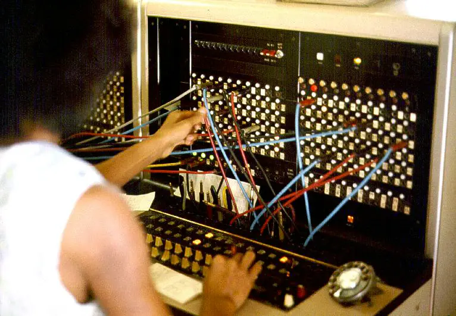

## Intro

Hey, it's Sun. Welcome to my course blog for [How To Make (Almost) Anything](https://fab.cba.mit.edu/classes/MAS.863/) (HTMAA), fall 2025.  
I'll publish weekly articles on the things I've learned and report progress towards the final project.

I joined the [Tangible Media Group](https://tangible.media.mit.edu/) at the [MIT Media Lab](https://www.media.mit.edu/) in 2025. My [research interest](https://medialab.chuanqisun.com/?secret=empathy) is in the social, cultural, and philosophical aspects of generative AI. I've previously worked as a software engineer at Microsoft and enjoy [building tools](https://chuanqisun.com/) for the open source community.

## Weekly updates



<!-- hide the "post" tag because it is self-evidence -->

- [{{ post.data.title }}]({{ post.url }}) {{ post.data.date | humanDate }}  #{{ tag }}



## Final project

I want to combine my background in AI application development with TMG's focus in Tangible Interface to build a voice-driven AI programming system inspired by telephone switchboard operators.

### The inspiration

I’m motivated by how AI-routed phone systems have eroded the empathy and connection once provided by human operators. I want to revive that craft by building a switchboard that puts a person back in the loop as a thoughtful listener and connector.

**Jersey Telecom Switchboard and Operator ([source](https://commons.wikimedia.org/wiki/File:Jersey_Telecom_switchboard_and_operator.jpg))**

### The idea

A physical AI agent network implemented as a hardware grid with voice-based interaction and programming capabilities. The system combines push-to-talk interfaces with node-based generative AI computation, allowing users to dynamically program and interact with AI agents through voice commands. I want to call this system **Field Programmable Generative AI (FPGAI)**

**My initial sketch**

Next, I want to visualize the idea with gen AI. I'm entirely new to 3D modeling and rendering, so the fastest route to gain intuition on the form of the design is naturally using AI.

I crafted the prompt based on what I was imagining. The latest gemini model got this for me in one shot.

**Device base ([prompt](./posts/week-01/media/ai-rendered-base.txt))**

Next, let's visualize the hand-held device. I want to model it after a CB radio speaker mic. Inspired by [this project](https://x.com/gvy_dvpont/status/1866217836537848144)

**Hand unit ([prompt](./posts/week-01/media/ai-rendered-hand-unit.txt))**

Finally, let's put them together and add some context. I haven't decided the exact size for each component yet. I think that will have to wait until I figured out the electronics first.

**In use ([prompt](./posts/week-01/media/ai-rendered-in-use.txt))**

### The implementation

While it's still too early to fully specify the project, I have the following high level design.

**Main Board**

- Grid of 3.5mm audio jacks serving as physical computation nodes
- Analog-to-Digital conversion
- LED indicators for node states and network connections
- Network interface to host computer for AI workloads

**Speaker-Microphone Units**

- Handheld devices with audio connectors
- Push-to-talk button for voice input
- Mode switch (interaction/programming)
- Built-in speaker for AI audio output

### Operating Modes

**Interaction Mode**

- Push-to-talk activates voice input to connected node
- AI processes input and returns audio response through speaker
- Real-time computation with visual feedback via LEDs

**Programming Mode**

- Voice commands modify network topology
- Reprogram individual node computation logic
- Create autonomous nodes that operate without physical connection
- Define inter-node communication patterns

After the conceptual exploration from week 1, I switched focus to the electronics. I hope the electronics design can help inform the exterior of the system.

I started off with off-the-shelf components and iterated the idea to build more from sractch.

### Proof of concept with off-the-shelf components

I can prototype almost the entire experience with cheap off-the-shelf products:

1. Push-to-talk with a secondhand CB radio hand unit
2. Audio cable adapters to 3.5mm TRRS
3. USB hub for multiple inputs

**Prototype using consumer electronics**

What's missing:

1. No effort involved. This will result in a failing grade. It's only good for prototyping
2. Can't guarantee the compatibility of the hand unit with the 3.5mm TRRS jack
3. Can't prototype the visual feedback feature, where the 3.5mm jack shows "ready" state to the user via an LED

### Bring intelligence to the main body

Iterating on the idea, I could use a Raspberry Pi with a primitive USB hub as the main processor. The Pi may still use a nearby laptop for LLM and speech-to-text, text-to-speech, but it's also possible to bring the entire AI/ML stack onto the device, reducing the need for networking.

**Moving compute to Raspberry Pi**

I still need to figure out how the Pi can use the LEDs to display system state. Besides, I need to program some microcontroller to meet the requirements of this class. Can we go one level deeper?

### Move audio processing to hand unit

To make the project more challenging, I can use an ESP32-based audio system to pick up speech and play back AI voice. We can wirelessly connect the ESP32 with a nearby laptop, where the voice-driven AI interactions will take place.

The main body still needs a controller to send the following information to the nearby laptop:

1. Detect which socket is plugged in
2. Control the LED status lights

**Audio processing in hand unit**

The audio cable in this design does not really pass audio. It is solely used for detecting the state of plugged/unplugged. I need to figure out how to rig the 3.5mm jack to achieve this.

### Build my own speaker/microphone

The next level is replacing the ESP32-based audio kit with a custom PCB, with speaker and microphone manually soldered. This will probably be the upper bound of the level of complexity I can handle.

**Build microphone and speaker on custom PCB**

My next step is taking the idea to a TA for advice. This is my first time designing with electronics, so I do anticipate big revisions. Stay tuned.

### Networking

Learning about embedded programming validated the design above. After getting hands-on experience building an [echo server with ESP32](./posts/week-03/index.md#networking), I now feel confident that I can relay data between the ESP32 hand unit and a nearby laptop using either a Wi-Fi or a serial connection. Next, I can explore several things in parallel:

- Improve the 3D modeling using the electronics component as reference
- Learn 3D printing (next week) and prototype the hand unit and the main body
- Program the microphone and speaker with the ESP32 to inform the circuit design for the custom PCB
- Explore low-latency, two-way audio streaming between the laptop and the ESP32
