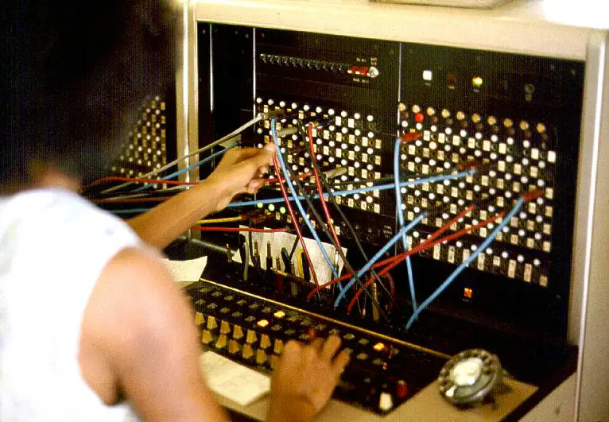
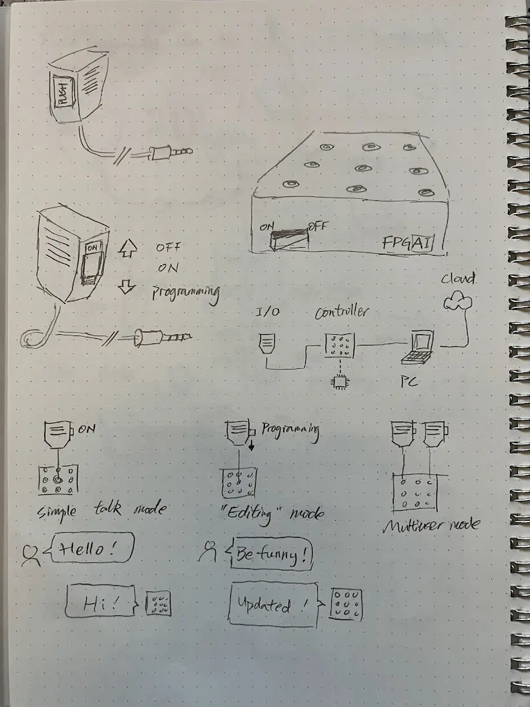
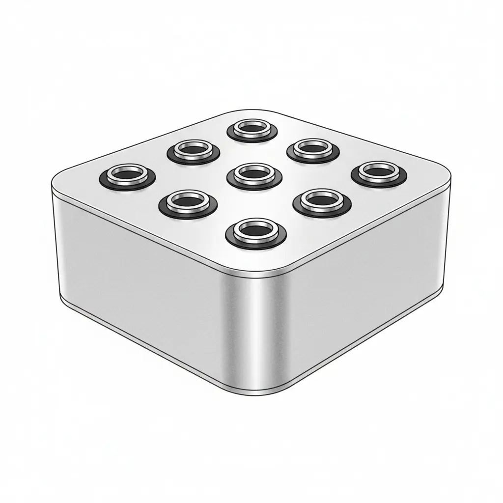
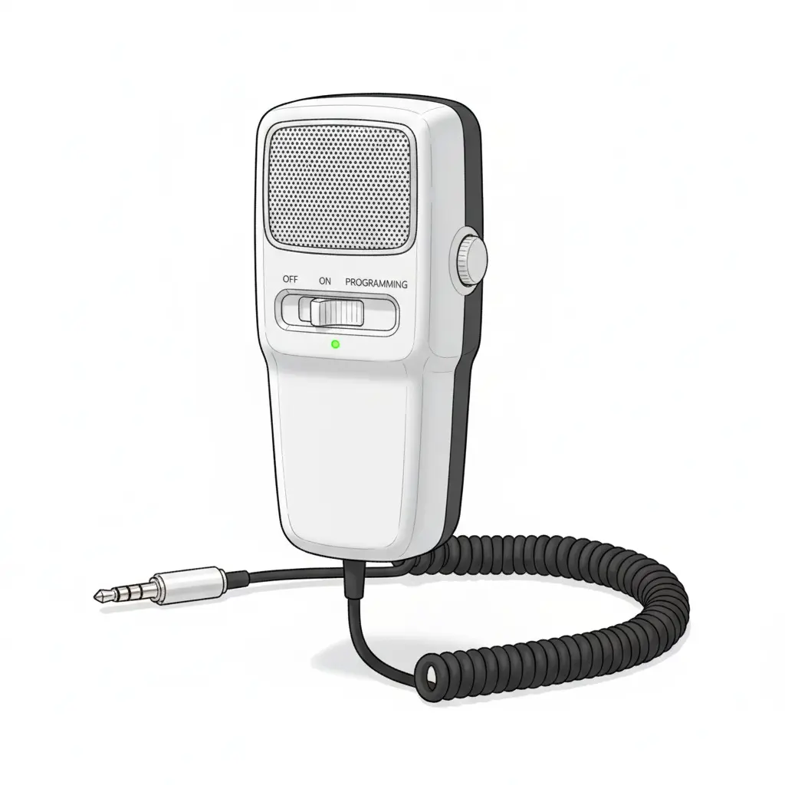
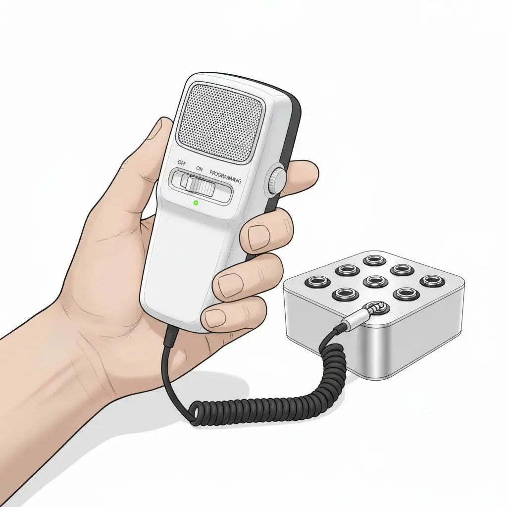
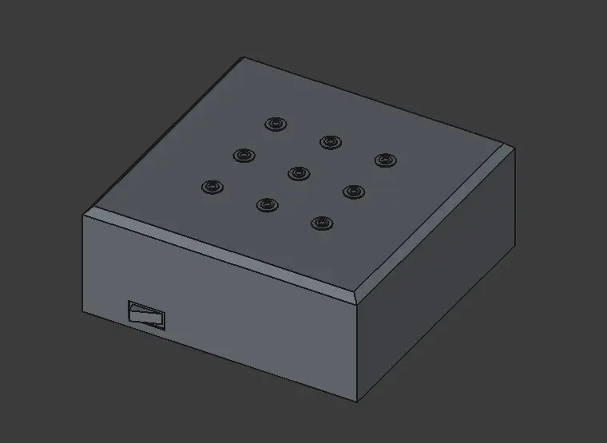
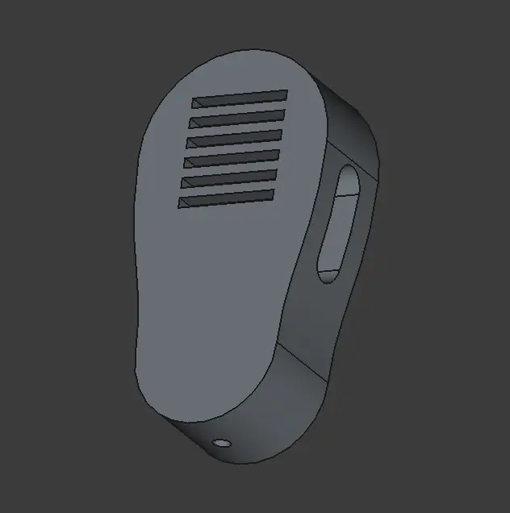
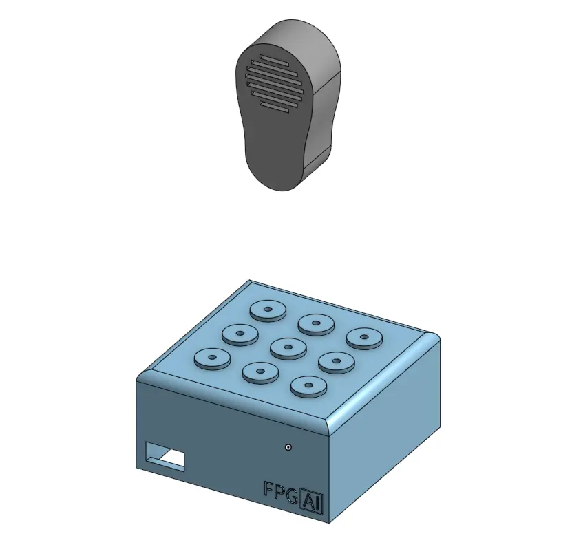

## Project kickoff

As a 1st year graduate student joining Tangible Media Group (TMG) at the Media Lab, I want to combine my background in AI application development with TMG's focus in Tangible Interface to build a voice-driven AI programming system inspired by telephone switchboard operators.

### The inspiration

I’m motivated by how AI-routed phone systems have eroded the empathy and connection once provided by human operators. I want to revive that craft by building a switchboard that puts a person back in the loop as a thoughtful listener and connector.

**Jersey Telecom Switchboard and Operator ([source](https://commons.wikimedia.org/wiki/File:Jersey_Telecom_switchboard_and_operator.jpg))**

### The idea

A physical AI agent network implemented as a hardware grid with voice-based interaction and programming capabilities. The system combines push-to-talk interfaces with node-based generative AI computation, allowing users to dynamically program and interact with AI agents through voice commands. I want to call this system **Field Programmable Generative AI (FPGAI)**

**My initial sketch**

Next, I want to visualize the idea with gen AI. I'm entirely new to 3D modeling and rendering, so the fastest route to gain intuition on the form of the design is naturally using AI.

I crafted the prompt based on what I was imagining. The latest gemini model got this for me in one shot.

**Device base ([prompt](./media/ai-rendered-base.txt))**

Next, let's visualize the hand-held device. I want to model it after a CB radio speaker mic. Inspired by [this project](https://x.com/gvy_dvpont/status/1866217836537848144)

**Hand unit ([prompt](./media/ai-rendered-hand-unit.txt))**

Finally, let's put them together and add some context. I haven't decided the exact size for each component yet. I think that will have to wait until I figured out the electronics first.

**In use ([prompt](./media/ai-rendered-in-use.txt))**

### The implementation

While it's still too early to fully specify the project, I have the following high level design.

#### Hardware Components

**Main Board**

- Grid of 3.5mm audio jacks serving as physical computation nodes
- Analog-to-Digital conversion
- LED indicators for node states and network connections
- Network interface to host computer for AI workloads

**Speaker-Microphone Units**

- Handheld devices with audio connectors
- Push-to-talk button for voice input
- Mode switch (interaction/programming)
- Built-in speaker for AI audio output

#### Operating Modes

**Interaction Mode**

- Push-to-talk activates voice input to connected node
- AI processes input and returns audio response through speaker
- Real-time computation with visual feedback via LEDs

**Programming Mode**

- Voice commands modify network topology
- Reprogram individual node computation logic
- Create autonomous nodes that operate without physical connection
- Define inter-node communication patterns

## Learning CAD

I want to stay in Linux so my options are a more limited. I looked into FreeCAD and Onshape, and briefly tried OpenSCAD, OpenJSCAD, and PySCAD. Initial thoughts:

**FreeCAD**: similar to most open-source software, very powerful and very hard to use. The v1 release came out near the end of 2024, so tutorials for the latest version are limited.
**Onshape**: well done for a web app. Switching between sketch and parts design feels very seamless. But I'm afraid of vendor lock in and network connection issues.

I also attempted running VS Code + GitHub Copilot (gemini 2.5 pro) + FreeCAD MCP. It works as a proof of concept but the AI struggles to make the right editing decision. I do foresee text-to-CAD becoming viable in the next year or two.

Before giving up on AI assisted CAD (AAD?), I want give the code-first approach a shot. My first intuitation is that the declarative syntax of OpenSCAD will be perfect for AI code generation. But upon a closer look, there are still gaps:

- Lack of type annotation, reducing LLM's ability to validate results
- Syntax extremely verbose, further increasing error rate.
- Lack of custom editor support. Making VS Code and Cursor use difficult.

My decision is to stay with FreeCAD and Onshape. Maybe explore AI assisted model building as a side project when there is less pressure in meeting the project deadline.

This is what I've got for my projects. (Screenshots for now. I will try make a live model viewer later)

**Device base with FreeCAD**

**Hand unit with FreeCAD**

**Full system with Onshape**

Things I need to keep learning/practicing on:

- Model for 3D printing, not for rendering.
- Sketching on curved surfaces.
- Parameterize more things
- Integrate the electronics into the modeling process

Things I am reflecting on:

- The constraints system in CAD is very similar to the responsive design principle in CSS, and even more similar to the iOS app layout system.
- I can see some parallel between functional programming and CAD. If each operator is a pure function, the entire process can be modeled as a composition of functions.
- Usability matters. No matter how powerful the system is, if the entry bar is too high, novice users will build their habits around the easier products and get locked into their ecosystem.
