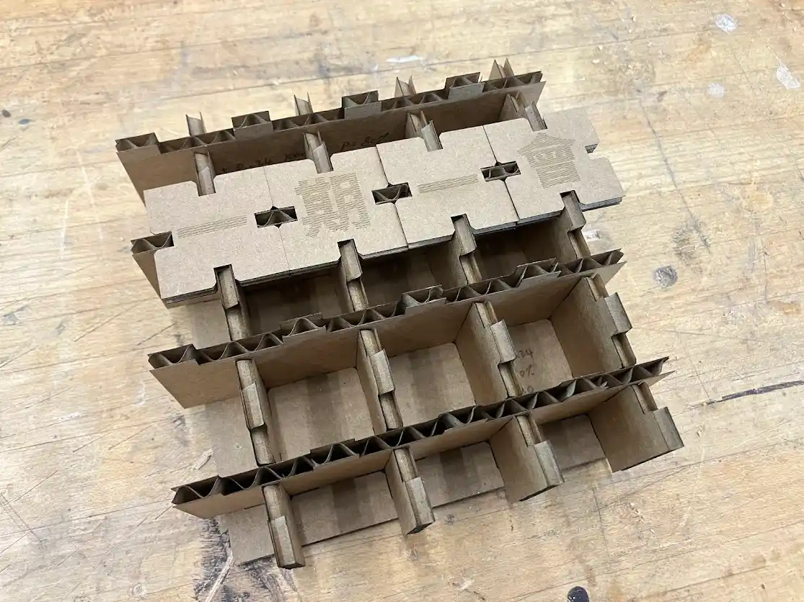

## Group Assignment: Characterizing the Laser Cutter

### Introduction

I joined forces with [Miranda](https://fab.cba.mit.edu/classes/863.25/people/MirandaLi/) and [Ray](https://fab.cba.mit.edu/classes/863.25/people/RaySong/) to study the kerf characteristics of the laser cutter. After receiving the demo and training from the lab manager, we selected the xTool P2 desktop laser cutter for its usability:

- Camera-guided UI was very easy to use
- Built-in templates for creating a test grid with varying parameters
- One-click auto-focus

**One-click to set laser focus**

### Finding the Optimal Cutting Power

We began by determining the minimum power required to cut through our material. Using the default speed of 16mm/s, we tested power settings from 10% to 100% in 10% increments.

**Visualize how power affects cutting**

| Power (%) | Cut Through?   |
| --------- | -------------- |
| 10        | No             |
| 20        | No             |
| 30        | Yes (minimum)  |
| 40        | Yes (selected) |
| ...       | Yes            |
| 100       | Yes            |

**Result:** We found 30% to be the minimum power for complete cutting. To account for variance, we selected 40% for all subsequent tests.

**Power testing results**

### Initial Kerf Testing: Learning from Mistakes

For our first approach, we cut a test piece with dimensions 16mm × 30mm to insert into 30mm long slits ranging from 4.1mm to 4.9mm width. The width range was determined by the measured cardboard thickness around 4.2mm, which varies and can go up to 4.6mm, depending on the position of measurement.

This revealed two critical issues:

1. **Oversized slits:** The kerf caused all slits to be much wider than their specified dimensions
2. **Impractical data:** Knowing the exact measurement of a well-fitting slit wasn't as useful as knowing the machine-specific kerf setting

**Slits are too lose**

### Switching to the Empirical Method

We pivoted to a more practical approach: varying the kerf setting on the machine until achieving optimal fit.

**Rationale:** The kerf setting (offset) depends on both:

- The absolute kerf of the laser
- The desired joint tolerance for our design

It's more productive to obtain the kerf setting directly rather than measuring its individual components.

### Understanding xTool's Kerf Settings

The xTool software allows for both outward (positive) and inward (negative) kerf settings. Initially, we were confused by the terminology—does "outward" mean moving the laser outward, or compensating for outward kerf by moving inward?

Through testing, we confirmed:

- **Positive offset (outward):** Use for pegs/protrusions
- **Negative offset (inward):** Use for holes/slots

This is because kerf effectively shrinks pegs and enlarges holes.

**We wrote down "Outward/Loose", "Inward/Tight" next to slits**

### Systematic Kerf Testing

We created test slits with the following parameters:

| Parameter         | Value              |
| ----------------- | ------------------ |
| Slit width        | 4mm                |
| Kerf offset range | -0.08mm to +0.08mm |
| Increment         | 0.01mm             |

**Key findings:**

- Positive kerf offset → looser fit
- Negative kerf offset → tighter fit

We acknowledge that the 4mm width was loosely based on the average thickness of the cardboard at 4.19mm. This "lazy" estimate works because we are only looking for a fit, and don't care about the final dimension.

**We hypothesized, debated, observed, and learned as a group**

### Final Calibration Test

Based on initial results showing 0.03-0.04mm kerf offset as optimal, we refined our testing:

| Test Range   | 0.02mm to 0.05mm      |
| ------------ | --------------------- |
| Increment    | 0.01mm                |
| Orientations | Horizontal & Vertical |
| Applied to   | Both pegs and slits   |

**Results:**

| Kerf Offset\* | Fit Type  |
| ------------- | --------- |
| ±0.04mm       | Loose fit |
| ±0.05mm       | Snug fit  |

\*Positive offset on pegs, negative offset on holes

**Testing different orientations for best fit**

**Additional observations:**

- Orientation did not affect fit quality
- Repetitive testing caused material fatigue (compressed pegs, enlarged holes). This should be considered in practical assembly scenarios

## Vinyl Cutting

I found Cricut Maker 3 and Roland GS-24 in the shop. Following threads from online forums, I tried installing the appropriate software for Linux. Unfortunately, none of them work:

1. Several places mentioned [inkcut](https://github.com/inkcut/inkcut). The official installation guide works but it does not have matching device profiles for our machines.
2. [One forum](https://en.industryarena.com/forum/free-tux-plot-v2-2-vinyl-cutters-engravers-pen-plotters-etc--147178.html) mentioned tux plot, but the [download link](http://securetech-ns.ca/camm-linux.html) is dead.
3. I managed to download and install Cricut Windows software using [Wine](https://www.winehq.org/) and [Bottles](https://usebottles.com/). The software crashes immediately after launch.

I was about to give up at this point and started considering asking to borrow someone's Windows laptop. However, to my surprise, Cricut has an iOS app which, upon further investigation, allows file upload. There was hope!

**File upload via iOS app**

Let's test this timeless symbol. It has two colors, and my plan is to cut the four pieces separately and assemble them manually.

**Yin and Yang ([source](https://en.wikipedia.org/wiki/Yin_and_yang#/media/File:Yin_and_Yang_symbol.svg))**

Uploading the SVG was smooth. But to my surprise, the app automatically planned a simpler cut:

1. First pass: cut the large and small circles on black
2. Second pass: cut the irregular shape and small circle on white

**Cut the black first**

**Cut the white next**

This strategy would result in a non-flat surface but easier assembly. Being a beginner, I opted for simplicity.

I found this [YouTube tutorial](https://www.youtube.com/watch?v=VDdDAkGLnn8) on using the machine mat.

First, carefully remove the protective film. The film helps preserve the sticky layer of the mat and should be put back on after use.

**Peeling off the film**

Line up the vinyl sheets. I could only find black with matte finish and white with glossy finish.

**Prepare both colors on the same mat**

First, cut the black.

**Cutter only cuts through the surface layer**

Rotate 180 degrees to cut the white.

**Prepare for cutting the white**

**Bending the vinyl helps reveal the gap**

It's time for the final assembly. Angled tweezers are very helpful.

**Assemble the parts**

Finish up with the small black circle.

**Last piece in manual assembly**

Testing the final result. Did you notice the issue?

**Notice the black rim**

What caused the very noticeable black rim outside the white half?

- It could be my assembly skills. Steadier hands might help.
- Mixing different materials might be a factor, but it shouldn't be that noticeable.
- It shouldn't be a kerf issue. While I did not adjust for kerf, the black and white parts should be affected equally if kerf were the problem.

I believe it's most likely a skill issue. With the shop closing in less than 30 minutes, I want to make sure I can wrap up in time, so I trimmed the black rim with scissors as a quick fix.

**Trimmed with scissors**

The result looks much better after trimming.

## Construction Kit: Movable Type on Paper

I'm planning to construct a miniature printing press using cardboard movable type with the following approach:

- **Engrave mode:** Create raised or grooved letters on cardboard surfaces
- **Cut mode:** Build a 3D structure to configure and hold the letter plates in position
- **Printing method:** Use pencil and thin paper for word transfer

After a quick sketch, I decided to use latticed walls as a support platform and square tiles for the letters.

**Initial sketch**

I found that sketching is a very poor medium for spatial reasoning. I needed to try different shapes and slide them around to "feel" the material. Let's bring in CAD! However, I don't want to be slowed down by the details of setting constraints and switching between 2D and 3D modes. In other words, I need a tool for 3D prototyping, not modeling. Maybe [Tinkercad](https://www.tinkercad.com/dashboard)?

I realized tiling on a lattice is not easy. The shape of the tile must account for the extrusion from the lattice. My first few lattice designs resulted in an unstable and assymetric tile. Let's play with the geometry a bit more.

**Initial prototype**

A few iterations later, I landed on a geometry that works. I can't imagine doing this with pen and paper.

**Revised prototype**

Let's visualize the full kit, with a base for stabilizing the walls.

**Prototyping the kit ([open](https://www.tinkercad.com/things/iHp7Bxp9Onp-movable-type-prototype?sharecode=bYhST49tU9vGhXVUZNt28QIcgHIHKFvyDy96pVRKxtk))**

Tinkercad does not allow instancing of a master model, nor does it have parametric design. We need a proper CAD tool like [Onshape](https://www.onshape.com/). I started with parts design, using parameters for tile width, tile notch depth, paper thickness, wall height. Everything else should be calculated based on those.

**Parts design converted from Tinkercad**

After the 2D sketching, I tested the assembly. Glad to see everything fitting together.

**Virtual assembly**

To add engraving, I sketched the text and removed it from the surface of the tiles. I was able to represent the text as a parameter, but I couldn't find a way to map an array of characters onto an array of part instances. So I manually created the text grid, one by one, to match the position of the tiles. This is an 80%-time effort in the 80/20 rule.

**Text sketch**

The final kit has all the tiles, one for each character, the base, and the X/Y lattice walls.

**Full kit ([open](https://cad.onshape.com/documents/0a294381c272da023ac4d4bd/w/7e9dc8833e6fc5270abc7d8c/e/766b306b154d4536663d85ba?renderMode=0&uiState=68c6d7c62a40ce68118af406))**

Enough pixels. Let's go to the machine. I cut the lattice and a single tile to test the fit. I didn't use a kerf offset because I want to have a good baseline on how the fit feels.

**Loose fit due to kerf**

As expected, the laser made the tile a bit smaller and the slot a bit bigger. So I printed a square, measured the difference between the hole and the square, divided by 2, and got a 0.24mm kerf offset.

**Kerf test**

I want to cut out the letter and use pencil/paper for a transfer print. The idea didn't work because the cardboard does not have enough stiffness to support the pencil.

**Transfer test, failed**

Seeing the issue, [Dan](https://dangilbert.pages.cba.mit.edu/home/), suggested a great idea of using the cutout as a spray painting mask. But I realized another issue with cutting out the letter. Some characters have enclosed shapes, think `P`, `O`, `D` in English, and `口` and `回` in Chinese. The inner shape would become free-floating after the cut. The idea won't work.

What if we emboss the character by engraving the negative space? I tested with a sharpie. It could have worked had there been more oily ink. The sharpie got aborbed by paper and instantly dried up so I wasn't able to make the transfer. If you read Chinese/Japanese, you will notice the character is mirrored.

**Printing test, failed**

Given the limited time and no access to other paint/ink, I decided to build a modular paper display, using scored or engraved Kanji only. Testing showed that engraving can create beautiful horizontal stripes.

**Engraving test, success**

Cutting the tiles requires some planning. We need to engrave the characters before cutting the tiles. The machine automatically figured this out, but I need to keep this in mind if the machine were manual.

**Cutting tiles after engraving**

Success upon first assembly! In [Chinese](https://en.wikipedia.org/wiki/Chengyu) and [Japanese](https://en.wikipedia.org/wiki/Yojijukugo), we have many four characters words, making this system the perfect tool for exploring the combinatorial possibilities!

**Kanji 一期一会 (ichigo ichie), meaning once-in-a-lifetime encounter**

I added all the tiles to display the phrase "The Future of Parametric Design", something we are doing for this class; "Stand out", "Blaze the trail", and "Make mountains", values I learned from my professor [Hiroshi Ishii](https://www.media.mit.edu/people/ishii/overview/).

**Final assembly**

When viewed at certain angles, the engraving marks shine beautifully. It reminds me of the [Tatami making](https://www.youtube.com/shorts/WkftZ3dWNW40) technique by [Kenji Yamada](https://art-tatami.com/history/).

**On the bookshelf, interacting with light**

## Final Project Update

TBD
