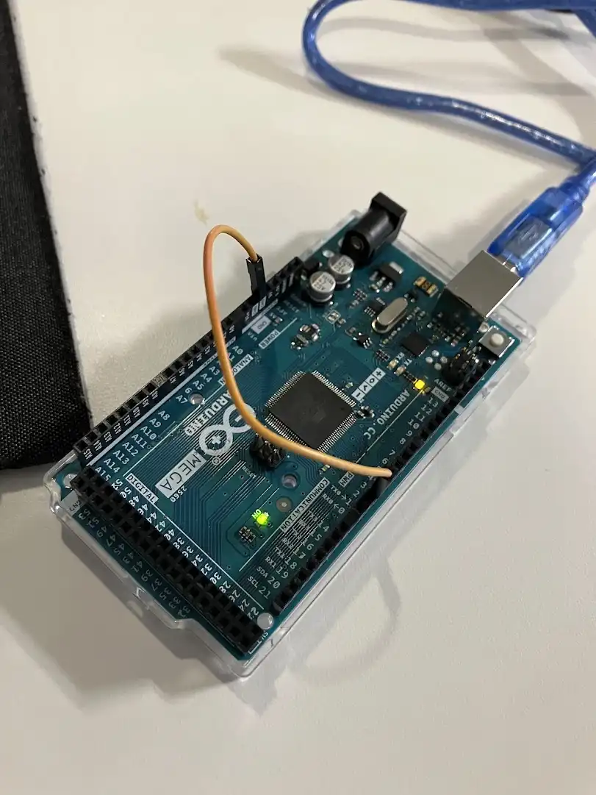
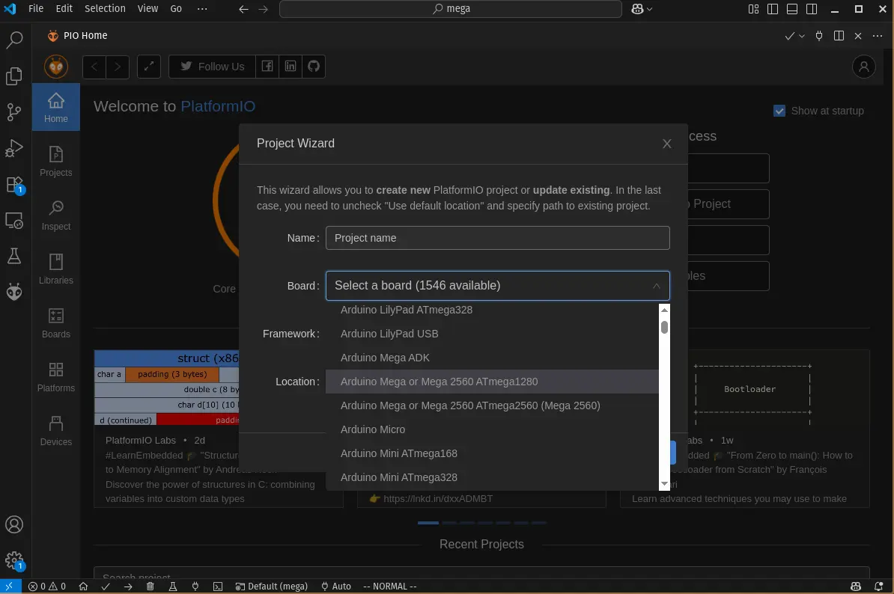
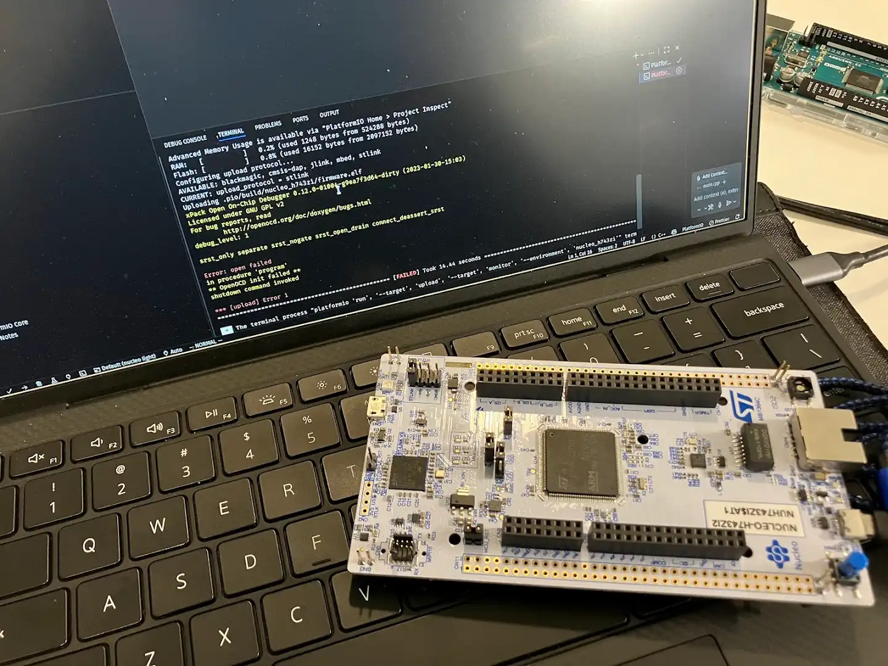
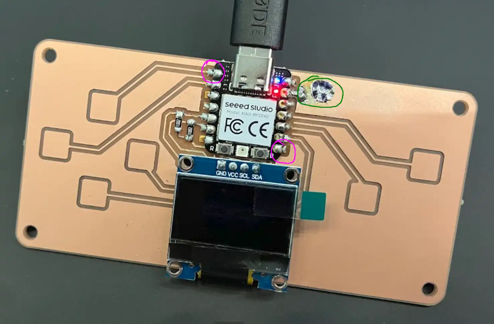
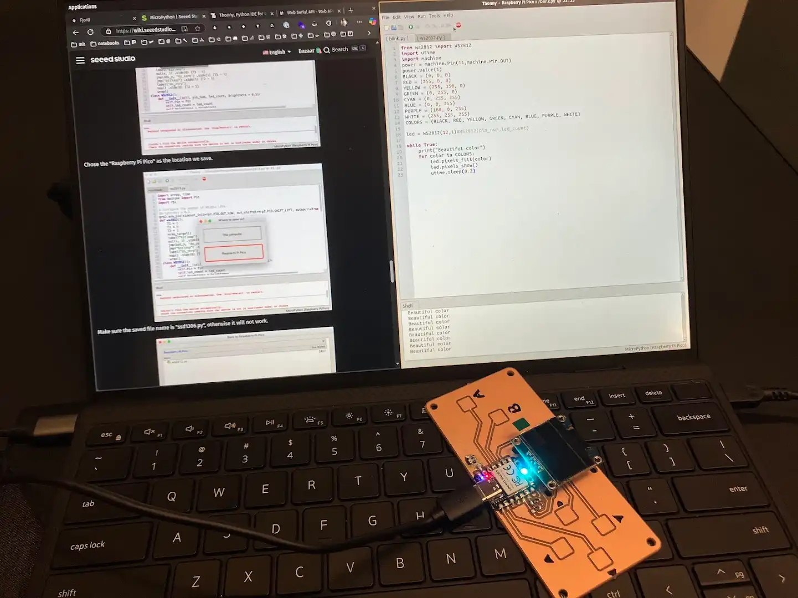
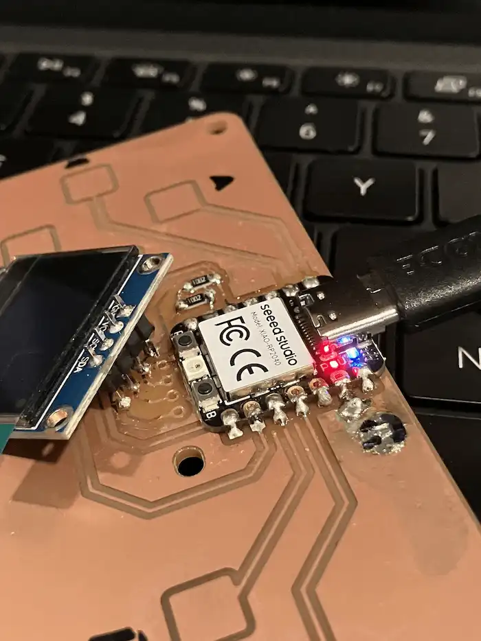
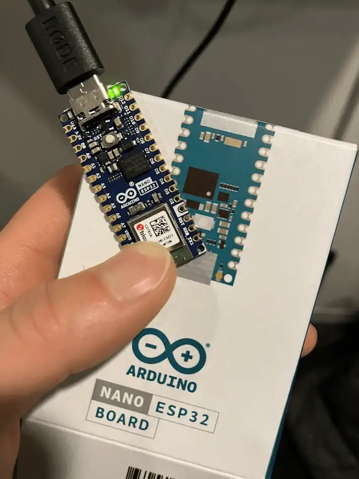
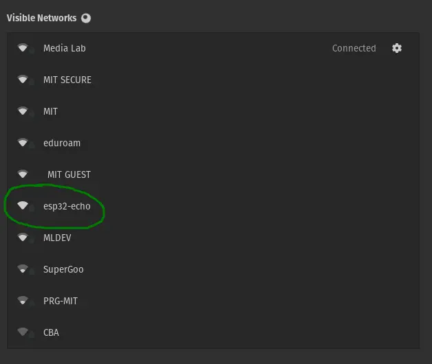
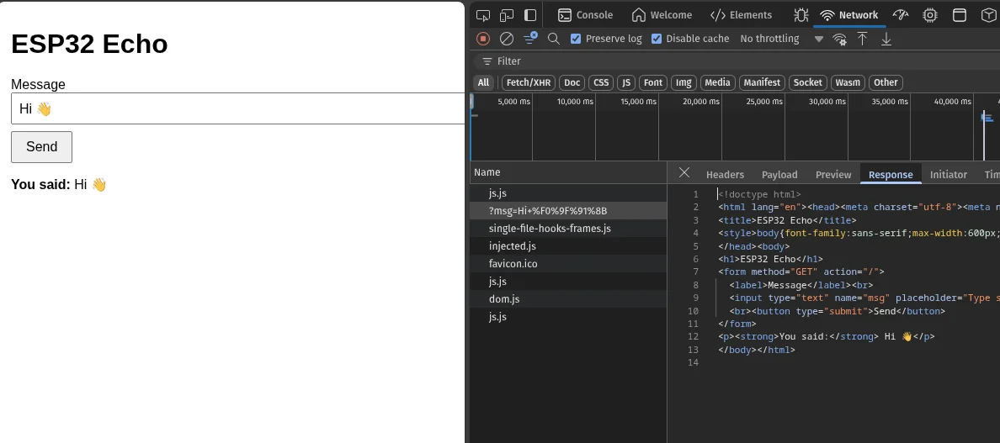

(this post is a work in progress)

## Group activity

Before attending the soldering workshop, I met up with [Ceci](https://fab.cba.mit.edu/classes/863.25/people/CeciliaMarsicovetereFanjul/), [Eitan](https://fab.cba.mit.edu/classes/863.25/people/EitanWolf/), and [Miranda](https://fab.cba.mit.edu/classes/863.25/people/MirandaLi/) to get familiar with the Arduino platform.

We borrowed equipment from Ceci's lab. After a brief intro by Ceci, we fired up the Arduino IDE and started programming. The setup was very simple.


**Testing Arduino Mega 2560**

After trying the official [Arduino IDE](https://www.arduino.cc/en/software/), I tested out VSCode + [PlatformIO](https://platformio.org/). It supports a wide variety of platforms and boards.


**PlatformIO runs inside VS Code**

I'd love to stay in the VSCode environment because I can use all of my familiar editor extensions as well as GitHub Copilot for AI assisted coding. But I soon realized that not all boards are supported. For example:


**NUCLEO H743Z12 is incompatible with PlatformIO**

Without any peripherals, I tried to make the most out of the jumper wires. I had fun building an "Affective computing" demo where plugging a jumper wire pin into the board causes "ouch" to appear from the serial port.

<video src="./media/group-activity-02.mp4" controls muted></video>
**Single jumper wire interaction ([source](./code/jumper-wire/jumper-wire.cpp))**

After the group activity, I felt dissatisfied with the workflow: the Arduino IDE has limited programming language support. Compared to the TypeScript and Node.js ecosystem I'm familiar with, I can't easily look up symbols and `.h` header files in any of the tools above. Programming feels slow.

I attended a soldering workshop next. The only experience I had was soldering the GPIO header onto a Raspberry Pi nearly 10 years ago. I had much to learn.


**My first soldering attempt**

The photo above encodes two of my lessons:

- Start with the corners to stabilize the chip, then solder the rest of the contacts. See purple circles.
- If there's a mistake that doesn't affect functionality, leave it. Trying to fix it could make it worse. See green circle.

My soldering worked on the first attempt. I moved on to programming the board.

## Individual project

Following the [instructions by our TA](https://quentinbolsee.pages.cba.mit.edu/qpad-page/), I picked QPAD-xiao, based on RP2040.

Reading the [datasheet for RP2040](https://files.seeedstudio.com/wiki/XIAO-RP2040/res/rp2040_datasheet.pdf) was overwhelming. I'm thankful the Arduino library has taken care of most of the low-level details regarding the clock, memory, and I/O. I had the mental model that JavaScript and Python are high-level languages, and C is a low-level language. Reading the datasheet gave me concrete examples of what low-level programming actually involves. Definitely a humbling moment for me.

Practically speaking, I think the datasheet is not a textbook. I can't read it from cover to cover. It is more useful as a reference when I have a specific question to ask or a problem to solve.

Next, I compiled and loaded the [sample programs](https://gitlab.cba.mit.edu/quentinbolsee/qpad-xiao) from [Quentin](https://quentinbolsee.pages.cba.mit.edu/home/) with the Arduino IDE. The touch pad blinked the LED; the OLED said "Hello world." It's time to build something myself.

The idea was to simply "fuse" together the [touch pad code](https://gitlab.cba.mit.edu/quentinbolsee/qpad-xiao/-/blob/main/code/Arduino/test_touch_RP2040/test_touch_RP2040.ino?ref_type=heads) and the [OLED display code](https://gitlab.cba.mit.edu/quentinbolsee/qpad-xiao/-/blob/main/code/Arduino/test_display_RP2040/test_display_RP2040.ino?ref_type=heads). I could have done this in ChatGPT, but it would be too much copy-pasting. Can I get VSCode and GitHub Copilot to work?

So I tested [Arduino CLI](https://github.com/arduino/arduino-cli) in VSCode as well as [MicroPython](https://wiki.seeedstudio.com/xiao_esp32c3_with_micropython/) with [Thonny IDE](https://thonny.org/) for the Xiao RP2040. MicroPython itself is really good, but the board I had seems to have an issue connecting to the OLED. In addition, as soon as I started organizing a more complex program into multiple files, the lack of a good multi-file uploader made coding in Python very inconvenient.


**Thonny IDE was good for simple python programming**

In the end, I landed on VSCode + Arduino CLI and wrote a shell script to simplify debugging:

```sh
#!/bin/bash
arduino-cli compile -b rp2040:rp2040:seeed_xiao_rp2040 "$CURRENT_FILE_PATH"
arduino-cli upload -p /dev/ttyACM0 -b rp2040:rp2040:seeed_xiao_rp2040 "$CURRENT_FILE_PATH"
arduino-cli monitor -p /dev/ttyACM0
```

Here is the corresponding VS Code `.vscode/launch.json` settings file that lets you press <kbd>F5</kbd> to start debugging:

```json
{
  "version": "0.2.0",
  "configurations": [
    {
      "command": "./debug.sh",
      "name": "deploy to device",
      "request": "launch",
      "type": "node-terminal",
      "cwd": "${workspaceFolder}",
      "env": {
        "CURRENT_FILE_PATH": "${fileDirname}"
      }
    }
  ]
}
```

This is by far the most productive setup. Here is my full comparison:

| Workflow                     | Pros                                                                            | Cons                                                                                                                                   |
| ---------------------------- | ------------------------------------------------------------------------------- | -------------------------------------------------------------------------------------------------------------------------------------- |
| **Arduino IDE**              | • Official support<br>• Simple `.ino` format                                    | • Limited IDE features<br>• Unintuitive keyboard binding                                                                               |
| **VSCode + PlatformIO**      | • Community support for many platforms and boards<br>• Good VS Code integration | • Lack of extensibility when your board is not supported                                                                               |
| **MicroPython + Thonny IDE** | • Simple for Python programming                                                 | • Poor support for Xiao RP2040<br>• Poor multi-file support<br>• Requires bootloader firmware<br>• Poor performance due to interpreter |
| **VSCode + Arduino CLI**     | • Can use best of both VS Code and Arduino ecosystem                            | • Serial port monitoring is not as robust as the Arduino IDE                                                                           |

I built a basic "cube viewer" using VSCode + Arduino CLI.

<video src="./media/cube-01.mp4" controls muted></video>
**Cube viewer**

You may download the source files and put them into a `/code/cube-viewer` folder to run as a project.

- Source code
  - [cube-viewer.ino](./code/cube-viewer/cube-viewer.ino)
  - [lib-01-touch.ino](./code/cube-viewer/lib-01-touch.ino)
  - [lib-02-led.ino](./code/cube-viewer/lib-02-led.ino)
  - [lib-04-screen.ino](./code/cube-viewer/lib-04-screen.ino)

I spent lots of time tuning the capacitive touch pads to achieve the balance of sensitivity and debouncing. This is the core logic of my capacitive sensing, adapted from Quentin's code

```cpp
#define THRESHOLD 10
const unsigned long RISE_COUNT = 50; // max count for touch read

void detect_touch() {
  int t;
  int p;

  for (int i = 0; i < N_TOUCH; i++) {
    p = touch_pins[i];

    pinMode(p, OUTPUT); // pull down voltage
    digitalWriteFast(p, LOW);

    delayMicroseconds(25); // wait for it to actually go down

    noInterrupts();

    pinMode(p, INPUT_PULLUP); // pull up voltage

    // measure how many ticks for voltage to actually reach high
    t = 0;
    while (!digitalReadFast(p) && t < RISE_COUNT) {
      t++;
    }
    touch_values[i] = t;

    interrupts();

    pin_touched_past[i] = pin_touched_now[i];
    pin_touched_now[i] = touch_values[i] > THRESHOLD;
  }
}
```

My biggest learning is that we measure how many loop cycles it takes to pull the voltage up. The human body slows down the process because current is "leaking" through our fingers. And if it takes more than the `THRESHOLD` amount of ticks to reach high, we can assume a touch.

To handle continuous input while holding down a touch pad, I implemented a hold-to-repeat mechanism similar to keyboard repeat functionality. This allows smooth, continuous adjustments to the cube's zoom, pitch, and yaw without requiring rapid tapping.

```cpp
void handle_touch(long &zoom, long &pitch, long &yaw) {
  unsigned long now = millis();

  if (pin_touched_now[0]) {
    if (!pin_touched_past[0]) {
      zoom += 1;
      lastRepeatMillis_A = now;
    } else {
      while (now - lastRepeatMillis_A >= REPEAT_MS) {
        zoom += 1;
        lastRepeatMillis_A += REPEAT_MS;
      }
    }
  }

  if (pin_touched_now[1]) {
    if (!pin_touched_past[1]) {
      zoom -= 1;
      lastRepeatMillis_B = now;
    } else {
      while (now - lastRepeatMillis_B >= REPEAT_MS) {
        zoom -= 1;
        lastRepeatMillis_B += REPEAT_MS;
      }
    }
  }

  // Down pad (index 2) -> pitch-
  if (pin_touched_now[2]) {
    // omitted for brevity
  }

  // Left pad (index 3) -> yaw-
  if (pin_touched_now[3]) {
    // omitted for brevity
  }

  // Right pad (index 4) -> yaw+
  if (pin_touched_now[4]) {
    // omitted for brevity
  }

  // Up pad (index 5) -> pitch+
  if (pin_touched_now[5]) {
    // omitted for brevity
  }
}
```

The hold-to-repeat logic works by tracking the last time each action was performed. On initial touch, it immediately applies the change and records the timestamp because I want it to feel responsive. While the touch is held, it checks if enough time has passed since the last repeat, and if so, applies another increment.

I also set up an AI coding environment using Copilot instructions. Unlike chat-driven development, my strategy is to maintain a human-readable source of truth for [instructing Copilot](https://docs.github.com/en/copilot/how-tos/configure-custom-instructions/add-repository-instructions?tool=vscode). You can recreate this environment with the following instruction files:

- [.github/instructions/coding.instructions.md](./code/coding.instructions.md)
- [.github/instructions/oled.instructions.md](./code/oled.instructions.md)
- [.github/instructions/project.instructions.md](./code/project.instructions.md)

## Networking

I was planning to use the serial port and the [Web Serial API](https://developer.mozilla.org/en-US/docs/Web/API/Web_Serial_API) to render the same 3D cube in the browser. Unfortunately, the OLED screen was ripped off during transport in my bag. I will need a new board.


**Broken OLED screen, bummer**

Given the limited time left, I went ahead and found another ESP32 chip in my lab and tested its wireless capabilities. I generated a program with Copilot to run the ESP32 as a Wi‑Fi access point.


**Smallest WiFi access point + web server I've seen**

I was able to see the access point on my laptop as well as my smartphone.


**Access point visible to my laptop**

Opening the server, I could send a message to the ESP32 and see it echoed back.


**Echo test success**

Here is [the full program](./code/echo-server/echo-server.ino) for the echo server. It was based on the [official demo](./code/simple-web-server/simple-web-server.ino), modified with a short [AI prompt](./echo-server-prompt.txt). As a web developer, I wish there were a mature framework to serve HTML pages, JSON payloads, as well as binary streams. I'll need these capabilities for my final project.

## Second attempt

After I broke the OLED, I went back and re-soldered the same components to a new board. This time, I added a [web browser app](./code/cube-viewer/cube-viewer.html) to view the cube. The idea is worth mentioning here as it is a proof of concept for networking on the serial port.

<video src="./media/cube-02.mp4" controls muted></video>
**Cube viewer with web interface**

To take the networking to the next level, I want to have bi-directional communication. Writing a serial port data parser in C++ is not as easy as in JavaScript. Another challenge is sending binary data, e.g. audio stream. I will save those challenges for another time.
