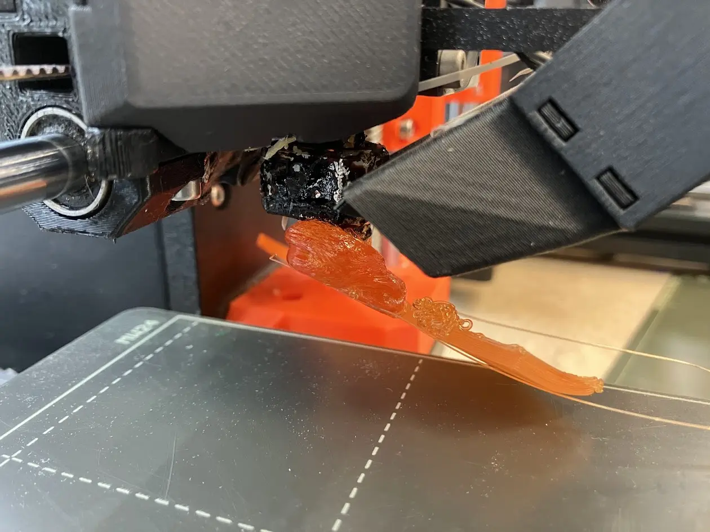
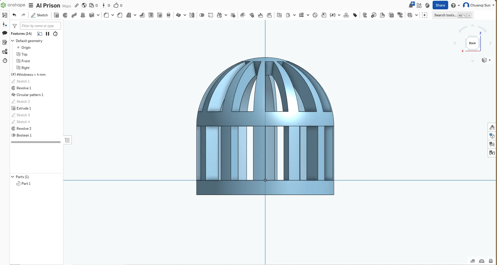
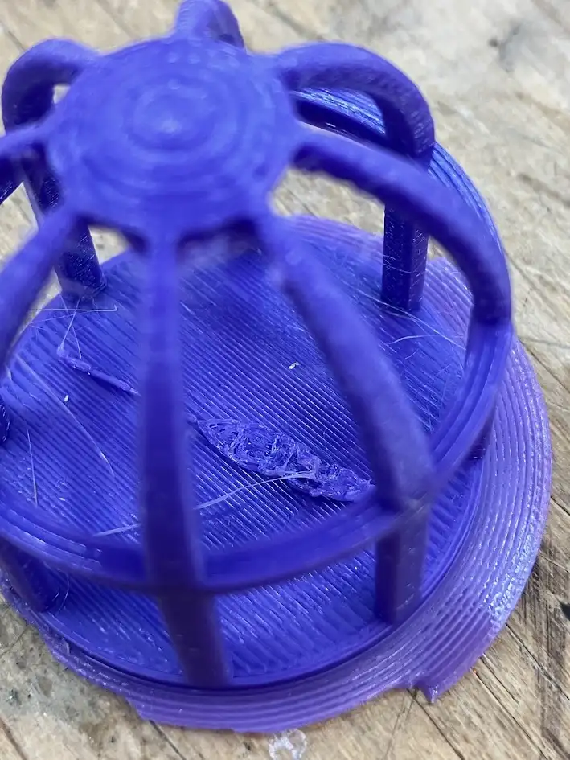
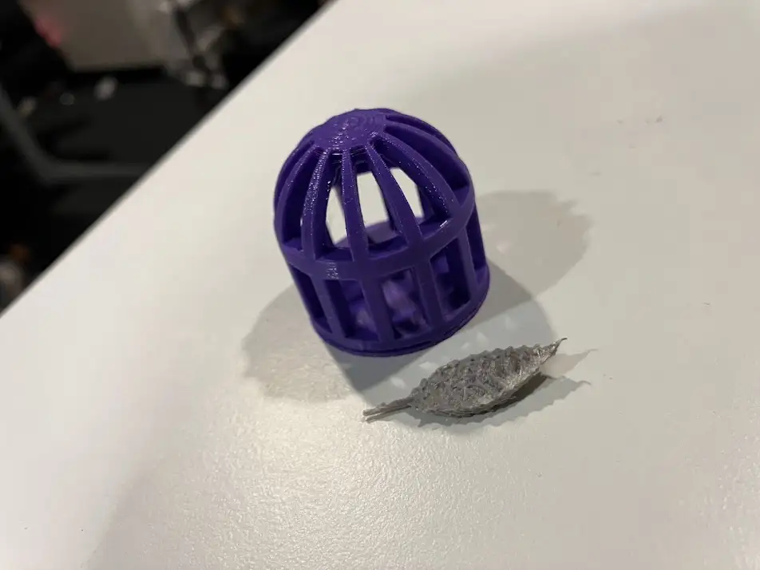
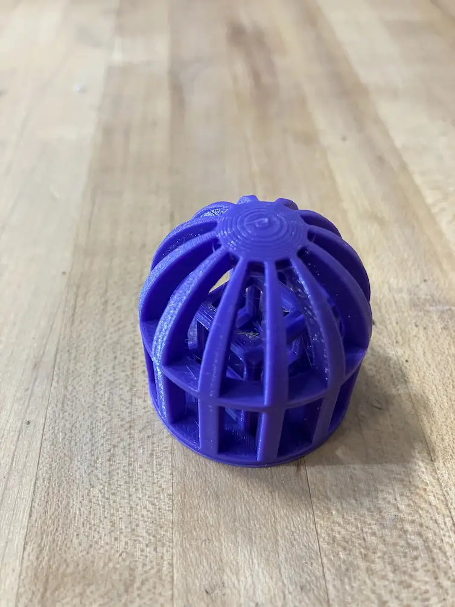
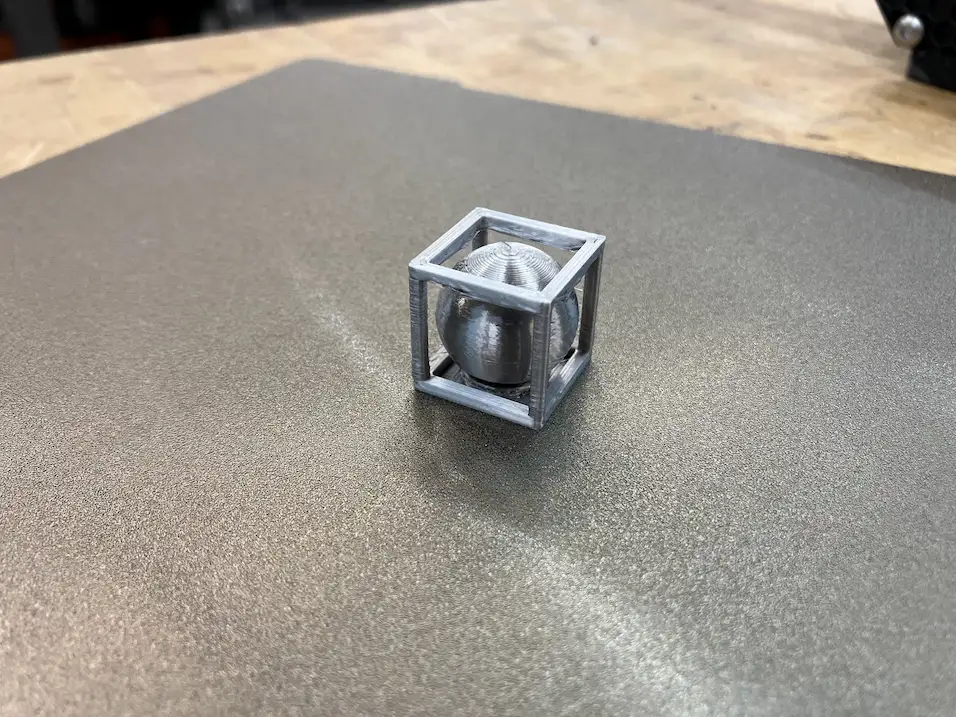
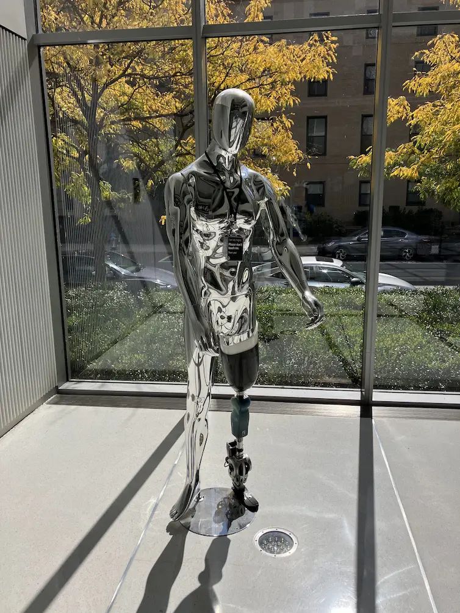
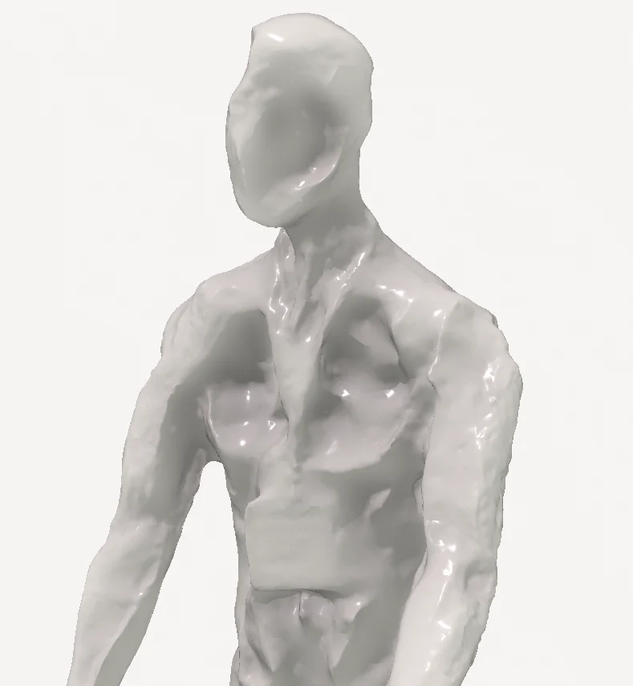
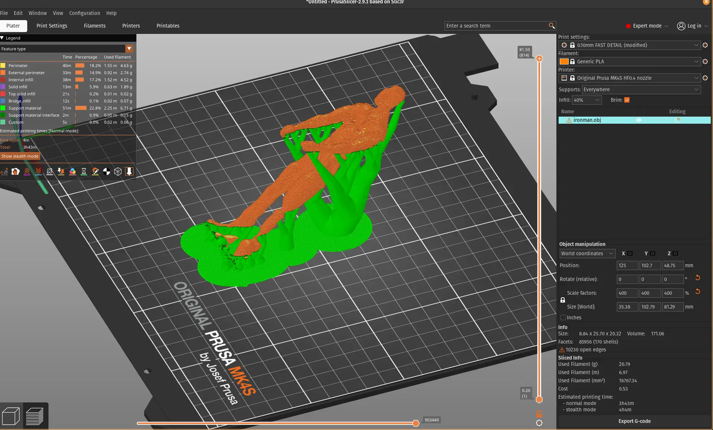
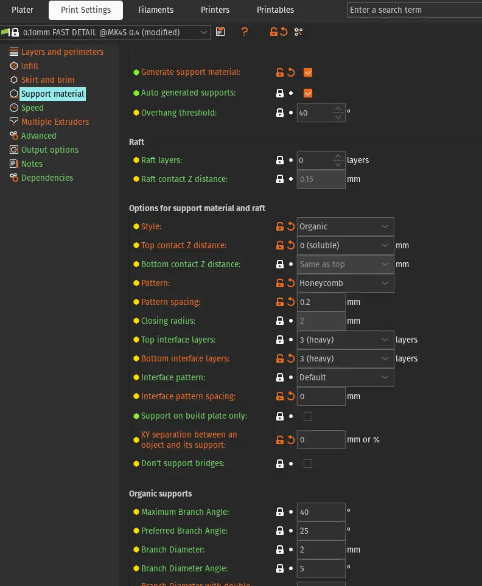

## 3D printing

I attended [Session 2](https://fab.cba.mit.edu/classes/MAS.863/CBA/group_assignments/week4/) for the group activity, where people were excited to get hands-on with the 3D printer. However, due to our rush to start printing, we didn't correctly set the right filament type in both the printer and slicer, which resulted in a big spaghetti ball. This experience taught us that next time, we need to carefully read the manuals and understand the machine before using it.

**Nozzle clogged due to wrong filament setting.**

For my individual assignment, I used the [Prusa MK4S](https://www.prusa3d.com/product/original-prusa-mk4s-3d-printer-5/) for all of my printing. Being a beginner, I wanted to focus on the basics and leave the Formlabs printer for later exploration.

To satisfy the non-subtractive requirement, I started by designing a cage in Onshape. This gave me good practice with the circular pattern repeat feature and helped me get the hang of parametric design. I revolved the cross-section to form a single beam and then repeated the beam to form the cage. In retrospect, I should have extruded the cross-section to form a uniformly thick beam, which would allow the beams near the top area of the cage to have better strength. My current design has thinner beams near the top, which I had to compensate for by adding another disc at the top.

**Notice how beams became thinner near the top.**

Next, I wanted to print a feather inside the cage to add a poetic touch. I designed a feature using linear repeats and boolean interaction of a "leaf" shape. I directly printed the feature onto the cage, but it turned out too small.

**Feature is barely visible**

I enlarged the feature and printed it separately. This time it worked perfectly.

**Separate the feature ([model](./models/feather.obj))**

Combining the feather with the previous cage design created a mini sculpture.

**A touch of poetry ([model](./models/cage.obj))**

Next, I wanted to challenge myself by printing something more difficult. I designed a 4D cube, also known as a tesseract, and placed it in the same cage. The CAD work was much more difficult with this design. I had to use several boolean operations to get the cube inside the cube, and connecting their vertices required creating new planes that are not coplanar with any existing faces.

**Cube inside cube inside cage ([model](./models/cube-in-cage.obj))**

Finally, I wanted to introduce a movable element, so I printed a ball inside a cube cage. The ball's diameter is the same as the cube's interior dimension so it won't fall out.

**Ball inside cube ([model](./models/ball-in-cube.obj))**

Notice the support material inside the cube. I used the default snug fit support provided by PrusaSlicer, and it worked as expected: it was easy to remove and prevented any spaghetti from overhang issues.

## 3D scanning

I scanned a bionic mannequin in the lobby of the Media Lab using the Polycam photogrammetry app on my iPhone.

<iframe src="https://poly.cam/capture/919E7813-8CB6-4461-B14A-C7DB4EEA701F/embed" title="Polycam capture viewer" style="height:100%;width:100%;max-height:720px;max-width:1280px;min-height:280px;min-width:280px" frameborder="0"></iframe>

Here is the original object. Even for human eyes, it's hard to tell what the actual shape is without invoking my knowledge of human anatomy.

**The mannequin in the Media Lab lobby.**

The mirror surface confused the photogrammetry software and caused it to treat convexity as concavity.

**Notice the concavity on the face and chest area.**

I found the result aesthetically provocative, resembling a starving zombie. So I proceeded to tilt the figure backward and add an organic support to transform it into a horror sculpture.

In order to make the support structure part of the final print, I extensively customized the support structure to ensure:

1. There was no vertical or horizontal gap to the model.
2. Double-walled support (this seems to be the strongest option PrusaSlicer offers).
3. Minimum spacing in support layers for additional strength.

**Extensive customization ([project](./models/ironman.3mf))**

I attempted a few different sizes and materials. The largest one printed with PETG turned out the best. The middle-sized print used the default organic support settings, which suffered "broken leg" failure, while the small version lost too much detail.

I think the project was a success according to my TA's feedback.

> I find this disturbing.  
> -- [Alan Han](https://fab.cba.mit.edu/classes/863.23/CBA/people/Alan/)
