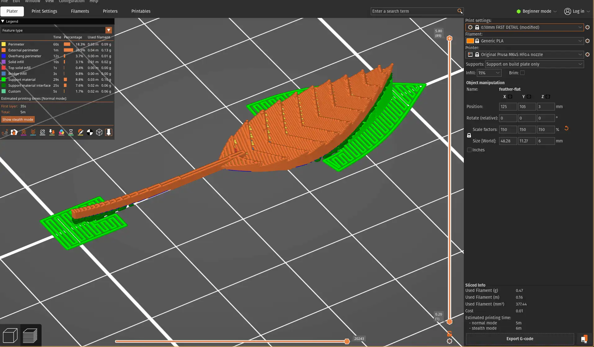

# 3D printing

- I attended the [Session 2](https://fab.cba.mit.edu/classes/MAS.863/CBA/group_assignments/week4/) for the group activity.
  - People are a bit excited to get hands-on with the 3D printer
  - Due to the rush, we didn't correctly set the right filament type in the printer and slicer, got a big spaghetti ball
  - Next time, we need to carefully read the manuals and understood the machine before using it
  - 
- Individual assignment
  - I used [Prusa MK4S](https://www.prusa3d.com/product/original-prusa-mk4s-3d-printer-5/) for all of the printing. Being a beginner, I want to focus on the basics and leave the formlabs printer for later.
  - To satisfy the non-subtractive requirement, I started with designing a cage in Onshape. I got a good amount of practice on circular pattern repeat feature and started to get the hang of parametric design.
  - I resolveed the cross-section of the cage beam, and then resolved the beam again to form the cage.
  - In retrospect, I should have extruded each cage bar first, followed by circular repeat. This would allow the beams near the top area of the cage to have equal strength. My current design has thinner beams near the top, which I had to compensate by adding a another disc at the top.
  -  Notice how beams became thinner near the top.
- Next, I wanted to print feather inside the cage to add a poetic touch. I directly printed the feature onto the cage but it turned out too small.
  - 
- I enlarged the feature and printed separately. This time I worked.
  - . [Model file](./models/feather.obj)
- Combine the feather with the previous cage design, it comes a mini sculpture.
  - . [Model file](./models/cage.obj)
- Next, I want to challenge myself by printing something more difficult. So I designed a 4D cube, also known as tesseract, and put it in the same cage.
  - The cadding was much more difficult with this one. I had to use several boolean operations to get the cube inside the cube, and connecting their vertices required creating new planes from three points, followed by circular pattern repeats.
  - . [Model file](./models/cube-in-cage.obj)
  - Finally, I want to introduce a movable element, so I printed a ball inside a cube cage, the ball's diameter is the same as the cube so it won't fall out.
  - . [Model file](./models/ball-in-cube.obj) Notice the support material inside the cube. I used the default snug fit support provided the PrusaSlicer and it worked as expected: it was easy to remove and no spaghetti from overhang.

# 3D scanning

- Scanned bionic mannequin in the lobby of the Media Lab, using Polycam photogrammetry app on iPhone.
  - Here is the original object
  - 
- The mannequin had a mirror surface, which confused the photogrammetry software to treat convexity as concavity.

  <iframe src="https://poly.cam/capture/919E7813-8CB6-4461-B14A-C7DB4EEA701F/embed" title="Polycam capture viewer" style="height:100%;width:100%;max-height:720px;max-width:1280px;min-height:280px;min-width:280px" frameborder="0"></iframe>

- I find the result aesthetically provocative, resembling a starving zombie. So I proceeded to tild the figure backward add an organic support to make it a horror sculpture.
  -  Notice the concavity on the chest area.
- In order to make the support structure part of the final print, I set both the Interface pattern spacing and XY separation to 0 mm. This would establish a strong connection between the support and the model.
  -  [Slicer file](./models/ironman.3mf)
- I extensively customized the support structure to make sure
  - 1. There is no vertical or horizon gap to the model
  - 2. Double walled support (this seems to be the strongest option PrusaSlicer has)
  - 3. Minimum spacing in support layers for additional strength
  - 
- I attempted a few different sizes and materials. I think the largest one with PETG turned out the best. The middle sized printout didn't have any custom support override and suffered a support failure. The small version lost too much detail.
