## Group assignment

- For group assignment, Alan explained poweer supply, multimeter, oscilloscope, function generator, and logic analyzer.
- I used my own project to study the logic analyzer. The device used MAX98357A as DAC and amp but the had issue producing sound.
- Debugging session with the TAs (Nikhil and Alan)
  - We ruled out power issue: observed stable power voltage.
  - Ruled out connection issue: all the lines: clock, channel, and data are normal
  - Found low voltage on speaker
  - Eventually realized the bug was software. The diagnostic tool was helping in eliminating hardware issues.

During the testing, we noticed that the plugging in/out of probes can interfere with the I2S signal. Presumably because of the motion of the probes causing inductance change, which in tern, distorted the clock or data line.

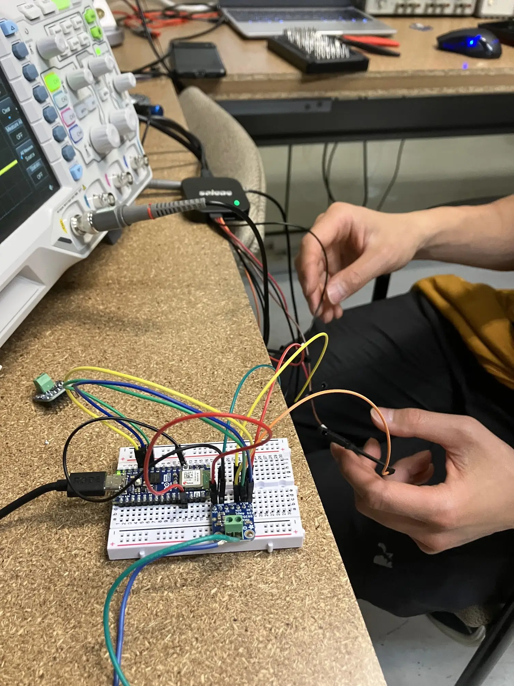
**Hooking up logic analyzer probes**

We used saleae Logic 2 analyzer with the [companion software](https://www.saleae.com/pages/downloads?srsltid=AfmBOootFb68Y2L5odb06p_WkZ1gnm-TIDW_Hhu8xv7w9I_agw8oQwBw). The tool can visualize both digital and analog signals and allowed us to choose a protocol and decode the data. Very helpful.

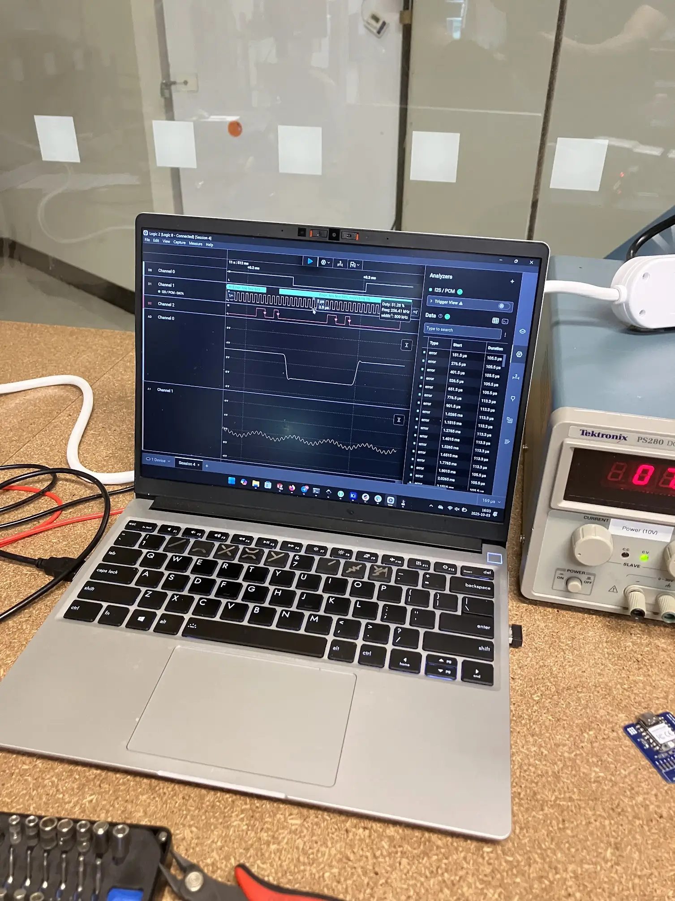
**Visualize data**

## Simulation

- I want o simulate the hand-held device of my final project
- For simulation, I want to study the idea of addressing unique 3.5mm audio jacks using the binary encoding.
  
  **TRRS jack**

- One ping for ground, 3 pins for 2^3 = 8 unique addresses.
- I used an 8-pin DIP switch to simulate the 3-bit binary input. In production, the input will be determined by the jack that the user plugs in.
- The jack's identity only matters in the software, but to make the simulation fun, I added an LCD display to show which jack is plugged in.
- Since it's a walkie talkie, I added a push button to show TTS, and a slide switch to toggle between modes: programming vs. interaction
- Used wokwi, which provided the Xiao-ESP32-C3 board that my project uses.
- For production, there won't be an LCD, but will be an I2C DAC/amp and a I2C ADC for audio input/output. I will prototype them for the actual PCB design.
- If there are enough I/O pins, I will consider a second button so user can squeeze both to enable broadcast mode.

<video controls muted src="./media/simulation-1.mp4"></video>
**Simulate the hand-held device**

- I also wanted to simulate the main body device. It has two roles:
  - Lighting up an LED for a specific jack. The computer will control which jack is active and use wifi to activate it.
  - Set the 3-bit address for each jack. This can hard wired directly from Xiao's 3.3v output
- To make the simulation more interesting, I cycled the LEDs in order, just to show I can address them by software.

<video controls muted src="./media/simulation-2.mp4"></video>
**Simulate the main device**

## PCB Design

- I want to start the PCB design towards my final project, using KiCad.
- The schematic design is very simple: layout the Xiao-ESP32-C3, I2S Microphone, I2S DAC/Amp, a TRRS jack, and a couple of switches.
  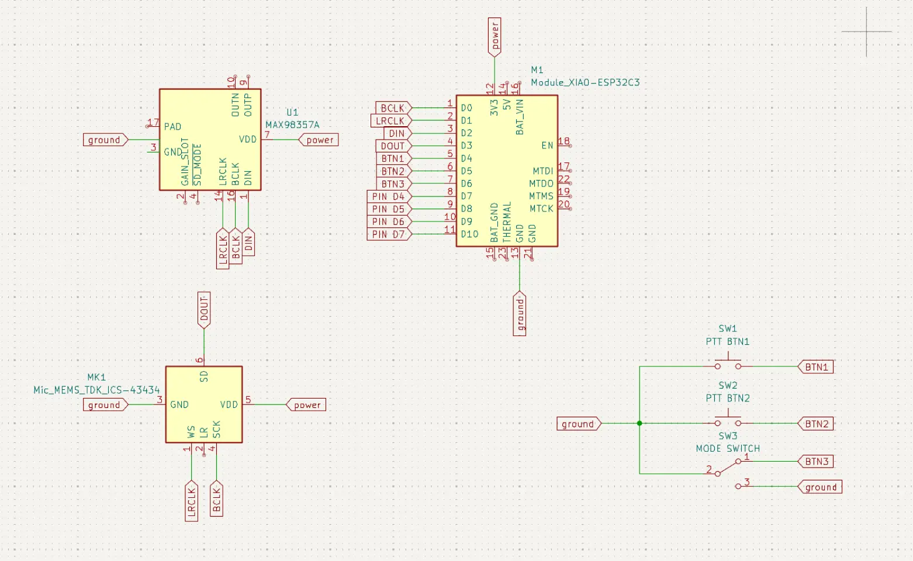
  **Schematic design**
- As soon I transitioned the PCB design, I realized the problem: I hope to use the MAX98357A and ICS-43434 both on their breakout boards, not as bare ICs.
  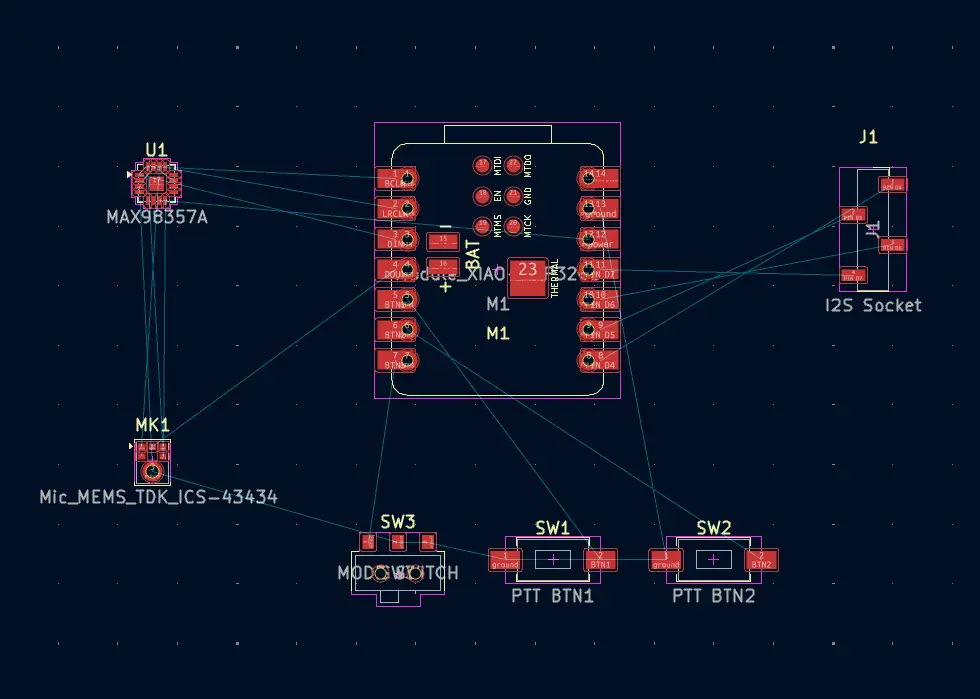
  **PCB design missing breakout boards**
- Also, I don't want to solder them onto the same board as the Xiao. As a consumer, I enjoy electronics that come with user repairable parts. So I decided to pivot: design a development board that helps me route the pins from the Xiao to the headers where I can plug in the breakout boards. If I accidentally damage any component, I want to make it easy to swap out the broken part.
- Starting over, I put down the schematic design using pin sockets and loaded them into PCB editor. But when I opened the 3D view, I realized that I chose the wrong connector. I wanted female socket, but got the male pin instead.
- Switching to female socket, the symbol exists, but they are missing footprint. Luckily, I was able to find a similar footprint. Assigning the footprint to the symbol allowed me to open the PCB editor based on schematic design.
  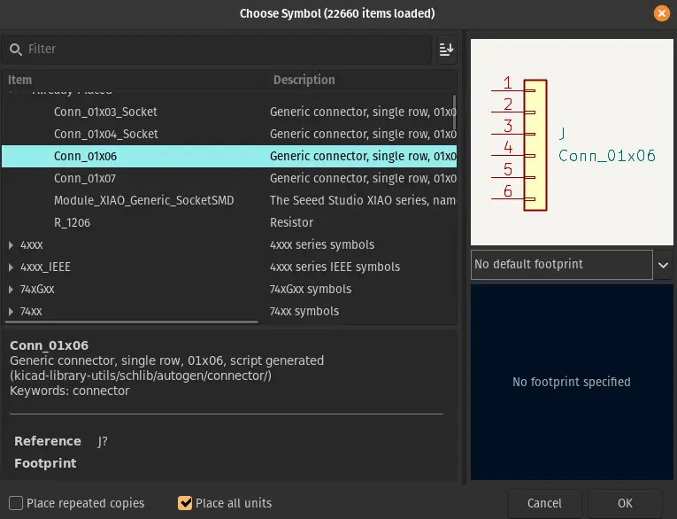
  **The symbol is missing footprint**
  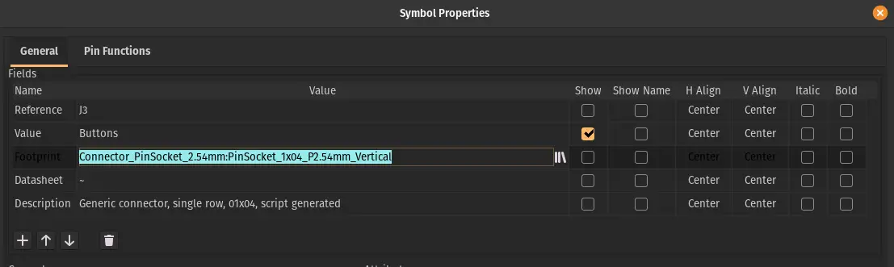
  **Manually assign footprint**
  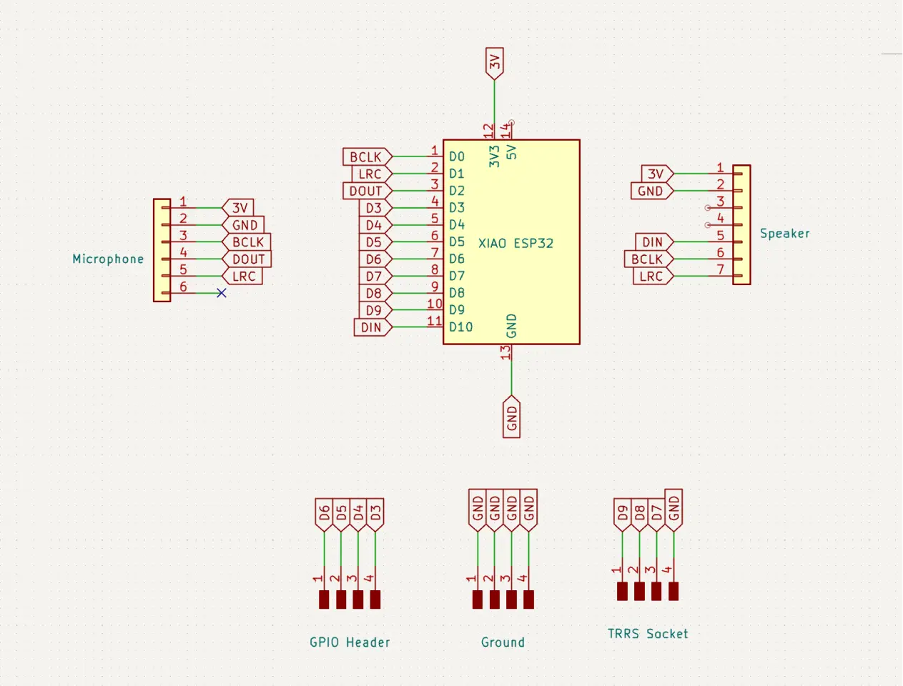
  **Schematic design with sockets**
  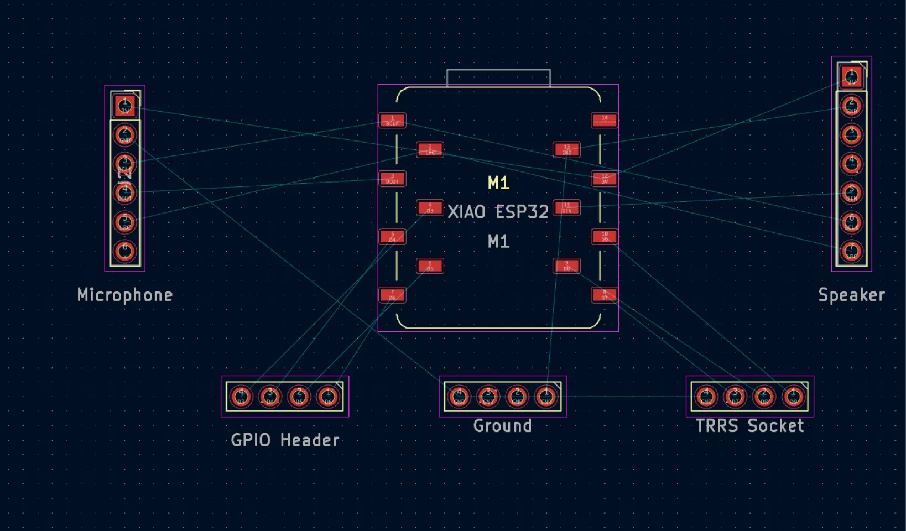
  **PCB design with sockets**
- Just as thought I was approaching the finish line, I recalled to run the constraint checker. I realized I have chosen the wrong track width. Instead of 0.2mm, I should have chosen 0.4mm.
  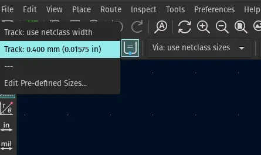
  **I should have selected track width sooner**
  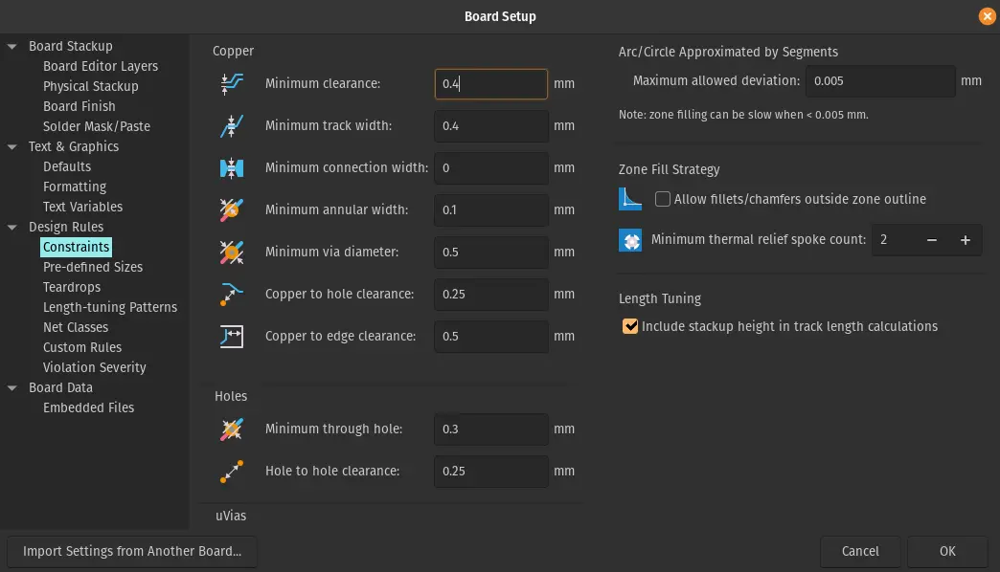
  **Set minimum clearance**
- I took me a while to manually fixing all the wires. I also marked up the area for the speaker, just to get a sence of scale.
  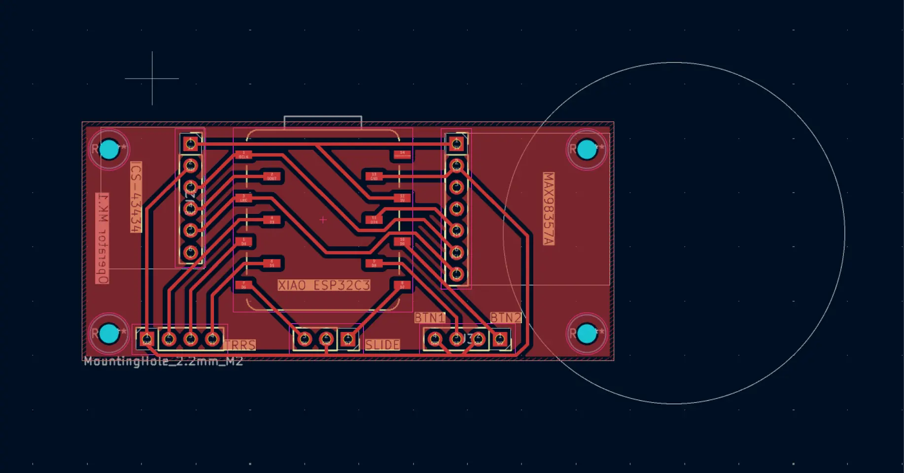
  **PCB design with the correct sockets**

- Feeling a bit uncertain, I went to the office our TA Alfonso and got the immediate bad news: I didn't run constraint checker after changing the track width.
- Running the constraint checker again, more problems appear. Because I laid out the wires using 0.2mm track, now the wires are touching the keepout area. After several rounds of manual fixing, I felt that it was impossible to clear the errors without cross at least one wire. Alfonso agreed and encouraged me to try using 0 ohm resistors as a jumper.
- Adding a jumper was not as straightforward as I thought. I had to go back to add the the symbol, then redo alsmot the entire PCB design due to position shifting.
  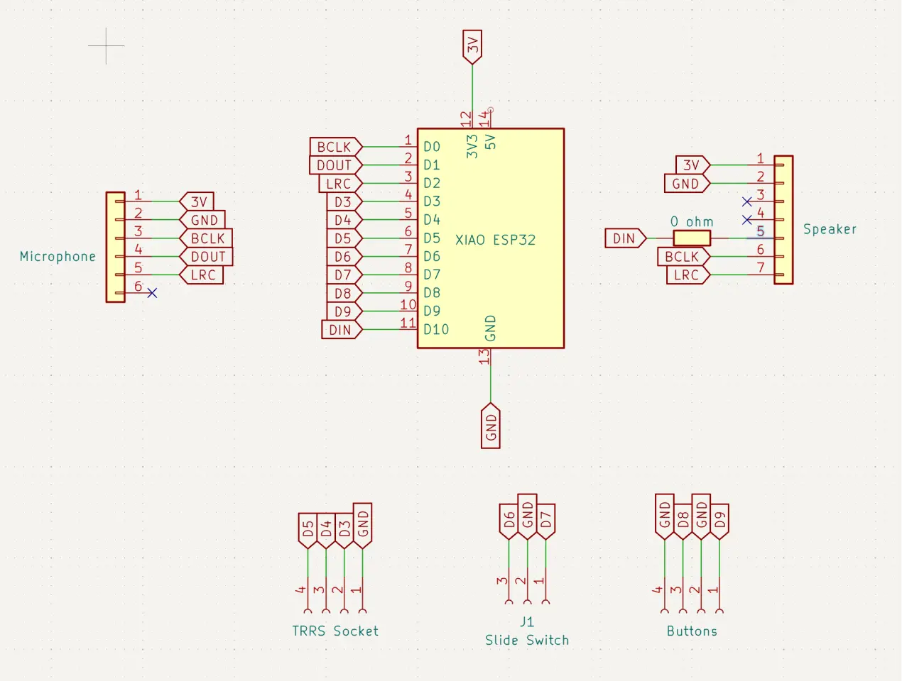
- The resistor jumper requires additional clearance, forcing me to push out the speaker area
  **Adding an resistor as jumper**
  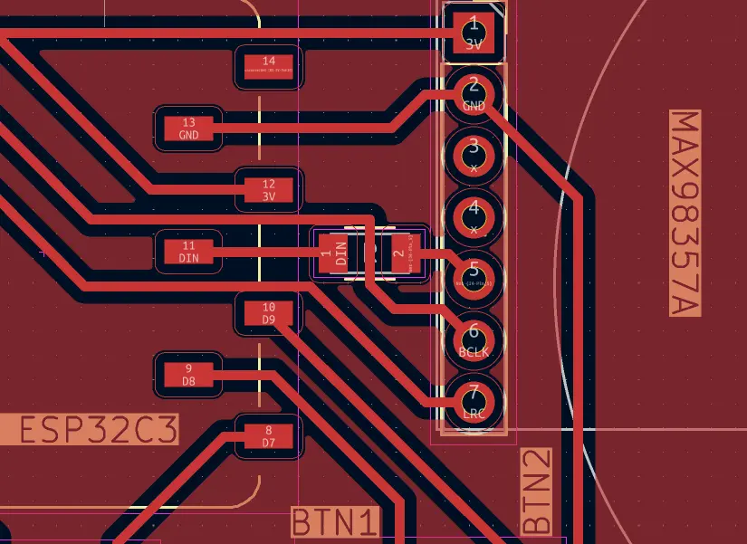
- The final 3D view. Notice the small jumper between the Xiao socket and the speaker socket
  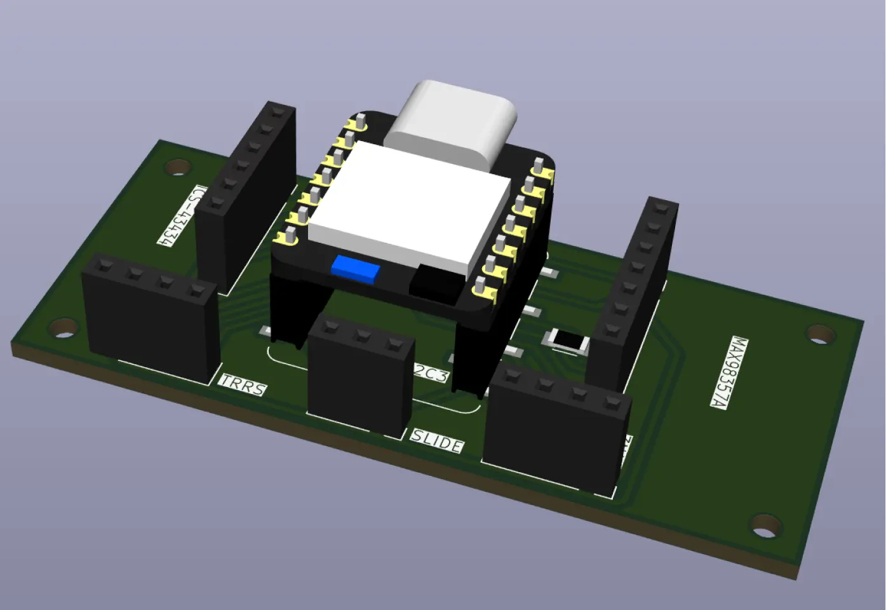
  **3D view, notice the jumper ([download](./code/operator-202510062100.zip))**

- After designing the hand-held device PCB, I felt more comfortable with the tool and quickly designed the main body PCB.
- For each TRRS jack, I added an LED as status indicator.
- I "hardwired" the 3-bit address from Xiao to each jack.
- I used resistors to protect the LEDs from high voltage.
  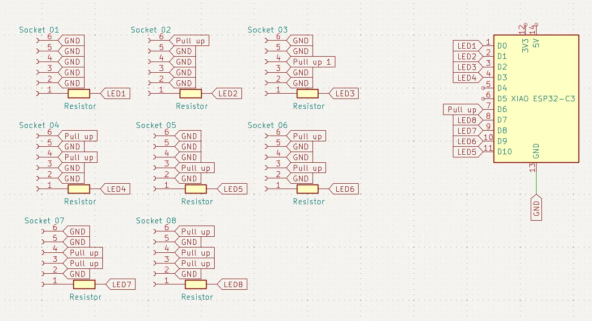
  **Main body schematic**
  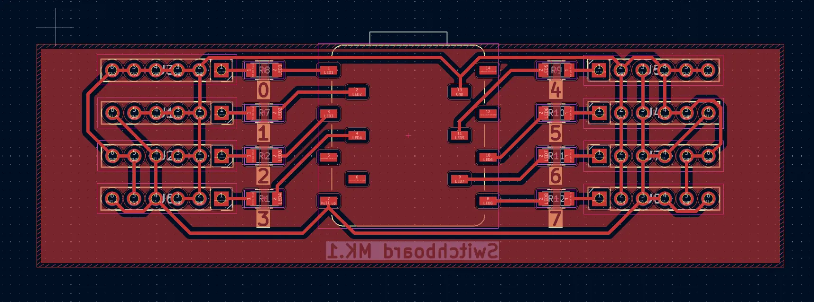
  **Main body PCB design**
  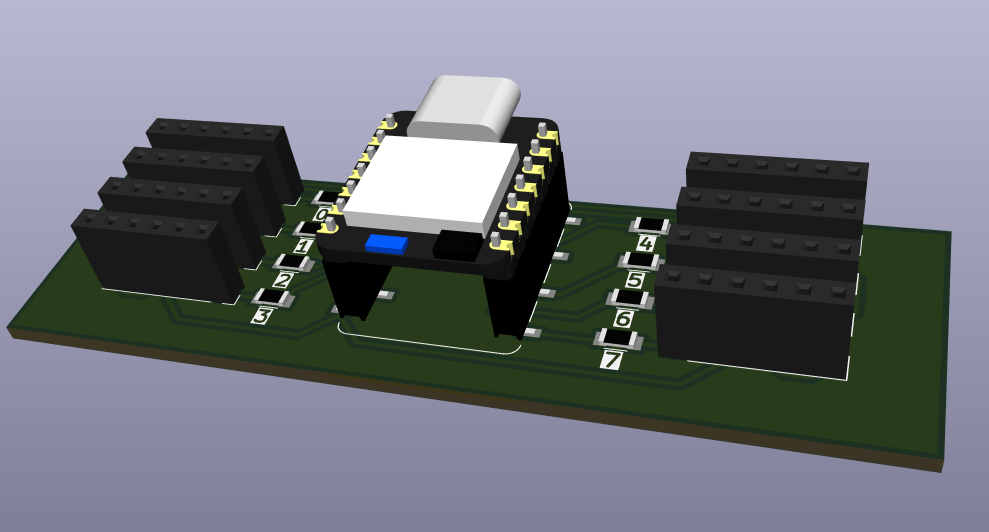
  **Main body 3D view ([download](./code/switchboard-202510062144.zip))**

- Key lesson learned:
  - Apply design rules before starting PCB layout
  - Check constraints often
  - Do not lay the wires too early. They are not easy to change
