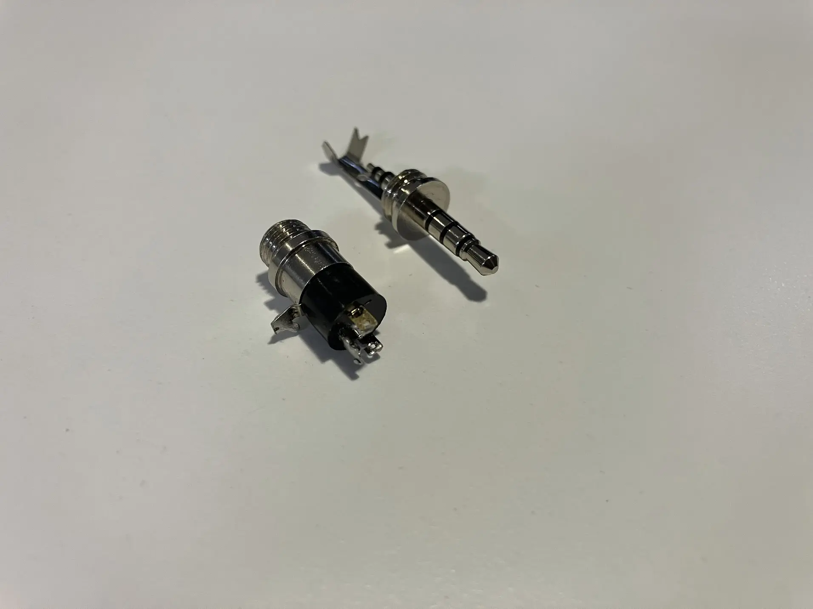

## Group assignment

- For group assignment, Alan explained poweer supply, multimeter, oscilloscope, function generator, and logic analyzer.
- I used my own project to study the logic analyzer. The device used MAX98357A as DAC and amp but the had issue producing sound.
- Debugging session with the TAs (Nikhil and Alan)
  - We ruled out power issue: observed stable power voltage.
  - Ruled out connection issue: all the lines: clock, channel, and data are normal
  - Found low voltage on speaker
  - Eventually realized the bug was software. The diagnostic tool was helping in eliminating hardware issues.

During the testing, we noticed that the plugging in/out of probes can interfere with the I2S signal. Presumably because of the motion of the probes causing inductance change, which in tern, distorted the clock or data line.

**Hooking up logic analyzer probes**

We used saleae Logic 2 analyzer with the [companion software](https://www.saleae.com/pages/downloads?srsltid=AfmBOootFb68Y2L5odb06p_WkZ1gnm-TIDW_Hhu8xv7w9I_agw8oQwBw). The tool can visualize both digital and analog signals and allowed us to choose a protocol and decode the data. Very helpful.

**Visualize data**

## Simulation

- I want o simulate the hand-held device of my final project
- For simulation, I want to study the idea of addressing unique 3.5mm audio jacks using the binary encoding.
  
  **TRRS jack**

- One ping for ground, 3 pins for 2^3 = 8 unique addresses.
- I used an 8-pin DIP switch to simulate the 3-bit binary input. In production, the input will be determined by the jack that the user plugs in.
- The jack's identity only matters in the software, but to make the simulation fun, I added an LCD display to show which jack is plugged in.
- Since it's a walkie talkie, I added a push button to show TTS, and a slide switch to toggle between modes: programming vs. interaction
- Used wokwi, which provided the Xiao-ESP32-C3 board that my project uses.
- For production, there won't be an LCD, but will be an I2C DAC/amp and a I2C ADC for audio input/output. I will prototype them for the actual PCB design.
- If there are enough I/O pins, I will consider a second button so user can squeeze both to enable broadcast mode.

<video controls muted src="./media/simulation-1.mp4"></video>
**Simulate the hand-held device**

- I also wanted to simulate the main body device. It has two roles:
  - Lighting up an LED for a specific jack. The computer will control which jack is active and use wifi to activate it.
  - Set the 3-bit address for each jack. This can hard wired directly from Xiao's 3.3v output
- To make the simulation more interesting, I cycled the LEDs in order, just to show I can address them by software.

<video controls muted src="./media/simulation-2.mp4"></video>
**Simulate the main device**

## PCB Design

TODOs:

- Identify Mic requirements
- Layout both Mic, Amp, two buttons, and TRRS jack
