The legend goes that Steve Jobs and Steve Wozniak hand-built the first Apple-1 computers in their garage. This week, I learned how to hand-build something simpler, but in the same spirit: a custom microcontroller board.

## Group assignment

Our group assignment was to characterize the design rules for our Carvera PCB milling machine. We started by reading the excellent [tutorial by our TA Quentin](https://quentinbolsee.pages.cba.mit.edu/carvera-pcb-tutorial/), then started producing a test PCB to understand the machine's capabilities.
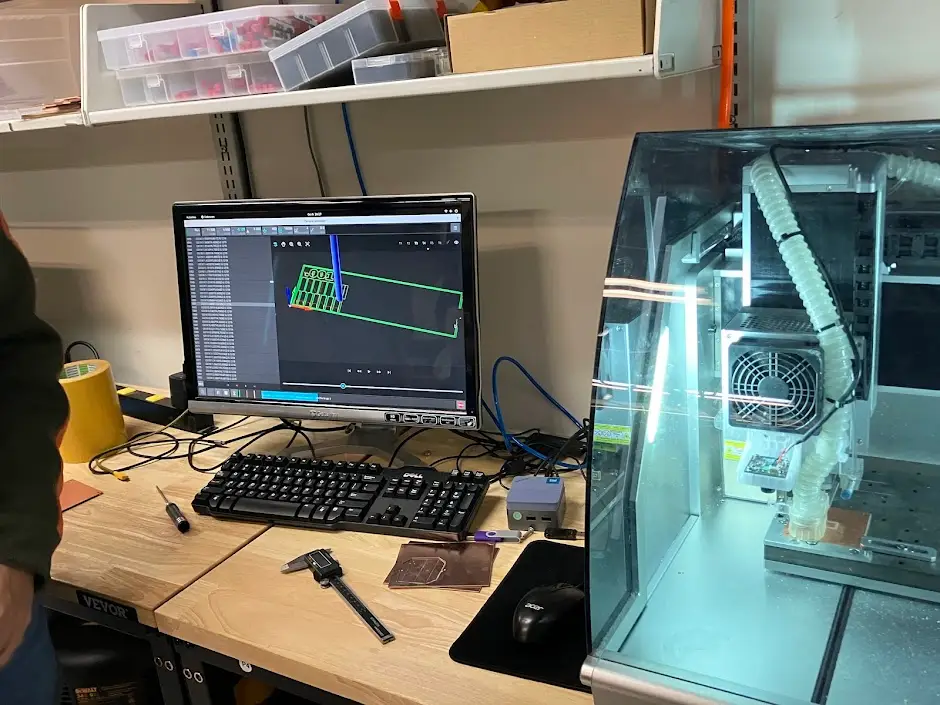
**Characterizing the Carvera PCB milling machine**

Our first run resulted in large amounts of burrs along the edges of the traces. We learned this was due to a damaged endmill and subsequently learned how to replace the bit. The machine is able to consistently handle traces down to 0.2mm.
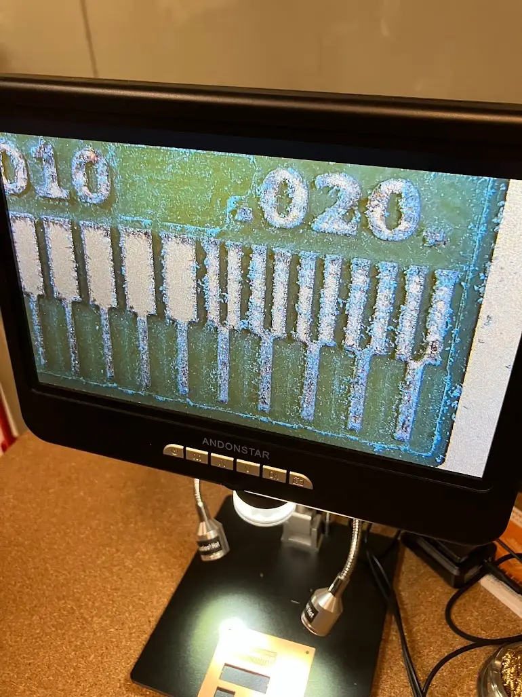
**Burrs everywhere**

Later, I attended a second session with Kristof where we debugged the milling machine after it entered a halted state. We documented our debugging process and findings in our [group note](https://fab.cba.mit.edu/classes/MAS.863/CBA/group_assignments/week6/).

## Fabricating

For my final project, I designed two main components: a hand-held unit I call "the Operator" and a main body unit called "the Switchboard." Having completed the circuit simulations in the previous week, I already had initial designs for both boards. This week, my focus shifted to the physical milling and fabrication process.

### The Operator

The Operator is a dev board for the Xiao-ESP32-C3 that connects a Microphone, DAC/Amp, TRRS jack, and a couple of switches. Milling the first version of the Operator board, a single-sided design, was straightforward.

In KiCad, export the PCB design as Gerber files and drill files.
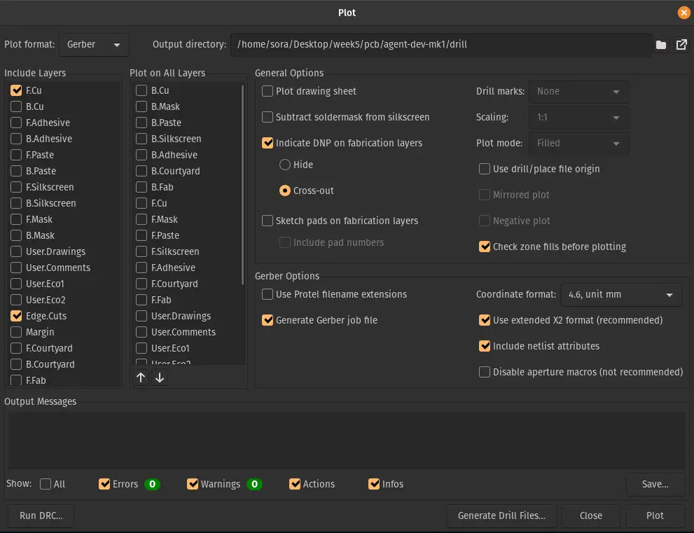
**Export Gerber files**

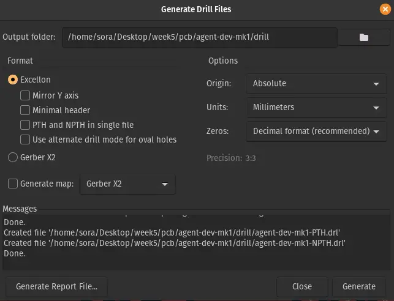
**Export drill files**

Upload both files at the same time to Quentin's [gerber2img](https://quentinbolsee.pages.cba.mit.edu/gerber2img/) tool to convert the copper layer, edge cut layer, and drill files into PNG images.

- For the exterior cut, I used the "Black and white" setting and checked "Fill edge cut" to create a solid outline including the drill holes.
- For the traces, I unchecked this option.

Use Neal's [modsproject](https://modsproject.org/) with the Carvera mill 2D PCB program to generate the final G-code for the milling machine. The tool is self-explanatory. Just follow the pipeline to proceed.

The initial milling produced some burrs, but after a bit of sanding, the results were very good.

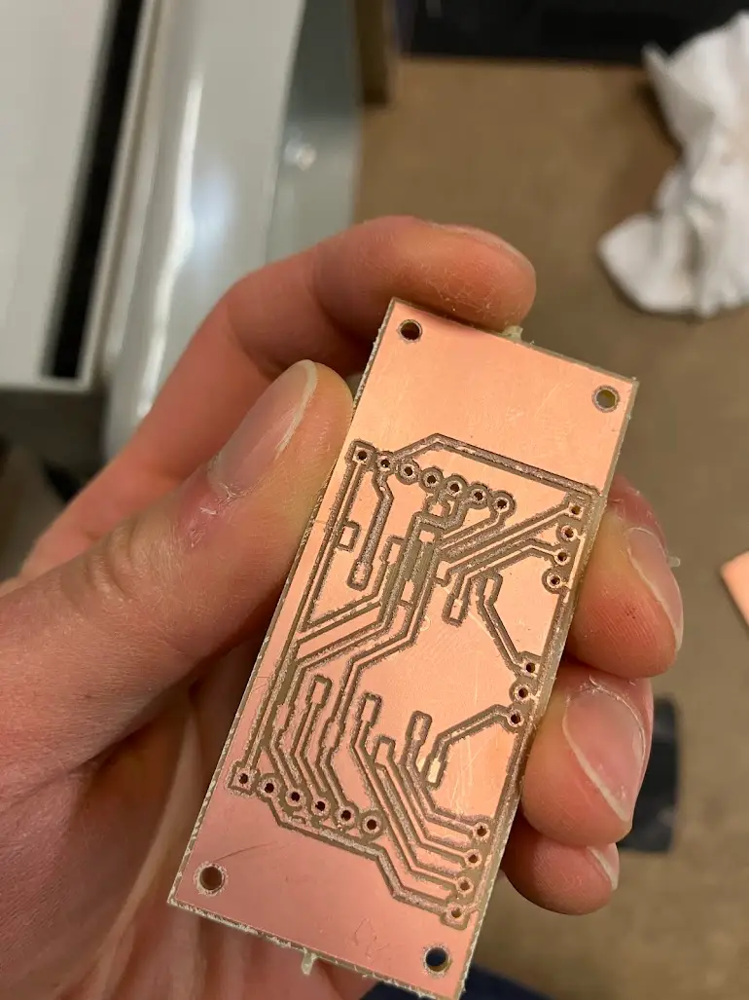
**Before sanding**

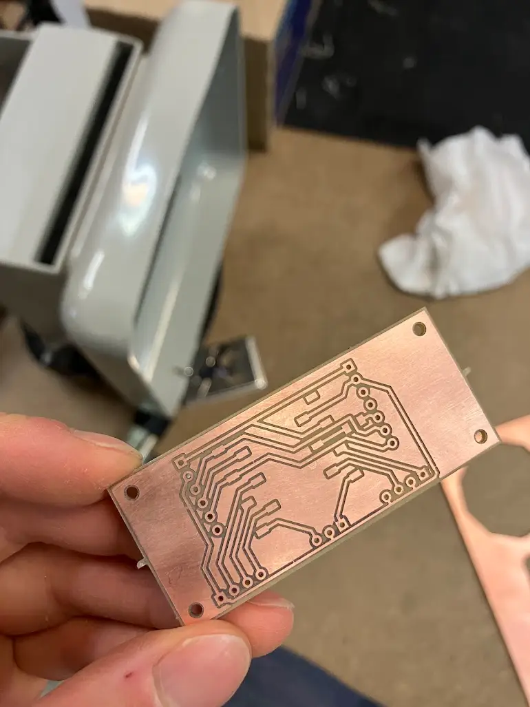
**After sanding**

However, as I gathered components for stuffing the board, I saw my mistake: we didn't have any surface-mount pin connector sockets in the lab. I could either bend the legs of the through-hole connectors or redesign the board. This was a key lesson: **check component availability and stay flexible during the design process.**

Bending the legs of the through-hole connectors was not ideal: they added extra height and also undermined the reliability of the connection. I also took TA feedback into account and decided to redesign the board as a two-sided PCB with a ground plane on the back, which would also simplify routing.

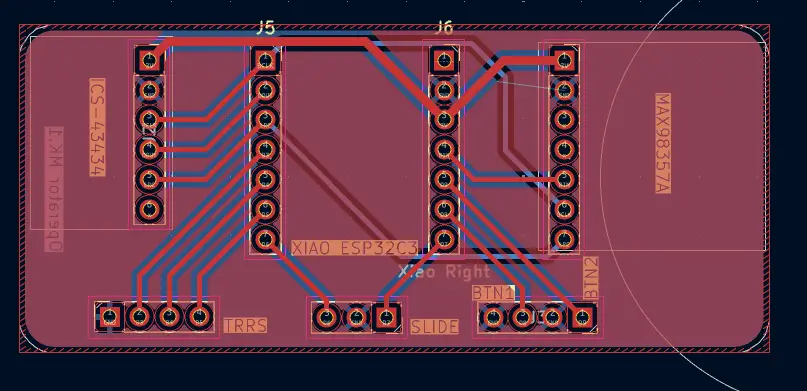
**Two-sided PCB design**

Thanks to this change, I learned how to fill a ground plane in KiCad and produced my new design.

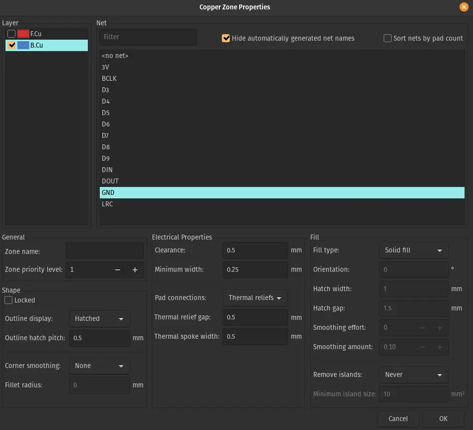
**Ground plane filling**

This led to my second mistake, which I thankfully caught before milling. When I switched from surface-mount to through-hole components, I didn't consider the soldering process. I had assumed we would have plated through-holes (PTH), allowing me to solder on either side. Without PTH, I would have to solder components on the opposite side of the board and use vias to connect traces between the front and back. This required another complete redesign to account for these manufacturing constraints. **Lesson learned: think about the manufacturing process during design.**

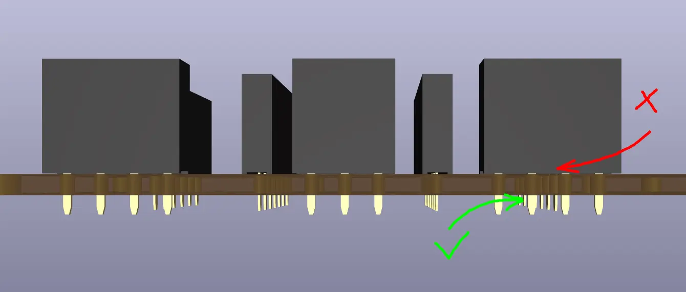
**You cannot solder under the plastic**

In the final redesign, I added vias, M2 mounting holes, and rounded edges for a more polished board.

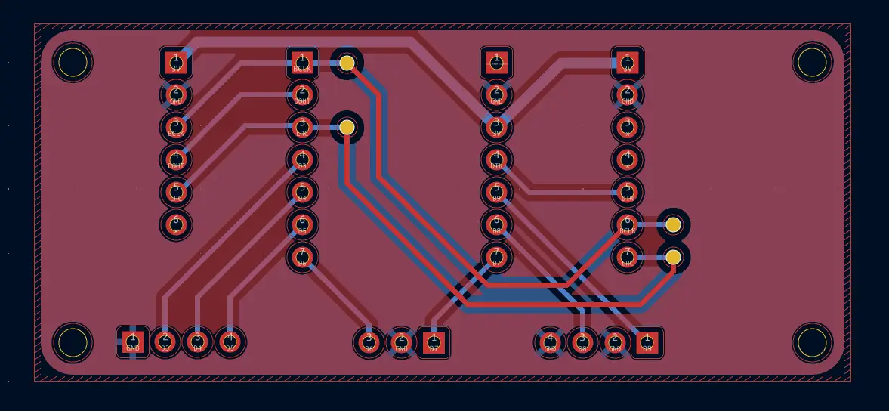
**Final two-sided PCB design**

Milling a two-sided PCB proved to be a challenge. While there is [a clever trick](https://sibusaman.fabcloud.io/doublepcb/) using symmetry to create a fixture for perfect alignment, I opted for a manual calibration method. I milled the first side, measured the machine's offset, and calculated the new origin for the second side.

My first attempt failed because I forgot to mirror the backside image and didn't include the tab offset for both sides, resulting in total misalignment.

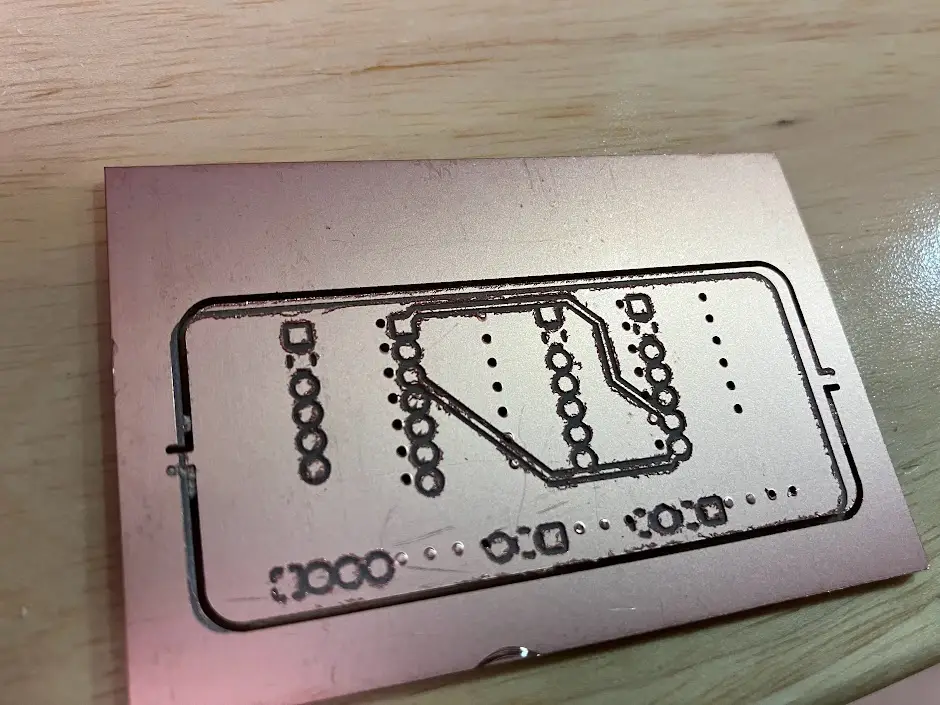
**Everything that could have gone wrong did go wrong**

The second attempt, however, was a success. The holes aligned perfectly.

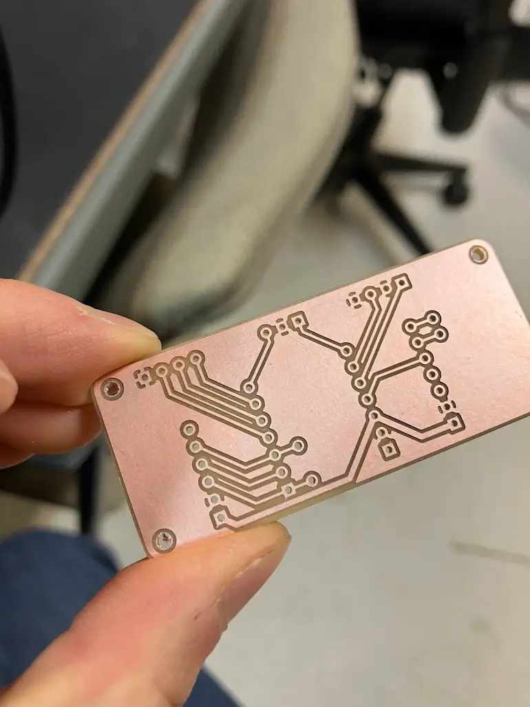
**Good alignment from manually calculating the offset**

Here are the calculations I used to align the origins:

```
// Backside milled first
bottom_offset: 5 mm
entered_left_offset: 3.9265 mm
expected_right_offset: 3.9265 mm
actual_left_offset: 5.51 mm
actual_right_offset: 4.74 mm

// Frontside calculation
bottom_offset: 5 mm
entered_left_offset: 3.156 mm = 4.74 - (5.51 - 3.9265)
```

Soldering this board was much harder than expected. The non-plated through-holes had limited grip on the solder, even with flux. I had to reflow several connections multiple times to ensure a solid connection.

Checking with the TAs, I received the advice to use a higher temperature or to preheat the pins longer. They diagnosed me with a "cold solder joint" issue.

### The Switchboard

The Switchboard is an array of TRRS jacks, each with an LED to indicate status.

For the Switchboard PCB, I made almost all the same mistakes as with the Operator. My original design also assumed plated through-holes. Luckily, the Switchboard is a single-sided board, so I could move all the components to the other side and adjust the circuit without needing vias.

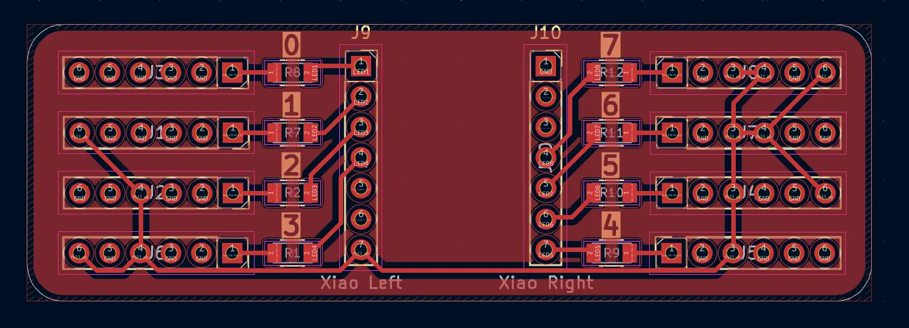
**Original design without considering soldering**

However, I then made two more errors:

1.  I forgot to mirror the component footprints after flipping them to the other side.
2.  I used the wrong pins for the connectors after flipping the design and only realized it after milling.

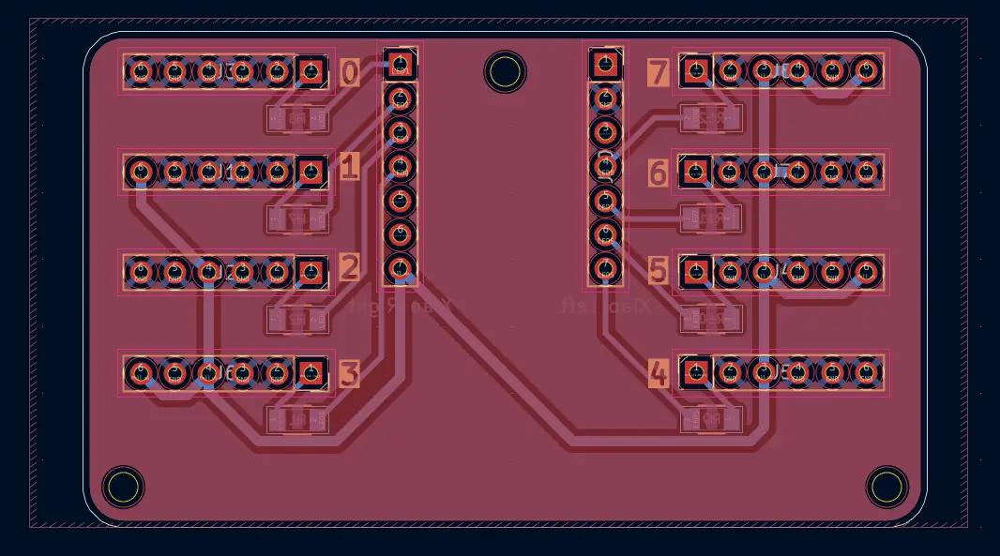
**Corrected design with mirrored footprints and correct pins**

I didn't notice the mirroring problem until I had finished soldering all the resistors for the LEDs. At that point, I decided to capitalize on the mistake and use the partially assembled board to test the LED circuit. I placed an LED on the pads without solder and used a multimeter to light it up. It worked!

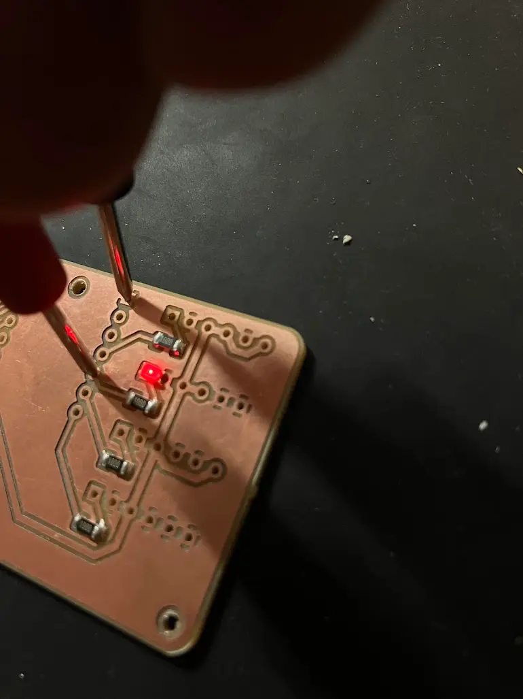
**Testing LED circuit**

### Bonus: Laser cutting my own ICS-43434 breakout board

I needed a breakout board for the ICS-43434 microphone, similar to [this one from Adafruit](https://www.digikey.com/en/products/detail/adafruit-industries-llc/6049/25589349). I decided to try fabricating it with a laser cutter.

I followed a [YouTube tutorial](https://www.youtube.com/watch?v=8peIFpolsmk) to set up the machine, but his settings UI was different from mine. Instead of speed (mm/s), I had dot duration (microseconds). I proceeded with a test cut with varying duration values. The results were terrible: some parts of the copper were burned away, but the surface wasn't fully removed. The laser also seemed to have reduced power towards the edges of the cutting area.

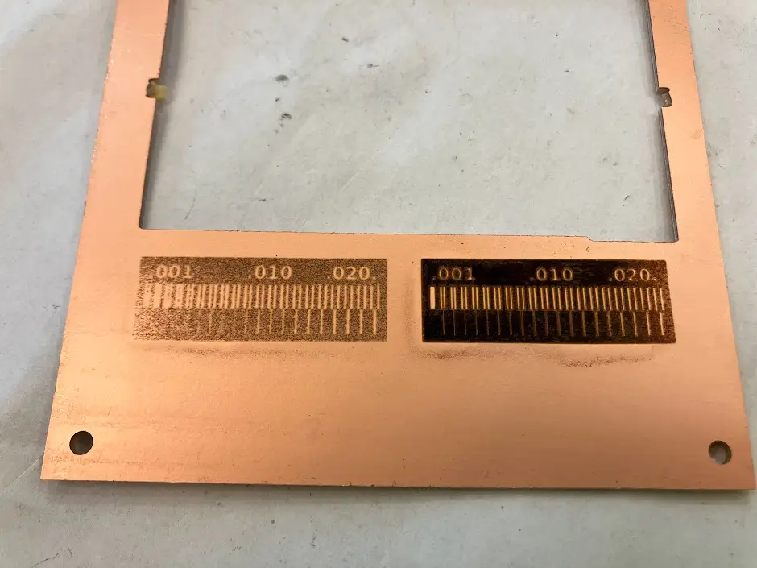
**Failed test**

I soon realized the problem was the image format. Switching to SVG files exposed the correct settings. The `gerber2img` tool didn't export SVGs, and KiCad's native SVG export produced the wrong shapes when opened in xTool. I ended up using the [Adobe PNG to Vector converter](https://www.adobe.com/express/feature/image/convert/png-to-svg) and then manually cleaned up the SVG in [Figma](https://www.figma.com/).

I settled on the following workflow:

1.  Drill alignment holes with the PCB mill first.
2.  Use the laser cutter to ablate the copper for the traces, using the holes for alignment.
3.  Use the mill again to cut the board's outline.

I scaled the SVG to match the measured dimension in KiCad before applying it on top of the drill holes.
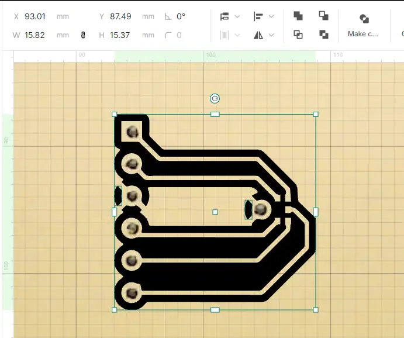
**Alignment**

I first made the mistake that the image was outdated after I moved the stock. This caused the laser to engrave on the bed.

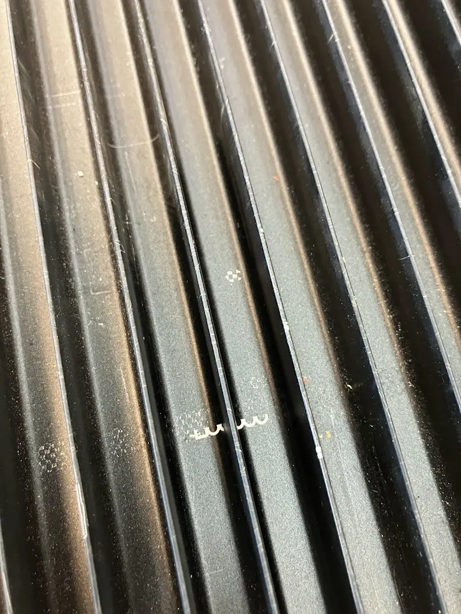
**Engraving on the bed**

The xTool V1 Ultra's camera alignment was slightly off. Even with careful alignment in the software, the first few results were shifted.

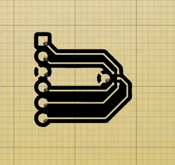
**The perfect alignment turned out to be offset by 0.3mm on both axes**

I also dialed in the machine settings. It took a total of 20 passes to completely remove the copper.

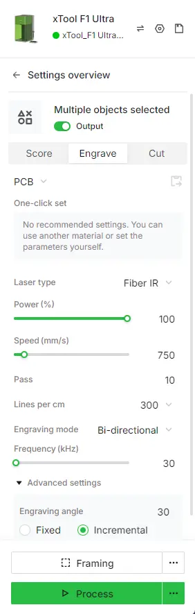
**10 passes each, processed twice**

After applying a manual offset, my fourth attempt produced a very good result and was ready for the edge cut. The tolerance for edge cutting is wide. I visually aligned the outline using the Carvera's laser scan. It worked perfectly.
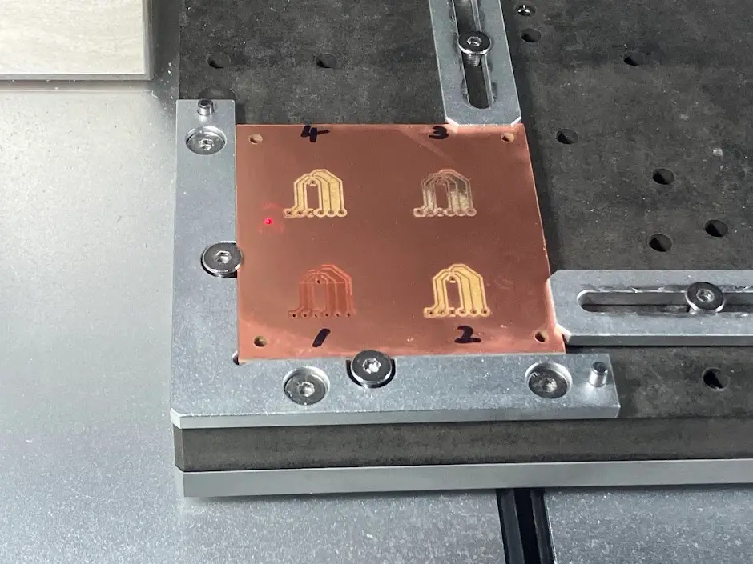
**Laser scan for edge cut**

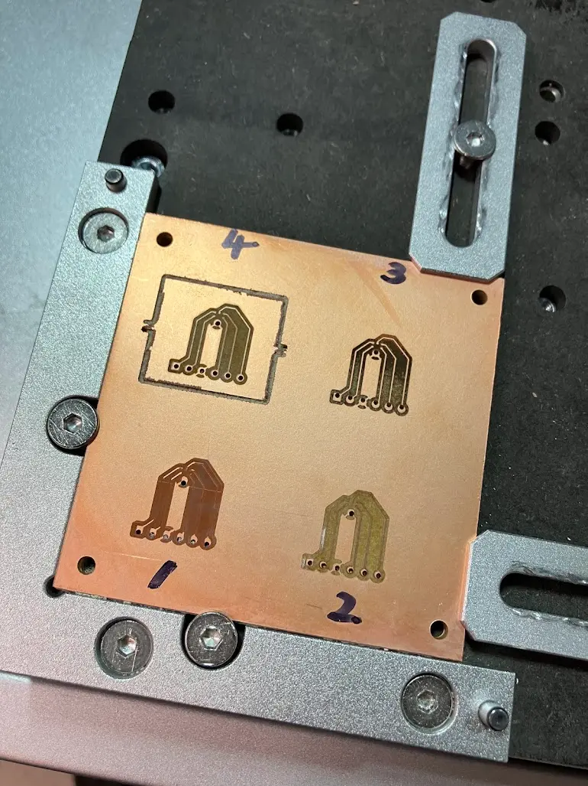
**The fourth attempt was good enough for milling**

In retrospect, I could have drilled the holes and cut the outline in one go before laser cutting. That would save a trip to the mill.

I also checked with TA Quentin that the xTool software has its own vectorize tool. I planned to use that next time instead of using Adobe and Figma.

Soldering the ICS-43434 was nightmarish. The component has tiny pads on its underside, which are unreachable with a soldering iron. The laser-etched traces were so thin they could barely hold any solder.

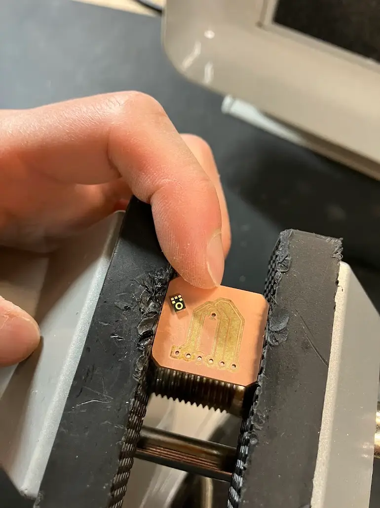
**How to solder this?**

I used a heat gun, hoping surface tension would do the work, but the heat began to damage the microphone's plastic casing. An attempt to heat the board from the bottom nearly burned the PCB before the solder melted. There was a warning during the lecture that FR1 was a poor heat conductor so I should have avoided this in the first place. After many tries, I managed to get it positioned with no shorts between the pads, but I have yet to test if the microphone actually works.

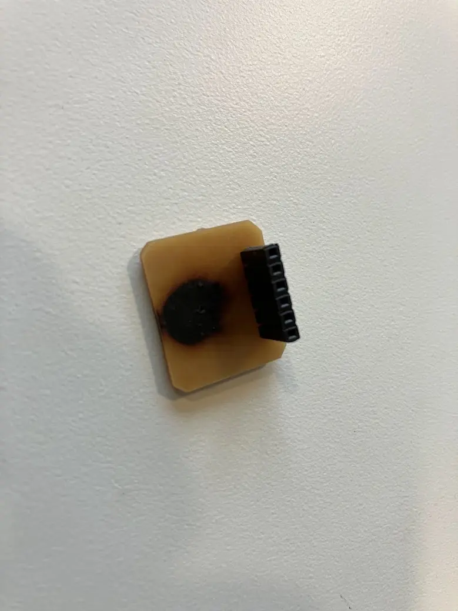
**Heating up the PCB from the bottom resulted in damage**

I tested with a multimeter and confirmed there was no short. But it was unclear whether the microphone survived the heat damage.

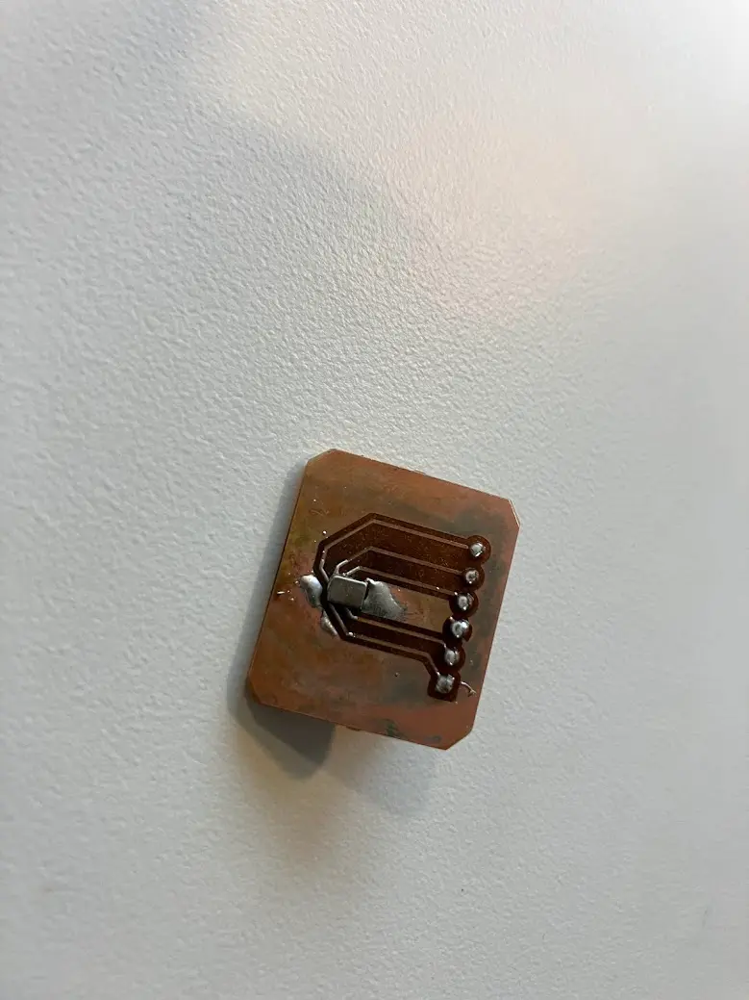
**Microphone breakout, soldered**

At this point, I realized that the pinout on my board is not the same as the Adafruit breakout board which my Operator board assumes. The only way for it to be compatible is to use jumper wires to sort out the connections. This was not ideal, but I had no choice now as it was already 3 AM.

Later, I received advice from TA Quentin that I could use solder paste. The process looks like this:

- Apply solder paste to the pads
- Heat from above to let the solder paste flow into the trace
- Place the component and heat again from above and let surface tension do the work

This could be something to try for v2.

### Integration Test

These were all the components I made this week. From top, clockwise:

- ICS-43434 breakout board (laser cut)
- Switchboard (milled, single-sided)
- Operator (milled, two-sided)

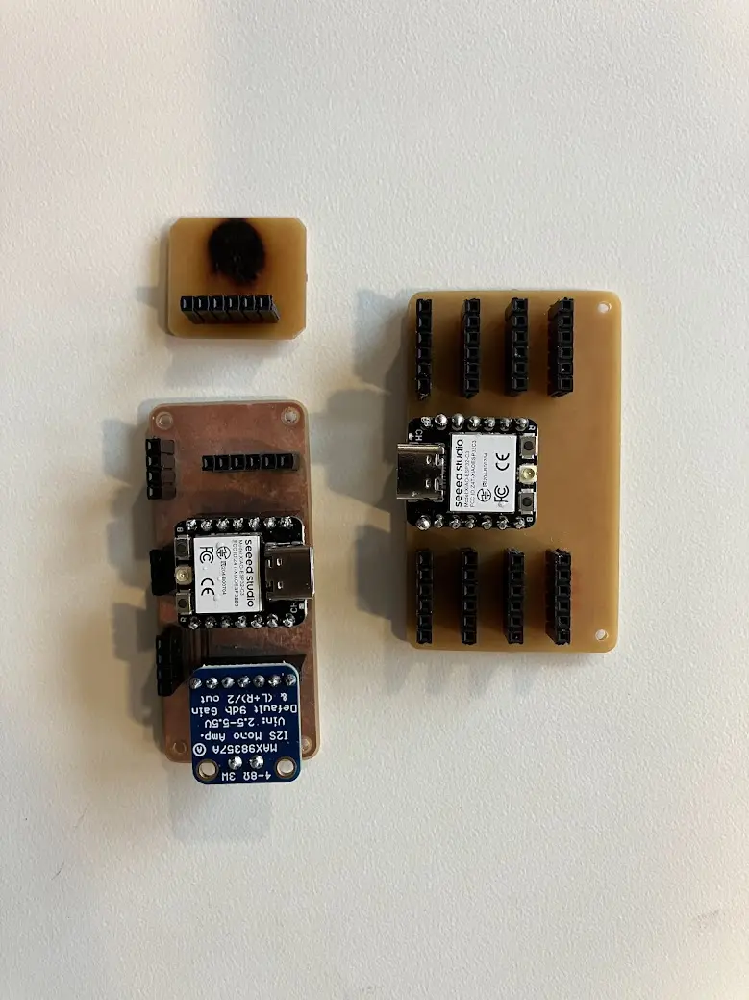
**All the components fabricated this week**

Let's assemble and test. Since we plan to have dedicated I/O and networking weeks, I focused only on basic connectivity.

I programmed the Switchboard to supply digital signals to each TRRS socket, and programmed the Operator to read the digital signal and determine which pins have high voltage. To simulate the final project scenario, I used a real TRRS male and female connector pair.

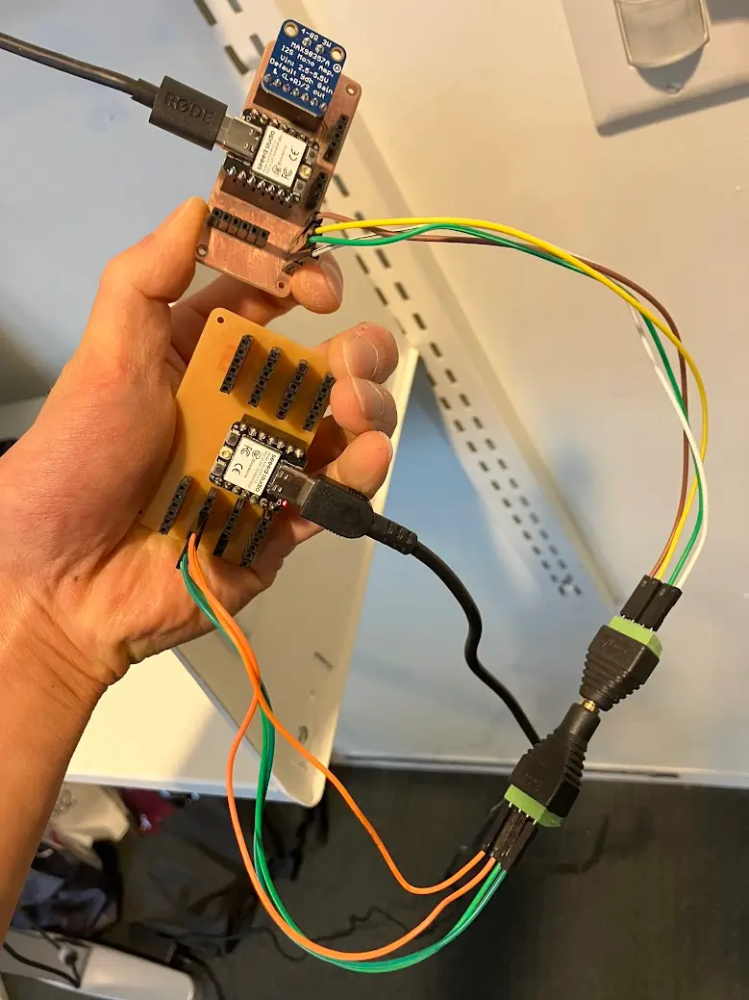
**Assembly with real TRRS connectors**

I was able to confirm from the serial output that all the TRRS sockets are giving out distinct high/low voltage patterns.

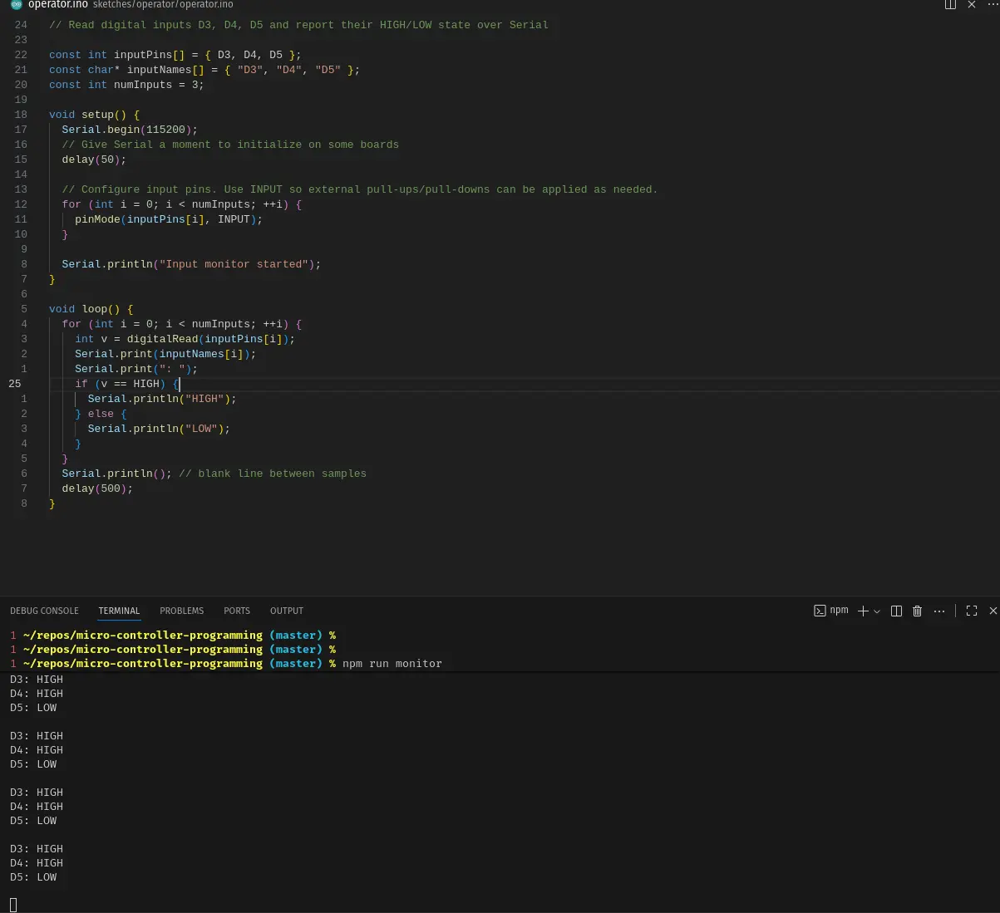
**Digital readings from TRRS sockets**

Key observations:

- Unplugging/replugging caused the reading to be high momentarily
- It took 1-2 seconds for the reading to stabilize after plugging in

I switched the digital pins to use `PULL_UP` mode, and the floating HIGH issue disappeared. I also realized that I need to reserve the `LOW LOW LOW` reading for unplugged state, therefore, I only have 7 distinct states for 8 TRRS sockets.

## Key lessons

This week was a gauntlet of trial and error, but the lessons were invaluable.

- **Heeding the instructions in class.** could have prevented the burning of the ICS-43434 breakout board.
- **Check component availability before designing.** A simple stock check can save a complete redesign.
- **Think about the manufacturing process during design.** Constraints like non-plated through-holes fundamentally change how a board must be laid out.
- **Double-check orientations,** especially when two-sided PCBs are involved. Mirroring is easy to forget and fatal to a design.
- **Homemade through-holes do not solder as easily as commercial PTH.** If possible, consider using surface-mount components for easier assembly.
- **Don't rely on intuition.** I found myself inclined to make the same mistake over and over. A checklist or a more rigorous verification process is essential.

## Appendix

- [Operator PCB design files](./code/operator-20251013.zip)
- [Switchboard PCB design files](./code/switchboard-20251013.zip)
- [ICS-43434 breakout board design files](./code/ics-43434-breakout-20251013.zip)
- [Integration test code](./code/integration-test-20251013.zip)
