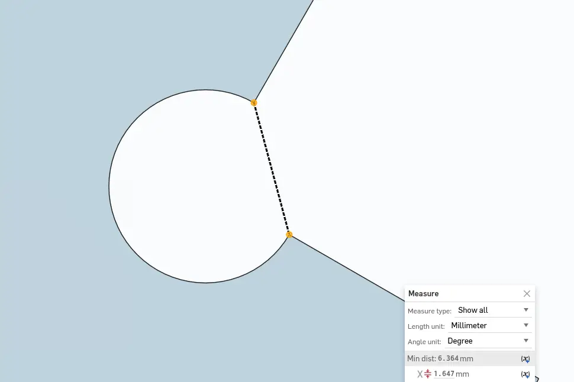

- This week's schedule is a bit special. Due to limited machine time, I was only able to characterize the CNC on the day of my cutting session.
- Essentially, I did the group assignment with [Dan](https://dangilbert.pages.cba.mit.edu/home/), as we iterated the design together by the machine.

## Project Context

- I've been racing mountain bike since 2015, but never learned the technique of manualing.
- Manualing is when you lift the front wheel of the bike off the ground and balance on the rear wheel while riding.
- Here is a good reference video: [How To Manual Like A Pro – MTB Skills](https://www.youtube.com/watch?v=NkWnV4RDzkU)
- People have created "Manual Machines" to help riders learn this skill. I decided to build my own using the skills acquired this week.

## Gathering Data

- I found a picture of my bike and its dimensions from the [manufacturer's website](https://otsocycles.com/collections/fenrir-ti).
  - The key data is the wheelbase (distance between front and rear axle), and the tire diameters.
  - I also manually measured the tire width. It was narrower than the spec, at roughly 56mm.

**Bike Geometry**

- I found a few reference designs from a quick Google search of ["manual machine for bikes"](https://www.google.com/search?udm=2&q=manual+machine+for+bikes)

## Paper Prototyping

- A quick sketch by hand to understand form and 3D relations

**Sketching the Design**

- Laser cutting. I'm shocked how fast I was able to characterize and machine and CAD a prototype thanks to the practice in [Week 2](../week-02/index.md)
- - 85% power, 70 mm/s speed seems reasonable, 0.12mm kerf

**Characterize and Cut**

- The intial assembly feels wobbly. I realized I could tild the joints to use gravity for better stability.

**Initial Paper Prototype**

- The paper helped me feel the weak points of the design and iterated with improved fastening mechanism

**Final Paper Prototype**

## Make The Big One

- I started the paper prototype without knowing the exact material.
- Later, I found out we would use 8 ft by 4 ft Oriented Strand Board (OSB).
- I originally assumed 2 by 4 lumber. The change of material forced me to rethink the design.
- Scaling the model to fit the bike. I used my bike as an underlay image and traced its geometry in Onshape.

**Designing the Full Scale Model**

- Special thanks to Dan, who helped me setting up the machine and running the job.
- I did all the CAD work in Onshape, which does not have a free CAM solution to students.
- Dan generously allowed me to use his Fusion360 to generated the toolpaths.
- During the first simulation, I realized I misunderstood how dogbones work
  - The drill bit couldn't reach the corner due to a bottleneck
  - The center of the circle does not have to be the corner of the part

**Dogbone Incorrect**

- The goal is to cut the smallest radius that satisfies two constraints:
  - Tolerant to the mill bit diameter
  - Creates perfectly mating interfaces

**Dogbone Bottleneck**

- Identifying the bottleneck

**Dogbone Corrected**

- Next I generated the toolpaths
  - Job 1 is single pass, down to -0.2 inch depth
  - Job 2 is multi-pass, down from -0.2 to -0.45 inch depth, cut through
- All cuts are 2D Contour.

**Milling in Progress**

- During the milling, the machine didn't cut through the z-axis.
- According to my measurement, Cut 2 should have cut through the material but it didn't

**It should have cut through here...**

- I decided to manually measure the remaining thickness and run a third job to cut through the remaining material.

**Measuring Remaining Thickness**

- I added one additional pass to fully mill through the material.

**Job 3 Milled Through**

- I compared my parameters with others: I used 11.5mm as the stock height, while others used 12mm. I believe this is why the machine didn't cut through the material.

| Parameter                 | Job 1          | Job 2          | Job 3          |
| ------------------------- | -------------- | -------------- | -------------- |
| **Clearance Height**      |                |                |                |
| From                      | Retract height | Retract height | Retract height |
| Offset                    | 0.4 in         | 0.4 in         | 0.4 in         |
| **Retract Height**        |                |                |                |
| From                      | Stock top      | Stock top      | Stock top      |
| Offset                    | 0.2 in         | 0.2 in         | 0.2 in         |
| **Feed Height**           |                |                |                |
| From                      | Top height     | Top height     | Top height     |
| Offset                    | 0.2 in         | 0.2 in         | 0.2 in         |
| **Top Height**            |                |                |                |
| From                      | Stock top      | Stock top      | Stock top      |
| Offset                    | 0 in           | -0.2 in        | -0.45 in       |
| **Bottom Height**         |                |                |                |
| From                      | Stock top      | Stock top      | Stock top      |
| Offset                    | -0.2 in        | -0.45 in       | -0.56 in       |
| **Multiple Depths**       |                |                |                |
| Enabled                   | No             | **Yes**        | No             |
| Maximum Roughing Stepdown | N/A            | **0.2 in**     | N/A            |

## Assemble and Enhance

- I used tabs during the milling. Removing the tabs weren't trivial. I used the [Milwaukee oscillating multi-tool](https://www.milwaukeetool.com/products/power-tools/woodworking/oscillating-multi-tool) paried with a bi-metal blade to remove the tabs and flattening the edges.

**Removing Tabs**

- As a safety note, wearing gloves is essential. I had a piece of wood splinter cut through the glove and stabbed my thumb. Had I not been wearing the glove, it could have been much worse.
- First assembly on the floor. My calculations for the board thickness was perfect. All joints were snug fit without any glue or fasteners.

**First Assembly on Floor**

- First assembly revealed that I miscalculated the tire diameter. Also, the middle section feels a bit wobbly.

**First Assembly with Bike**

- I measured the gap between the tire and the wood

**Measuring Gap**

- Due to limited machine time, I designed reinforcements that I could manually cut with a table band saw

**Handle Calculating the Redesign**

- I learned how to use the band saw by observing others in the shop. The key point is to down cut from the side with loose wood chips of the OSB, so the saw holds the wood against the table with minimum splintering.

**Cutting Reinforcements**

- Due to slight error in my design, one of the reinforcements was a bit loose. I learned that it's better to design towards a tight fit and iteratively relax until it fits.
- Adding the spacers definitely improved rigidity

**Final Assembly with Spacers and Reinforcements (Colored Blue)**

- I tied a rope using a flexible knot, anchored by a washer. The rope was from an unknown source and appears weak. A proper design would call for cargo [tie down straps](https://en.wikipedia.org/wiki/Tie_down_strap) with a open/close mechanism.

  
  **Rope Anchor**

## Testing

- First, static test: One foot on the ground, rotate backward, hold break, and mount.

**Functional Test**

- Second, limit test: Ask a friend to support you while rotating as backward as possible. Test the rope strength.
  
  **Limit Test**

- Finally, full test. Bring the bike up from ground.

- The machine was a big success but my demo needs practice. I landed on my butt, and learned the lesson the "hard way" - knowledge can be dangerous.

## Appendix

- Paper prototype files
- Full scale CAD files
