This week's schedule was a bit special. Due to limited machine time for the large-format CNC, I was only able to characterize the machine on the same day as my cutting session. This meant I essentially did the group assignment with my TA [Dan](https://dangilbert.pages.cba.mit.edu/home/), as we iterated on our designs together right by the machine.

## Project Context

I've been racing mountain bikes since 2015, but I've never quite mastered the technique of manualing. Manualing is the skill of lifting the front wheel off the ground and balancing on the rear wheel while riding, which is crucial for clearing obstacles on the trail as well as for the occasional showoff. A great reference video is [How To Manual Like A Pro – MTB Skills](https://www.youtube.com/watch?v=NkWnV4RDzkU). To help riders learn this skill in a controlled environment, people have created "[Manual Machines](https://www.google.com/search?udm=2&q=manual+machine+for+bikes)". I decided to build my own using the skills from this week.

## Gathering Data

The first step was to get the critical dimensions of my bike. I found a geometry chart on the [manufacturer's website](https://otsocycles.com/collections/fenrir-ti), which gave me the wheelbase (distance between the front and rear axles) and tire diameter. I also manually measured the tire width, which came out to be 55 mm, slightly narrower than the 56-57 mm stated in the [official spec](https://www.renehersecycles.com/shop/components/tires/700c/700c-x-55-fleecer-ridge/).

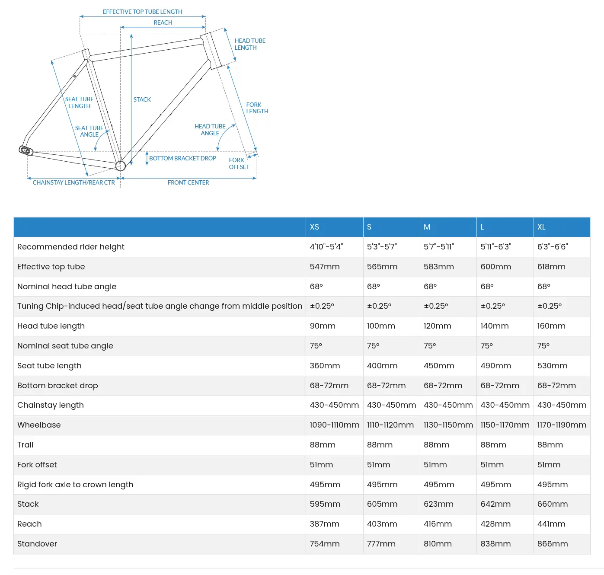
**Bike Geometry**

## Paper Prototyping

I started with a quick hand sketch to get a feel for the form and how the 3D parts would relate to each other.

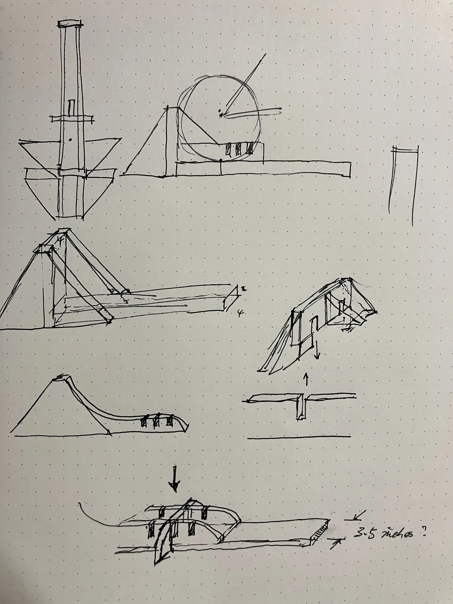
**Sketching the Design**

With the practice from [Week 2](../week-02/index.md), I was shocked at how quickly I could move from a sketch to a physical prototype. I used the laser cutter to make a small-scale model. After a quick test, I found that 85% power at 70 mm/s speed with a 0.12 mm kerf worked well for the cardboard.

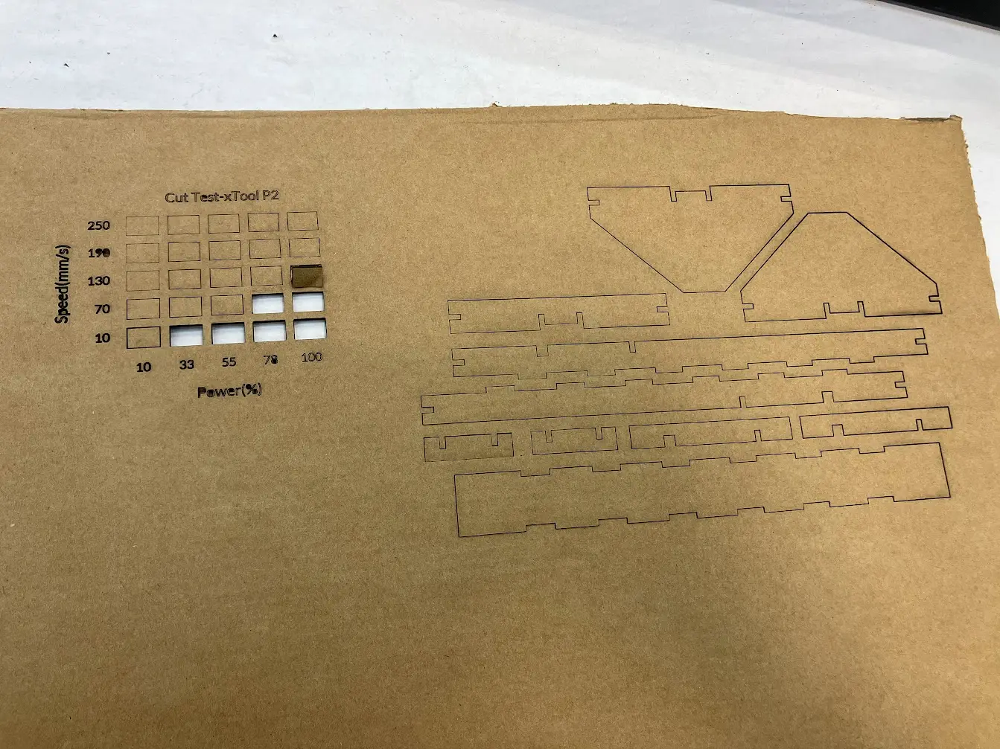
**Characterize and Cut**

The initial assembly felt wobbly. I realized I could tilt the joints, using gravity to create more stable connections. This small-scale model was invaluable for identifying weak points in the design.

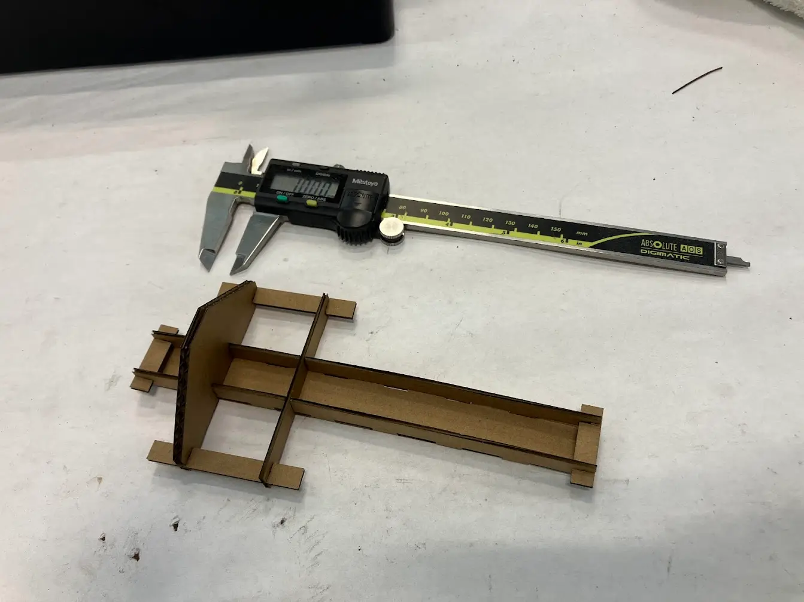
**Initial Paper Prototype**

I iterated on the fastening mechanism to improve stability. In the final version, I introduced through-holes, slanted joints, and a press-fit "tail bone".

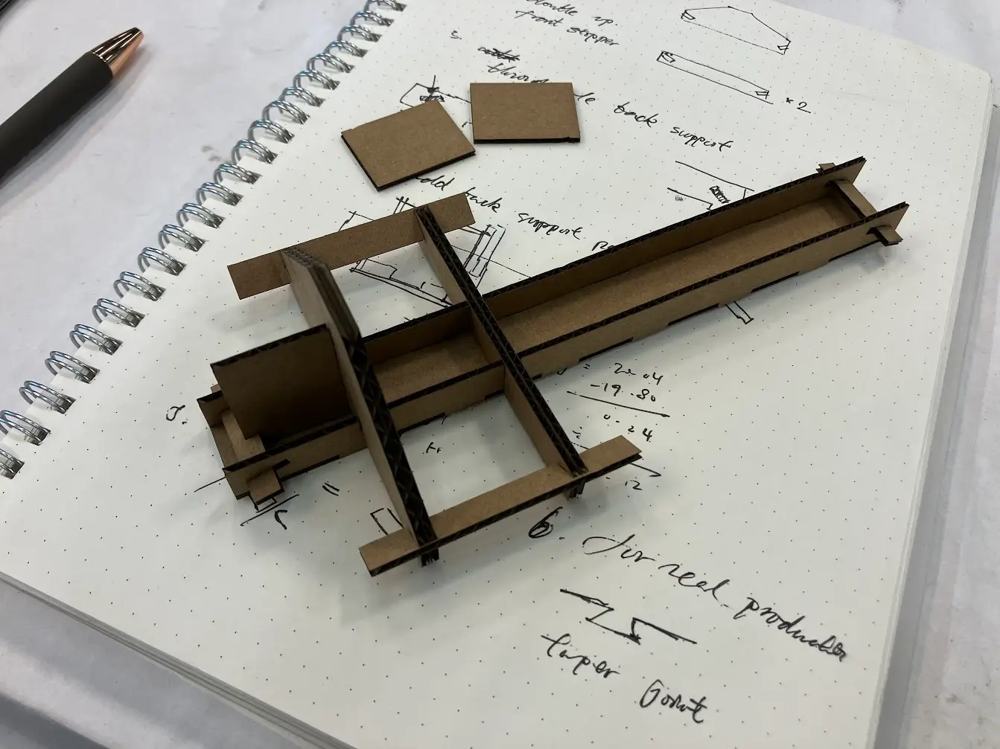
**Final Paper Prototype**

## Make The Big One

When I started the paper prototype, I didn't know what material we would be using for the final build. I had assumed 2x4 lumber, but later found out we would be using 4x8 ft sheets of Oriented Strand Board (OSB). This change in material forced me to rethink the design to work with sheet stock.

I scaled up the model in Onshape, using a picture of my bike as an underlay to trace its geometry and ensure a perfect fit.

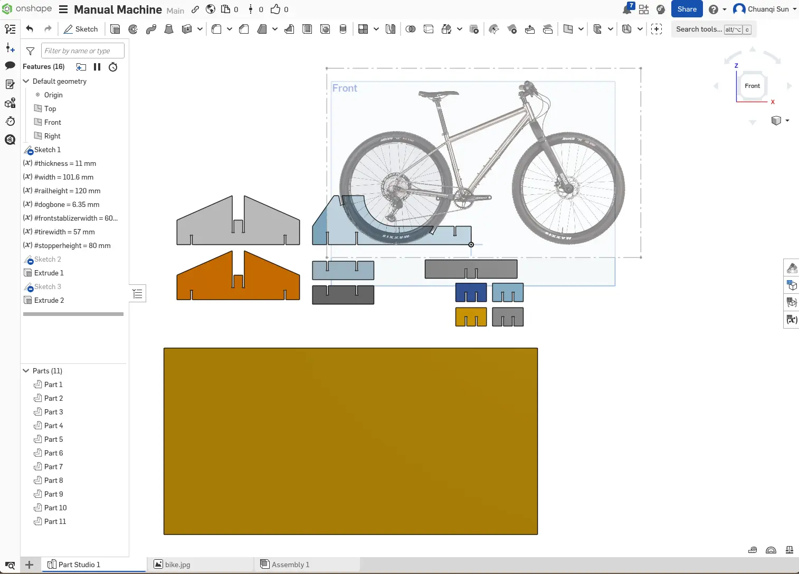
**Designing the Full Scale Model**

Special thanks to Dan, who helped me set up the machine and run the job. I did all my CAD work in Onshape, which unfortunately does not have a free CAM solution for students. Dan generously let me use his Fusion360 license to generate the toolpaths.

During the first CAM simulation, I realized I had misunderstood how dogbones work. I had placed the center of the dogbone circle at the corner of the part, creating a bottleneck that the drill bit couldn't navigate.

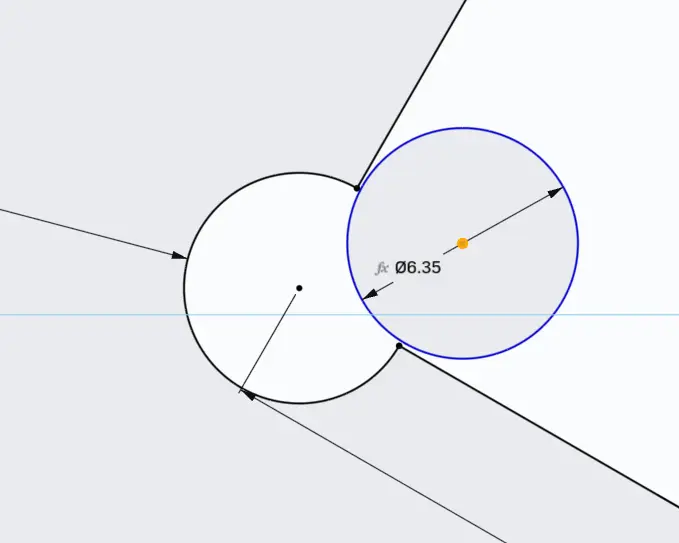
**Dogbone Incorrect**

The key insight was that the goal is to create the smallest possible cut that allows the mating part to fit perfectly, which doesn't require the circle's center to be at the corner.

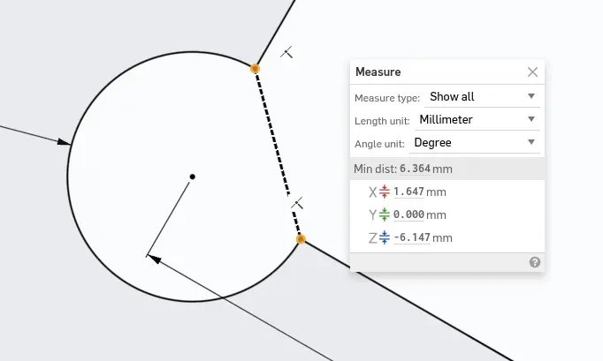
**Identifying the bottleneck**

The correct placement of the dogbone is to make the corner coincide with the circle.

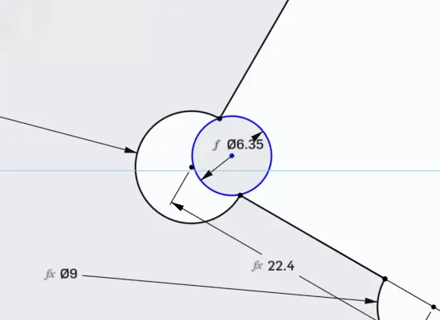
**Dogbone Corrected**

Due to limited machine time, I went with the practical decision of simply increasing my circle's radius until the bottleneck is wide enough.

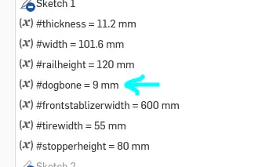
**Parameteric Design Saved my Day**

Thanks to Parametric Design, I could iterate quickly. This resulted in a 9 mm circle at each right corner angle of my shapes. This approach is less efficient and slightly undermines structure.

**Verifying Toolpath After Dogbone Fix**

With the dogbones issue addressed, I generated the toolpaths using 2D Contour cuts:

- **Job 1:** A single pass down to -0.2 inches.
- **Job 2:** A multi-pass cut from -0.2 inches down to -0.45 inches, intended to cut all the way through.

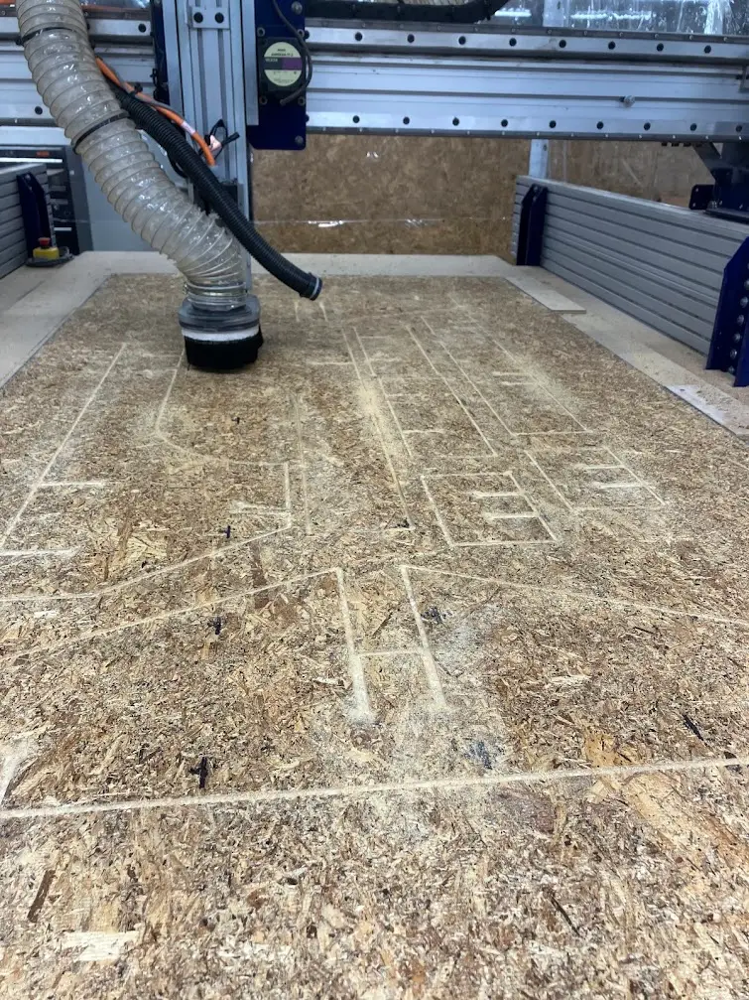
**Milling in Progress**

However, during the milling, Job 2 didn't cut all the way through the material.

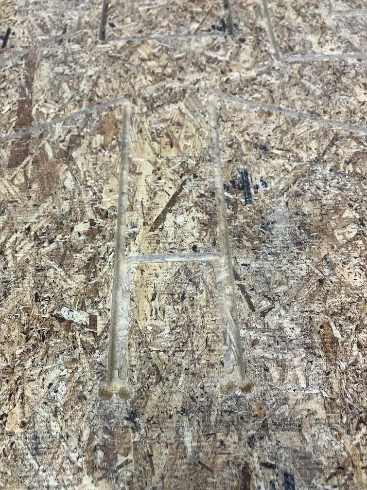
**It should have cut through here...**

After the job, I manually measured and calculated the remaining thickness, and created a third job to cut through the rest of the material.

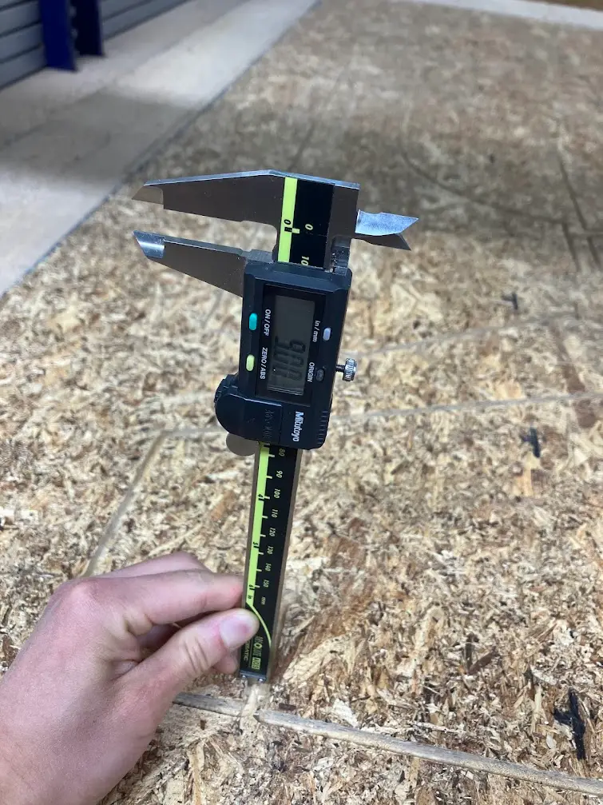
**Measuring Remaining Thickness**

This final pass successfully cut the parts out. Comparing my parameters with others, I realized my mistake: I had set the stock height to 11.2 mm (thinnest measurement) while others used 12 mm (thickest measurement). I believe this discrepancy is why the machine didn't cut through on the first attempt.

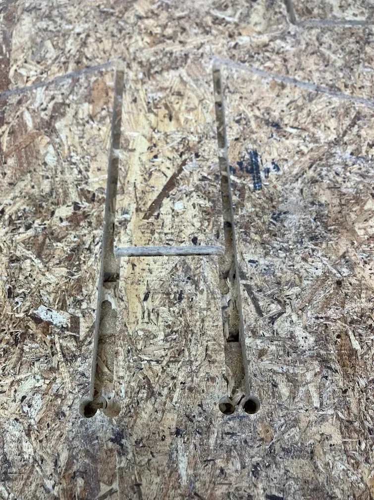
**Job 3 Milled Through**

| Parameter                 | Job 1          | Job 2          | Job 3          |
| ------------------------- | -------------- | -------------- | -------------- |
| **Clearance Height**      |                |                |                |
| From                      | Retract height | Retract height | Retract height |
| Offset                    | 0.4 in         | 0.4 in         | 0.4 in         |
| **Retract Height**        |                |                |                |
| From                      | Stock top      | Stock top      | Stock top      |
| Offset                    | 0.2 in         | 0.2 in         | 0.2 in         |
| **Feed Height**           |                |                |                |
| From                      | Top height     | Top height     | Top height     |
| Offset                    | 0.2 in         | 0.2 in         | 0.2 in         |
| **Top Height**            |                |                |                |
| From                      | Stock top      | Stock top      | Stock top      |
| Offset                    | 0 in           | -0.2 in        | -0.45 in       |
| **Bottom Height**         |                |                |                |
| From                      | Stock top      | Stock top      | Stock top      |
| Offset                    | -0.2 in        | -0.45 in       | -0.56 in       |
| **Multiple Depths**       |                |                |                |
| Enabled                   | No             | **Yes**        | No             |
| Maximum Roughing Stepdown | N/A            | **0.2 in**     | N/A            |

## Assemble and Enhance

I used tabs to keep the parts in place during milling, and removing them wasn't trivial. I used a [Milwaukee oscillating multi-tool](https://www.milwaukeetool.com/products/power-tools/woodworking/oscillating-multi-tool) with a bi-metal blade to cut the tabs and flatten the edges.

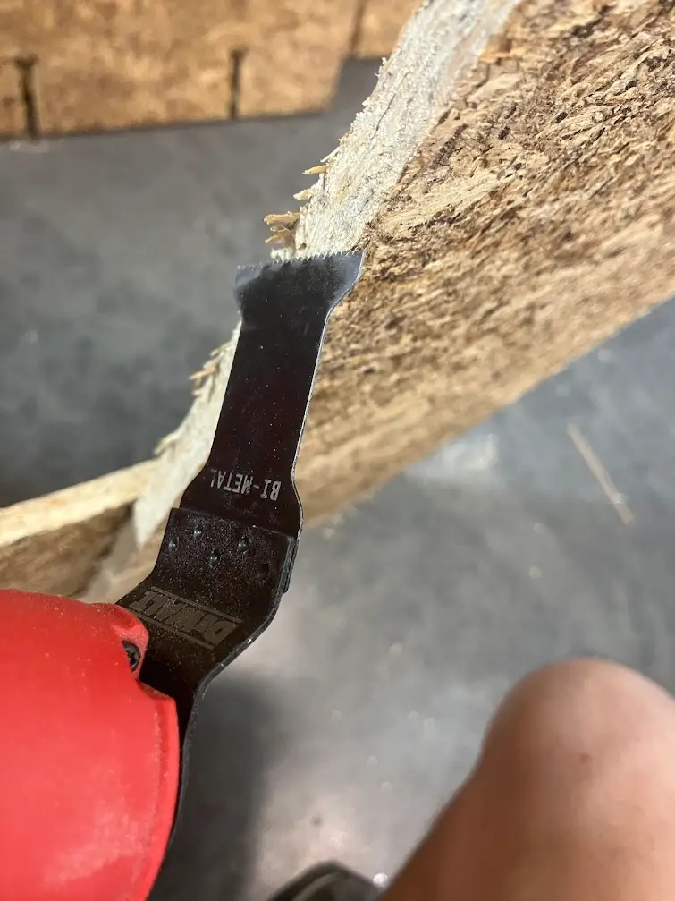
**Removing Tabs**

A quick safety note: wearing gloves is essential when working with OSB. A wood splinter cut straight through my glove and stabbed my thumb. Had I not been wearing the glove, the injury could have been much worse.

The first assembly on the floor went smoothly. My calculations for the material thickness were perfect, and all the joints had a snug fit without any glue or fasteners.

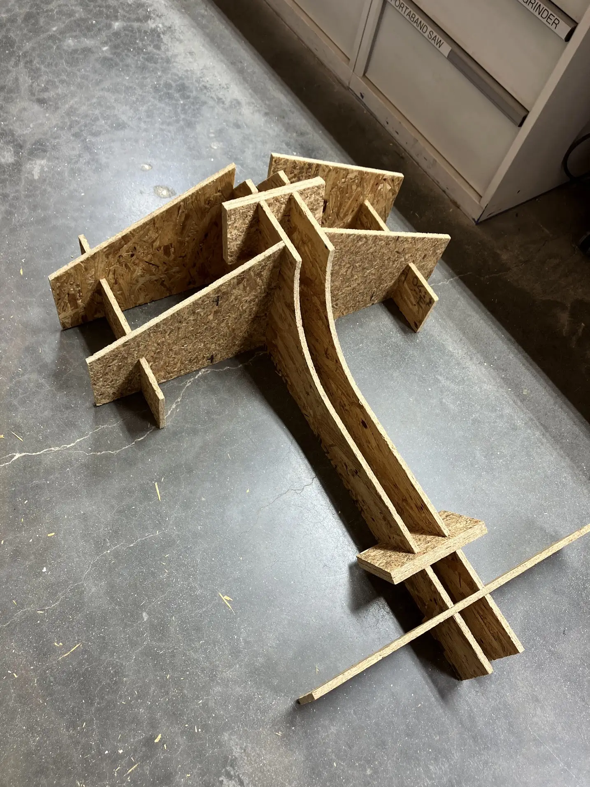
**First Assembly on Floor**

However, adding the bike revealed two problems: I had miscalculated the tire diameter, and the middle section felt a bit wobbly.

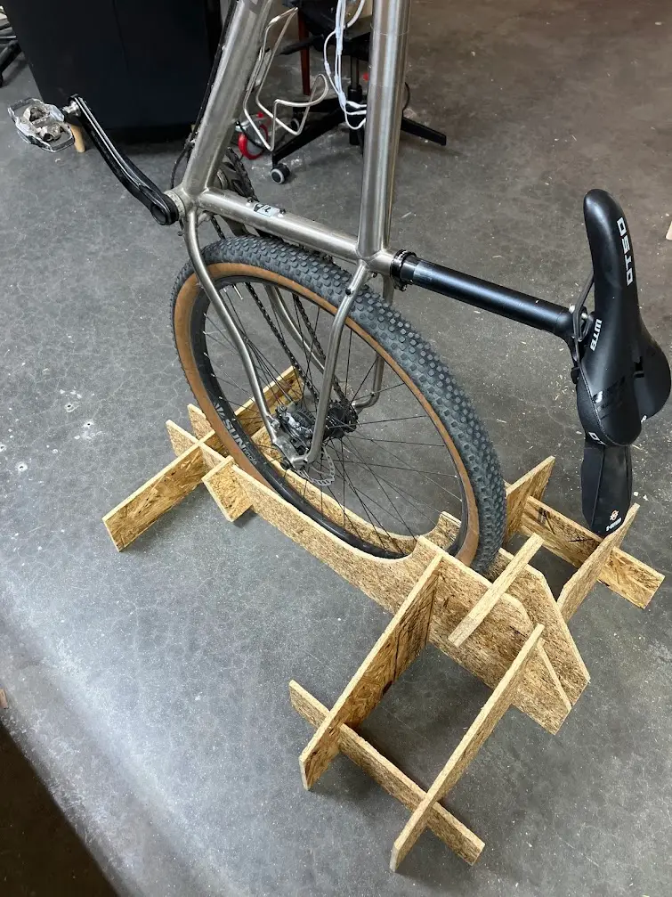
**First Assembly with Bike**

The tire fit can be addressed with spacers. The weak middle can be reinforced with brackets. I measured the gap between the tire and the wood to determine the size of the needed spacers.

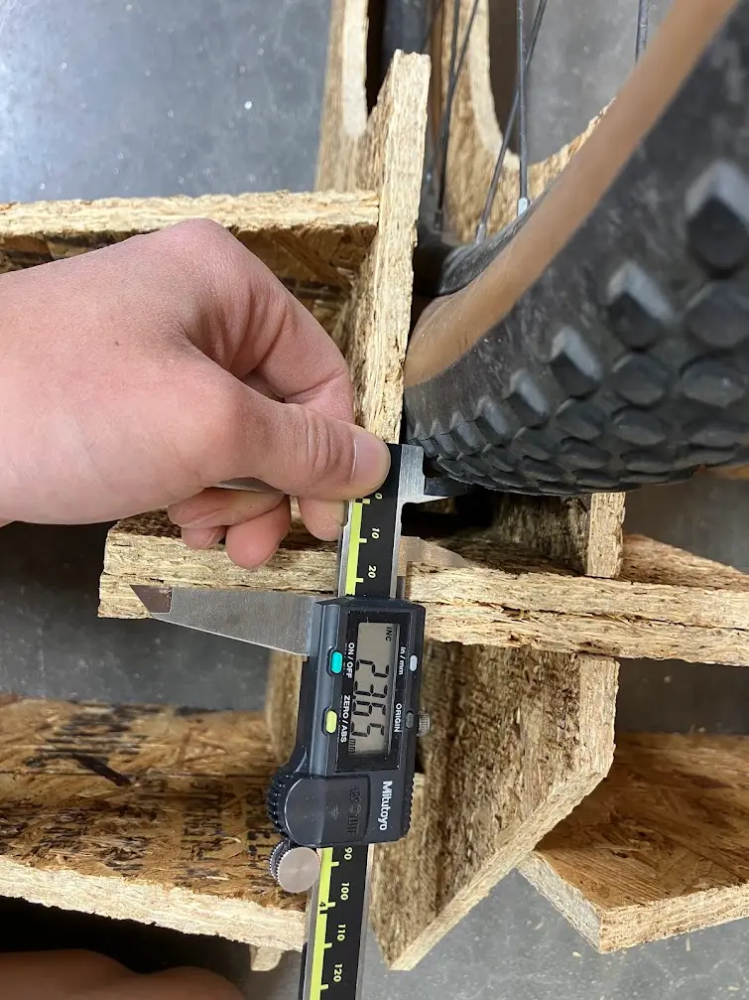
**Measuring Gap**

Due to limited machine time, I designed reinforcements that I could cut manually on a band saw.

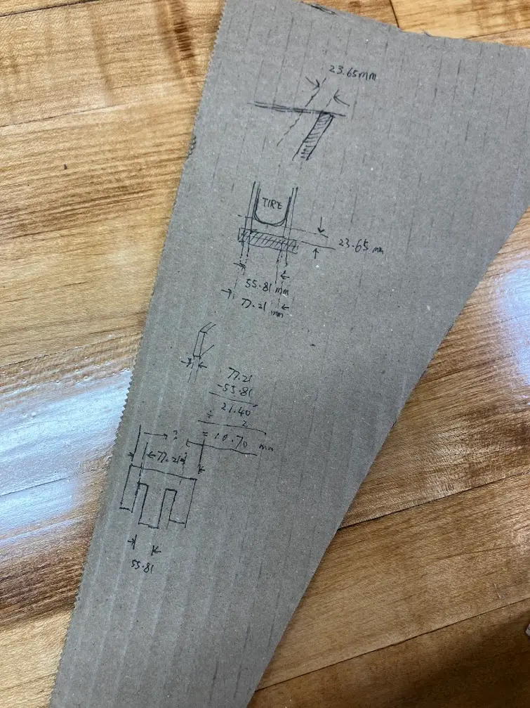
**Handle Calculating the Redesign**

I learned how to use the band saw by observing and asking a classmate. Special shout out to [Charlie](https://fab.cba.mit.edu/classes/863.25/people/CharlesLu/) who happened to be using the band saw in the shop and generously demoed his technique to me. The key is to cut from the side with loose wood chips, so the saw's downward motion holds the OSB against the table and minimizes splintering.

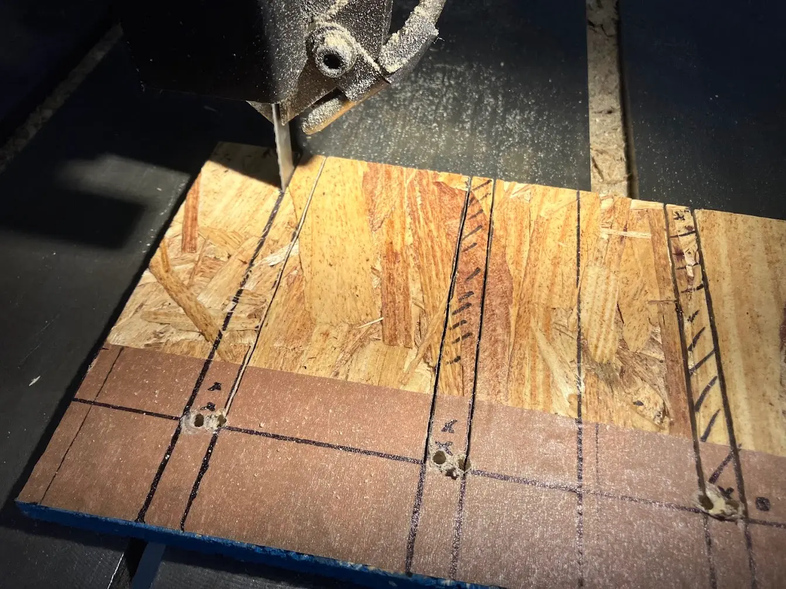
**Cutting Reinforcements with Band Saw**

One of the reinforcements was a bit loose, a result of a slight error in my design. This taught me that it's better to design for a tight fit and then iteratively sand or file it down until it fits perfectly. Adding the spacers and reinforcements significantly improved the structure's rigidity.

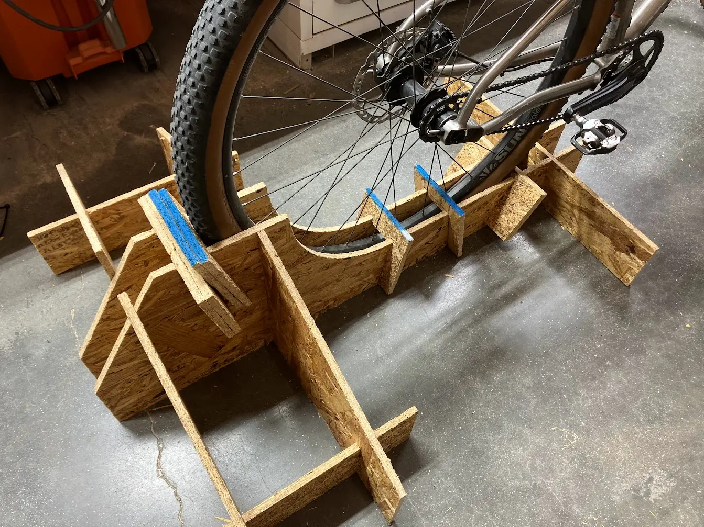
**Final Assembly with Spacers and Reinforcements (Colored Blue)**

For the safety tether, I tied a rope using a flexible knot, anchored by a washer. The rope was from an unknown source and seemed weak. A proper design would use rated cargo [tie-down straps](https://en.wikipedia.org/wiki/Tie_down_strap) with a secure buckle mechanism.

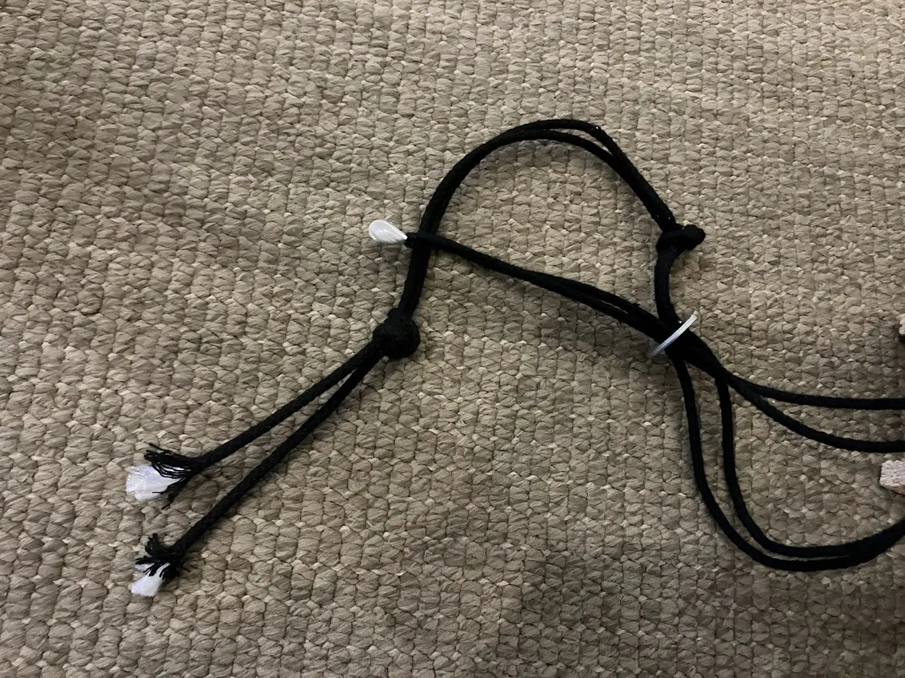
**Rope Anchor**

## Testing

With the machine fully assembled, it was time to test.

- **Static Test:** I started by placing one foot on the ground, rotating the bike backward, holding the brake, and mounting. The structure felt solid.

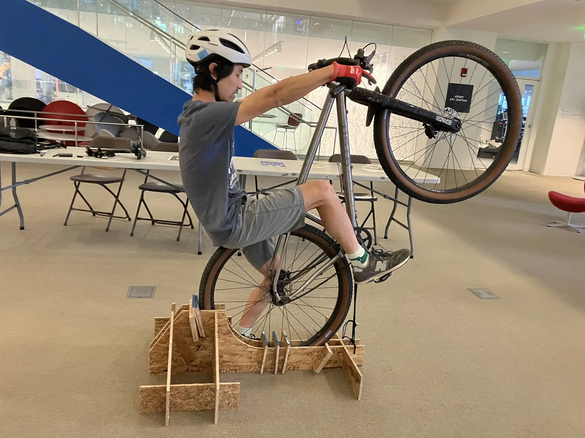
**Functional Test**

- **Limit Test:** I had a friend support me while I rotated as far back as possible to test the strength of the rope tether.

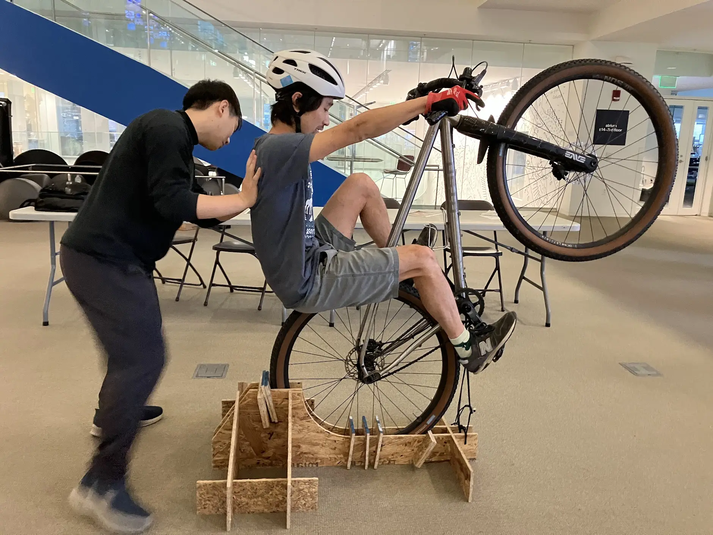
**Limit Test**

- **Full Test:** Finally, I attempted to bring the bike up from the ground into a manual without any assistance.

The machine was a big success, but my demo needs practice. I promptly landed on my butt, learning the lesson the "hard way" that sometimes, knowledge can be dangerous.

## Appendix

- Paper prototype files
- Full scale CAD files
