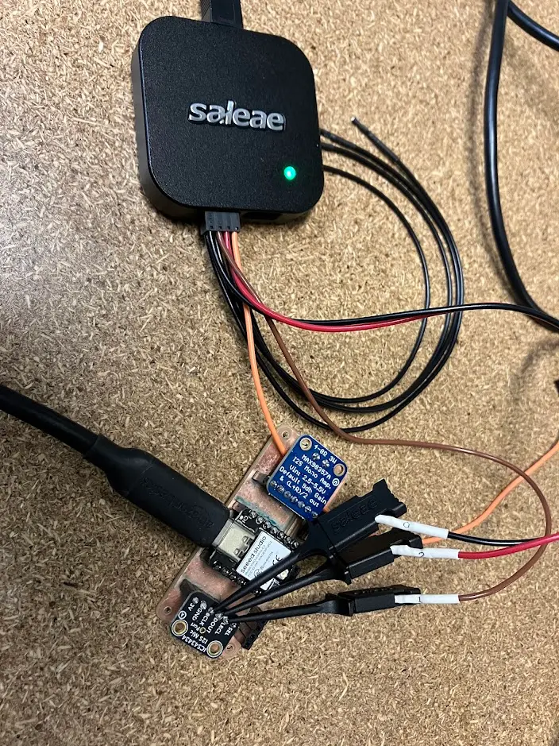
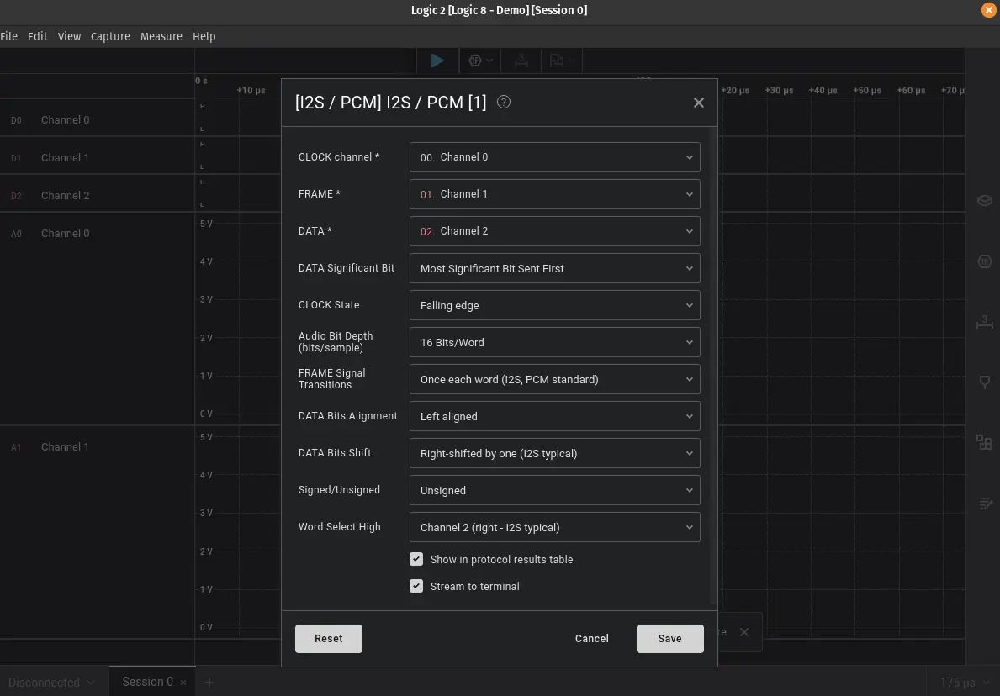
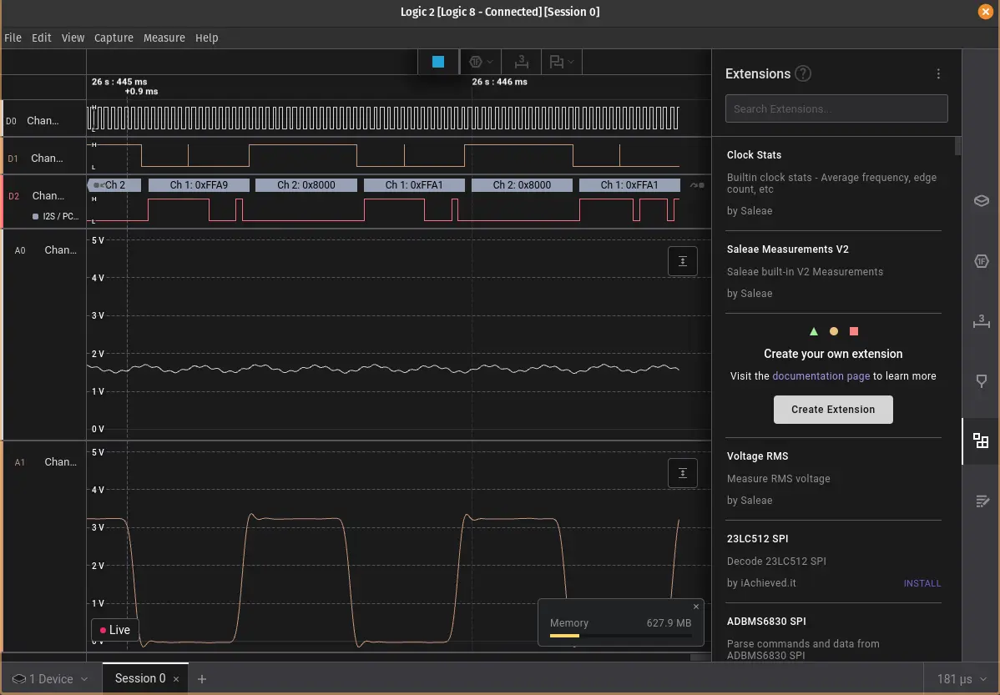
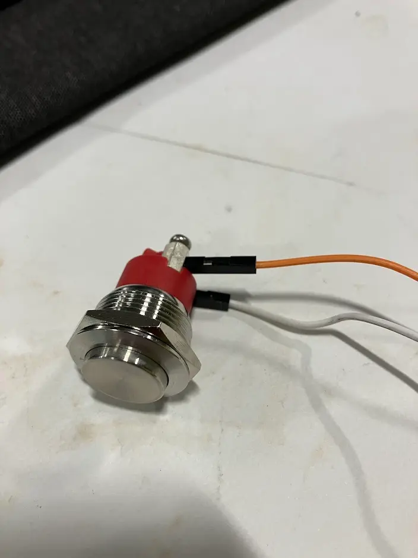

## Group Assignment

I joined [Typer](https://fab.cba.mit.edu/classes/863.25/people/TylerJensenHill/) and [Jacqueline](https://fab.cba.mit.edu/classes/863.25/people/JacquelineOrr/) to characterize input devices in our lab. We started by probing a photo transistor to understand its behavior. Our key finding was that the resting resistance is quite high, and covering the sensor with a hand has only a modest effect. However, shining a flashlight on the sensor causes a significant drop in resistance, confirming its sensitivity to light.

To gain more hands-on experience, I decided to probe the microphone breakout board I fabricated in [Week 6](../week-06/index.md) with [Saleae Logic 8](https://www.saleae.com/products/saleae-logic-8). Wiring up the probes proved tricky due to the small soldering joints on the board.


**Probe setup**


**Setup Analyzer for I2S protocol**

I couldn't find a clock signal generator in the lab, so I programmed the Xiao to initialize the I2S device and generate the necessary clock signals for testing.

This is the minimum code to drive the I2S device:

```cpp
// Simple I2S microphone CSV output
// Custom pinout: D0 = BCLK, D1 = DOUT, D2 = LRC

#include "AudioTools.h"

AudioInfo info(16000, 1, 16);  // 16kHz, mono, 16-bit
I2SStream i2sStream;
CsvOutput<int16_t> csvOutput(Serial);
StreamCopy copier(csvOutput, i2sStream);

void setup() {
  Serial.begin(115200);
  AudioToolsLogger.begin(Serial, AudioToolsLogLevel::Info);

  // Configure I2S for custom pinout
  auto cfg = i2sStream.defaultConfig(RX_MODE);
  cfg.copyFrom(info);
  cfg.pin_bck = D0;   // BCLK
  cfg.pin_data = D1;  // DOUT
  cfg.pin_ws = D2;    // LRC
  cfg.i2s_format = I2S_STD_FORMAT;

  i2sStream.begin(cfg);
  csvOutput.begin(info);
}

void loop() {
  copier.copy();
}
```

I confirmed from the serial plotter that the device was outputting data. The software supports both I2S and PCM protocols, but the decoding was not very useful for analysis purposes.



## Making a Wireless Microphone

Speech recognition is a key component of my final project. I leveraged this week's input device topic to deep dive into the making of a wireless microphone, exploring different network protocols and integration approaches.

### Networking Test with Sine Wave

I started with Phil Schatzmann's examples in the [Arduino Audio Tools library](https://github.com/pschatzmann/arduino-audio-tools). My first goal was to stream a basic sine wave over WiFi. I took Phil's sample code as is and confirmed that sound was working over WiFi. During testing, I found that the antenna seems necessary for a stable connection. I had success in previous tests without using an antenna, but for some reason, the antenna became necessary in this setup.

```cpp
/**
 * @file streams-generator-server_wav.ino
 *
 * See: https://github.com/pschatzmann/arduino-audio-tools/blob/main/examples/examples-communication/http-server/streams-generator-webserver_wav/streams-generator-webserver_wav.ino
 * This sketch generates a test sine wave. The result is provided as WAV stream which can be listened to in a Web Browser
 *
 * @author Phil Schatzmann
 * @copyright GPLv3
 *
 */

#include "AudioTools.h"
#include "AudioTools/Communication/AudioHttp.h"

// WIFI
const char *ssid = "REPLACE_WITH_SSID";
const char *password = "REPLACE_WITH_REAL_PASSWORD";

AudioWAVServer server(ssid, password);

// Sound Generation
const int sample_rate = 10000;
const int channels = 1;

SineWaveGenerator<int16_t> sineWave;            // Subclass of SoundGenerator with max amplitude of 32000
GeneratedSoundStream<int16_t> in(sineWave);     // Stream generated from sine wave


void setup() {
  Serial.begin(115200);;;
  AudioLogger::instance().begin(Serial,AudioLogger::Info);

  // start server
  server.begin(in, sample_rate, channels);

  // start generation of sound
  sineWave.begin(channels, sample_rate, N_B4);
  in.begin();

  Serial.print("Will sleep");
  // sleep for 5 seconds first
  delay(5000);

  Serial.print("Server URL: http://");
  Serial.print(WiFi.localIP());
}


// copy the data
void loop() {
  server.copy();
}
```

### HTTP Streaming

In this setup, the microcontroller works as the server, exposing a WAV stream. My computer works as the client, receiving and playing the WAV stream. I connected the I2S microphone to the ESP32 and configured it to stream audio data over HTTP.

```cpp
#include "AudioTools.h"
#include "AudioTools/Communication/AudioHttp.h"

// WiFi credentials
const char *ssid = "REPLACE_WITH_SSID";
const char *password = "REPLACE_WITH_PASSWORD";

// I2S and Audio
AudioInfo info(22000, 1, 16);  // 22kHz, mono, 16-bit
I2SStream i2sStream;           // Access I2S as stream
ConverterFillLeftAndRight<int16_t> filler(LeftIsEmpty);
AudioWAVServer server(ssid, password);

void setup() {
  Serial.begin(115200);
  delay(100);
  AudioLogger::instance().begin(Serial, AudioLogger::Info);

  // Connect to WiFi
  Serial.println("\nConnecting to WiFi...");
  WiFi.begin(ssid, password);

  int attempts = 0;
  while (WiFi.status() != WL_CONNECTED && attempts < 20) {
    delay(500);
    Serial.print(".");
    attempts++;
  }

  if (WiFi.status() != WL_CONNECTED) {
    Serial.println("\nFailed to connect to WiFi");
    return;
  }

  Serial.println("\nWiFi connected!");
  Serial.print("Device IP: ");
  Serial.println(WiFi.localIP());

  Serial.println("Starting I2S...");
  auto cfg = i2sStream.defaultConfig(RX_MODE);
  cfg.copyFrom(info);
  cfg.pin_bck = D0;   // BCLK
  cfg.pin_data = D1;  // DOUT
  cfg.pin_ws = D2;    // LRC
  cfg.i2s_format = I2S_STD_FORMAT;

  if (!i2sStream.begin(cfg)) {
    Serial.println("Failed to initialize I2S");
    return;
  }
  Serial.println("I2S initialized successfully");

  // Start WAV server
  Serial.println("Starting WAV server...");
  server.begin(i2sStream, info, &filler);
  Serial.print("Server URL: http://");
  Serial.print(WiFi.localIP());
}

void loop() {
  server.copy();
}
```

After testing this approach, I observed several issues. The latency was inconsistent, ranging from 1 second to 5 seconds. The sound quality was also inconsistent, sometimes good, sometimes poor. My suspicion is that the network condition affected the streaming performance.

## Exploring MP3 Encoding

I wanted to test MP3 encoding to reduce bandwidth usage and potentially improve robustness against network issues. The theory was that compressed audio would be more resilient to network fluctuations.

```cpp
#include "AudioTools.h"
#include "AudioTools/AudioCodecs/CodecMP3LAME.h"
#include "AudioTools/Communication/AudioHttp.h"

// WiFi credentials
const char *ssid = "REPLACE_WITH_SSID";
const char *password = "REPLACE_WITH_PASSWORD";

// I2S and Audio
AudioInfo info(16000, 1, 16);  // 16kHz, mono, 16-bit
I2SStream i2sStream;           // Access I2S as stream
MP3EncoderLAME mp3;
AudioEncoderServer server(&mp3, ssid, password);

void setup() {
  Serial.begin(115200);
  delay(100);
  AudioLogger::instance().begin(Serial, AudioLogger::Info);

  // Connect to WiFi
  Serial.println("\nConnecting to WiFi...");
  WiFi.begin(ssid, password);

  int attempts = 0;
  while (WiFi.status() != WL_CONNECTED && attempts < 20) {
    delay(500);
    Serial.print(".");
    attempts++;
  }

  if (WiFi.status() != WL_CONNECTED) {
    Serial.println("\nFailed to connect to WiFi");
    return;
  }

  Serial.println("\nWiFi connected!");
  Serial.print("Device IP: ");
  Serial.println(WiFi.localIP());

  // Configure I2S with custom pinout
  Serial.println("Starting I2S...");
  auto cfg = i2sStream.defaultConfig(RX_MODE);
  cfg.copyFrom(info);
  cfg.pin_bck = D0;   // BCLK
  cfg.pin_data = D1;  // DOUT
  cfg.pin_ws = D2;    // LRC
  cfg.i2s_format = I2S_STD_FORMAT;

  if (!i2sStream.begin(cfg)) {
    Serial.println("Failed to initialize I2S");
    return;
  }
  Serial.println("I2S initialized successfully");

  // Start MP3 server
  Serial.println("Starting MP3 server...");
  server.begin(i2sStream, info);
  Serial.print("Server URL: http://");
  Serial.print(WiFi.localIP());
}

void loop() {
  server.doLoop();
}
```

Running this code caused a memory allocation error:

```txt
[Error] lame.c : 2792 - calloc(1,85840) -> 0x0
available MALLOC_CAP_8BIT: 114676 / MALLOC_CAP_32BIT: 114676  / MALLOC_CAP_SPIRAM: 0
```

It turns out MP3 encoding is quite memory intensive. While it may reduce network bandwidth usage, it does not fit the memory constraints of the ESP32-C3. This was a dead end for optimization.

## UDP Streaming Experiment

If I couldn't address the audio codec limitation, could I tackle the network issue itself? I knew that the HTTP protocol has built-in error correction and guarantees delivery through two-way communication, which may introduce significant overhead. UDP is a connectionless protocol that does not guarantee delivery, but it has lower latency and overhead. I don't worry about occasional packet loss in audio streaming, as it often goes unnoticed by the human ear. I decided to go back to basics and test whether I could stream a sine wave over UDP.

```cpp

#include "AudioTools.h"
#include "AudioTools/Communication/UDPStream.h"


// WiFi credentials
const char *ssid = "REPLACE_WITH_SSID";
const char *password = "REPLACE_WITH_PASSWORD";


AudioInfo info(22000, 1, 16);
SineWaveGenerator<int16_t> sineWave(32000);
GeneratedSoundStream<int16_t> sound(sineWave);
UDPStream udp(ssid, password);
Throttle throttle(udp);
IPAddress udpAddress(192, 168, 41, 106);
const int udpPort = 8888;
StreamCopy copier(throttle, sound);

void setup() {
  Serial.begin(115200);
  AudioToolsLogger.begin(Serial, AudioToolsLogLevel::Info);

  sineWave.begin(info, N_B4);

  // Define udp address and port
  udp.begin(udpAddress, udpPort);

  auto cfg = throttle.defaultConfig();
  cfg.copyFrom(info);
  throttle.begin(cfg);

  Serial.println("started...");
  Serial.print("Device IP: ");
  Serial.println(WiFi.localIP());
  Serial.print("Sending to: ");
  Serial.print(udpAddress);
  Serial.print(":");
  Serial.println(udpPort);
}

void loop() {
  copier.copy();
}
```

The challenge with UDP is that it cannot be directly played in a browser like HTTP streams. I needed to implement a simple UDP client. Having worked with JavaScript extensively, I chose to use Node.js for the client implementation. This program receives audio data over UDP and pipes it directly into FFmpeg for playback.

```js
const dgram = require("dgram");
const { spawn } = require("child_process");

const SAMPLE_RATE = 22000;
const CHANNELS = 1;
const BITS_PER_SAMPLE = 16;

const UDP_PORT = 8888;

const server = dgram.createSocket("udp4");

// FFmpeg process to play audio
let ffmpegPlayer = null;

// Statistics
let packetsReceived = 0;
let bytesReceived = 0;
let lastStatsTime = Date.now();

function startAudioPlayer() {
  console.log("Starting audio player...");

  // Use ffmpeg to play raw PCM audio
  ffmpegPlayer = spawn("ffmpeg", [
    "-f",
    "s16le", // signed 16-bit little-endian
    "-ar",
    SAMPLE_RATE.toString(), // sample rate
    "-ac",
    CHANNELS.toString(), // channels
    "-i",
    "pipe:0", // input from stdin
    "-f",
    "alsa", // Use ALSA for Linux audio output
    "default", // Default audio output device
  ]);

  ffmpegPlayer.stderr.on("data", (data) => {
    // ffmpeg outputs info to stderr, only log errors
    const message = data.toString();
    if (message.includes("error") || message.includes("Error")) {
      console.error("FFmpeg error:", message);
    }
  });

  ffmpegPlayer.on("error", (err) => {
    console.error("FFmpeg process error:", err);
  });

  ffmpegPlayer.on("close", (code) => {
    console.log(`FFmpeg process exited with code ${code}`);
  });

  console.log("✓ Audio player started");
}

// Handle incoming UDP packets
server.on("message", (msg, rinfo) => {
  if (!ffmpegPlayer) {
    startAudioPlayer();
  }

  // Write audio data to ffmpeg stdin
  if (ffmpegPlayer && !ffmpegPlayer.killed) {
    ffmpegPlayer.stdin.write(msg);
  }

  // Update statistics
  packetsReceived++;
  bytesReceived += msg.length;

  // Log statistics every 5 seconds
  const now = Date.now();
  if (now - lastStatsTime > 5000) {
    const elapsed = (now - lastStatsTime) / 1000;
    const packetsPerSec = (packetsReceived / elapsed).toFixed(1);
    const kbytesPerSec = (bytesReceived / elapsed / 1024).toFixed(2);

    console.log(`Stats: ${packetsPerSec} packets/s, ${kbytesPerSec} KB/s from ${rinfo.address}:${rinfo.port}`);

    packetsReceived = 0;
    bytesReceived = 0;
    lastStatsTime = now;
  }
});

server.on("error", (err) => {
  console.error(`Server error:\n${err.stack}`);
  server.close();
});

server.on("listening", () => {
  const address = server.address();
  const interfaces = require("os").networkInterfaces();
  const addresses = [];

  for (const name of Object.keys(interfaces)) {
    for (const iface of interfaces[name]) {
      if (iface.family === "IPv4" && !iface.internal) {
        addresses.push(iface.address);
      }
    }
  }

  console.log("\n==============================================");
  console.log("ESP32 Audio UDP Receiver");
  console.log("==============================================");
  console.log(`UDP Server listening on port ${address.port}`);
  console.log(`Sample Rate: ${SAMPLE_RATE} Hz`);
  console.log(`Channels: ${CHANNELS} (mono)`);
  console.log(`Bits per sample: ${BITS_PER_SAMPLE}`);
  console.log("\nListening on:");
  console.log(`  Local:   ${address.address}:${address.port}`);
  addresses.forEach((addr) => {
    console.log(`  Network: ${addr}:${address.port}`);
  });
  console.log("\nWaiting for ESP32 to send audio...");
  console.log("==============================================\n");
});

// Start UDP server
server.bind(UDP_PORT);

// Graceful shutdown
process.on("SIGINT", () => {
  console.log("\n\nShutting down...");

  if (ffmpegPlayer && !ffmpegPlayer.killed) {
    ffmpegPlayer.stdin.end();
    ffmpegPlayer.kill("SIGTERM");
  }

  server.close(() => {
    console.log("Server closed");
    process.exit(0);
  });
});
```

I confirmed the sine wave was working with this setup. The UDP approach showed promise for reducing latency.

## UDP Microphone Streaming

Next, I modified the microcontroller code to stream I2S data over UDP instead of generating a sine wave. UDP does not have flow control, so I needed to implement the throttle pattern recommended in the [AudioTools example](https://github.com/pschatzmann/arduino-audio-tools/blob/main/examples/examples-communication/udp/communication-udp-send/communication-udp-send.ino) to prevent overwhelming the network.

```cpp
#include "AudioTools.h"
#include "AudioTools/Communication/UDPStream.h"


// WiFi credentials
const char *ssid = "";
const char *password = "";

AudioInfo info(22000, 1, 16);  // 32kHz, mono, 16-bit
I2SStream i2sStream;           // Access I2S as stream
ConverterFillLeftAndRight<int16_t> filler(LeftIsEmpty); // fill both channels
UDPStream udp(ssid, password);
Throttle throttle(udp);
IPAddress udpAddress(192, 168, 41, 106);  // Broadcast address
const int udpPort = 8888;
StreamCopy copier(throttle, i2sStream);  // copies I2S microphone input into UDP

void setup() {
  Serial.begin(115200);
  delay(100);
  AudioToolsLogger.begin(Serial, AudioToolsLogLevel::Info);

  // Connect to WiFi
  Serial.println("\nConnecting to WiFi...");
  WiFi.begin(ssid, password);

  int attempts = 0;
  while (WiFi.status() != WL_CONNECTED && attempts < 20) {
    delay(500);
    Serial.print(".");
    attempts++;
  }

  if (WiFi.status() != WL_CONNECTED) {
    Serial.println("\nFailed to connect to WiFi");
    return;
  }

  Serial.println("\nWiFi connected!");
  Serial.print("Device IP: ");
  Serial.println(WiFi.localIP());

  Serial.println("Starting I2S...");
  auto i2sCfg = i2sStream.defaultConfig(RX_MODE);
  i2sCfg.copyFrom(info);
  i2sCfg.pin_bck = D0;   // BCLK
  i2sCfg.pin_data = D1;  // DOUT
  i2sCfg.pin_ws = D2;    // LRC
  i2sCfg.i2s_format = I2S_STD_FORMAT;

  if (!i2sStream.begin(i2sCfg)) {
    Serial.println("Failed to initialize I2S");
    return;
  }
  Serial.println("I2S initialized successfully");

  // Define udp address and port
  udp.begin(udpAddress, udpPort);

  auto throttleCfg = throttle.defaultConfig();
  throttleCfg.copyFrom(info);
  throttle.begin(throttleCfg);

  Serial.println("Started streaming...");
  Serial.print("Sending to: ");
  Serial.print(udpAddress);
  Serial.print(":");
  Serial.println(udpPort);
}

void loop() {
  copier.copy();
}

```

The Node.js client remained unchanged from the sine wave test, which allowed me to evaluate the latency and compare it with the HTTP protocol version. I was able to achieve much more consistent latency with 1-2 seconds delay. On special occasions, I achieved near real-time performance, but it was unclear how to reproduce it consistently. I suspect it still depends on network conditions.

<video controls src="./media/latency.mp4"></video>
**Latency test with UDP**

## Integrating OpenAI Transcription

Next, I modified the Node.js code to transcribe the audio input using OpenAI's Whisper API. The FFmpeg playback was kept for debugging purposes and also provided an audible reference on where the latency occurs—whether it's before or during the transcription.

The key design decision was to use multi-part form data to stream audio chunks as soon as they are available. Since we don't have a way to delimit the audio stream automatically, I used an arbitrary 5-second interval to send chunks. I verified that OpenAI was able to respond with the transcribed text.

```js
const dgram = require("dgram");
const { spawn } = require("child_process");

const SAMPLE_RATE = 22000;
const CHANNELS = 1;
const BITS_PER_SAMPLE = 16;
const UDP_PORT = 8888;

const OPENAI_API_KEY = process.env.OPENAI_API_KEY; // Make you set the environment variable with your own key
const TRANSCRIPTION_INTERVAL = 5000; // ms

const server = dgram.createSocket("udp4");

let ffmpegPlayer = null;
let audioBuffer = [];
let lastTranscriptionTime = Date.now();
let isTranscribing = false;
let packetsReceived = 0;
let bytesReceived = 0;
let lastStatsTime = Date.now();

function startAudioPlayer() {
  console.log("Starting audio player...");

  ffmpegPlayer = spawn("ffmpeg", ["-f", "s16le", "-ar", SAMPLE_RATE.toString(), "-ac", CHANNELS.toString(), "-i", "pipe:0", "-f", "alsa", "default"]);

  ffmpegPlayer.stderr.on("data", (data) => {
    const message = data.toString();
    if (message.includes("error") || message.includes("Error")) {
      console.error("FFmpeg error:", message);
    }
  });

  ffmpegPlayer.on("error", (err) => {
    console.error("FFmpeg process error:", err);
  });

  ffmpegPlayer.on("close", (code) => {
    console.log(`FFmpeg process exited with code ${code}`);
  });

  console.log("✓ Audio player started");
}

async function createWavFromPCM(pcmData) {
  const dataSize = pcmData.length;
  const fileSize = 44 + dataSize;
  const header = Buffer.alloc(44);

  header.write("RIFF", 0);
  header.writeUInt32LE(fileSize - 8, 4);
  header.write("WAVE", 8);

  header.write("fmt ", 12);
  header.writeUInt32LE(16, 16); // fmt chunk size
  header.writeUInt16LE(1, 20); // audio format (1 = PCM)
  header.writeUInt16LE(CHANNELS, 22);
  header.writeUInt32LE(SAMPLE_RATE, 24);
  header.writeUInt32LE((SAMPLE_RATE * CHANNELS * BITS_PER_SAMPLE) / 8, 28); // byte rate
  header.writeUInt16LE((CHANNELS * BITS_PER_SAMPLE) / 8, 32); // block align
  header.writeUInt16LE(BITS_PER_SAMPLE, 34);

  // data chunk
  header.write("data", 36);
  header.writeUInt32LE(dataSize, 40);

  return Buffer.concat([header, pcmData]);
}

async function transcribeAudio(audioData) {
  if (!OPENAI_API_KEY) {
    console.error("⚠️  OPENAI_API_KEY not set. Skipping transcription.");
    return;
  }

  if (audioData.length === 0) {
    console.log("⚠️  No audio data to transcribe");
    return;
  }

  console.log(`🎤 Transcribing ${(audioData.length / 1024).toFixed(2)} KB of audio...`);

  try {
    // Convert PCM to WAV
    const wavData = await createWavFromPCM(audioData);

    // Build multipart/form-data with boundary (similar to web implementation)
    const boundary = "----WebKitFormBoundary" + Math.random().toString(36).slice(2);
    const CRLF = "\r\n";

    // Build the multipart form data manually
    const preamble =
      `--${boundary}${CRLF}` +
      `Content-Disposition: form-data; name="model"${CRLF}${CRLF}` +
      `whisper-1${CRLF}` +
      `--${boundary}${CRLF}` +
      `Content-Disposition: form-data; name="language"${CRLF}${CRLF}` +
      `en${CRLF}` +
      `--${boundary}${CRLF}` +
      `Content-Disposition: form-data; name="file"; filename="audio.wav"${CRLF}` +
      `Content-Type: audio/wav${CRLF}${CRLF}`;

    const epilogue = `${CRLF}--${boundary}--${CRLF}`;

    // Create a ReadableStream from the data
    const { Readable } = require("stream");
    const bodyStream = Readable.from(
      (async function* () {
        yield Buffer.from(preamble, "utf-8");
        yield wavData;
        yield Buffer.from(epilogue, "utf-8");
      })()
    );

    // Make request using fetch
    const response = await fetch("https://api.openai.com/v1/audio/transcriptions", {
      method: "POST",
      headers: {
        Authorization: `Bearer ${OPENAI_API_KEY}`,
        "Content-Type": `multipart/form-data; boundary=${boundary}`,
      },
      body: bodyStream,
      duplex: "half",
    });

    if (!response.ok) {
      const errorText = await response.text();
      throw new Error(`HTTP ${response.status}: ${errorText}`);
    }

    const result = await response.json();
    console.log(`\n📝 Transcription: "${result.text}"\n`);
  } catch (error) {
    console.error("❌ Transcription error:", error.message);
  }
}

async function processTranscriptionQueue() {
  if (isTranscribing || audioBuffer.length === 0) {
    return;
  }

  const now = Date.now();
  if (now - lastTranscriptionTime < TRANSCRIPTION_INTERVAL) {
    return;
  }

  isTranscribing = true;
  lastTranscriptionTime = now;

  // Get accumulated audio data
  const audioData = Buffer.concat(audioBuffer);
  audioBuffer = [];

  // Transcribe in background
  transcribeAudio(audioData).finally(() => {
    isTranscribing = false;
  });
}

// Handle incoming UDP packets
server.on("message", (msg, rinfo) => {
  if (!ffmpegPlayer) {
    startAudioPlayer();
  }

  // Write audio data to ffmpeg stdin
  if (ffmpegPlayer && !ffmpegPlayer.killed) {
    ffmpegPlayer.stdin.write(msg);
  }

  // Add to transcription buffer
  audioBuffer.push(Buffer.from(msg));

  // Update statistics
  packetsReceived++;
  bytesReceived += msg.length;

  // Check if it's time to transcribe
  processTranscriptionQueue();

  // Log statistics every 5 seconds
  const now = Date.now();
  if (now - lastStatsTime > 5000) {
    const elapsed = (now - lastStatsTime) / 1000;
    const packetsPerSec = (packetsReceived / elapsed).toFixed(1);
    const kbytesPerSec = (bytesReceived / elapsed / 1024).toFixed(2);
    const bufferSize = (audioBuffer.reduce((sum, buf) => sum + buf.length, 0) / 1024).toFixed(2);

    console.log(`📊 Stats: ${packetsPerSec} packets/s, ${kbytesPerSec} KB/s, buffer: ${bufferSize} KB`);

    packetsReceived = 0;
    bytesReceived = 0;
    lastStatsTime = now;
  }
});

server.on("error", (err) => {
  console.error(`Server error:\n${err.stack}`);
  server.close();
});

server.on("listening", () => {
  const address = server.address();
  const interfaces = require("os").networkInterfaces();
  const addresses = [];

  for (const name of Object.keys(interfaces)) {
    for (const iface of interfaces[name]) {
      if (iface.family === "IPv4" && !iface.internal) {
        addresses.push(iface.address);
      }
    }
  }

  console.log("\n==============================================");
  console.log("ESP32 Audio UDP Receiver with Transcription");
  console.log("==============================================");
  console.log(`UDP Server listening on port ${address.port}`);
  console.log(`Sample Rate: ${SAMPLE_RATE} Hz`);
  console.log(`Channels: ${CHANNELS} (mono)`);
  console.log(`Bits per sample: ${BITS_PER_SAMPLE}`);
  console.log(`Transcription interval: ${TRANSCRIPTION_INTERVAL / 1000}s`);
  console.log(`OpenAI API Key: ${OPENAI_API_KEY ? "✓ Set" : "✗ Not set"}`);
  console.log("\nListening on:");
  console.log(`  Local:   ${address.address}:${address.port}`);
  addresses.forEach((addr) => {
    console.log(`  Network: ${addr}:${address.port}`);
  });
  console.log("\nWaiting for ESP32 to send audio...");
  console.log("==============================================\n");
});

// Start UDP server
server.bind(UDP_PORT);

// Graceful shutdown
process.on("SIGINT", () => {
  console.log("\n\nShutting down...");

  if (ffmpegPlayer && !ffmpegPlayer.killed) {
    ffmpegPlayer.stdin.end();
    ffmpegPlayer.kill("SIGTERM");
  }

  server.close(() => {
    console.log("Server closed");
    process.exit(0);
  });
});
```

## User-Controlled Speech Detection

The 5-second interval auto-send was a temporary solution for testing transcription. For a more practical implementation, I used one of the buttons on my Operator Board to signal the beginning and ending of speech. When the button is pressed, the microcontroller starts recording audio. When the button is released, it stops recording and sends the audio for transcription. This push-to-talk approach is similar to how walkie-talkies work.


**I found this button in my lab**

Here are the key sections in the code related to the push-to-talk functionality.

```cpp
// ...

// Debounce settings
const int DEBOUNCE_THRESHOLD = 5;
int buttonCounter = 0;
bool buttonState = HIGH;
bool lastButtonState = HIGH;

// ...

void setup() {
  // ...

  // Configure D8 and D9 as input with pull-up resistors
  pinMode(D8, INPUT_PULLUP);
  pinMode(D9, INPUT_PULLUP);

  // ...
}

void loop() {
  // Read combined button state (LOW if either button is pressed)
  int buttonReading = (digitalRead(D8) == LOW || digitalRead(D9) == LOW) ? LOW : HIGH;

  // Debounce combined button
  if (buttonReading == LOW) {
    buttonCounter++;
    if (buttonCounter >= DEBOUNCE_THRESHOLD) {
      buttonState = LOW;
      buttonCounter = DEBOUNCE_THRESHOLD; // Cap the counter
    }
  } else {
    buttonCounter--;
    if (buttonCounter <= -DEBOUNCE_THRESHOLD) {
      buttonState = HIGH;
      buttonCounter = -DEBOUNCE_THRESHOLD; // Cap the counter
    }
  }

  // Log state changes
  if (buttonState != lastButtonState) {
    if (buttonState == LOW) {
      Serial.println("Speaking...");
    } else {
      Serial.println("Sent");
    }
    lastButtonState = buttonState;
  }

  // Transmit audio only if button is pressed
  if (buttonState == LOW) {
    copier.copy();
  }
}
```

On the Node.js side, I implemented a state machine to handle the audio stream more intelligently. The system starts in a silent state. Upon receiving audio packets, it transitions to a speaking state and begins streaming audio to OpenAI. After detecting sustained silence, it transitions back to the silent state and wraps up the transcription request.

```js
// ...

// State machine
const STATE = {
  SILENT: "silent",
  SPEAKING: "speaking",
};
let currentState = STATE.SILENT;
let audioBuffer = [];
let lastPacketTime = null;
let silenceCheckInterval = null;
let isTranscribing = false;

// ...

function transitionToSpeaking() {
  if (currentState !== STATE.SPEAKING) {
    console.log("🎤 Speaking...");
    currentState = STATE.SPEAKING;
    audioBuffer = [];
  }
}

async function transitionToSilent() {
  if (currentState !== STATE.SILENT) {
    console.log("📤 Sent");
    currentState = STATE.SILENT;

    // Transcribe the accumulated audio
    if (audioBuffer.length > 0 && !isTranscribing) {
      const audioData = Buffer.concat(audioBuffer);
      audioBuffer = [];
      await transcribeAudio(audioData);
    }
  }
}

function checkForSilence() {
  if (currentState === STATE.SPEAKING && lastPacketTime) {
    const timeSinceLastPacket = Date.now() - lastPacketTime;
    if (timeSinceLastPacket > SILENCE_TIMEOUT) {
      transitionToSilent();
    }
  }
}

// ...

// Handle incoming UDP packets
server.on("message", (msg, rinfo) => {
  // ...

  // Transition to speaking state on first packet
  transitionToSpeaking();

  // ...

  // Add to transcription buffer
  audioBuffer.push(Buffer.from(msg));

  // ...
});

// ...

server.on("listening", () => {
  // ...

  // Start silence checker
  silenceCheckInterval = setInterval(checkForSilence, 100);
});

// ...
```

## Real-Time Voice Response

In this final version, I jumped ahead slightly and implemented response synthesis. Instead of going through transcription separately, I directly prompt the model with the audio stream and manually trigger a response upon detecting silence. The playback currently happens on the computer and will be streamed to the microcontroller in next week's Output Device assignment.

The microcontroller side required a minor change. According to OpenAI's [documentation](https://platform.openai.com/docs/guides/realtime-transcription#session-fields), the Realtime API requires 24kHz sampling rate.

```diff
- AudioInfo info(22000, 1, 16);  // 22kHz, mono, 16-bit
+ AudioInfo info(24000, 1, 16);  // 24kHz, mono, 16-bit
```

The Node.js server code required a substantial overhaul. The architecture changed from a simple HTTP transcription flow to a WebSocket-based real-time conversation system.

Before:

```txt
UDP packet -> FFmpeg -> STT -> TTS -> Audio playback
```

After:

```txt
UDP packet -> OpenAI WebSocket -> TTS -> Audio playback
```

I engineered a [prompt](./code/final-prompt.txt) for AI to migrate my previous implementation to generate voice responses. The prompt referenced a markdown file that contains the full content of the [Realtime Models Prompting guide](https://platform.openai.com/docs/guides/realtime-models-prompting) and [Realtime conversations guide](https://platform.openai.com/docs/guides/realtime-conversations).

```js
const dgram = require("dgram");
const { spawn } = require("child_process");
const OpenAI = require("openai");

const SAMPLE_RATE = 22000;
const CHANNELS = 1;
const BITS_PER_SAMPLE = 16;
const UDP_PORT = 8888;
const SILENCE_TIMEOUT_MS = 1000;
const STATS_INTERVAL_MS = 5000;
const SILENCE_CHECK_INTERVAL_MS = 100;

const STATE = {
  SILENT: "silent",
  SPEAKING: "speaking",
};

const openai = new OpenAI({
  apiKey: process.env.OPENAI_API_KEY,
});

const server = dgram.createSocket("udp4");

let currentState = STATE.SILENT;
let audioBuffer = [];
let lastPacketTime = null;
let silenceCheckInterval = null;
let isTranscribing = false;
let packetsReceived = 0;
let bytesReceived = 0;
let lastStatsTime = Date.now();

startServer();

function startServer() {
  server.bind(UDP_PORT);
  server.on("listening", handleServerListening);
  server.on("message", handleIncomingAudioPacket);
  server.on("error", handleServerError);
  process.on("SIGINT", handleGracefulShutdown);
}

function handleServerListening() {
  const address = server.address();
  logServerStartup(address);
  silenceCheckInterval = setInterval(detectSilenceAndTranscribe, SILENCE_CHECK_INTERVAL_MS);
}

function handleIncomingAudioPacket(msg, rinfo) {
  beginSpeakingStateIfNeeded();
  lastPacketTime = Date.now();
  audioBuffer.push(Buffer.from(msg));
  updateStatistics(msg.length);
  logStatisticsIfIntervalElapsed();
}

function handleServerError(err) {
  console.error(`Server error:\n${err.stack}`);
  server.close();
}

function handleGracefulShutdown() {
  console.log("\n\nShutting down...");
  if (silenceCheckInterval) {
    clearInterval(silenceCheckInterval);
  }
  server.close(() => {
    console.log("Server closed");
    process.exit(0);
  });
}

function beginSpeakingStateIfNeeded() {
  if (currentState !== STATE.SPEAKING) {
    console.log("🎤 Speaking...");
    currentState = STATE.SPEAKING;
    audioBuffer = [];
  }
}

function detectSilenceAndTranscribe() {
  if (currentState === STATE.SPEAKING && lastPacketTime) {
    const timeSinceLastPacket = Date.now() - lastPacketTime;
    if (timeSinceLastPacket > SILENCE_TIMEOUT_MS) {
      transitionToSilentAndProcessAudio();
    }
  }
}

async function transitionToSilentAndProcessAudio() {
  if (currentState !== STATE.SILENT) {
    console.log("📤 Sent");
    currentState = STATE.SILENT;

    if (audioBuffer.length > 0 && !isTranscribing) {
      const audioData = Buffer.concat(audioBuffer);
      audioBuffer = [];
      await transcribeAndRespond(audioData);
    }
  }
}

async function transcribeAndRespond(audioData) {
  if (!process.env.OPENAI_API_KEY) {
    console.error("⚠️  OPENAI_API_KEY not set. Skipping transcription.");
    return;
  }

  if (audioData.length === 0) {
    console.log("⚠️  No audio data to transcribe");
    return;
  }

  isTranscribing = true;
  console.log(`🔄 Transcribing ${(audioData.length / 1024).toFixed(2)} KB of audio...`);

  try {
    const transcribedText = await transcribeAudioToText(audioData);
    console.log(`\n📝 Transcription: "${transcribedText}"\n`);

    const responseText = await generateConversationalResponse(transcribedText);
    if (responseText) {
      await speakTextAloud(responseText);
    }
  } catch (error) {
    console.error("❌ Transcription error:", error.message);
  } finally {
    isTranscribing = false;
  }
}

async function transcribeAudioToText(audioData) {
  const wavData = createWavFileFromPCM(audioData);
  const formData = buildMultipartFormData(wavData);

  const response = await fetch("https://api.openai.com/v1/audio/transcriptions", {
    method: "POST",
    headers: {
      Authorization: `Bearer ${process.env.OPENAI_API_KEY}`,
      "Content-Type": `multipart/form-data; boundary=${formData.boundary}`,
    },
    body: formData.stream,
    duplex: "half",
  });

  if (!response.ok) {
    const errorText = await response.text();
    throw new Error(`HTTP ${response.status}: ${errorText}`);
  }

  const result = await response.json();
  return result.text;
}

async function generateConversationalResponse(transcribedText) {
  console.log(`🤖 Generating response to: "${transcribedText}"`);

  try {
    const response = await openai.responses.create({
      model: "gpt-5-mini",
      input: transcribedText,
      input: [
        {
          role: "developer",
          content: "Respond to user speech in the voice of a HAM radio operator. One short spoken phrase response only.",
        },
        {
          role: "user",
          content: [{ type: "input_text", text: transcribedText }],
        },
      ],
      reasoning: { effort: "minimal" },
      text: { verbosity: "low" },
    });

    const responseText = response.output.find((item) => item.type === "message").content?.find((item) => item.type === "output_text")?.text;
    return responseText;
  } catch (error) {
    console.error("❌ Response generation error:", error.message);
    return null;
  }
}

async function speakTextAloud(text) {
  console.log(`🔊 Playing TTS for: "${text}"`);

  try {
    const audioResponse = await openai.audio.speech.create({
      model: "gpt-4o-mini-tts",
      voice: "ash",
      input: text,
      instructions: "Low coarse seasoned veteran from war time, military ratio operator voice with no emotion. Speak fast with urgency.",
      response_format: "wav",
    });

    const buffer = Buffer.from(await audioResponse.arrayBuffer());
    await playAudioBufferThroughSpeakers(buffer);
  } catch (error) {
    console.error("❌ TTS error:", error.message);
  }
}

async function playAudioBufferThroughSpeakers(buffer) {
  const ffplay = spawn("ffplay", ["-nodisp", "-autoexit", "-loglevel", "quiet", "-i", "pipe:0"]);

  ffplay.on("error", (err) => {
    console.error("❌ ffplay error:", err.message);
  });

  ffplay.on("close", (code) => {
    if (code === 0) {
      console.log("✓ TTS playback completed");
    } else {
      console.error(`❌ ffplay exited with code ${code}`);
    }
  });

  ffplay.stdin.write(buffer);
  ffplay.stdin.end();
}

function updateStatistics(messageLength) {
  packetsReceived++;
  bytesReceived += messageLength;
}

function logStatisticsIfIntervalElapsed() {
  const now = Date.now();
  if (now - lastStatsTime > STATS_INTERVAL_MS) {
    const elapsed = (now - lastStatsTime) / 1000;
    const packetsPerSec = (packetsReceived / elapsed).toFixed(1);
    const kbytesPerSec = (bytesReceived / elapsed / 1024).toFixed(2);
    const bufferSize = (audioBuffer.reduce((sum, buf) => sum + buf.length, 0) / 1024).toFixed(2);

    console.log(`📊 Stats: ${packetsPerSec} packets/s, ${kbytesPerSec} KB/s, buffer: ${bufferSize} KB`);

    packetsReceived = 0;
    bytesReceived = 0;
    lastStatsTime = now;
  }
}

function logServerStartup(address) {
  const networkAddresses = getNetworkAddresses();

  console.log("\n==============================================");
  console.log("ESP32 Audio UDP Receiver with Transcription");
  console.log("==============================================");
  console.log(`UDP Server listening on port ${address.port}`);
  console.log(`Sample Rate: ${SAMPLE_RATE} Hz`);
  console.log(`Channels: ${CHANNELS} (mono)`);
  console.log(`Bits per sample: ${BITS_PER_SAMPLE}`);
  console.log(`Silence timeout: ${SILENCE_TIMEOUT_MS}ms`);
  console.log(`OpenAI API Key: ${process.env.OPENAI_API_KEY ? "✓ Set" : "✗ Not set"}`);
  console.log("\nListening on:");
  console.log(`  Local:   ${address.address}:${address.port}`);
  networkAddresses.forEach((addr) => {
    console.log(`  Network: ${addr}:${address.port}`);
  });
  console.log("\nWaiting for ESP32 to send audio...");
  console.log("==============================================\n");
}

function getNetworkAddresses() {
  const interfaces = require("os").networkInterfaces();
  const addresses = [];

  for (const name of Object.keys(interfaces)) {
    for (const iface of interfaces[name]) {
      if (iface.family === "IPv4" && !iface.internal) {
        addresses.push(iface.address);
      }
    }
  }

  return addresses;
}

function buildMultipartFormData(wavData) {
  const boundary = "----WebKitFormBoundary" + Math.random().toString(36).slice(2);
  const CRLF = "\r\n";

  const preamble =
    `--${boundary}${CRLF}` +
    `Content-Disposition: form-data; name="model"${CRLF}${CRLF}` +
    `whisper-1${CRLF}` +
    `--${boundary}${CRLF}` +
    `Content-Disposition: form-data; name="language"${CRLF}${CRLF}` +
    `en${CRLF}` +
    `--${boundary}${CRLF}` +
    `Content-Disposition: form-data; name="file"; filename="audio.wav"${CRLF}` +
    `Content-Type: audio/wav${CRLF}${CRLF}`;

  const epilogue = `${CRLF}--${boundary}--${CRLF}`;

  const { Readable } = require("stream");
  const stream = Readable.from(
    (async function* () {
      yield Buffer.from(preamble, "utf-8");
      yield wavData;
      yield Buffer.from(epilogue, "utf-8");
    })()
  );

  return { boundary, stream };
}

function createWavFileFromPCM(pcmData) {
  const dataSize = pcmData.length;
  const fileSize = 44 + dataSize;
  const header = Buffer.alloc(44);

  header.write("RIFF", 0);
  header.writeUInt32LE(fileSize - 8, 4);
  header.write("WAVE", 8);

  header.write("fmt ", 12);
  header.writeUInt32LE(16, 16);
  header.writeUInt16LE(1, 20);
  header.writeUInt16LE(CHANNELS, 22);
  header.writeUInt32LE(SAMPLE_RATE, 24);
  header.writeUInt32LE((SAMPLE_RATE * CHANNELS * BITS_PER_SAMPLE) / 8, 28);
  header.writeUInt16LE((CHANNELS * BITS_PER_SAMPLE) / 8, 32);
  header.writeUInt16LE(BITS_PER_SAMPLE, 34);

  header.write("data", 36);
  header.writeUInt32LE(dataSize, 40);

  return Buffer.concat([header, pcmData]);
}
```

The final implementation cuts down response latency to about 3 seconds. The speech synthesis sounds quite natural, creating a convincing conversational experience. This prototype successfully demonstrates the core functionality needed for my final project's speech input.

<video controls src="./media/final-demo.mp4"></video>
**Wrap up with an immersive demo. USB-C is only for power-supply.**

## Appedix

- [Final project code](./code/talkie-only.zip)
