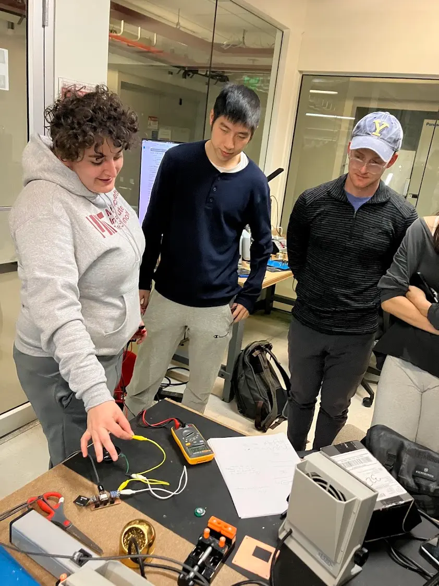

## Group Assignment

This week's theme is output devices. Since my final project involves a speaker, I invited our group to measure the power consumption of a speaker. We characterized the speaker to understand its how power consumption might be influenced. The detailed findings are documented in our [group notes](https://fab.cba.mit.edu/classes/MAS.863/CBA/group_assignments/week9/).


**Ceci explaining multimeter setup**

## Give AI A Voice

In the [previous week](../week-08/index.md), I built a wireless microphone system that streams audio from an ESP32 to my laptop, where OpenAI generates speech responses. However, the generated voice was only playing on my laptop. This week, I wanted to complete the loop by streaming the synthesized voice back to the ESP32, creating a true wireless voice interaction system.

### Playing Sine Wave

I started by testing basic audio output using the Arduino Audio Tools [example code](https://github.com/pschatzmann/arduino-audio-tools/blob/main/examples/examples-stream/streams-generator-i2s/streams-generator-i2s.ino) to play a sine wave through the I2S DAC. This simple test would verify that my speaker hardware and connections were working correctly. The following program generates and plays a simple sine wave tone:

```cpp
#include "AudioTools.h"

#define I2S_BCLK D0
#define I2S_DOUT D1
#define I2S_LRC  D2
#define I2S_DIN  D10

const int frequency = 440;
const int sampleRate = 44100;

AudioInfo info(sampleRate, 2, 16);
SineWaveGenerator<int16_t> sineWave(4000); // sine wave with max amplitude of 4000
GeneratedSoundStream<int16_t> sound(sineWave); // stream generated from sine wave
I2SStream out;
StreamCopy copier(out, sound); // copies sound into i2s

void setup() {
  Serial.begin(115200);

  AudioToolsLogger.begin(Serial, AudioToolsLogLevel::Info);

  Serial.println("Starting I2S...");
  auto config = out.defaultConfig(TX_MODE);
  config.copyFrom(info);
  config.pin_bck = I2S_BCLK;
  config.pin_ws = I2S_LRC;
  config.pin_data = I2S_DIN;
  out.begin(config);

  sineWave.begin(info, frequency);
  Serial.println("Started sine wave playback");
}

void loop() {
  copier.copy();
}
```

When I ran this code, I heard loud clicking sounds instead of a clean tone. I systematically experimented with different sampling rates to identify the source of the artifacts:

| Sample Rate | Result                 |
| ----------- | ---------------------- |
| 44.1 kHz    | Pulsing sound artifact |
| 44 kHz      | Same artifact          |
| 40 kHz      | Reduced artifact       |
| 32 kHz      | No artifact            |
| 22 kHz      | No artifact            |

I made several key observations during testing. Opening the serial port seemed to correlate positively with noise artifacts. Higher sampling frequencies also correlated with more artifacts, though this could be confounded by the fact that higher sampling rates mean higher data transmission rates.

To identify the root cause, I conducted follow-up experiments:

- **Hypothesis 1:** The microphone on the device was causing interference since it shares BCLK and LRC lines with the speaker.
  - **Experiment:** Unplugging the microphone should reduce or remove noise.
  - **Result:** No effect observed.

- **Hypothesis 2:** Serial port communication was causing interference.
  - **Experiment:** Switching from a data-passing USB-C cable to a power-only cable, and removing all serial communication in the code.
  - **Result:** Noise reduced but not eliminated.

**Conclusion:** Over-sampling could cause noise artifacts, and serial communication could exacerbate the issue. For clean audio output, I needed to use lower sampling rates and minimize serial communication during playback.

### Stream Sine Wave from Computer to Device

With local audio playback working, the next step was to stream audio from my computer to the ESP32. I started with the [sample code](https://github.com/pschatzmann/arduino-audio-tools/blob/main/examples/examples-communication/udp/communication-udp-receive/communication-udp-receive.ino) for receiving audio over UDP. On the server side, I wrote Node.js code to generate and stream a sine wave. This setup would help me verify the network streaming pipeline before adding the complexity of OpenAI voice synthesis.

**Client** (other logic omitted for brevity)

```cpp
#include "AudioTools.h"
#include "AudioTools/Communication/UDPStream.h"

// ... pin definitions ...

const char *ssid = "";
const char *password = "";

const int SAMPLE_RATE = 22000;
const int CHANNELS = 1;
const int BITS_PER_SAMPLE = 16;
const int UDP_PORT = 8888;

AudioInfo info(SAMPLE_RATE, CHANNELS, BITS_PER_SAMPLE);
I2SStream i2s;           // I2S output to speaker
UDPStream udp(ssid, password);
StreamCopy copier(i2s, udp, 1024); // copy UDP stream to I2S

void setup() {
  // ... WiFi connection ...

  // Start I2S with custom pinout for speaker output
  auto i2sCfg = i2s.defaultConfig(TX_MODE);
  i2sCfg.copyFrom(info);
  i2sCfg.pin_bck = I2S_BCLK;
  i2sCfg.pin_ws = I2S_LRC;
  i2sCfg.pin_data = I2S_DIN;
  i2sCfg.i2s_format = I2S_STD_FORMAT;
  i2s.begin(i2sCfg);

  // Start UDP receiver
  udp.begin(UDP_PORT);
}

void loop() {
  copier.copy();
}
```

**Server** (other logic omitted for brevity)

```js
const SAMPLE_RATE = 22000;
const PACKET_SIZE = 1024; // bytes per UDP packet
const FREQUENCY = 440; // Hz (A4 note)

function startSineWaveStream() {
  let phase = 0;
  const samplesPerPacket = PACKET_SIZE / 2; // 2 bytes per sample (16-bit)
  const phaseIncrement = (2 * Math.PI * FREQUENCY) / SAMPLE_RATE;

  setInterval(
    () => {
      const result = generateSineWaveBuffer(phase, samplesPerPacket, phaseIncrement);
      phase = result.phase;
      sendAudioPacket(result.buffer);
    },
    (samplesPerPacket / SAMPLE_RATE) * 1000
  );
}

function generateSineWaveBuffer(phase, samplesPerPacket, phaseIncrement) {
  const buffer = Buffer.alloc(PACKET_SIZE);

  for (let i = 0; i < samplesPerPacket; i++) {
    const sample = Math.sin(phase) * 0.3; // 30% amplitude to avoid clipping
    const pcm16Value = Math.round(sample * 32767);
    buffer.writeInt16LE(pcm16Value, i * 2);
    phase += phaseIncrement;
    if (phase >= 2 * Math.PI) {
      phase -= 2 * Math.PI;
    }
  }

  return { buffer, phase };
}
```

When I tested this setup, I noticed clicking sound artifacts again. Since we had already eliminated serial communication as a significant source of noise, networking became the prime suspect. I experimented with different UDP packet sizes to find the sweet spot:

| Packet Size | Result                                                                                   |
| ----------- | ---------------------------------------------------------------------------------------- |
| 128 bytes   | Continuous clicking, almost like a Geiger counter. Might be useful for a future project! |
| 256 bytes   | Continuous clicking, slightly less frequent                                              |
| 512 bytes   | A few clicks every second                                                                |
| 1024 bytes  | No clicks                                                                                |

**Conclusion:** UDP buffer size directly affects noise artifacts. Larger buffer sizes reduce artifacts significantly.

Upon reflection, I realized I only adjusted the UDP buffer size. There are additional parameters I could experiment with in future iterations:

- I2S buffer size (defaults to 6)
- I2S buffer count (defaults to 512)

The default parameters are defined in [AudioToolsConfig.h](https://github.com/pschatzmann/arduino-audio-tools/blob/c8e8eb74495521ed9402655cbc2e2ec3ce26fbe5/src/AudioToolsConfig.h). It's interesting that noise occurs when the UDP packet size is smaller than or equal to the I2S buffer size. This relationship warrants further investigation given more time.

### Transcribing Audio and Streaming Voice from Computer to Device

With the basic UDP streaming working, I moved on to integrating the complete voice interaction loop. I updated the client to handle push-to-talk button functionality. This logic is similar to what I implemented in the previous week for audio input, but now it also handles audio output for playback.

<video src="./media/knock-knock.mp4" controls></video>
**Voice interaction demo**

**Client** (other logic omitted for brevity)

```cpp
I2SStream i2sMic;
I2SStream i2sSpeaker;
UDPStream udpSend(WIFI_SSID, WIFI_PASSWORD);
UDPStream udpReceive(WIFI_SSID, WIFI_PASSWORD);

StreamCopy transmitCopier(throttle, i2sMic);
StreamCopy receiveCopier(i2sSpeaker, udpReceive, 1024);

int debounceCounter = 0;
bool isTransmitting = false;

void loop() {
  bool buttonPressed = (digitalRead(BTN_PTT1) == LOW || digitalRead(BTN_PTT2) == LOW);

  if (buttonPressed) {
    debounceCounter++;
    if (debounceCounter >= DEBOUNCE_THRESHOLD) {
      isTransmitting = true;
    }
  } else {
    debounceCounter--;
    if (debounceCounter <= -DEBOUNCE_THRESHOLD) {
      isTransmitting = false;
    }
  }

  if (isTransmitting) {
    transmitCopier.copy();
  }

  receiveCopier.copy();
}
```

On the server side, I implemented the logic to handle OpenAI's real-time API for transcription and response generation, then stream the synthesized speech back to the ESP32.

**Server** (other logic omitted for brevity):

```js
const STATE = {
  SILENT: "silent",
  SPEAKING: "speaking",
};

let currentState = STATE.SILENT;
let audioBuffer = [];
let lastPacketTime = null;

function detectSilence() {
  if (currentState === STATE.SPEAKING && lastPacketTime) {
    const timeSinceLastPacket = Date.now() - lastPacketTime;
    if (timeSinceLastPacket > SILENCE_TIMEOUT_MS) {
      transitionToSilentAndProcessAudio();
    }
  }
}

function streamAudioChunkToRealtime(audioChunk) {
  const base64Audio = audioChunk.toString("base64");
  const event = {
    type: "input_audio_buffer.append",
    audio: base64Audio,
  };
  realtimeWs.send(JSON.stringify(event));
}

async function commitAudioAndRequestResponse() {
  realtimeWs.send(JSON.stringify({ type: "input_audio_buffer.commit" }));
  realtimeWs.send(JSON.stringify({ type: "response.create", response: { modalities: ["text"] } }));
  realtimeWs.send(JSON.stringify({ type: "input_audio_buffer.clear" }));
}

// Convert TTS to PCM and stream to ESP32
async function synthesizeAndStreamSpeech(text) {
  const response = await fetch("https://api.openai.com/v1/audio/speech", {
    method: "POST",
    headers: {
      Authorization: `Bearer ${process.env.OPENAI_API_KEY}`,
      "Content-Type": "application/json",
    },
    body: JSON.stringify({
      model: "gpt-4o-mini-tts",
      voice: "ash",
      input: text,
      instructions: "Low coarse seasoned veteran from war time, military radio operator voice with no emotion. Speak fast with urgency.",
      response_format: "wav",
    }),
  });

  const wavBuffer = Buffer.from(await response.arrayBuffer());
  const pcmBuffer = await convertWavToPCM16(wavBuffer);
  await streamAudioToUDP(pcmBuffer);
}

// Send audio packets with timing control
async function streamAudioToUDP(pcmBuffer) {
  const totalPackets = Math.ceil(pcmBuffer.length / PACKET_SIZE);

  for (let i = 0; i < totalPackets; i++) {
    const packet = pcmBuffer.slice(i * PACKET_SIZE, (i + 1) * PACKET_SIZE);
    await sendAudioPacketToESP32(packet);

    // Wait to match playback speed
    const delayMs = (PACKET_SIZE / 2 / SAMPLE_RATE) * 1000;
    await sleep(delayMs);
  }
}
```

This completes the full voice interaction loop. The system can now receive spoken input from the ESP32, process it with OpenAI's API, and stream the synthesized voice response back to play through the speaker.

## Sonic Fidget Spinner

I've always been fascinated by [Musical Roads](https://en.wikipedia.org/wiki/Musical_road) that let drivers play music by driving over specially designed rumble strips. There are many demos like [this one](https://www.youtube.com/watch?v=beGiU1EpGKI) on the internet showing how the vibrations create melodies. I wanted to build a miniature version controlled by a rotary encoder, offering a similar tactile experience. This would be something I could fidget with during boring Zoom calls.

### Rotary Encoder

I received feedback that I did too much networking work during Input Device week, so this was an opportunity to add more input device exploration. I picked up a rotary encoder from my lab's spare parts bin and started studying its mechanism by watching a [YouTube tutorial](https://www.youtube.com/watch?v=fgOfSHTYeio).

The rotary encoder works by generating signals as you rotate the shaft. You can determine both the direction and speed of rotation. I implemented a basic test program using the Rotary Encoder library. My version is simplified from the [full example code](https://github.com/mo-thunderz/RotaryEncoder/blob/main/Arduino/ArduinoRotaryEncoder/ArduinoRotaryEncoder.ino):

```cpp
#include "RotaryEncoder.h"

// Define the pins connected to the encoder
#define PIN_ENCODER_A D6
#define PIN_ENCODER_B D7

RotaryEncoder encoder(PIN_ENCODER_A, PIN_ENCODER_B);

void checkPosition() {
  encoder.tick(); // Call tick() to check the state
}

void setup() {
  Serial.begin(115200);
  Serial.println("Rotary Encoder Example");

  // Attach interrupts for encoder pins
  attachInterrupt(digitalPinToInterrupt(PIN_ENCODER_A), checkPosition, CHANGE);
  attachInterrupt(digitalPinToInterrupt(PIN_ENCODER_B), checkPosition, CHANGE);
}

void loop() {
  // Read encoder position
  int newPosition = encoder.getPosition();
  static int lastPosition = 0;

  if (newPosition != lastPosition) {
    Serial.print("Encoder Position: ");
    Serial.println(newPosition);
    lastPosition = newPosition;
  }

  delay(10); // Debounce or prevent overwhelming serial
}
```

This simple program confirmed that the encoder was working correctly and gave me real-time position feedback through the serial monitor.

### Trigger Mechanism

With the encoder working, I needed to decide how to map rotation to musical notes. I considered two approaches:

| Approach                                    | Pros                                      | Cons                                  |
| ------------------------------------------- | ----------------------------------------- | ------------------------------------- |
| Note per click                              | Simple implementation, precise triggering | No control over note duration         |
| Consecutive clicks to start and stop a note | More control over note duration           | More complex, especially timing logic |

I chose the second approach because it would allow for more expressive playing. With debouncing logic, I could track when a group of consecutive clicks starts and stops:

```cpp
// ... setup and encoder initialization ...

int counter = 0;
unsigned long lastChangeTime = 0;
bool isChanging = false;
bool groupStarted = false;

void loop() {
  int newPosition = encoder.getPosition();
  static int lastPosition = 0;

  // Detect position change
  if (newPosition != lastPosition) {
    lastPosition = newPosition;
    lastChangeTime = millis();
    isChanging = true;
    if (!groupStarted) {
      Serial.println("Position change group started");
      groupStarted = true;
    }
  }

  // Detect end of group (100ms timeout)
  if (isChanging && (millis() - lastChangeTime > 100)) {
    counter++;
    Serial.print("Position change group ended, Counter: ");
    Serial.println(counter);
    isChanging = false;
    groupStarted = false;
  }
}
```

The 100ms timeout worked well for detecting when the user paused between rotation gestures. Each continuous rotation motion was now being counted as a single unit. Increasing the timeout would cause a lingering effect and makes the device feel lagging.

### Audio Synthesis

With the rotation detection working, it was time to add sound. I started with the simple approach of playing the same tone for each note, merging the audio playback code from the walkie-talkie with the encoder logic:

```cpp
#include "AudioTools.h"

// ... I2S pin definitions ...

const int sampleRate = 22000;
AudioInfo info(sampleRate, 1, 16);
SineWaveGenerator<int16_t> sineWave(16000);
GeneratedSoundStream<int16_t> sound(sineWave);
I2SStream out;
StreamCopy copier(out, sound);
bool playing = false;

void setup() {
  // ... encoder setup ...

  // Setup I2S for audio output
  auto config = out.defaultConfig(TX_MODE);
  config.copyFrom(info);
  config.pin_bck = I2S_BCLK;
  config.pin_ws = I2S_LRC;
  config.pin_data = I2S_DIN;
  out.begin(config);
  sineWave.begin(info, 440);  // 440 Hz (A4 note)
}

void loop() {
  // ... encoder position detection ...

  if (newPosition != lastPosition) {
    // ... debouncing logic ...
    if (!groupStarted) {
      playing = true;  // Start playing when group starts
      groupStarted = true;
    }
  }

  if (isChanging && (millis() - lastChangeTime > 100)) {
    playing = false;  // Stop playing when group ends
    // ... rest of debouncing ...
  }

  // Only copy audio when playing
  if (playing) {
    copier.copy();
  }
}
```

This worked well as a proof of concept. The speaker would play a tone when I started rotating and stop when I paused. Now it was time to make it musical.

### Soundtrack

To create an actual melody, I mapped out "Ode to Joy" to musical notes and their frequencies. I chose this piece because it's simple, recognizable, and works well with discrete note triggers. I added a pointer to track the current position in the melody:

```cpp
// Note-to-frequency mapping
float getFreq(char note) {
  switch (note) {
    case 'g': return 392.00 / 2;
    case 'C': return 261.63;
    case 'D': return 293.66;
    case 'E': return 329.63;
    case 'F': return 349.23;
    case 'G': return 392.00;
    default: return 0;
  }
}

// Ode to Joy melody
const char song[62] = {
  'E','E','F','G','G','F','E','D','C','C','D','E','E','D','D',
  'E','E','F','G','G','F','E','D','C','C','D','E','D','C','C',
  'D','D','E','C','D','E','F','E','C','D','E','F','E','D','C','D','g',
  'E','E','F','G','G','F','E','D','C','C','D','E','D','C','C'
};

int currentNote = 0;

void loop() {
  // ... encoder position detection ...

  if (newPosition != lastPosition) {
    // ... debouncing logic ...
    if (!groupStarted) {
      playing = true;
      // Play next note in sequence
      char note = song[currentNote % 63];
      float freq = getFreq(note);
      sineWave.setFrequency(freq);
      currentNote++;
      groupStarted = true;
    }
  }

  // ... rest of loop ...
}
```

Now each rotation gesture would play the next note in "Ode to Joy", creating a tactile musical experience. The device was starting to feel like a real instrument.

### A Not-So-Mary B-side

As I tested the device, an idea struck me: what if rotating backwards would play a different melody, like the B-side of a vinyl record? I decided to add "Mary Had a Little Lamb" as the B-side melody. It's an equally joyful tune that would complement "Ode to Joy".

However, implementing bidirectional melodies revealed a problem. The encoder would occasionally bounce with an unexpected double flip: it changes direction for one click, and immediately changes back for the next click. I had to defer the direction detection after debouncing so as to ignore these spurious direction changes.

```cpp
// Two melodies for bidirectional playback
const char odeToJoy[62] = {
  'E','E','F','G','G','F','E','D','C','C','D','E','E','D','D',
  'E','E','F','G','G','F','E','D','C','C','D','E','D','C','C',
  'D','D','E','C','D','E','F','E','C','D','E','F','E','D','C','D','g',
  'E','E','F','G','G','F','E','D','C','C','D','E','D','C','C'
};

const char littleLamb[26] = {
  'E','D','C','D','E','E','E','D','D','D','E','G','G','E','D','C','D','E','E','E','C','D','D','E','D','C'
};

int currentNote = 0;
int lastDirection = 0;  // Track rotation direction: 1 = forward, -1 = backward

void loop() {
  static int lastPosition = 0;
  int newPosition = encoder.getPosition();

  if (newPosition != lastPosition) {
    // Determine rotation direction
    int dir = (newPosition > lastPosition) ? 1 : -1;
    lastPosition = newPosition;
    lastChangeTime = millis();

    // Detect direction change (only when not currently changing to avoid bounce)
    if (!isChanging && dir != lastDirection && lastDirection != 0) {
      currentNote = 0;  // Reset counter on direction change
      lastDirection = dir;
      Serial.println("Direction changed, resetting counter");
    }

    // Set initial direction
    if (lastDirection == 0) {
      lastDirection = dir;
    }

    // Play appropriate melody based on direction
    if (!isChanging) {
      char note;
      if (lastDirection == 1) {
        note = odeToJoy[currentNote % 62];
      } else if (lastDirection == -1) {
        note = littleLamb[currentNote % 26];
      }

      float freq = getFreq(note);
      sineWave.setFrequency(freq);

      isChanging = true;
      playing = true;
    }
  }

  // Stop playing after debounce timeout
  if (isChanging && (millis() - lastChangeTime > DEBOUNCE_TIME)) {
    isChanging = false;
    playing = false;
    currentNote++;  // Advance to next note
  }

  if (playing) {
    copier.copy();
  }
}
```

I was able to play both melodies. There were still occasional misfires of direction change, but it was good enough for a one-off performance.

<video src="./media/mary-had-a-little-lamb.mp4" controls></video>
**Playing Mary Had A Little Lamb on the B-side**

If I had more time, I would focus on single soundtrack but use the change of rotation direction to delimit tones. This would allow user to quickly play two notes without waiting for the debounce timeout.

## After Thought

My development board for the XIAO ESP32 was the unsung hero of this week. The breakout board I created in earlier weeks allowed me to explore both the wireless voice interaction system and the sonic fidget spinner without fabricating new PCBs. I was especially glad that I had mapped out all the pins to female headers during the initial design. This was a perfect example of upfront investment in modular design paying dividends later.

## Appendix

- [Walkie Talkie Code](./code/walkie-talkie.zip)
- [Sonic Fidget Spinner Code](./code/sonic-fidget.zip)
