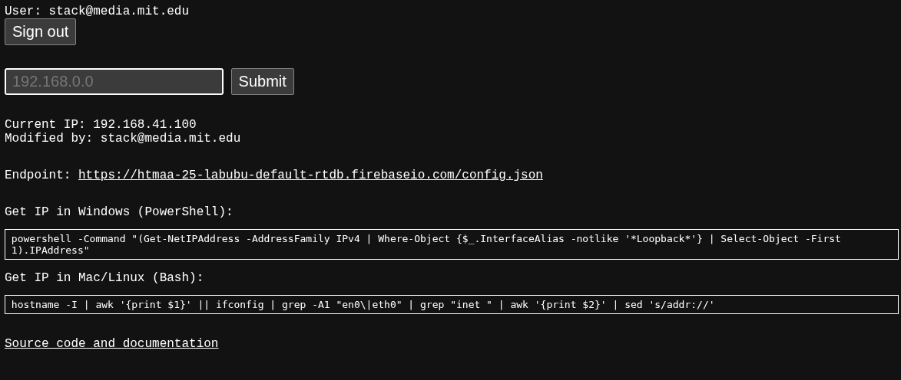
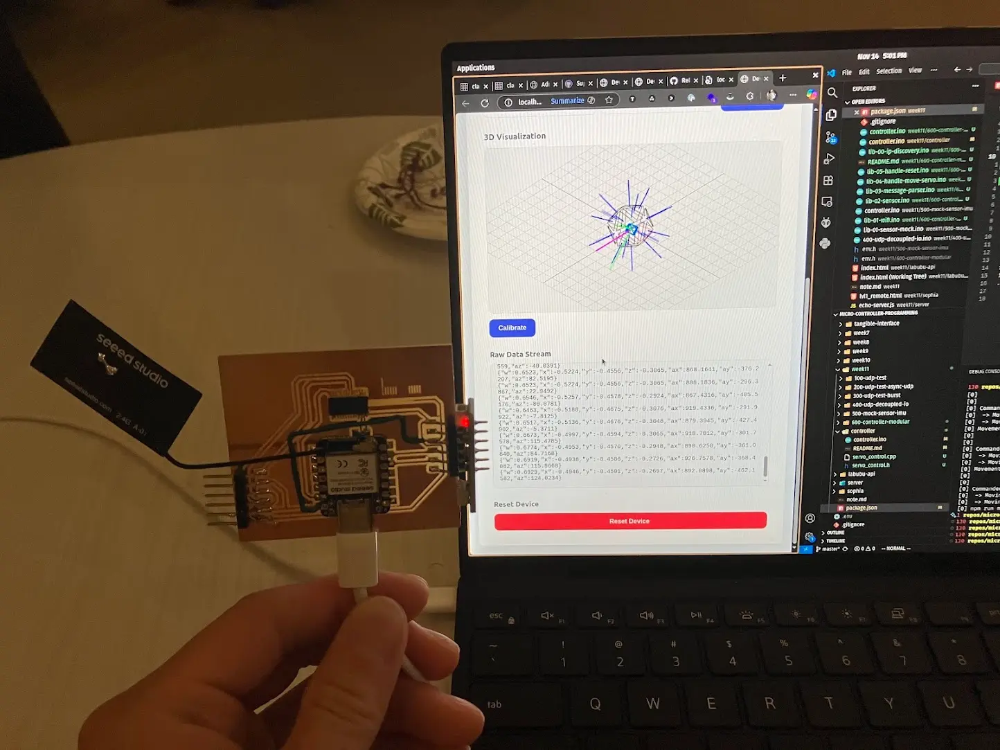
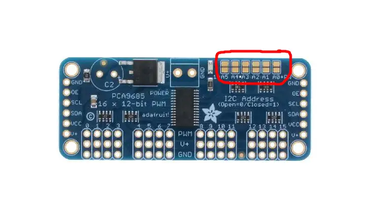

This is a group project week. This document captures the tasks I was involved in. See the group project page for the full context.

## Labubu

Miranda pitched the idea of building an icosahedron robot that can move around based on IMU data. Each face would be a Labubu to punches out and propels the icosahedron in the desired direction. I'm too old to understand the cultural significance of Labubu, but the idea sounds cool. Towards the end of the project, we have replaced the Labubu with our professor's Neil's face. That makes the project much more relatable but also much higher stakes.

## Project organization

The group devided themselves into four sub-teams: MechE, Electronics, Software, Creative. I focused on Software.

- During the initial project planning, we discussed how to organize the codebase.
- People originally proposed formal PR process and branch-based workflow
- I want to emphasize on people over technology and advised that sub-team leaders should be responsible for:
  - Anticipate dependency and conflicts with other teams. Communicate early for those
  - Adapt their version control strategy based on their team members' skills and preferences

> Don't communicate by sharing memory; share memory by communicating.
> — Go Language Design Principle

- I proposed a controversial idea of organizing code by people and duplicate code to surface full history at all times.

Consider this folder structure

```txt
- PersonA
  - sensing
  - networking
- PersonB
  - actuation
  - webUI
...
```

Fundamentally, this is a "copy-paste" version control system most professional developers would cringe at.
I advocated for this style because we need to quickly branch and fork each other's ideas, 90% of the code in the beginning will be self-contained one-off experiments that won't evole later. Exposing everyone's work in the same branch at the same time means:

- We can easily re-mix each other's code
- People using AI can reference multiple components from different people and use AI to help with integration
- People's work becomes a natural source of documentation on what they have done. History not buried in git logs.
- No merge conflicts because everyone works in their own folder

As a caveat, the person sharing their code to others is responsible for discussing what breaking changes are incoming; the person consuming other's code is responsible for stating assumptions and expectations.

This organization worked well in the beginning, but towards the second half of the project, we came to the conclusion that we need a point of integration. So our final folder structure is:

```txt
- integration
  - controller
  - web
- PersonA
  ...
- PersonB
  ...
```

I fully understand this is not how git workflow is suppose to be. But for a mob-like student projects, this organization did its magic in helping us ssee each other's code without the branching overhead. I would still advocate for the same strategy for future projects.

## Division of labor

On the first night, Matti and I discussed task division. We want to:

- Create independent modules that can be worked on in parallel
- Reduce the dependencies between modules by defining clear interfaces

This is what we came up with:

- Sensing (C++):
  - Understand the format of IMU data from our sensor.
  - Prepare it on the xiao before sending to network.
- Networking (C++ & Python):
  - wifi connection management
  - tracking IP address of the remote control (PC)
  - sending IMU data from xiao to remote control over UDP
  - receiving servo motor number from remote control to xiao over UDP
- Planning (JavaScript)
  - Use math to convert move front/back/left/right into the correct servo motor number that should move
- Actuation (C++)
  - Based on the received servo motor number, drive the motor to make the movement
- UI (JavaScript/HTML/CSS):
  - a web UI
  - Visualize device orientation
  - Show buttons to move front/back/left/right and provides control butt
  - Show buttons to manually move individual servo motors

At the end of the project, a similar structure was reflected in our code, redminding me of Conway's Law. As a reflection, we can use Conway's Law to our advantage by asking what kind of teams and collaborations do we desire, and thus we would modularize our project to maximize the organizational structure we want.

## Software Architecture

We also agreed on the high level architecture: shift as much computation to the PC as possible because it's much easier to iterate and debug on the PC than on the xiao.

- Running server on PC instead of xiao
  - Easier to debug
  - Keep laptop connected to school wifi so we can use Gen AI to accelerate coding
  - Drawback acknowledged: higher latency because going through school wifi, but we should be able to

This concept was reflected in every subsequent decision we made. Xiao's logic is dead simple

- Xiao sends low level IMU data to PC: quaternion WXYZ and accelerometer XYZ
- Xiao takes a servo motor number and fully extend, then retracts it based on predefined PWM sequence

The PC takes heavy lifting in interpreting the IMU data, solving the gemoetric puzzle, calibrating, and solving the correct servos to move based on user commands.

## Networking Proof of Concept

We started with UDP over Wifi because I had a similar system already working from the Input/Output week for streaming voice. I implemented a few diagnostic programs to test UDP

First, we want to understand the performance characteristics of Xiao ESP32 UDP over Wifi.

An simple node.js server echos that any UDP message back to the sender

```js
const dgram = require("dgram");
const os = require("os");

const server = dgram.createSocket("udp4");

server.on("message", (msg, rinfo) => {
  console.log(`Received ${msg.length} bytes from ${rinfo.address}:${rinfo.port}`);
  try {
    const data = JSON.parse(msg.toString());
    console.log(`currentTime: ${data.currentTime}, latency: ${data.latency}`);
  } catch (e) {
    console.log(`Invalid JSON: ${msg.toString()}`);
  }
  // Send back the same message
  server.send(msg, 0, msg.length, rinfo.port, rinfo.address, (err) => {
    if (err) console.error("Error sending response:", err);
  });
});

server.on("listening", () => {
  const address = server.address();
  const interfaces = os.networkInterfaces();
  let localIP = "127.0.0.1"; // fallback
  for (let iface in interfaces) {
    for (let addr of interfaces[iface]) {
      if (addr.family === "IPv4" && !addr.internal) {
        localIP = addr.address;
        break;
      }
    }
    if (localIP !== "127.0.0.1") break;
  }
  console.log(`UDP server listening on ${localIP}:${address.port}`);
});

server.bind(41234); // Bind to port 41234
```

On the ESP32 side, I sent UDP packets in bursts and measure latency during peak load.

```cpp
#include <WiFi.h>
#include <AsyncUDP.h>

const char* WIFI_SSID = "MLDEV";
const char* WIFI_PASSWORD = "";

AsyncUDP udp;
IPAddress targetIP(192, 168, 41, 229);
const unsigned int targetPort = 41234;
int packetNum = 0;
unsigned long lastLatency = 0;
int burstCount = 0;
const int BURST_SIZE = 1;

void setup() {
  Serial.begin(115200);

  WiFi.mode(WIFI_STA);
  WiFi.begin(WIFI_SSID, WIFI_PASSWORD);
  unsigned long startTime = millis();
  while (WiFi.status() != WL_CONNECTED && millis() - startTime < 300000) {
    delay(500);
    Serial.print(".");
  }
  if (WiFi.status() != WL_CONNECTED) {
    Serial.println("WiFi Failed");
  }
  Serial.println("Connected to WiFi");
  Serial.print("IP Address: ");
  Serial.println(WiFi.localIP());

  if (udp.connect(targetIP, targetPort)) {
    Serial.println("UDP connected");
    udp.onPacket([](AsyncUDPPacket packet) {
      String msg = String((char*)packet.data(), packet.length());
      int colonPos = msg.indexOf("currentTime\":");
      if (colonPos != -1) {
        colonPos += 13;
        int commaPos = msg.indexOf(",", colonPos);
        if (commaPos != -1) {
          String timeStr = msg.substring(colonPos, commaPos);
          unsigned long sentTime = strtoul(timeStr.c_str(), NULL, 10);
          lastLatency = millis() - sentTime;
        }
      }
      packet.printf("Got %u bytes of data", packet.length());
    });
  }
}

void loop() {
  if (burstCount < BURST_SIZE) {
    packetNum++;
    burstCount++;
    String json = "{\"currentTime\":" + String(millis()) + ",\"packetNum\":" + String(packetNum) + ",\"latency\":" + String(lastLatency) + "}";
    udp.print(json);
    Serial.println("Sent: " + json);
  } else {
    Serial.println("Sleeping for 1 second...");
    delay(10);
    burstCount = 0;
  }
}
```

- Xiao UDP can send over 1k hz to a PC
- But it will crash, presumable due to buffer overflow, when PC sends it too much data
- characteristics
  - typical latency: 30-50ms
  - worst latency: 100-200ms
  - best latency: 4-6ms
- xiao needs to sleep 1ms between send. Otherwise, it will be blocked from reading packet

I realized the problem that each person's laptop has a different IP address. So I implemented a simple IP discovery protocol:

- People can announce their IP address on a server.
- ESP32 will poll the server to get the latest IP address of the laptop.


**IP Discovery Tool**

This tool was eventually taken offline due to switching from Wifi to Bluetooth.

## Interface first

To implement the web sever without existing microcontroller code, I encouraged the team to define the networking contract first:

The notified payloads still contain Quaternion (w, x, y, z) and Accelerometer (ax, ay, az) readings in newline-delimited JSON:

### esp32 -> laptop

```json
{
  "w": 0.875,
  "x": 0.0243,
  "y": 0.0393,
  "z": -0.482,
  "ax": 17.5781,
  "ay": 3.1738,
  "az": 1025.3906
}
```

Each notification is parsed by `bluetooth.js` and forwarded to the UI; `threejs-vis.js` consumes the quaternion stream to animate the model.

### laptop -> esp32

General format is JSON with "cmd" and "args" fields. For simplicity, "args" is a string. It is optional.

Move servo command

```json
{ "cmd": "move_servo", "args": "5,12" }
```

Reset device command

```json
{ "cmd": "reset" }
```

We disucssed custom bit packing to reduce bandwidth consumption but I advocated for JSON for simplicity and agreed that we can optimize later if needed.

The JSON protocol was eventually superseded by a custom op-code based binary protocol in order to conserve BLE bandwidth.

In retrospect, I would still advocate for JSON protocol with more concise names. The bit packing optimization has marginal gain and made serialization/deserialization much more error prone.

## Server implementation

- Yufeng ran the demo code for Adafruit IMU board and started developing sensor data processing.
- Thanks for the data format contract, I was able to in parallel mock the IMU data in a separate Xiao, communicate with a node.js server over UDP

This is the module that mocks the sensor data.

```cpp
// Mock IMU sensor data
float gx = 0.0, gy = 0.0, gz = 0.0;  // Gyroscope in degrees
float mx = 0.0, my = 0.0, mz = 0.0;  // Compass/Magnetometer in degrees

void updateMockSensorData() {
  // Update mock IMU data with random changes
  gx += random(-10, 11) * 0.1;  // Change by -1.0 to +1.0 degrees
  gy += random(-10, 11) * 0.1;
  gz += random(-10, 11) * 0.1;
  mx += random(-10, 11) * 0.1;
  my += random(-10, 11) * 0.1;
  mz += random(-10, 11) * 0.1;

  // Keep values in reasonable ranges
  gx = constrain(gx, -180, 180);
  gy = constrain(gy, -180, 180);
  gz = constrain(gz, -180, 180);
  mx = constrain(mx, 0, 360);
  my = constrain(my, 0, 360);
  mz = constrain(mz, 0, 360);
}

String getSensorDataJSON() {
  // Create JSON array format: [gx,gy,gz,mx,my,mz]
  return "[" + String(gx, 2) + "," + String(gy, 2) + "," + String(gz, 2) + ","
             + String(mx, 2) + "," + String(my, 2) + "," + String(mz, 2) + "]";
}
```

## Determine high level logic

Realizing that multiple people are adding pieces to the Xiao code, I started a refactoring effort to modularize the code so that the high level logic is easier to understand. This is the psuedo code I came up with:

```cpp
setup() {
  wifi = connect_wifi();
  laptop_ip = discover_laptop(wifi);

  on_message_received = (message) => {
    handle_reset(message);
    handle_servo_command(message);
  };

  handle_laptop_udp_message(wifi, laptop_ip, on_message_received);
}

loop() {
  sendor_data = read_imu_sensor();
  send_udp_message(wifi, laptop_ip, sendor_data);
}
```

I discussed the high level design with the group to make sure everyone shares the understanding. In theory the design allows future I/O to plug into the main program without needing to change other modules' code.

## Sensor Integration Test (during Friday Studcom Social Tea hour)

The EE team provided the electronics. We uploaded our sketch and started testing.


**Dumping IMU data to the web UI over UDP**


**Testing against inteference in the crowded StudCom Tea Party**

- In Media Lab tea party with about 40 people, the device can experience 3 seconds+ latency
- The WXYZ quaternion takes 12+ seconds to stablize

Bad news: UDP + Wifi clearly won't work.
Good news: we discovered early enough. There is still time to pivot. Also, our communication isn't that coupled to sensor logic.

## The Big Migration

After the testing I tool Miranda's Bluetooth 2-way communication code, and used Claude 4.5 Sonnet to migrate the Wifi+UDP code with Bluetooth

```txt
Plan step by step, we are going to swap out the wifi + UDP + WebSocket based communication between ESP32 and Node.js with a simpler Bluetooth BLE based communication between ESP32 and the Web page, using Web Bluetooth API.

The change will include at least the following:
1. Remove UDP and Wifi on both ESP32 and Node.js
2. Add BLE on both ESP32 and the web page
3. Remove IP discovery code
4. Treat the server folder as static. use simple npx command to serve the file and not worry about maintaining a node.js server

We already have working reference implemention in #file:bluetooth. You can use that code as skeleton.

Keep the ESP32 organized by files, similar to existing structure lib-xx-name.ino; delete files that are no longer in use.

Make sure to carefully map out the migration and execute it with a checklist.
```

Miraculously, the migration worked on the first try. AI is such a game changer.

## Integrating servo

Saetbeyol implemented the servo motor control. When I integrated her work, the servo could not respond to commands from the PC. We suspect I/O blocking.

After investigation, we realized that the communication loop is blocking.

```cpp
  if (isBLEConnected()) {
    String sensorData = getSensorJSON();
    sendBLEMessage(sensorData); // <-- need to disable this line in order to send any command to the ESP32, why?
  }
```

Solution, instead of blocking the main loop, we use a timer to send sensor data every 20ms.

The `20ms` interval is empirically determined. I don't feel happy about the solution but we proceeded and decided to revisit.

```cpp
static unsigned long lastSendTime = 0;
const unsigned long SEND_INTERVAL_MS = 20;

void setupSensorTransmission() {
  lastSendTime = 0;
  Serial.println("Sensor transmission initialized");
}

void sendSensorDataIfReady() {
  if (!isBLEConnected()) {
    return;
  }

  unsigned long currentTime = millis();

  if (currentTime - lastSendTime >= SEND_INTERVAL_MS) {
    String sensorData = getSensorJSON();
    sendBLEMessage(sensorData);
    lastSendTime = currentTime;
  }
}

```

With this fix, we got the first full integration where sensors and servos are both working. Here is the celebratory dance:

<video src="./media/servo-01.mp4" controls></video>
**Servos dancing while sensors streaming IMU data over BLE**

## Debugging MUX issue

We tested driving multiple servos through the MUX PWM PCA9685 board. The code behaved erratically. Later, we would find out that

- The MUX board was very sensitive. Touching with hand could trigger weird behavior.
- Our code didn't fully implement the MUX behavior.

Matti directed us to run the adafruit official MUX PWM PCA9685 library code.
We confirmed that the board wiring is correct, all servo motors are functional

We solved the issue by using Adadruit official library example code as starting point and not worrying about the board.

Matti also found out how to serial connect two MUX board by soldering the address pin to set one board at 0x41 instead of 0x40.


**Pads for changing the address of PCA9685 MUX Board**

The base address is 0x40. The EE team would later solder A3 (0x08) for 0x48 and A5 (0x20) for 0x60. Had we known sooner, we could have soldered the same address as they would do.

## Stress testing the BLE communication

We found out that rapidly sending BLE messages would the connection to drop.
Matti suggested we use different tx characteristic for namespaced communication, saving bandwidth from command names

## Systematic testing of BLE in Web Bluetooth API

Sending characters at high frequency triggered error:

```js
sendInterval = setInterval(async () => {
  try {
    const encoder = new TextEncoder();
    const data = encoder.encode(message);
    await charTx.writeValue(data);
    log(`TX: ${message}`);
  } catch (error) {
    log(`SEND ERROR: ${error.message}`);
    stopSending();
  }
}, interval);
```

Error code from the Web Bluetooth API:

```txt
SEND ERROR: GATT operation already in progress.
```

This implies that flow control is needed. On the browser side, we can throttle or buffer the messages.

Reasoning:

- Throttling could help but throughput is environment dependent. We will end up being very conservative and losing performance.
- Buffering makes sense. We just need to make sure there is only one transmission at a time.

Solving flow control with a naive queue-based scheduler. Using the RxJS mergeMap operator, I could easily toggle between single-thread mode and unrestricted concurrency mode.

```js
const concurrency = useScheduler ? 1 : undefined;

const send$ = interval(intervalMs).pipe(
  takeUntil(stopBrowserSend$),
  tap(() => browserQueueSize++),
  mergeMap(async () => {
    const encoder = new TextEncoder();
    const data = encoder.encode(message);
    await charTx.writeValue(data);

    browserQueueSize--;
    messageSent$.next();
    log(`[Test 1] TX: ${message}`);
  }, concurrency)
);
```

Based on this idea, I implemented a comprehensive diagnostic tool to profile the BLE performance.

## Characterize the performance:

The tool allows user to measure latency, throughput for varying message sizes.

<video src="./media/ble-test.mp4" controls></video>
**BLE benchmarking in action**

### Best case, side by side same room

- Bandwdith:
  - Browser to ESP32: 14 messages/sec
  - ESP32 to Browser: 100 messages/sec
- Latency: 92 ms average, min: 84 ms, max: 140 ms
- Removing antenna did not reduce performance at close range, but as I walk away, performance drops quickly. Connection lost at 5 meters.

### At distance of 30 meters, through one glass wall

Unable to establish new connection at distance, but can tether previous connection to 30 meters

- Bandwidth:
  - Browser to ESP32: 8 messages/sec
  - ESP32 to Browser: 50 messages/sec
- Latency: 250 ms, min 89 ms, max 540 ms

### Realistic usage: inside metal icosahedron structure, at 10 meters distance

Browser -> ESP32: 14 messages per second
ESP32 -> Browser: 100 messages per second
Latency: 230 ms, min 157 ms, max 332 ms

## Integrate scheduler

- The diagnostic tool used RxJS. For production, I want to avoid adding more libraries. I implemented a stand alone scheduler that uses a queue to ensure single threaded execution of tasks
- I want the scheduler to be hidden behind the bluetooth module so the caller of the bluetooth module does not have to worry about scheduler and multiple callers of the bluetooth will be scheduled in a first in first out manner.

Core implementation:

```js
  /**
   * Add a task to the queue and process it
   * @param {Function} taskFn - Async function to execute
   * @returns {Promise} - Resolves when task completes
   */
  async enqueue(taskFn) {
    return new Promise((resolve, reject) => {
      this.queue.push({ taskFn, resolve, reject });
      this.processQueue(); // After each task, check for more tasks
    });
  }

  /**
   * Process the queue sequentially
   */
  async processQueue() {
    // If already processing, return
    if (this.isProcessing) {
      return;
    }

    // If queue is empty, return
    if (this.queue.length === 0) {
      return;
    }

    this.isProcessing = true;

    while (this.queue.length > 0) {
      const { taskFn, resolve, reject } = this.queue.shift();

      try {
        const result = await taskFn();
        resolve(result);
      } catch (error) {
        console.error("Task failed in scheduler:", error);
        reject(error); // The caller can ignore the rejection if they want.
      }
    }

    this.isProcessing = false;
  }
```

With the scheduler in place, I was able to dispatch the command at the high speed without causing BLE transmission errors.

## Reflection

> The bearing of a child takes nine months, no matter how many women are assigned.
> — Fred Brooks, _The Mythical Man-Month_

It's tempting to add more process and throw more people at the problems. In this project, I found it most effective when two-people micro-teams pair program to solve on problem. I saw it working very well between Matti and Miranda, and Saetbeyol and me. This means it is even more important to decompose the problem into smaller chunks that can be solved by small teams in parallel.

This project also challenged my conventional wisdom about formal software development. Version control, testing, code review, CI/CD, TypeScript, ES6 modules, linting, formatting, design patterns were all thrown out the window, maybe for the better. I'm always fascinated by emerging practices under extreme constraints. In this project, I'm convinced that less is more when the timeline is short and the skill levels are diverse.

## Appendix

- [IP Discovery code](./code/ip-discovery.zip)
- [Bluetooth Benchmark tool](./code/bluetooth-benchmark.zip)
- [BLE Transmission Scheduler](./code/scheduler.js)
