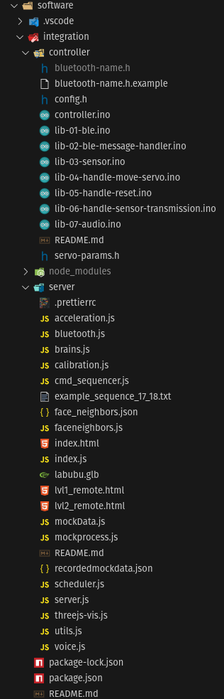

This is a group project week. This document captures the tasks I was involved in. See the [group project page](https://fab.cba.mit.edu/classes/MAS.863/CBA/group_assignments/week11/) for the full context.

## Labubu

[Miranda](https://fab.cba.mit.edu/classes/863.25/people/MirandaLi/) pitched the idea of building an icosahedron robot that can move based on IMU data. Each face would host a [Labubu](https://en.wikipedia.org/wiki/Labubu) that punches out to propel the icosahedron in the desired direction. I'm too old to understand the cultural significance of Labubu, but the idea sounds cool. Towards the end of the project, we replaced Labubu with our professor [Neil](https://ng.cba.mit.edu/)'s face. This made the project much more relatable but also raised the stakes considerably.

## Project Organization

The group divided into four sub-teams: MechE, Electronics, Software, and Creative. I focused on Software.

During the initial project planning, we discussed how to organize the codebase. People originally proposed a formal PR process and branch-based workflow. I wanted to emphasize people over technology and advised that sub-team leaders should be responsible for anticipating dependencies and conflicts with other teams. Communication should happen early. Team leaders should adapt their version control strategy based on their team members' skills and preferences.

> Don't communicate by sharing memory; share memory by communicating.
>
> — Go Language Design Principle

I proposed a controversial idea: organize code by people and duplicate code to surface full history at all times. Consider this folder structure:

```txt
- PersonA
  - sensing
  - networking
- PersonB
  - actuation
  - webUI
...
```

Fundamentally, this is a copy-paste version control system that most professional developers would cringe at. I advocated for this style because we needed to quickly branch and fork each other's ideas. I expected that 90% of the code in the beginning would be self-contained one-off experiments that wouldn't evolve later. Exposing everyone's work in the same branch at the same time provides several benefits:

- Easy remixing of each other's code
- People using AI can reference multiple components from different people and get help with integration
- People's work becomes a natural source of documentation. History is not buried in git logs.
- No merge conflicts because everyone works in their own folder

As a caveat, the person sharing code is responsible for discussing incoming breaking changes. The person consuming code is responsible for stating assumptions and expectations.

This organization worked well initially. During the second half of the project, we concluded that we needed a point of integration. Our final folder structure became:

```txt
- integration
  - controller
  - web
- PersonA
  ...
- PersonB
  ...
```

I fully understand this is not how git workflows are supposed to work. But for mob-like student projects, this organization helped us see each other's code without branching overhead. I would advocate for the same strategy in future projects.

## Division of Labor

On the first night, [Matti](https://fab.cba.mit.edu/classes/863.25/people/MattiGruener/) and I discussed task division. We wanted to create independent modules that could be worked on in parallel and reduce dependencies between modules by defining clear interfaces. This is what we came up with:

**Sensing (C++)**

- Understand the format of IMU data from our sensor
- Prepare data on the Xiao before sending to network

**Networking (C++)**

- WiFi connection management
- Track IP address of the remote control (PC)
- Send IMU data from Xiao to remote control over UDP
- Receive servo motor number from remote control to Xiao over UDP

**Planning (JavaScript)**

- Use math to convert move front/back/left/right into the correct servo motor number

**Actuation (C++)**

- Drive the motor based on the received servo motor number

**UI (JavaScript/HTML/CSS)**

- Create a web UI
- Visualize device orientation
- Show buttons to move front/back/left/right
- Show buttons to manually move individual servo motors

At the end of the project, a similar structure was reflected in our code. This reminded me of Conway's Law. We can use Conway's Law to our advantage by asking what kind of teams and collaborations we desire, then modularize our project to maximize that organizational structure.


**Integration Folder Structure**

## Software Architecture

We agreed on a high level architecture: shift as much computation to the PC as possible. It's much easier to iterate and debug on the PC than on the Xiao. Running the server on PC offered several advantages:

- Easier to debug
- Avoid using ESP32 as Wifi access point so laptop can connect to the internet and use generative AI to accelerate coding
- Acknowledged drawback: higher latency because of going through school WiFi

This concept was reflected in every subsequent decision. The Xiao's logic is simple:

- Xiao sends low level IMU data to PC: quaternion WXYZ and accelerometer XYZ
- Xiao takes a servo motor number and fully extends it, then retracts it based on predefined PWM sequence

The PC does the heavy lifting: interpreting IMU data, solving the geometric puzzle, calibrating, and determining which servos to move based on user commands.

## Networking Proof of Concept

We started with UDP over WiFi because I already had a similar system working from [Input](../week-08/index.md)/[Output](../week-09/index.md) week for streaming voice. I implemented a few diagnostic programs to test UDP performance.

First, I wanted to understand the performance characteristics of Xiao ESP32 UDP over WiFi. I wrote a simple Node.js server that echoes any UDP message back to the sender:

```js
const dgram = require("dgram");
const os = require("os");

const server = dgram.createSocket("udp4");

server.on("message", (msg, rinfo) => {
  console.log(`Received ${msg.length} bytes from ${rinfo.address}:${rinfo.port}`);
  try {
    const data = JSON.parse(msg.toString());
    console.log(`currentTime: ${data.currentTime}, latency: ${data.latency}`);
  } catch (e) {
    console.log(`Invalid JSON: ${msg.toString()}`);
  }
  // Send back the same message
  server.send(msg, 0, msg.length, rinfo.port, rinfo.address, (err) => {
    if (err) console.error("Error sending response:", err);
  });
});

server.on("listening", () => {
  const address = server.address();
  const interfaces = os.networkInterfaces();
  let localIP = "127.0.0.1"; // fallback
  for (let iface in interfaces) {
    for (let addr of interfaces[iface]) {
      if (addr.family === "IPv4" && !addr.internal) {
        localIP = addr.address;
        break;
      }
    }
    if (localIP !== "127.0.0.1") break;
  }
  console.log(`UDP server listening on ${localIP}:${address.port}`);
});

server.bind(41234); // Bind to port 41234
```

On the ESP32 side, I sent UDP packets in bursts and measured latency during peak load:

```cpp
#include <WiFi.h>
#include <AsyncUDP.h>

const char* WIFI_SSID = "MLDEV";
const char* WIFI_PASSWORD = "";

AsyncUDP udp;
IPAddress targetIP(192, 168, 41, 229);
const unsigned int targetPort = 41234;
int packetNum = 0;
unsigned long lastLatency = 0;
int burstCount = 0;
const int BURST_SIZE = 1;

void setup() {
  Serial.begin(115200);

  WiFi.mode(WIFI_STA);
  WiFi.begin(WIFI_SSID, WIFI_PASSWORD);
  unsigned long startTime = millis();
  while (WiFi.status() != WL_CONNECTED && millis() - startTime < 300000) {
    delay(500);
    Serial.print(".");
  }
  if (WiFi.status() != WL_CONNECTED) {
    Serial.println("WiFi Failed");
  }
  Serial.println("Connected to WiFi");
  Serial.print("IP Address: ");
  Serial.println(WiFi.localIP());

  if (udp.connect(targetIP, targetPort)) {
    Serial.println("UDP connected");
    udp.onPacket([](AsyncUDPPacket packet) {
      String msg = String((char*)packet.data(), packet.length());
      int colonPos = msg.indexOf("currentTime\":");
      if (colonPos != -1) {
        colonPos += 13;
        int commaPos = msg.indexOf(",", colonPos);
        if (commaPos != -1) {
          String timeStr = msg.substring(colonPos, commaPos);
          unsigned long sentTime = strtoul(timeStr.c_str(), NULL, 10);
          lastLatency = millis() - sentTime;
        }
      }
      packet.printf("Got %u bytes of data", packet.length());
    });
  }
}

void loop() {
  if (burstCount < BURST_SIZE) {
    packetNum++;
    burstCount++;
    String json = "{\"currentTime\":" + String(millis()) + ",\"packetNum\":" + String(packetNum) + ",\"latency\":" + String(lastLatency) + "}";
    udp.print(json);
    Serial.println("Sent: " + json);
  } else {
    Serial.println("Sleeping for 1 second...");
    delay(10);
    burstCount = 0;
  }
}
```

The testing revealed several characteristics:

- Xiao UDP can send over 1000 Hz to a PC
- The system crashes, presumably due to buffer overflow, when PC sends too much data
- Typical latency: 30-50ms
- Worst latency: 100-200ms
- Best latency: 4-6ms
- Xiao needs to sleep 1ms between sends. Otherwise, it will be blocked from reading packets

I realized that each person's laptop has a different IP address. I implemented a simple IP discovery protocol. People can announce their IP address on a server. The ESP32 polls the server to get the latest IP address of the laptop.


**IP Discovery Tool**

This tool was eventually taken offline due to switching from Wifi to Bluetooth. But I plan to use the technique for my [final project](../final-project/index.md) in which IP discovery is still needed.

## Interface First

To implement the web server without existing microcontroller code, I encouraged the team to define the networking contract first. The payloads contain Quaternion (w, x, y, z) and Accelerometer (ax, ay, az) readings in newline-delimited JSON:

### esp32 -> laptop

```json
{
  "w": 0.875,
  "x": 0.0243,
  "y": 0.0393,
  "z": -0.482,
  "ax": 17.5781,
  "ay": 3.1738,
  "az": 1025.3906
}
```

Each notification is parsed by `bluetooth.js` and forwarded to the UI; `threejs-vis.js` consumes the quaternion stream to animate the model.

### laptop -> esp32

General format is JSON with "cmd" and "args" fields. For simplicity, "args" is a string. It is optional.

Move servo command

```json
{ "cmd": "move_servo", "args": "5,12" }
```

Reset device command

```json
{ "cmd": "reset" }
```

We discussed custom bit packing to reduce bandwidth consumption. I advocated for JSON for simplicity and agreed that we could optimize later if needed. The JSON protocol was eventually superseded by a custom op-code based binary protocol to conserve BLE bandwidth.

In retrospect, I would still advocate for the JSON protocol with more concise names. The bit packing optimization had marginal gain and made serialization/deserialization much more error prone.

## Server Implementation

[Yufeng](https://fab.cba.mit.edu/classes/863.25/people/YufengZhao/) ran the demo code for the Adafruit IMU board and started developing sensor data processing. Thanks to the data format contract, I was able to work in parallel. I mocked the IMU data in a separate Xiao and communicated with a Node.js server over UDP. This is my code that mocks the sensor data:

```cpp
// Mock IMU sensor data
float gx = 0.0, gy = 0.0, gz = 0.0;  // Gyroscope in degrees
float mx = 0.0, my = 0.0, mz = 0.0;  // Compass/Magnetometer in degrees

void updateMockSensorData() {
  // Update mock IMU data with random changes
  gx += random(-10, 11) * 0.1;  // Change by -1.0 to +1.0 degrees
  gy += random(-10, 11) * 0.1;
  gz += random(-10, 11) * 0.1;
  mx += random(-10, 11) * 0.1;
  my += random(-10, 11) * 0.1;
  mz += random(-10, 11) * 0.1;

  // Keep values in reasonable ranges
  gx = constrain(gx, -180, 180);
  gy = constrain(gy, -180, 180);
  gz = constrain(gz, -180, 180);
  mx = constrain(mx, 0, 360);
  my = constrain(my, 0, 360);
  mz = constrain(mz, 0, 360);
}

String getSensorDataJSON() {
  // Create JSON array format: [gx,gy,gz,mx,my,mz]
  return "[" + String(gx, 2) + "," + String(gy, 2) + "," + String(gz, 2) + ","
             + String(mx, 2) + "," + String(my, 2) + "," + String(mz, 2) + "]";
}
```

## Determine High Level Logic

Multiple people were adding pieces to the Xiao code. I started a refactoring effort to modularize the code so that the high level logic would be easier to understand. This is the pseudocode I came up with:

```cpp
setup() {
  wifi = connect_wifi();
  laptop_ip = discover_laptop(wifi);

  on_message_received = (message) => {
    handle_reset(message);
    handle_servo_command(message);
  };

  handle_laptop_udp_message(wifi, laptop_ip, on_message_received);
}

loop() {
  sendor_data = read_imu_sensor();
  send_udp_message(wifi, laptop_ip, sendor_data);
}
```

I discussed the high level design with the group to ensure everyone shared the same understanding. In theory, the design allows future I/O to plug into the main program without needing to change other modules' code.

## Sensor Integration Test

The EE team provided the electronics on Friday during the StudCom social tea hour. We uploaded our sketch and started testing.


**Dumping IMU data to the web UI over UDP**


**Testing against interference in the crowded StudCom tea party**

The results were concerning. In the Media Lab tea party with about 40 people, the device experienced 3+ seconds of latency. The WXYZ quaternion took 12+ seconds to stabilize.

Bad news: UDP plus WiFi clearly wouldn't work. Good news: we discovered this early enough. There was still time to pivot. Our communication wasn't tightly coupled to the sensor logic.

## The Big Migration

After testing, I took Miranda's Bluetooth 2-way communication code and used Claude 4.5 Sonnet to migrate the WiFi plus UDP code to Bluetooth:

```txt
Plan step by step, we are going to swap out the wifi + UDP + WebSocket based communication between ESP32 and Node.js with a simpler Bluetooth BLE based communication between ESP32 and the Web page, using Web Bluetooth API.

The change will include at least the following:
1. Remove UDP and Wifi on both ESP32 and Node.js
2. Add BLE on both ESP32 and the web page
3. Remove IP discovery code
4. Treat the server folder as static. use simple npx command to serve the file and not worry about maintaining a node.js server

We already have working reference implemention in #file:bluetooth. You can use that code as skeleton.

Keep the ESP32 organized by files, similar to existing structure lib-xx-name.ino; delete files that are no longer in use.

Make sure to carefully map out the migration and execute it with a checklist.
```

Miraculously, the migration worked on the first try. AI is such a game changer.

## Integrating Servo

[Saetbyeol](https://fab.cba.mit.edu/classes/863.25/people/SaetbyeolLeeyouk/) implemented the servo motor control. When I integrated her work, the servo could not respond to commands from the PC. We suspected I/O blocking. After investigation, we realized that the BLE communication loop was blocking:

```cpp
  if (isBLEConnected()) {
    String sensorData = getSensorJSON();
    sendBLEMessage(sensorData); // <-- need to disable this line in order to send any command to the ESP32, why?
  }
```

The solution was to use a timer to send sensor data every 20ms instead of blocking the main loop. The 20ms interval was empirically determined. I wasn't happy with this solution, as the cool down period could vary depending on unknown factors, but we proceeded and decided to revisit it later if needed.

```cpp
static unsigned long lastSendTime = 0;
const unsigned long SEND_INTERVAL_MS = 20;

void setupSensorTransmission() {
  lastSendTime = 0;
  Serial.println("Sensor transmission initialized");
}

void sendSensorDataIfReady() {
  if (!isBLEConnected()) {
    return;
  }

  unsigned long currentTime = millis();

  if (currentTime - lastSendTime >= SEND_INTERVAL_MS) {
    String sensorData = getSensorJSON();
    sendBLEMessage(sensorData);
    lastSendTime = currentTime;
  }
}

```

With this fix, we got the first full integration where sensors and servos are both working. Here is the celebratory dance:

<video src="./media/servo-01.mp4" controls></video>
**Servos dancing while sensors streaming IMU data over BLE**

## Debugging MUX Issue

We tested driving multiple servos through the MUX PWM PCA9685 board. The code behaved erratically. We discovered two issues:

- The MUX board was very sensitive. Touching it with a hand could trigger weird behavior.
- Our code didn't fully implement the MUX behavior.

Matti directed us to run the [Adafruit official MUX PWM PCA9685](https://www.adafruit.com/product/815?srsltid=AfmBOopC6kYK4gODFQ-fP-w5XOa5UHXWy5K4ZIimy-BltCTrpr54ms1B) library code. We confirmed that the board wiring was correct and all servo motors were functional. We solved the issue by using the Adafruit official library [example code](<(https://github.com/adafruit/Adafruit-PWM-Servo-Driver-Library/blob/master/examples/servo/servo.ino)>) as a starting point.

Matti also discovered how to serial connect two MUX boards by soldering the address pin to set one board at 0x41 instead of 0x40.


**Pads for changing the address of PCA9685 MUX Board**

The base address is 0x40. The EE team would later solder A3 (0x08) for 0x48 and A5 (0x20) for 0x60. Had we known sooner, we could have matched their addressing scheme in our dev boards.

## Stress Testing BLE Communication

We discovered that rapidly sending BLE messages would cause the connection to drop. Matti suggested using different TX characteristics for namespaced communication. This would save bandwidth by eliminating command names.

## Systematic Testing of BLE in Web Bluetooth API

Sending characters at high frequency triggered an error:

```js
sendInterval = setInterval(async () => {
  try {
    const encoder = new TextEncoder();
    const data = encoder.encode(message);
    await charTx.writeValue(data);
    log(`TX: ${message}`);
  } catch (error) {
    log(`SEND ERROR: ${error.message}`);
    stopSending();
  }
}, interval);
```

Error code from the Web Bluetooth API:

```txt
SEND ERROR: GATT operation already in progress.
```

This indicated that flow control was needed. On the browser side, we could throttle or buffer the messages. I reasoned through the options:

- Throttling could help, but throughput is environment dependent. We would end up being very conservative and losing performance.
- Buffering made more sense. We just needed to ensure only one transmission at a time.

I solved flow control with a queue-based scheduler. Using the RxJS [mergeMap](https://rxjs.dev/api/operators/mergeMap) operator, I could easily toggle between single-thread mode and unrestricted concurrency mode:

```js
const concurrency = useScheduler ? 1 : undefined;

const send$ = interval(intervalMs).pipe(
  takeUntil(stopBrowserSend$),
  tap(() => browserQueueSize++),
  mergeMap(async () => {
    const encoder = new TextEncoder();
    const data = encoder.encode(message);
    await charTx.writeValue(data);

    browserQueueSize--;
    messageSent$.next();
    log(`[Test 1] TX: ${message}`);
  }, concurrency)
);
```

Based on this idea, I implemented a comprehensive diagnostic tool to profile the BLE performance.

## Performance Characterization

The tool allows users to measure latency and throughput for varying message sizes. I was able to confirm, the scheduler was able to max out the throughput without triggering errors.

<video src="./media/ble-test.mp4" controls></video>
**BLE benchmarking in action**

### Best Case: Side by Side in Same Room

**Bandwidth:**

- Browser to ESP32: 14 messages/sec
- ESP32 to Browser: 100 messages/sec

**Latency:** 92ms average, min: 84ms, max: 140ms

Removing the antenna did not reduce performance at close range. However, as I walked away, performance dropped quickly. The connection was lost at 5 meters.

### At Distance of 30 Meters Through One Glass Wall

Unable to establish a new connection at this distance, but could maintain a previously established connection to 30 meters.

**Bandwidth:**

- Browser to ESP32: 8 messages/sec
- ESP32 to Browser: 50 messages/sec

**Latency:** 250ms average, min: 89ms, max: 540ms

### Realistic Usage: Inside Metal Icosahedron Structure at 10 Meters Distance

**Bandwidth:**

- Browser to ESP32: 14 messages/sec
- ESP32 to Browser: 100 messages/sec

**Latency:** 230ms average, min: 157ms, max: 332ms

## Integrate Scheduler

The diagnostic tool used RxJS. For production, I wanted to avoid adding more libraries. I implemented a standalone scheduler that uses a queue to ensure single threaded execution of tasks. I wanted the scheduler to be hidden behind the bluetooth module so the caller wouldn't have to worry about scheduling. Multiple callers of the bluetooth module would be scheduled in a first-in, first-out manner.

Scheduler implementation:

```js
class AsyncTaskScheduler {
  constructor() {
    this.queue = [];
    this.isProcessing = false;
  }

  /**
   * Add a task to the queue and process it
   * @param {Function} taskFn - Async function to execute
   * @returns {Promise} - Resolves when task completes
   */
  async enqueue(taskFn) {
    return new Promise((resolve, reject) => {
      this.queue.push({ taskFn, resolve, reject });
      this.processQueue();
    });
  }

  /**
   * Process the queue sequentially
   */
  async processQueue() {
    // If already processing, return
    if (this.isProcessing) {
      return;
    }

    // If queue is empty, return
    if (this.queue.length === 0) {
      return;
    }

    this.isProcessing = true;

    while (this.queue.length > 0) {
      const { taskFn, resolve, reject } = this.queue.shift();

      try {
        const result = await taskFn();
        resolve(result);
      } catch (error) {
        console.error("Task failed in scheduler:", error);
        reject(error);
        // Continue processing the rest of the queue despite the error
      }
    }

    this.isProcessing = false;
  }

  /**
   * Clear all pending tasks
   */
  clear() {
    // Reject all pending tasks
    while (this.queue.length > 0) {
      const { reject } = this.queue.shift();
      reject(new Error("Queue cleared"));
    }
  }

  /**
   * Get queue size
   * @returns {number} - Number of pending tasks
   */
  get size() {
    return this.queue.length;
  }

  /**
   * Check if scheduler is currently processing
   * @returns {boolean}
   */
  get busy() {
    return this.isProcessing;
  }
}
```

With the scheduler in place, I was able to dispatch commands at high speed without causing BLE transmission errors.

## Reflection

> The bearing of a child takes nine months, no matter how many women are assigned.
>
> — Fred Brooks, _The Mythical Man-Month_

It's tempting to add more process and throw more people at problems. In this project, I found it most effective when two-people micro-teams pair programmed to solve one problem. I saw this working very well between Matti and Miranda, and between Saetbeyol and me. This reinforced the importance of decomposing problems into smaller chunks that can be solved by small teams in parallel.

This project also challenged our conventional wisdom about formal software development. Version control, testing, code review, CI/CD, TypeScript, ES6 modules, linting, formatting, and design patterns were all thrown out the window. Maybe for the better. I'm always fascinated by emerging practices under extreme constraints. In this project, I'm convinced that less is more when the timeline is short and the skill levels are diverse.

## Appendix

- [IP Discovery code](./code/ip-discovery.zip)
- [Bluetooth Benchmark tool](./code/bluetooth-benchmark.zip)
- [BLE Transmission Scheduler](./code/scheduler.js)
