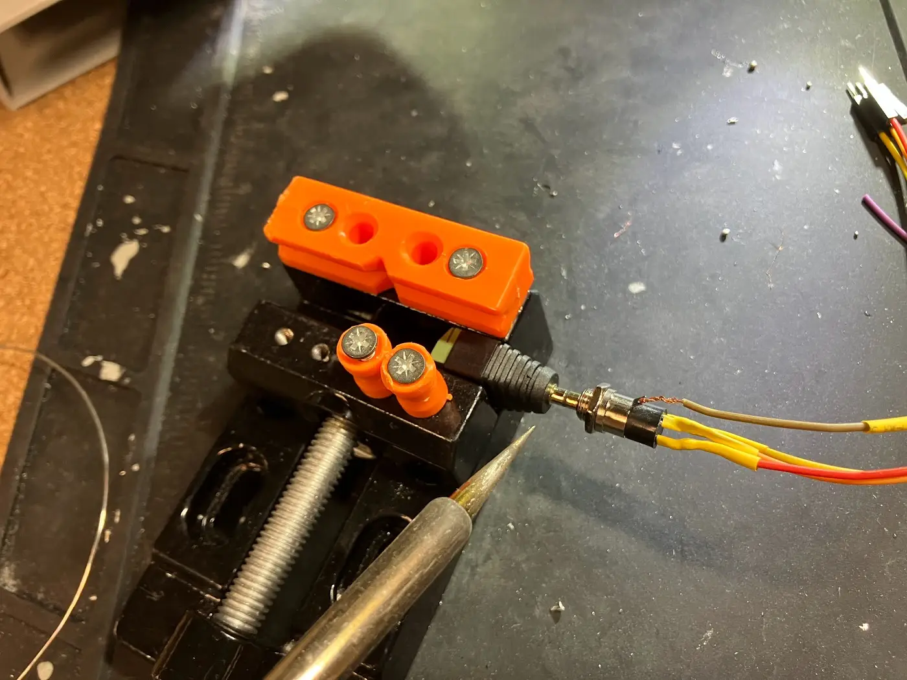
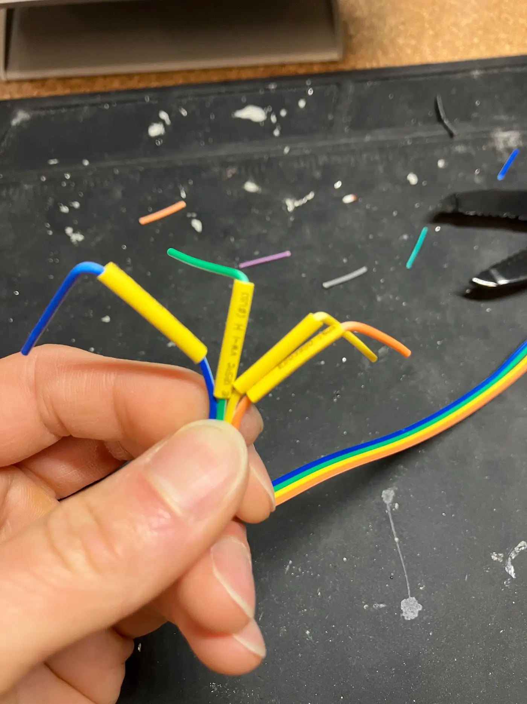

- As Neil mentioned, I accidentally satisfied the networking requirement twice during the Input device and Machine building week
- I made [more progress](../final-project/index.md#physical-assembly-test) towards the final project but also build something fun under the theme of the week
- I decided to temporarily turn my final project's hardware in whack-a-mole game: switchboard lights up LEDs, user plugs phone jack to "whack" it off, and another LED lights up...
- In the end, I realized that I had build 3 layers of the networking in one project. Kind of neat. And here is the story:

## Network 1: Voltage as physical address

- In my final project, I have a walkie talkie (aka **Operator**) that can plug in a panel of phone jacks (aka **Switchboard**). In the [Electronics fabrication week](../week-06/index.md), I prototyped using TRRS connector as a 3-bit addressable interface.
- This week, I fabricated all the phone jacks, with wiring, solder, and mounting


**Soldering TRRS connector to ribbon wires**

- I used heat shrink tubes to reinforce the solder joints as well as to prevent accidental shorts between adjacent pins
- I kept making the same mistake where I soldered the wire before adding the heat shrink tube. Due to size of the tube, I must add the tube first, then solder, then slide the tube over the joint and shrink it with heat gun.
- In the end, I developed the muscle memory of "tube first, solder second"


**Tube first, solder second, repeat after me...**

- I fell victim of the information denial trap as observed in behavioral economics. An example of information denial is when patient could scan for potential desease but they worry about the consequence of such knowledge and therefore choose to not know.
- I was on a happy streak soldering all the TRRS jack wires and thought as long as I solder all of the them the same way, it would be fine.
- But as soon as I finished soldering, I recalled that Neil said those connetors are "nasty" because when you plug in, the different terminals would touch all the conductive parts along the way in.
- Here is my initial wiring that took more than 4 hours to solder:

- Switchboard
  - Tip: Address bit 0 (digital write high or ground)
  - Ring1: Ground
  - Ring2: Address bit 1
  - Sleeve: Address bit 2
- Operator
  - Tip: Address bit 0 (digital read)
  - Ring1: Ground
  - Ring2: Address bit 1
  - Sleeve: Address bit 2

Visualize in the 4 by 4 table, where each cell represents a potential contact due to the sliding motion:

```
TRRS
   TRRS 👈

TRRS
  TRRS 👈


TRRS
 TRRS 👈

TRRS
TRRS
```

Visualize this in grid, when any digital write high (R2, S) touches the ground (R1), a short happens:

|                   | Tip (write) | Ring1 (GRD) | Ring2 (write) | Sleeve (write) |
| ----------------- | ----------- | ----------- | ------------- | -------------- |
| **Tip (read)**    | ✅          | ✅          | ✅            | ✅             |
| **Ring1 (GRD)**   |             | ✅          | ⚠️            | ⚠️             |
| **Ring2 (read)**  |             |             | ✅            | ✅             |
| **Sleeve (read)** |             |             |               | ✅             |

Realizing my mistake, I moved the ground to the tip so no other pins can touch it

|                   | Tip (GRD) | Ring1 (write) | Ring2 (write) | Sleeve (write) |
| ----------------- | --------- | ------------- | ------------- | -------------- |
| **Tip (GRD)**     | ✅        | ✅            | ✅            | ✅             |
| **Ring1 (read)**  |           | ✅            | ✅            | ✅             |
| **Ring2 (read)**  |           |               | ✅            | ✅             |
| **Sleeve (read)** |           |               |               | ✅             |

- Since I already used heat shrink tubes to reinforce the ribbon wires' pin headers, making this changes means removing the heat shrink tube and rearrange the wires. Luckily, the ribbon wires can be re-aranged. That was another 2 hour job.
- In programming, the Switchboard is hard wired to have digital write high or ground on each of the address bits.
- Originally, I thought I could have 8 addresses (3 bits) but because of the shorting issue I need to reserve an address to represent "Unplugged" state, I ended up having 7 usable addresses (`000` to `110`) and `111` represents "Unplugged".

Switchboard:

```cpp
//...
```

Operator:

```cpp
//...
```

## Network 2: Mac and name as BLE address

- I added the LED lights on the Switchboard. (See details in Final project page)
- Since the TRRS connection is a one-way communication from Switchboard to Operator, I need a way for the Operator to send information back to the Switchboard to change the state of LED lights
- Here is the full data flow:
  - Operator reads an 3-bit address from Switchboard
  - Operator sends the address to the browser app
  - The browser app sends a new address to the Switchboard
  - Switchboard lights up the LED corresponding to the address
- Bluetooth name length truncated by ESP32
  - I found `Switchboard` became `Switchbo` in the device list. I believe the bluetooth library is shortening the name to 8 characters.

Device name overflow:

```js
deviceSw = await navigator.bluetooth.requestDevice({
  filters: [{ name: "Switchboard" }],
  optionalServices: [SERVICE_UUID],
});
```

into

```js
deviceSw = await navigator.bluetooth.requestDevice({
  filters: [{ name: "sw" }],
  optionalServices: [SERVICE_UUID],
});
```

Switchboard:

```cpp
// show added code that lights up LED based on BLE command
```

Operator:

```cpp
// show added code that reads TRRS address and sends via BLE
```

In the web app, we need to account for bounce in the connection due to sliding motion. I picked my favorite RxJS library to handle the debounce.

Web app:

```js
// show debounce and state management code
```


## Network 3: URL as web address

- To satisfy the group assignment requirement of networking with other's project. I added the logic for the browser to HTTP POST the current score to Matti's server, which will in turn display the score on his e-ink display.

# Preparation

- 3D print
- Solder

# LED connection

See sketches/led-test

# Web -> ESP32: turn one light on with Bluetooth

See sketches/blue-light

# ESP32 -> Web: Stream probe value to browser

Stream raw probe
Debug bit address circuit (add image)
See archive/streaming-probe

## Appendix
