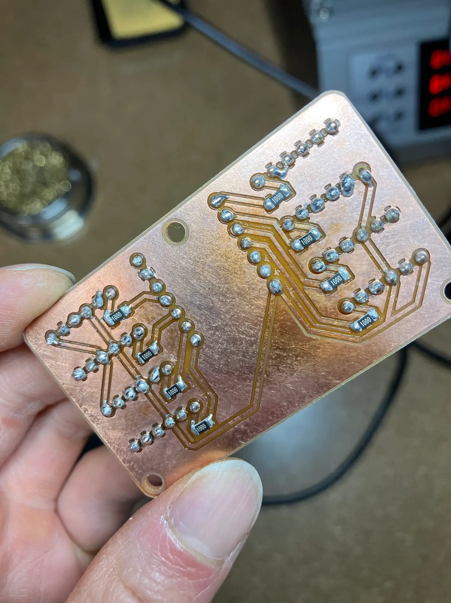
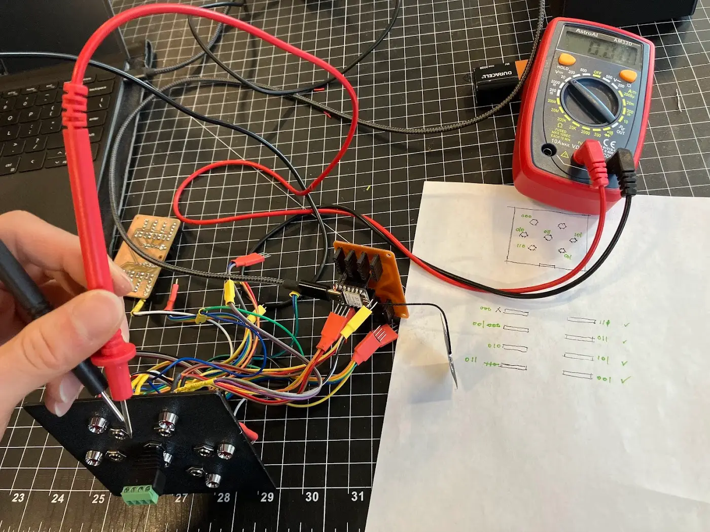

Neil noted that I had already satisfied the networking requirement during the [Input Device](../week-08/index.md) and [Machine Building](../week-11/index.md) weeks. For this week, I made [more progress](../final-project/index.md#physical-assembly-test) on my final project without missing the opportunity in building something fun under the networking theme. I temporarily converted the hardware for my final project into a "whack-a-mole" game. In this setup, the switchboard lights up an LED, the user plugs in a phone jack to "whack" it, and then another LED lights up. By the end, I realized I had built three networks into a single project.

## Network 1: Voltage as physical address

For my final project, I am building a walkie-talkie (the **Operator**) that plugs into a panel of phone jacks (the **Switchboard**). During [Electronics fabrication week](../week-06/index.md), I prototyped a 3-bit addressable interface using a TRRS connector. This week, I fabricated the phone jacks, complete with wiring, soldering, and mounting.


**Soldering TRRS connector to ribbon wires**

I used heat shrink tubes to reinforce the solder joints and prevent accidental shorts between adjacent pins. I repeatedly made the mistake of soldering the wire before adding the heat shrink tube. Because of the tube's size, I must add the tube first, solder the connection, slide the tube over the joint, and then shrink it with a heat gun. Eventually, I developed the muscle memory of "tube first, solder second."


**Tube first, solder second, repeat after me...**

I fell victim to the information denial trap observed in behavioral economics. This occurs when someone avoids learning information because they fear the consequences. I was on a happy streak soldering the TRRS jack wires and assumed that consistent soldering would suffice. As soon as I finished, I recalled Neil's warning that these connectors are "nasty" because the different terminals touch all conductive parts during insertion.

Here is my initial wiring configuration, which took over four hours to solder:

```txt
Switchboard
  - Tip: Address bit 0 (digital write high or ground)
  - Ring1: Ground
  - Ring2: Address bit 1
  - Sleeve: Address bit 2

Operator
  - Tip: Address bit 0 (digital read)
  - Ring1: Ground
  - Ring2: Address bit 1
  - Sleeve: Address bit 2
```

Let's visualize the different contact possibilities caused by the sliding motion:

```txt
TRRS
   TRRS 👈

TRRS
  TRRS 👈


TRRS
 TRRS 👈

TRRS
TRRS
```

When visualized in a grid, I saw the digital writes (Ring2, Sleeve) touching the ground (Ring1) causes a short:

|                   | Tip (write) | Ring1 (GRD) | Ring2 (write) | Sleeve (write) |
| ----------------- | ----------- | ----------- | ------------- | -------------- |
| **Tip (read)**    | ✅          | ✅          | ✅            | ✅             |
| **Ring1 (GRD)**   |             | ✅          | ⚠️            | ⚠️             |
| **Ring2 (read)**  |             |             | ✅            | ✅             |
| **Sleeve (read)** |             |             |               | ✅             |

Realizing my mistake, I moved the ground to the tip so no other pins can touch it.

|                   | Tip (GRD) | Ring1 (write) | Ring2 (write) | Sleeve (write) |
| ----------------- | --------- | ------------- | ------------- | -------------- |
| **Tip (GRD)**     | ✅        | ✅            | ✅            | ✅             |
| **Ring1 (read)**  |           | ✅            | ✅            | ✅             |
| **Ring2 (read)**  |           |               | ✅            | ✅             |
| **Sleeve (read)** |           |               |               | ✅             |

Since I had already used heat shrink tubes to reinforce the pin headers, making these changes required removing the tubes and rearranging the wires. Fortunately, the ribbon wires allowed for rearrangement, though it took another two hours.

In the programming, the Switchboard is hard-wired to have a digital write high or ground on each address bit. I originally planned for 8 addresses using 3 bits, but I need to reserve an address for the "Unplugged" state. I ended up with 7 usable addresses (`000` to `110`), with `111` representing "Unplugged".

Here is the Switchboard code with digital write high on D6 pin, which supplies 3.3V to all the `1` address bits:

```cpp
void setup() {
  pinMode(D6, OUTPUT);
  digitalWrite(D6, HIGH);
}

```

As seen on the PCB, each connector has six pins: two for the LED and four for the TRRS. Among the four TRRS pins, one is ground (second from the left in the left column, and second from the right in the right column).


**The address bits are baked into the hardware**

The Operator would read the address bits in a loop:

```cpp
const int inputPins[] = { D3, D4, D5 };
const char* inputNames[] = { "D3", "D4", "D5" };
const int numInputs = 3;

void setup() {
  Serial.begin(115200);
  delay(50);

  for (int i = 0; i < numInputs; ++i) {
    pinMode(inputPins[i], INPUT_PULLUP);
    digitalWrite(inputPins[i], HIGH); // HIGH HIGH HIGH means unplugged
  }
}

void loop() {
  for (int i = 0; i < numInputs; ++i) {
    int v = digitalRead(inputPins[i]);
    Serial.print(inputNames[i]);
    Serial.print(": ");
    if (v == HIGH) {
      Serial.println("HIGH");
    } else {
      Serial.println("LOW");
    }
  }
  Serial.println();
  delay(50);
}
```

This was confirmed working in [Electronics fabrication week](../week-06/index.md#integration-test).

## Network 2: Mac and name as BLE address

I added LED lights to the Switchboard (see the [Group assignment page](https://fab.cba.mit.edu/classes/MAS.863/CBA/group_assignments/week12/) for details). Since the TRRS connection provides only one-way communication from the Switchboard to the Operator, I needed a method for the Operator to send information back to change the LED states. A browser app was introduced to be the hub. The full data flow operates as follows:

1.  The Operator reads a 3-bit address from the Switchboard.
2.  The Operator sends the address to the browser app.
3.  The browser app sends a new address to the Switchboard.
4.  The Switchboard lights up the LED corresponding to that address.

I needed to associate the address of the phone jacks with the specific LED next to them. The wiring had changed over time, so the only guarantee was that they were distinct. I approached this empirically by probing them to determine the final addresses.


**Probing for address, with the help from [Adafruit TRRS Terminal Block](https://www.adafruit.com/product/2914)**

I placed a cheatsheet on the Switchboard case for easy reference:


**Cheatsheet for Switchboard addresses**

Here is the key logic for lighting up an LED based on a BLE command received by the Switchboard:

```cpp
#include <BLEDevice.h>
#include <BLEServer.h>
#include <BLEUtils.h>
#include <BLE2902.h>

#define UART_SERVICE_UUID "6e400001-b5a3-f393-e0a9-e50e24dcca9e"
#define UART_RX_UUID      "6e400002-b5a3-f393-e0a9-e50e24dcca9e"

BLEServer* pServer = NULL;
BLECharacteristic* pRxCharacteristic = NULL;
bool deviceConnected = false;

const int ledPins[] = {D0, D1, D2, D3, D7, D8, D9, D10};
const int numLeds = 8;

class MyServerCallbacks: public BLEServerCallbacks {
    void onConnect(BLEServer* pServer) {
        deviceConnected = true;
    }

    void onDisconnect(BLEServer* pServer) {
        deviceConnected = false;
    }
};

class MyRxCallbacks: public BLECharacteristicCallbacks {
    void onWrite(BLECharacteristic* pCharacteristic) {
        String rxValue = pCharacteristic->getValue();
        if (rxValue.length() > 0 && rxValue.startsWith("blink:")) {
            int ledIndex = rxValue.substring(6).toInt();
            if (ledIndex >= 0 && ledIndex < numLeds) {
                digitalWrite(ledPins[ledIndex], HIGH);
                delay(500);
                digitalWrite(ledPins[ledIndex], LOW);
            }
        }
    }
};

void setup() {
    for (int i = 0; i < numLeds; i++) {
        pinMode(ledPins[i], OUTPUT);
        digitalWrite(ledPins[i], LOW);
    }

    BLEDevice::init("Switchboard");

    pServer = BLEDevice::createServer();
    pServer->setCallbacks(new MyServerCallbacks());

    BLEService* pService = pServer->createService(UART_SERVICE_UUID);

    pRxCharacteristic = pService->createCharacteristic(
        UART_RX_UUID,
        BLECharacteristic::PROPERTY_WRITE
    );
    pRxCharacteristic->setCallbacks(new MyRxCallbacks());

    pService->start();

    BLEAdvertising* pAdvertising = BLEDevice::getAdvertising();
    pAdvertising->addServiceUUID(UART_SERVICE_UUID);
    pAdvertising->setScanResponse(false);
    pAdvertising->setMinPreferred(0x0);
    BLEDevice::startAdvertising();
}

void loop() {
    delay(10);
}
```

I noticed that one of the Bluetooth devices did not appear in the browser's device list. I discovered that the device name `Switchboard` became `Switchbo`. The Bluetooth library appears to shorten the name to 8 characters. There is a [related issue](https://stackoverflow.com/questions/58772005/why-is-the-web-bluetooth-device-name-limited-to-8-bytes) reported by Android developers, though it is unclear if a similar issue lies with the ESP32 Bluetooth library or the Web Bluetooth API.

I fixed the device name overflow by shortening it:

```diff
deviceSw = await navigator.bluetooth.requestDevice({
-  filters: [{ name: "Switchboard" }],
+  filters: [{ name: "sw" }],
  optionalServices: [SERVICE_UUID],
});
```

The Operator reads the TRRS address and sends it to the browser via BLE:

```cpp
#include <BLEDevice.h>
#include <BLEServer.h>
#include <BLEUtils.h>
#include <BLE2902.h>

#define UART_SERVICE_UUID "6e400001-b5a3-f393-e0a9-e50e24dcca9e"
#define UART_TX_UUID      "6e400003-b5a3-f393-e0a9-e50e24dcca9e"

BLEServer* pServer = NULL;
BLECharacteristic* pTxCharacteristic = NULL;
bool deviceConnected = false;
bool oldDeviceConnected = false;

const int inputPins[] = { D3, D4, D5 };
const int numInputs = 3;

class MyServerCallbacks: public BLEServerCallbacks {
    void onConnect(BLEServer* pServer) {
        deviceConnected = true;
    }

    void onDisconnect(BLEServer* pServer) {
        deviceConnected = false;
    }
};

void setup() {
  Serial.begin(115200);
  delay(50);

  for (int i = 0; i < numInputs; ++i) {
    pinMode(inputPins[i], INPUT_PULLUP);
  }

  BLEDevice::init("op");

  pServer = BLEDevice::createServer();
  pServer->setCallbacks(new MyServerCallbacks());

  BLEService* pService = pServer->createService(UART_SERVICE_UUID);

  pTxCharacteristic = pService->createCharacteristic(
      UART_TX_UUID,
      BLECharacteristic::PROPERTY_NOTIFY
  );
  pTxCharacteristic->addDescriptor(new BLE2902());

  pService->start();

  BLEAdvertising* pAdvertising = BLEDevice::getAdvertising();
  pAdvertising->addServiceUUID(UART_SERVICE_UUID);
  pAdvertising->setScanResponse(false);
  pAdvertising->setMinPreferred(0x0);
  BLEDevice::startAdvertising();
}

void loop() {
  if (!deviceConnected && oldDeviceConnected) {
    delay(500);
    pServer->startAdvertising();
    oldDeviceConnected = deviceConnected;
  }

  if (deviceConnected && !oldDeviceConnected) {
    oldDeviceConnected = deviceConnected;
  }

  String probe = "";
  for (int i = 0; i < numInputs; ++i) {
    int v = digitalRead(inputPins[i]);
    probe += (v == HIGH) ? "1" : "0";
  }

  if (deviceConnected) {
    pTxCharacteristic->setValue((uint8_t*)probe.c_str(), probe.length());
    pTxCharacteristic->notify();
  }

  delay(100);
}
```

In the web app, I needed to account for connection bounce caused by the sliding motion. I used the RxJS library to handle the debounce. The web app serves as the brain. It tracks the current LED, checks if the user probes the correct address, and sends a command to the Switchboard to turn off that LED and light up another.

```js
import { Subject, debounceTime, distinctUntilChanged, BehaviorSubject } from "https://esm.sh/rxjs";

const SERVICE_UUID = "6e400001-b5a3-f393-e0a9-e50e24dcca9e";
const TX_CHAR_UUID = "6e400003-b5a3-f393-e0a9-e50e24dcca9e";
const RX_CHAR_UUID = "6e400002-b5a3-f393-e0a9-e50e24dcca9e";

let charTxSw = null;
let charRxOp = null;
let probeSubject = new Subject();
let currentTarget = 3;
let scoreSubject = new BehaviorSubject(0);

document.getElementById("connectBtnSw").addEventListener("click", async () => {
  const deviceSw = await navigator.bluetooth.requestDevice({
    filters: [{ name: "sw" }],
    optionalServices: [SERVICE_UUID],
  });
  const server = await deviceSw.gatt.connect();
  const service = await server.getPrimaryService(SERVICE_UUID);
  charTxSw = await service.getCharacteristic(RX_CHAR_UUID);
  const encoder = new TextEncoder();
  await charTxSw.writeValue(encoder.encode("off:all"));
  await charTxSw.writeValue(encoder.encode("on:3"));
});

document.getElementById("connectBtnOp").addEventListener("click", async () => {
  probeSubject = new Subject();
  scoreSubject = new BehaviorSubject(0);
  const deviceOp = await navigator.bluetooth.requestDevice({
    filters: [{ name: "op" }],
    optionalServices: [SERVICE_UUID],
  });
  const server = await deviceOp.gatt.connect();
  const service = await server.getPrimaryService(SERVICE_UUID);
  charRxOp = await service.getCharacteristic(TX_CHAR_UUID);
  await charRxOp.startNotifications();
  charRxOp.addEventListener("characteristicvaluechanged", (e) => {
    probeSubject.next(new TextDecoder().decode(e.target.value.buffer).trim());
  });
  probeSubject.pipe(distinctUntilChanged(), debounceTime(500)).subscribe((value) => {
    const num = parseInt(value, 2);
    if (num === currentTarget) {
      const encoder = new TextEncoder();
      charTxSw.writeValue(encoder.encode("off:" + currentTarget)).then(() => {
        let randomLed = Math.floor(Math.random() * 7);
        while (randomLed === currentTarget) randomLed = Math.floor(Math.random() * 7);
        charTxSw.writeValue(encoder.encode(`on:${randomLed}`)).then(() => {
          currentTarget = randomLed;
          scoreSubject.next(scoreSubject.value + 1);
        });
      });
    }
  });
});

const apiKeyInput = document.getElementById("apiKey");
apiKeyInput.value = localStorage.getItem("htmaa-matti-key") || "";
apiKeyInput.addEventListener("input", () => localStorage.setItem("htmaa-matti-key", apiKeyInput.value));
```


## Network 3: URL as web address

To satisfy the group assignment requirement of networking with another project, I added logic for the browser to HTTP POST the current score to [Matti](https://fab.cba.mit.edu/classes/863.25/people/MattiGruener/)'s server. This, in turn, displays the score on his e-ink display.

```diff
+scoreSubject.subscribe((score) => {
+  const apiKey = document.getElementById("apiKey").value;
+  if (apiKey) {
+    fetch("https://api.mistermatti.com/htmaa-final/text", {
+      method: "POST",
+      headers: { "X-API-Key": apiKey, "Content-Type": "application/json" },
+      body: JSON.stringify({ text: score.toString() }),
+    });
+  }
+});
```

With this add-on, the browser posts to the server whenever the score updates. Please see the group page for details.


**Web app notifying remote server**

## Appendix

- [Operator code](./code/operator/operator.ino)
- [Switchboard code](./code/switchboard/switchboard.ino)
- [Web app](./code/web/index.html)
- [LED address map](./code/led-mapping.json)
