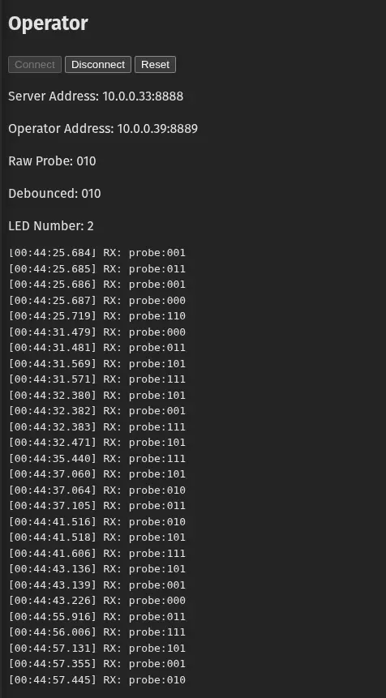
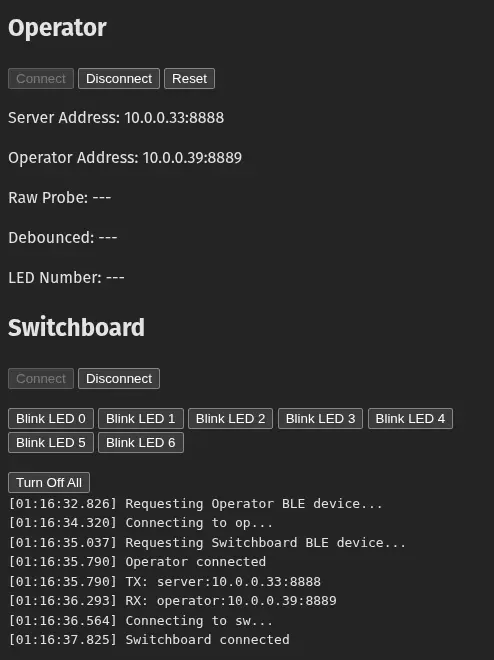
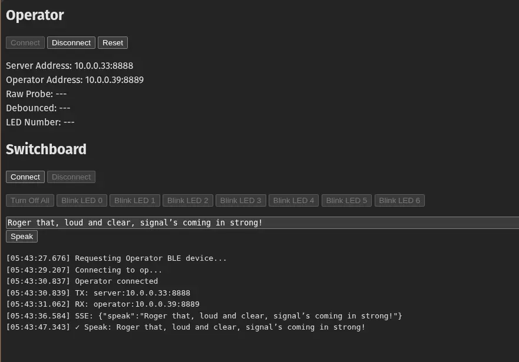
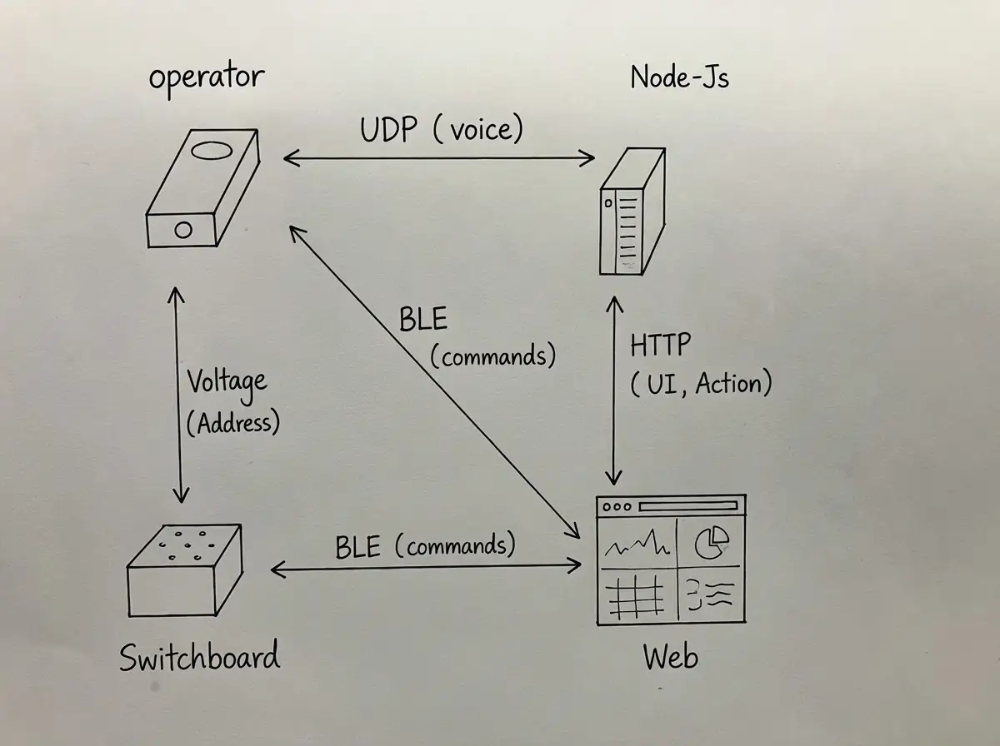
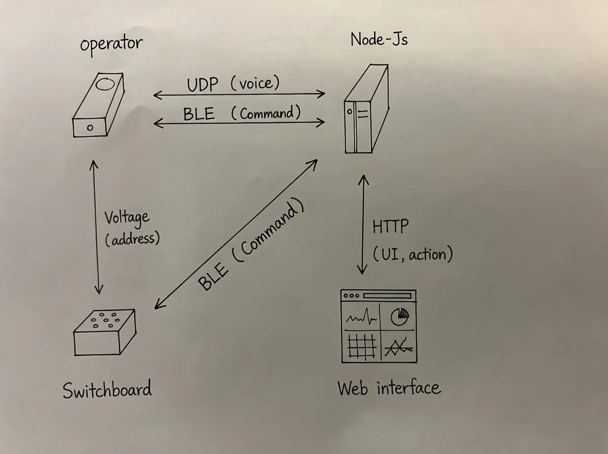
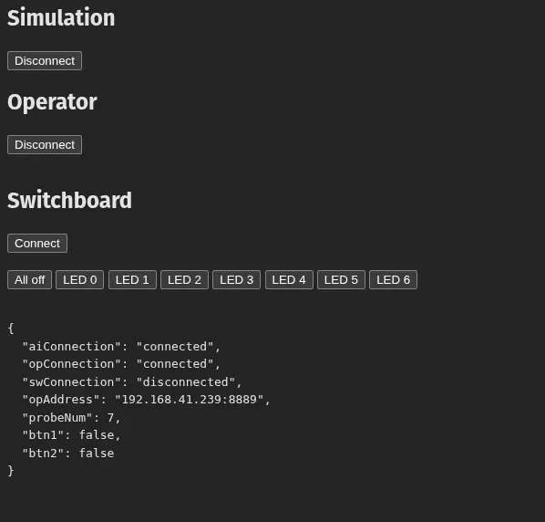
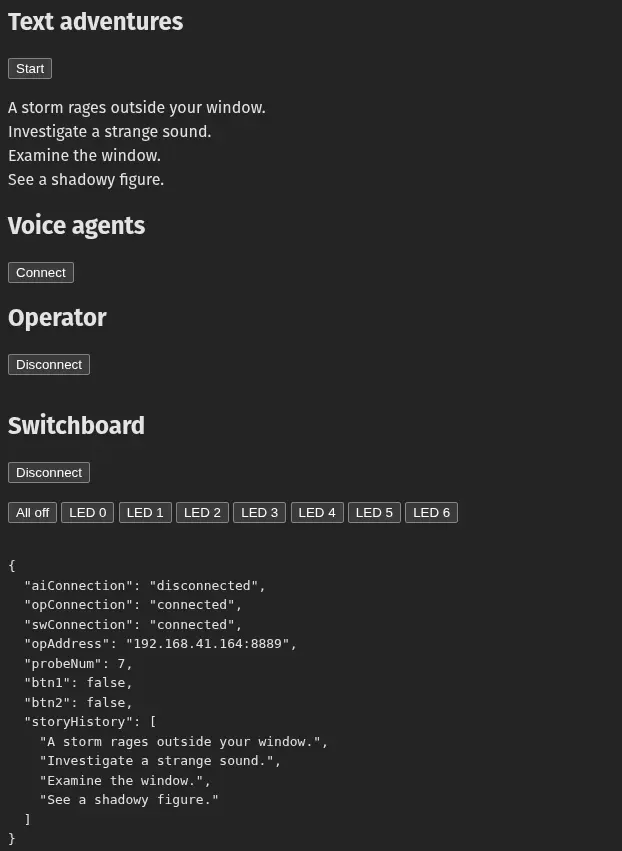

This week, I set out to bring my walkie-talkie device closer to an interactive demo. The goal was to write an application that interfaces a user with the input and output devices I made throughout the semester: the Operator (ESP32 with probe and buttons) and the Switchboard (ESP32 with LEDs). The application would orchestrate state management while providing a web UI for device management and debugging.

I grew tired of AI-generated frontend code with its Tailwind classes, React boilerplate, blue-purple gradients, oversized typography, and distracting animations. I decided to build as close to the web platform as possible: vanilla TypeScript, RxJS for reactive state, and lit-html for templating.

## Reviving the Foundation

I started by reviving the walkie-talkie code from [week 9](../week-09/index.md#transcribing-audio-and-streaming-voice-from-computer-to-device). The immediate challenge was IP discovery. Both devices had hardcoded addresses that broke whenever the network changed.

### Discovering ESP32 Address

The laptop could discover the ESP32's IP by inspecting `rinfo.address` from incoming UDP packets:

```js
import * as dgram from "dgram";

const udpReceiver = dgram.createSocket("udp4");

udpReceiver.bind(8888);

udpReceiver.on("message", (msg, rinfo) => {
  // rinfo contains sender information
  const senderIp = rinfo.address; // Get sender's IP address
  const senderPort = rinfo.port; // Get sender's port

  console.log(`Received from ${senderIp}:${senderPort}`);
  console.log(`Data: ${msg.toString()}`);
});
```

### Discovering Laptop Address

The reverse problem was harder. The ESP32 needed to know the laptop's IP address. I used the Node.js `os.networkInterfaces()` API to expose the laptop's address through an HTTP endpoint:

Server

```js
import * as os from "os";
import express from "express";

const app = express();

app.get("/api/origin", (req, res) => {
  const interfaces = os.networkInterfaces();
  const ipv4 = Object.values(interfaces)
    .flat()
    .find((addr) => addr.family === "IPv4" && !addr.internal);

  res.json({ host: ipv4?.address || "localhost" });
});

app.listen(3000);
```

Web UI

```ts
const ipInput = document.getElementById("ipInput") as HTMLInputElement;
const fetchButton = document.getElementById("fetchButton") as HTMLButtonElement;

fetchButton.addEventListener("click", async () => {
  try {
    const response = await fetch("http://localhost:3000/api/origin");
    const data = await response.json();
    ipInput.value = data.host;
  } catch (error) {
    console.error("Failed to fetch origin:", error);
    ipInput.value = "Error fetching origin";
  }
});
```

The web UI allowed users to fetch the laptop IP. We still need to push it to the ESP32 somehow.


**Initial UI for manually reading IP address**

## Automated Handshake Protocol

I borrowed the BLE networking code from the [Networking week](../week-12/index.md#network-2-mac-and-name-as-ble-address) and enhanced it with an automated handshake protocol for the laptop and the ESP32 to exchange IP addresses that can be used for full duplex UDP streaming. As soon as ESP32 is paired over BLE, the following sequence occurs:

1. Web requests server address from Node.js
2. Server responds with its own IP
3. Web sends server address to Operator via BLE
4. Operator responds with its own IP
5. Web registers Operator address with server

web

```js
// Fetch server IP on page load
const response = await fetch("http://localhost:3000/api/origin");
const data = await response.json();
serverAddressSpan.textContent = data.host;

// After Operator BLE connects, send server address
const message = `server:${url.hostname}:${url.port}`;
sendMessage(message);

// Receive operator address from device
if (message.startsWith("operator:")) {
  const address = message.substring(9);
  operatorAddressSpan.textContent = address;
  fetch(`http://localhost:3000/api/locate-operator?address=${encodeURIComponent(address)}`, {
    method: "POST",
  });
}
```

operator

```cpp
// Receive server address from web
void handleRxMessage(String msg) {
  if (msg.startsWith("server:")) {
    String serverIp = msg.substring(7, msg.lastIndexOf(':'));
    int port = msg.substring(msg.lastIndexOf(':') + 1).toInt();
    // Store and use for UDP
    setupUDP(serverIp.c_str(), port);
  }
}

// Send operator address to web for registration
void sendOperatorAddress() {
  String myIP = WiFi.localIP().toString();
  sendBLE("operator:" + myIP);
}
```

On the UI, I displayed both addresses for verification. In addition, the probe state is streamed over BLE and shown in real-time.


**Automated handshake and BLE data streaming**

## Adding the Switchboard UI

I added a Switchboard UI for connection testing, again, reusing the BLE communication patterns from the Networking week.


**Switchboard connection panel**

### Real-time Server Push with SSE

I wanted the web UI to receive live updates from the server without polling. I added a Server-Sent Events (SSE) endpoint to push data to the browser with minimal latency:

```js
// Server: SSE endpoint for pushing events to web
if (req.url === "/api/events") {
  res.writeHead(200, { "Content-Type": "text/event-stream", "Cache-Control": "no-cache" });
  sseClients.push({ res });
  req.on("close", () => {
    sseClients = sseClients.filter((c) => c.res !== res);
  });
}

// Server: /api/speak endpoint - triggers speech synthesis
else if (req.url === "/api/speak") {
  const { text, voice } = JSON.parse(body);
  await synthesizeAndStreamSpeech(text, voice);
  emitServerEvent(text); // Push to SSE clients
}

// Web: Listen to SSE stream
const eventSource = new EventSource("http://localhost:3000/api/events");
eventSource.onmessage = (event) => {
  logDiv.textContent += `[${timestamp}] SSE: ${event.data}\n`;
};

// Web: Trigger speak from UI
speakBtn.addEventListener("click", async () => {
  const text = speakTextarea.value.trim();
  const response = await fetch("http://localhost:3000/api/speak", {
    method: "POST",
    body: JSON.stringify({ text }),
  });
});
```

The web UI could now trigger speech synthesis and receive real-time updates regarding any speech events from the server.


**Speech synthesis controls with live event log**

## Taming Complexity

As features accumulated, the codebase became unwieldy. BLE communication lived in the web UI, but UDP communication lived in the Server.


**Entangled architecture with BLE in web UI and UDP in server**

I refactored nearly all the code to move BLE communication into the server, creating a modular architecture. Normally I would do this with AI. But the stake is too high: I'm running out of time for this week's project, and I knew I need a solid foundation to carry me through the final project. Reliability and maintainability became my priority, which meant no AI coding for this refactor.


**Simplified architecture after refactoring**

In the simplified architecture, I heavily relied on RxJS to create reactive data streams.

```ts
import { map, tap } from "rxjs";
import { HTTP_PORT, LAPTOP_UDP_RX_PORT } from "./config";
import { BLEDevice, opMac, swMac } from "./features/ble";
import { createButtonStateMachine } from "./features/buttons";
import { geminiResponse$, geminiTranscript$, handleConnectGemini, handleDisconnectGemini } from "./features/gemini-live";
import { createHttpServer } from "./features/http";
import {
  handleButtonsMessage,
  handleConnectOperator,
  handleDisconnectOperator,
  handleOpAddressMessage,
  handleProbeMessage,
  handleRequestOperatorAddress,
  logOperatorMessage,
  operatorAddress$,
  operatorButtons$,
  operatorProbeNum$,
} from "./features/operator";
import { silence$ } from "./features/silence-detection";
import { handleAudio, handleConnectSession, handleDisconnectSession, interrupt, triggerResponse } from "./features/simulation";
import { broadcast, handleSSE, newSseClient$ } from "./features/sse";
import { appState$, updateState } from "./features/state";
import { handleBlinkLED, handleConnectSwitchboard, handleDisconnectSwitchboard } from "./features/switchboard";
import { createUDPServer } from "./features/udp";

async function main() {
  const operator = new BLEDevice(opMac);
  const switchboard = new BLEDevice(swMac);

  createUDPServer([handleAudio()], LAPTOP_UDP_RX_PORT);

  createHttpServer(
    [
      handleSSE(),
      handleBlinkLED(switchboard),
      handleConnectSwitchboard(switchboard),
      handleDisconnectSwitchboard(switchboard),
      handleConnectOperator(operator),
      handleDisconnectOperator(operator),
      handleRequestOperatorAddress(operator),
      handleConnectSession(),
      handleDisconnectSession(),
      handleConnectGemini(),
      handleDisconnectGemini(),
    ],
    HTTP_PORT
  );

  appState$
    .pipe(
      map((state) => ({ state })),
      tap(broadcast)
    )
    .subscribe();

  newSseClient$.pipe(tap(() => broadcast({ state: appState$.value }))).subscribe();

  operator.message$.pipe(tap(logOperatorMessage), tap(handleProbeMessage()), tap(handleOpAddressMessage()), tap(handleButtonsMessage())).subscribe();
  operatorProbeNum$.pipe(tap((num) => updateState((state) => ({ ...state, probeNum: num })))).subscribe();
  operatorAddress$.pipe(tap((address) => updateState((state) => ({ ...state, opAddress: address })))).subscribe();
  operatorButtons$.pipe(tap((buttons) => updateState((state) => ({ ...state, btn1: buttons.btn1, btn2: buttons.btn2 })))).subscribe();

  const operataorButtons = createButtonStateMachine(operatorButtons$);

  operataorButtons.leaveIdle$.pipe(tap(interrupt)).subscribe();
  silence$.pipe(tap(triggerResponse)).subscribe();

  // Gemini Live API subscriptions
  geminiTranscript$.pipe(tap((text) => console.log(`🎤 Transcript: ${text}`))).subscribe();
  geminiResponse$.pipe(tap((text) => console.log(`🤖 Gemini: ${text}`))).subscribe();
}

main();
```

The web UI code followed the same modular pattern:

```ts
import { tap } from "rxjs";
import { appendDiagnosticsError, updateDiagnosticsState } from "./features/diagnostics";
import { initOperatorUI, updateOperatorUI } from "./features/operator";
import { initSimulationUI, updateSimulationUI } from "./features/simulation";
import { createSSEObservable } from "./features/sse";
import { state$, stateChange$ } from "./features/state";
import { initSwitchboardUI, updateSwitchboardUI } from "./features/switchboard";
import "./style.css";

initSwitchboardUI();
initOperatorUI();
initSimulationUI();

state$.pipe(tap(updateDiagnosticsState)).subscribe();

stateChange$.pipe(tap(updateSwitchboardUI), tap(updateOperatorUI), tap(updateSimulationUI)).subscribe();

export const sseEvents$ = createSSEObservable("http://localhost:3000/api/events");

sseEvents$.subscribe({
  next: (message) => {
    if (message.state) {
      state$.next(message.state);
    }
  },
  error: (error) => {
    appendDiagnosticsError(error);
  },
});
```

The UI now embodied the principle that view is a pure function of state. I rendered the JSON state of the server directly on the web UI. The rest of the interface was derived from that state.


**Diagnostics panel showing raw server state**

## The Pivot

Hardware failure struck. The microphone randomly picked up high noise. The speaker had unstable contact and barely worked. With no time left to debug flaky audio hardware, I made a strategic decision: keep the custom input devices (probe and buttons), keep the custom output device (LEDs), but route audio through the computer's speakers. Based on the remaining functional hardware, I redesigned the application to be an interactive [text adventure game](https://en.wikipedia.org/wiki/Interactive_fiction).

Thanks to the modular refactor, this pivot was fast.

- **Gemini API** generates branching story options
- **OpenAI TTS** synthesizes speech for each option
- **LEDs** illuminate when story options become available
- **Probe** selects which option to preview (triggers audio playback)
- **Buttons** commit the selection, advancing the story

The physical interface became a tangible story navigator. Probe a position to hear an option, press a button to choose your path.

### Game Logic

The main server wires together the game flow:

```ts
textGenerated$.pipe(concatMap((index) => turnOnLED(switchboard, index))).subscribe();
operatorProbeNum$
  .pipe(
    filter((num) => num !== 7),
    tap((index) => previewOption(index))
  )
  .subscribe();
operatorProbeNum$
  .pipe(
    filter((num) => num === 7),
    tap(cancelAllSpeakerPlayback)
  )
  .subscribe();

operataorButtons.someButtonDown$
  .pipe(
    withLatestFrom(operatorProbeNum$),
    tap(cancelAllSpeakerPlayback),
    tap(() => turnOffAllLED(switchboard)),
    tap(([_, index]) => commitOption(index))
  )
  .subscribe();
```

The game logic module handles story generation and option management:

```ts
import { GoogleGenAI } from "@google/genai";
import { JSONParser } from "@streamparser/json";
import { BehaviorSubject, Subject } from "rxjs";
import { z } from "zod";
import { zodToJsonSchema } from "zod-to-json-schema";
import type { Handler } from "./http";
import { cancelAllSpeakerPlayback, playPcm16Buffer } from "./speaker";
import { appState$, updateState } from "./state";
import { GenerateOpenAISpeech } from "./tts";

const storyOptionsSchema = z.object({
  storyOptions: z.array(z.string().describe("A story beginning for a text adventure game.")),
});
const ai = new GoogleGenAI({ apiKey: process.env.GEMINI_API_KEY! });

export const textGenerated$ = new Subject<number>();
export const assignments$ = new BehaviorSubject<{ index: number; text: string | null; audioBuffer: Promise<Buffer> | null }[]>([]);

let ongoingTasks = [] as AbortController[];

export async function previewOption(id: number) {
  const assignment = assignments$.value.find((a) => a.index === id);
  if (!assignment || assignment.text === null || assignment.audioBuffer === null) {
    console.error("Assignment not found or not ready");
    return;
  }

  cancelAllSpeakerPlayback();
  playPcm16Buffer(await assignment.audioBuffer);
}

export async function commitOption(id: number) {
  const assignment = assignments$.value.find((a) => a.index === id);
  if (!assignment || assignment.text === null) {
    console.error("Assignment not found or not ready");
    return;
  }

  killAllTasks();
  cancelAllSpeakerPlayback();

  // Commit the option to the story history
  updateState((state) => ({
    ...state,
    storyHistory: [...state.storyHistory, assignment.text!],
  }));

  // reset assignment slots
  assignments$.next(assignments$.value.map((a) => ({ ...a, text: null, audioBuffer: null })));

  const ac = new AbortController();
  ongoingTasks.push(ac);
  try {
    await generateOptionsInternal(ac, id);
  } finally {
    ongoingTasks = ongoingTasks.filter((task) => task !== ac);
  }
}

export function handleStartTextAdventures(): Handler {
  return async (req, res) => {
    if (req.method !== "POST" || req.url !== "/api/adventure/start") return false;

    killAllTasks();
    cancelAllSpeakerPlayback();
    assignments$.next([0, 1, 2, 3, 4, 5, 6].map((i) => ({ index: i, text: null, audioBuffer: null })));
    updateState((state) => ({ ...state, storyHistory: [] }));

    const ac = new AbortController();
    ongoingTasks.push(ac);

    try {
      await generateOptionsInternal(ac);
      res.writeHead(200);
      res.end();
    } finally {
      ongoingTasks = ongoingTasks.filter((task) => task !== ac);
    }

    return true;
  };
}

async function generateOptionsInternal(ac: AbortController, escapeIndex?: number) {
  const parser = new JSONParser();

  parser.onValue = (entry) => {
    if (typeof entry.key === "number" && typeof entry.value === "string") {
      console.log("Story option:", entry.value);

      const randomIndex = random(new Set(assignments$.value.filter((a) => a.text === null && a.index !== escapeIndex).map((a) => a.index)));
      if (randomIndex === null) {
        console.log("No available assignment slots, skip");
        return;
      }

      textGenerated$.next(randomIndex);
      assignments$.next(
        assignments$.value.map((a) =>
          a.index === randomIndex
            ? {
                ...a,
                text: entry.value as string,
                audioBuffer: GenerateOpenAISpeech(entry.value as string, ac.signal),
                visited: false,
              }
            : a
        )
      );
    }
  };

  const response = await ai.models.generateContentStream({
    model: "gemini-2.5-flash",
    contents: appState$.value.storyHistory.length
      ? `Based on the following story so far, generate 3 different story continuations for a text adventure game. Each option should be a one short verbal sentence with only a few words.

Story so far:
${appState$.value.storyHistory.join("\n")}
          `.trim()
      : `Generate 3 different story beginnings for a text adventure game. Each option should be a one short verbal sentence with only a few words.`.trim(),
    config: {
      responseMimeType: "application/json",
      responseJsonSchema: zodToJsonSchema(storyOptionsSchema as any),
      abortSignal: ac.signal,
    },
  });

  for await (const chunk of response) {
    const maybeOutput = chunk.candidates?.at(0)?.content?.parts?.at(0)?.text;
    if (!maybeOutput) continue;
    parser.write(maybeOutput);
  }
}

function killAllTasks() {
  ongoingTasks.forEach((ac) => ac.abort());
  ongoingTasks = [];
}

function random(set: Set<number>): number | null {
  if (set.size === 0) return null;
  const items = Array.from(set);
  return items[Math.floor(Math.random() * items.length)];
}
```

The final UI only displays the options chosen so far. The rest of the user interface is in the physical devices.


**Final game UI with story plot**

Let's go on an adventure!

<video src="./media/audio-adventures.mp4" poster="./media/video-poster.webp" controls></video>
**Text adventure game in action**

## Reflection

The final system uses:

- Node.js as HTTP and UDP server
- node-ble for BLE communication with ESP32 devices
- RxJS for functional reactive programming
- lit-html for HTML templating
- OpenAI and Gemini SDKs for text and speech generation

The pivot in the middle of the project put the modular design to the test. I was able to modify the main logic without touching any communication code. What began as a voice communication tool transformed into an AI Dungeon. The architecture enabled rapid adaptation when hardware failed.

As a future improvement, I want to render each story decision point with a generated image that I can project into a room to bring more immersion to the game. If a room has multiple projectable surfaces, maybe each surface could represent a option that the player can "walk" into.

## Appendix

- [Full Project Code](...)
