In the wild card week, we get to choose from a selection of topics to dive deep with one of our TAs.

I wanted to celebrate everything we learned about time management from this class by engraving the cover of The Dark Side of The Moon, the album that includes "Time".

> And then one day you find ten years have got behind you
> No one told you when to run, you missed the starting gun
>
> — Pink Floyd, "Time"

## Asset Preparation

[Jiaming](https://fab.cba.mit.edu/classes/863.24/people/JiamingLiu/About%20me.html) is our great TA who helped organize lab sessions and hands-on practice. We used the [XTool F2 Ultra 60W MOPA Laser Cutter](https://www.xtool.com/products/xtool-f2-ultra-60w-mopa-40w-diode-dual-laser-engraver) for engraving and the [xTool MetalFab Laser Welder/CNC Cutter](https://www.xtool.com/products/xtool-metalfab-laser-welder-and-cnc-cutters) for cutting 3mm stainless steel.

I prepared 3 different designs to sample a variety of capabilities of the laser cutter.

| Design                | Focus                   |
| --------------------- | ----------------------- |
| Dark Side of The Moon | Multi-color marking     |
| Spectrogram           | Raster image resolution |
| Nameplate             | Typography details      |

## Dark Side of The Moon

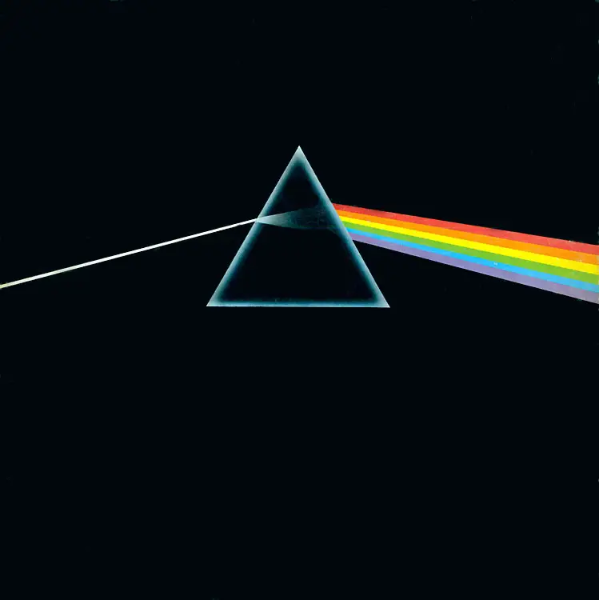
**Iconic album cover of Pink Floyd's "The Dark Side of The Moon" (1973)**

I learned that [Master Oscillator Power Amplifier (MOPA)](https://www.xtool.com/blogs/xtool-academy/what-is-mopa-laser) lasers can modulate the temperature at which metal oxidizes, producing different colors on stainless steel, aluminum, and titanium. I started with the original album cover and traced it with SVG.

In preparation for the lab session, I separated the traces by process:

- Single line for incoming light and the prism outline
- Gradient fill for the triangle inside the prism
- Solid fill for the line beams exiting the prism

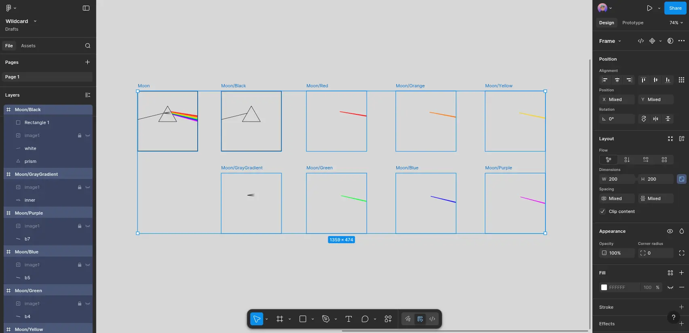
**Decomposing the design by process**

It turned out I over-prepared. Jiaming showed me how to separate elements with the XTool software. We just needed to select each part and apply different parameters.

In an earlier session, [Edward](https://fab.cba.mit.edu/classes/863.25/people/EdwardChen/) had worked with Jiaming to characterize the color output as a function of power, speed, and pulse frequency. All I needed was choosing from their color palette, mainly in the bottom righ corner below:

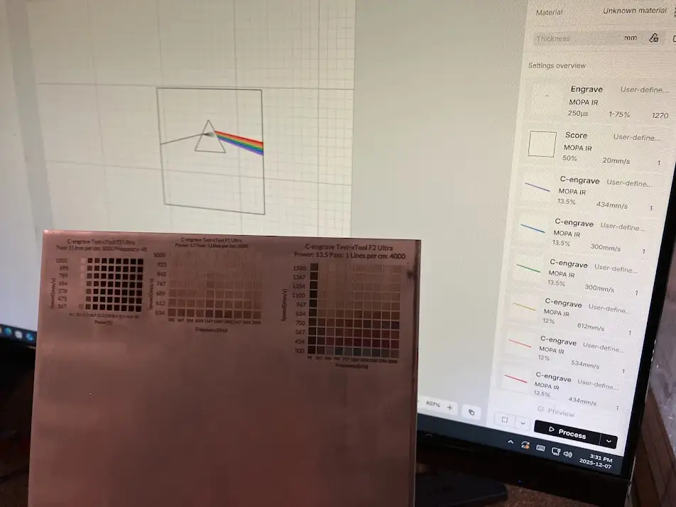
**Picking color from other people's characterization**

After the first cut, the line stroke was not coming out. We updated the parameters and the rest of the engraving went smoothly.

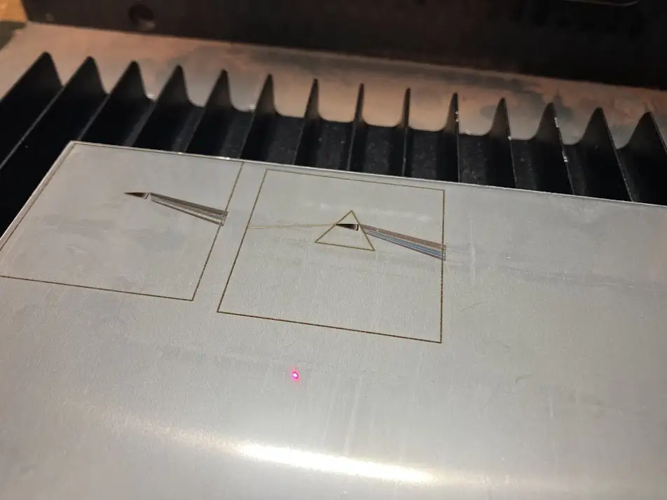
**Acceptable result after 2nd attempt**

My design file messed up the gradient part inside the prism. It came out as a black triangle, losing the original gradient effect. The colors were limited but at least we had a rainbow-like pattern.

## Spectrogram of Neil's Saying

I wanted to test if we can store sound as an image engraved on metal.

I had separately vibe-coded [a program](https://code.chuanqisun.com/spectrogram-recorder/) for conversion between audio and spectrogram. The program was all AI generated with 50+ rounds of revision. Since I don't have the full history of the AI coding session, I won't claim credit for the code. For this project, I'm only using the tool to generate a spectrogram from sound and to verify the sound from the engraved spectrogram.

Luckily, we had gathered lots of [quotes from Neil](https://gitlab.cba.mit.edu/classes/863.25/CBA/cba-machine/-/tree/main/software/media/neil_audio) during the [Machine Building Week](../week-11/index.md). Let's pick a hot take!

<audio src="./media/quote-before.mp3" controls></audio>
**Original quote from Neil**

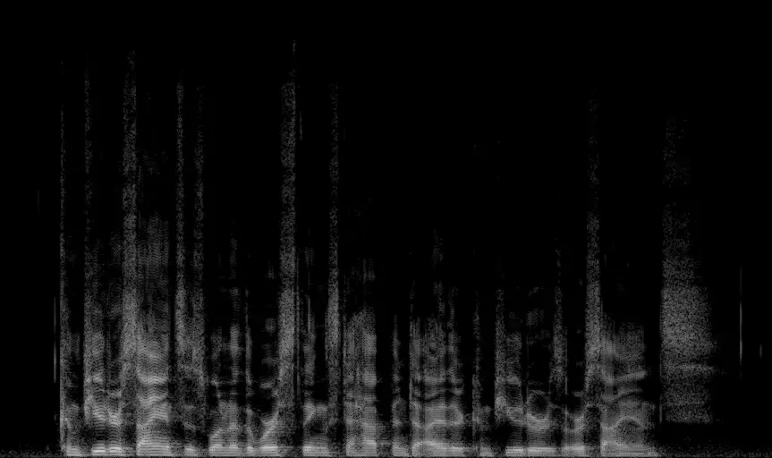
**Original spectrogram generated from audio**

Engraving didn't go well. All the gray levels were lost, and worse still, some of the darkest areas were inverted to light color.

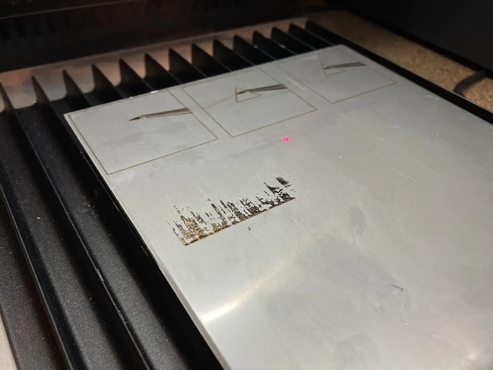
**Engraved spectrogram with unwanted artifacts**

I took a photo of the engraved metal, processed it in Figma, and decoded it into sound. The restoration steps:

1. Desaturate
2. Invert
3. Color burn (HEX `#666666`)
4. Reduce exposure

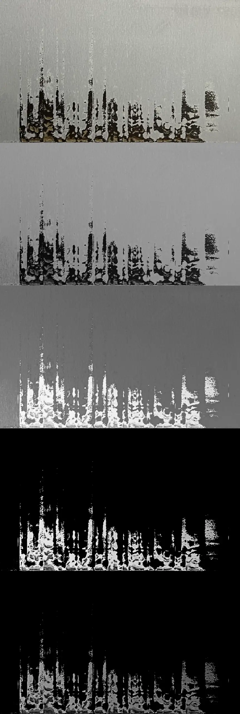
**Manual restoration process**

To make this project more interesting, I also used a large-language model with vision skills to restore the spectrogram. The AI restoration is similar to the manual process except I prompted AI to make most edits. AI was able to visually restore the [formants](https://en.wikipedia.org/wiki/Formant) lines, which in theory, contribute to a more natural utterance.

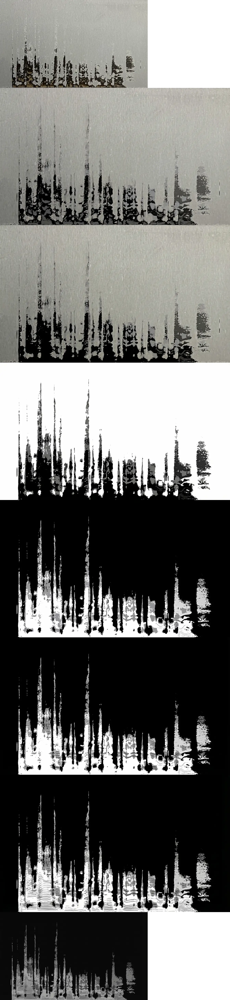
**AI restoration process ([chat log](./code/reconstruction-trace.txt))**

I uploaded both reconstructions to my custom [spectrogram player](https://code.chuanqisun.com/spectrogram-recorder/) and compared the results:

<audio src="./media/quote-before.mp3" controls></audio>
**Original**

<audio src="./media/quote-after-human.mp3" controls></audio>
**Manual reconstruction from photo of engraving**

<audio src="./media/quote-after-ai.mp3" controls></audio>
**AI reconstruction from photo of engraving**

## Nameplate for Final Project

I wanted to design a [nameplate](https://en.wikipedia.org/wiki/Rating_plate) for my [final project](../final-project/index.md). The 3mm thickness of the stainless steel was too thick for this purpose, but I proceeded anyway just to test how much detail we can get with typography.

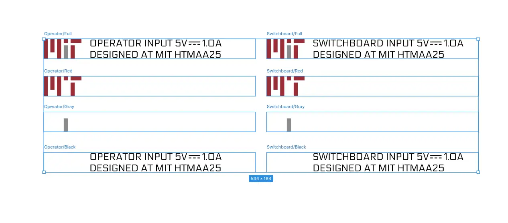
**Nameplate design with layers separated by process**

We failed in creating small texts using SVG exported from Figma. The program tried to trace the outline of the text instead of engraving the internal strokes. We switched to XTool's built-in font and the same issue persisted. In addition, the [Direct Current Symbol](https://www.compart.com/en/unicode/U+2393) was too small for our process.

Had we had more time, I would play with different SVG font options until the machine can recognize the internal strokes.

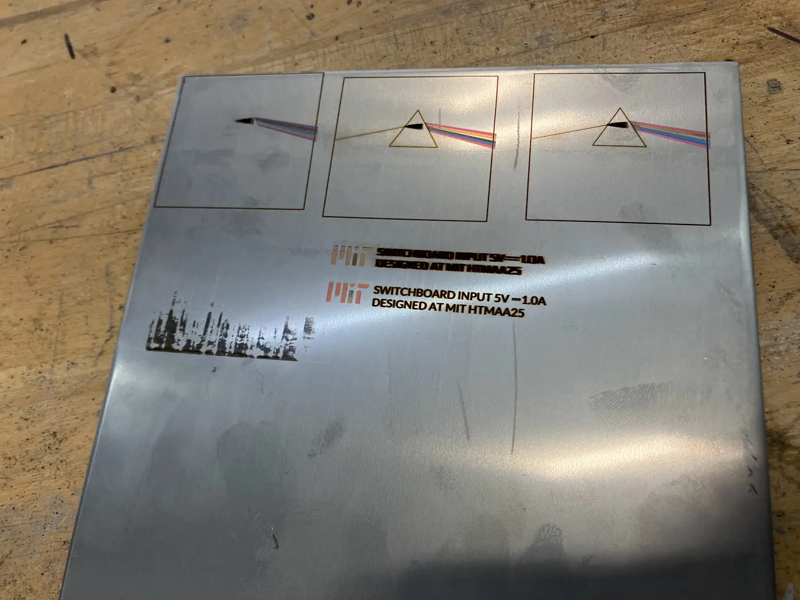
**Engraved nameplate**

## Post-processing

Jiaming showed me how to cut the metal with the MetalFab laser cutter. It was the same process we practiced in [Machine Cutting Week](../week-02/index.md).

**The violent process of cutting metal with laser**

After cutting, the molten metal edges need to be sanded down for safety and aesthetics. Jiaming showed me how to use the belt sander to remove the edges.

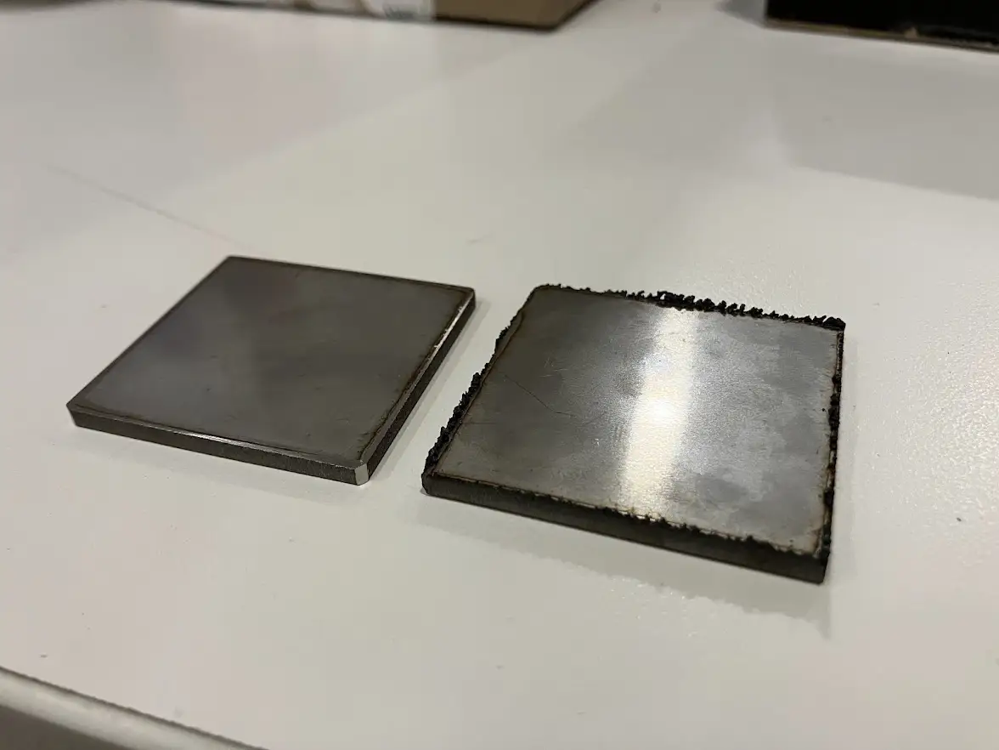
**Before and after sanding, showing bottom side**

Following Jiaming's demo, I sanded out the corners. The final results look great!

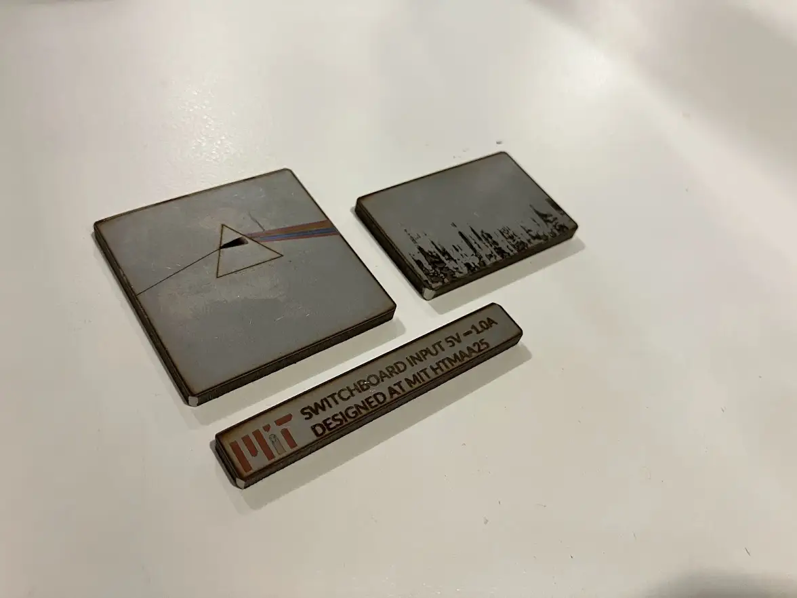
**Final results of all 3 designs**

Shout out to [Jiaming](https://fab.cba.mit.edu/classes/863.24/people/JiamingLiu/About%20me.html) for hands-on coaching, and [Edward](https://fab.cba.mit.edu/classes/863.25/people/EdwardChen/) for sharing his characterization results.

## Reflection

Color engraving is very trial-and-error based. It takes 2 hours just to map out a few possible color options. The parameters must be determined for the specific material and machine, and results may still vary.

I only had access to yellow, blue, purple colors on stainless steel. It would be vastly more interesting if we can access green and red colors as well.

Engraving raster image was very hard. I wish to have a process that can generate more gray levels. At the very minimum, I need to prevent inversions where darker designs become lighter due to over-burning.

AI was able to reconstruct somewhat intelligible spectrogram from a photo. This could become a new research topic or a multi-sensor AI benchmark.

## Appendix

- [All graphic design assets](./code/design.zip)
- [Spectrogram app](./code/spectrogram-app.zip)
